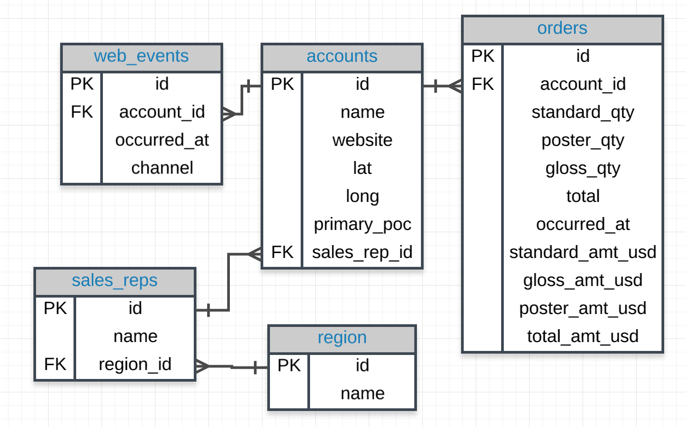
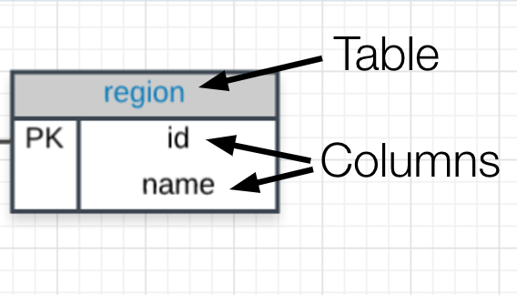

# Basic SQL

- Learn to write common SQL commands including SELECT, FROM, and WHERE
- Learn to use logical operators in SQL

## Parch & Posey Database

- A Paper Company

## Entity Relationshhip Diagram

### Entity Relationship Diagrams

- An **entity relationship diagram** (ERD) is a common way to view data in a database. Below is the ERD for the database we will use from Parch & Posey. These diagrams help you visualize the data you are analyzing including:

  - 1. The names of the tables.
  - 2. The columns in each table.
  - 3. The way the tables work together.

- **You can think of each of the boxes below as a spreadsheet.**

  - 

### What to Notice

- In the Parch & Posey database there are five tables (essentially 5 spreadsheets):

  1. `web_events`
  2. `accounts`
  3. `orders`
  4. `sales_reps`
  5. `region`

  - You can think of each of these tables as an individual spreadsheet. Then the columns in each spreadsheet are listed below the table name. For example, the `region` table has two columns: `id` and `name`. Alternatively the `web_events` table has four columns.

  

  - The "crow's foot" that connects the tables together shows us how the columns in one table relate to the columns in another table.

### Setting up the Parch & Posey database

- You can create and populate the database using PostgreSQL with this code:

  ```
  $ createdb parch
  $ psql parch < parch_and_posey.sql
  ```

## Quiz: ERD Fundamentals


- Note: `glossy_qty` is incorrect, it is actually `gloss_qty` in the database

- QUIZ QUESTION

  - Use the above image and your new knowledge of ERDs to match each Term to the appropriate `Definition`.

  | DEFINITION                                                             | TERM        |
  | ---------------------------------------------------------------------- | ----------- |
  | A column name in the Parch & Posey database.                           | primary_poc |
  | A table name in the Parch & Posey database.                            | web_events  |
  | A collection of tables that share connected data stored in a computer. | Database    |
  | A diagram that shows how data is structured in a database.             | ERD         |
  | A language that allows us to access data stored in a database.         | SQL         |

## Text: Map of SQL Content

- **SQL Basics** - Here you will get your first taste at how SQL works, and learn the basics of the SQL language. You will learn how to write code to interact with tables similar to the ones we analyzed in Excel earlier. Specifically, you will learn a little about databases, the basic syntax of SQL, and you will write your first queries!

- **SQL Joins** - In this lesson, you will learn the real power of SQL. You will learn about Entity Relationship Diagrams (ERDs), and how to join multiple tables together from a relational database. The power to join tables is what really moved companies to adopt this approach to holding data.

- **SQL Aggregations** - In this final lesson, you will learn some more advanced features of SQL. You will gain the ability to summarize data from multiple tables in a database.

## Video: Why SQL

### Why Do Data Analysts Use SQL?

- There are some major advantages to using `traditional relational databases`, which we interact with using SQL. The five most apparent are:

  - SQL is easy to understand.
  - Traditional databases allow us to access data directly.
  - Traditional databases allow us to audit and replicate our data.
  - SQL is a great tool for analyzing multiple tables at once.
  - SQL allows you to analyze more complex questions than dashboard tools like Google Analytics.

- You will experience these advantages first hand, as we learn to write SQL to interact with data.

- I realize you might be getting a little nervous or anxious to start writing code. This might even be the first time you have written in any sort of programming language. I assure you, we will work through examples to help assure you feel supported the whole time to take on this new challenge!

### SQL vs. NoSQL

- You may have heard of NoSQL, which stands for not only SQL. Databases using NoSQL allow for you to write code that interacts with the data a bit differently than what we will do in this course. These NoSQL environments tend to be particularly popular for web based data, but less popular for data that lives in spreadsheets the way we have been analyzing data up to this point. One of the most popular NoSQL languages is called MongoDB.

### Why Businesses Choose SQL?

- Why Businesses Like Databases

  - **Data integrity is ensured** - only the data you want entered is entered, and only certain users are able to enter data into the database.

  - **Data can be accessed quickly** - SQL allows you to obtain results very quickly from the data stored in a database. Code can be optimized to quickly pull results.

  - **Data is easily shared** - multiple individuals can access data stored in a database, and the data is the same for all users allowing for consistent results for anyone with access to your database.

## Video: How Databases Store Data

- A few key points about data stored in SQL databases:

  1. **Data in databases is stored in tables that can be thought of just like Excel spreadsheets.**
     For the most part, you can think of a database as a bunch of Excel spreadsheets. Each spreadsheet has rows and columns. Where each row holds data on a transaction, a person, a company, etc., while each column holds data pertaining to a particular aspect of one of the rows you care about like a name, location, a unique id, etc.

  2. **All the data in the same column must match in terms of data type.**
     An entire column is considered quantitative, discrete, or as some sort of string. This means if you have one row with a string in a particular column, the entire column might change to a text data type. **This can be very bad if you want to do math with this column!**

  3. **Consistent column types are one of the main reasons working with databases is fast.**
     Often databases hold **a LOT** of data. So, knowing that the columns are all of the same type of data means that obtaining data from a database can still be fast.

## Text + Quiz: Types of Databases

### SQL Databases

- There are many different types of SQL databases designed for different purposes. Here I will use [Postgres](https://www.postgresql.org/), which is a popular open-source database with a very complete library of analytical functions.

- Some of the most popular databases include:

  1. MySQL
  2. Access
  3. Oracle
  4. Microsoft SQL Server
  5. Postgres

- You can also write SQL within other programming frameworks like Python, Scala, and HaDoop.

### Small Differences

- Each of these SQL databases may have subtle differences in syntax and available functions -- for example, MySQL doesn’t have some of the functions for modifying dates as Postgres. Most of what you see with Postgres will be directly applicable to using SQL in other frameworks and database environments. For the differences that do exist, you should check the documentation. Most SQL environments have great documentation online that you can easily access with a quick Google search.

- The article [here](https://www.digitalocean.com/community/tutorials/sqlite-vs-mysql-vs-postgresql-a-comparison-of-relational-database-management-systems) compares three of the most common types of SQL: SQLite, PostgreSQL, and MySQL.

## SQLite vs MySQL vs PostgreSQL: A Comparison Of Relational Database Management Systems

### Introduction

- The relational data model, which organizes data in tables of rows and columns, predominates in database management tools. Today there are other data models, including NoSQL and NewSQL, but relational database management systems (RDBMSs) remain dominant for storing and managing data worldwide.

- This article compares and contrasts three of the most widely implemented open-source RDBMSs: SQLite, MySQL, and PostgreSQL. Specifically, it will explore the data types that each RDBMS uses, their advantages and disadvantages, and situations where they are best optimized.

### A Bit About Database Management Systems

- Databases are logically modelled clusters of information, or data. A database management system (DBMS), on the other hand, is a computer program that interacts with a database. A DBMS allows you to control access to a database, write data, run queries, and perform any other tasks related to database management.

- Although database management systems are often referred to as “databases,” the two terms are not interchangeable. A database can be any collection of data, not just one stored on a computer. In contrast, a DBMS specifically refers to the software that allows you to interact with a database.

- All database management systems have an underlying model that structures how data is stored and accessed. A relational database management system is a DBMS that employs the relational data model. In this relational model, data is organized into tables. Tables, in the context of RDBMSs, are more formally referred to as relations. A relation is a set of tuples, which are the rows in a table, and each tuple shares a set of attributes, which are the columns in a table:

1[](./images/tupleschart_2.png)

- Most relational databases use structured query language (SQL) to manage and query data. However, many RDBMSs use their own particular dialect of SQL, which may have certain limitations or extensions. These extensions typically include extra features that allow users to perform more complex operations than they otherwise could with standard SQL.

### Data Types and Constraints

- Each column is assigned a _data type_ which dictates what kind of entries are allowed in that column. Different RDBMSs implement different data types, which aren’t always directly interchangeable. Some common data types include dates, strings, integers, and Booleans.

- Storing integers in a database is more nuanced than putting numbers in a table. Numeric data types can either be signed, meaning they can represent both positive and negative numbers, or unsigned, which means they can only represent positive numbers. For example, MySQL’s `tinyint` data type can hold 8 bits of data, which equates to 256 possible values. The signed range of this data type is from -128 to 127, while the unsigned range is from 0 to 255.

- Being able to control what data is allowed into a database is important. Sometimes, a database administrator will impose a constraint on a table to limit what values can be entered into it. A constraint typically applies to one particular column, but some constraints can also apply to an entire table. Here are some constraints that are commonly used in SQL:

  - `UNIQUE`: Applying this constraint to a column ensures that no two entries in that column are identical.

  - `NOT NULL`: This constraint ensures that a column doesn’t have any `NULL` entries.

  - `PRIMARY KEY`: A combination of `UNIQUE` and `NOT NULL`, the `PRIMARY KEY` constraint ensures that no entry in the column is NULL and that every entry is distinct.

  - `FOREIGN KEY`: A `FOREIGN KEY` is a column in one table that refers to the `PRIMARY KEY` of another table. This constraint is used to link two tables together. Entries to the `FOREIGN KEY` column must already exist in the parent `PRIMARY KEY` column for the write process to succeed.

  - `CHECK`: This constraint limits the range of values that can be entered into a column. For example, if your application is intended only for residents of Alaska, you could add a `CHECK` constraint on a ZIP code column to only allow entries between 99501 and 99950.

- If you’d like to learn more about database management systems, check out our article on [A Comparison of NoSQL Database Management Systems and Models](https://www.digitalocean.com/community/tutorials/a-comparison-of-nosql-database-management-systems-and-models).

- Now that we’ve covered relational database management systems generally, let’s move onto the first of the three open-source relational databases this article will cover: SQLite.

### SQLite

- SQLite is a self-contained, file-based, and fully open-source RDBMS known for its portability, reliability, and strong performance even in low-memory environments. Its transactions are [ACID-compliant](<https://en.wikipedia.org/wiki/ACID_(computer_science)>), even in cases where the system crashes or undergoes a power outage.

- The [SQLite project’s website](https://www.sqlite.org/serverless.html) describes it as a “serverless” database. Most relational database engines are implemented as a server process in which programs communicate with the host server through an interprocess communication that relays requests. In contrast, SQLite allows any process that accesses the database to read and write to the database disk file directly. This simplifies SQLite’s setup process, since it eliminates any need to configure a server process. Likewise, there’s no configuration necessary for programs that will use the SQLite database: all they need is access to the disk.

#### SQLite’s Supported Data Types

| Data Type | Explanation                                                                                       |
| --------- | ------------------------------------------------------------------------------------------------- |
| `null`    | Includes any `NULL` values.                                                                       |
| `integer` | Signed integers, stored in 1, 2, 3, 4, 6, or 8 bytes depending on the magnitude of the value.     |
| `real`    | Real numbers, or floating point values, stored as 8-byte floating point numbers.                  |
| `text`    | Text strings stored using the database encoding, which can either be UTF-8, UTF-16BE or UTF-16LE. |
| `blob`    | Any blob of data, with every blob stored exactly as it was input.                                 |

- In the context of SQLite, the terms “storage class” and “data type” are considered interchangeable.

#### Advantages of SQLite

- **Small footprint**: As its name implies, the SQLite library is very lightweight. Although the space it uses varies depending on the system where it’s installed, it can take up less than 600KiB of space. Additionally, it’s fully self-contained, meaning there aren’t any external dependencies you have to install on your system for SQLite to work.

- **User-friendly**: SQLite is sometimes described as a “zero-configuration” database that’s ready for use out of the box. SQLite doesn’t run as a server process, which means that it never needs to be stopped, started, or restarted and doesn’t come with any configuration files that need to be managed. These features help to streamline the path from installing SQLite to integrating it with an application.

- **Portable**: Unlike other database management systems, which typically store data as a large batch of separate files, an entire SQLite database is stored in a single file. This file can be located anywhere in a directory hierarchy, and can be shared via removable media or file transfer protocol.

#### Disadvantages of SQLite

- **Limited concurrency**: Although multiple processes can access and query an SQLite database at the same time, only one process can make changes to the database at any given time. This means that while SQLite supports greater concurrency than most other embedded database management systems, it cannot support as much as client/server RDBMSs like MySQL or PostgreSQL.

- **No user management**: Database systems often come with support for _users_, or managed connections with predefined access privileges to the database and tables. Because SQLite reads and writes directly to an ordinary disk file, the only applicable access permissions are the typical access permissions of the underlying operating system. This makes SQLite a poor choice for applications that require multiple users with special access permissions.

- **Security**: A database engine that uses a server can, in some instances, provide better protection from bugs in the client application than a serverless database like SQLite. For example, stray pointers in a client cannot corrupt memory on the server. Also, because a server is a single persistent process, a client-server database can control data access with more precision than a serverless database. This allows for more fine-grained locking and better concurrency.

#### When To Use SQLite

- **Embedded applications**: SQLite is a great choice of database for applications that need portability and don’t require future expansion. Examples include single-user local applications, mobile applications, or games.

- **Disk access replacement**: In cases where an application needs to read and write files to disk directly, it can be beneficial to use SQLite for the additional functionality and simplicity that comes with using SQL.

- **Testing**: For many applications it can be overkill to test their functionality with a DBMS that uses an additional server process. SQLite has an in-memory mode which can be used to run tests quickly without the overhead of actual database operations, making it an ideal choice for testing.

#### When Not To Use SQLite

- **Working with lots of data**: SQLite can technically support a database up to 140TB in size, as long as the disk drive and file system also support the database’s size requirements. However, the SQLite website recommends that any database approaching 1TB be housed on a centralized client-server database, as an SQLite database of that size or larger would be difficult to manage.

- **High write volumes**: SQLite allows only one write operation to take place at any given time, which significantly limits its throughput. If your application requires lots of write operations or multiple concurrent writers, SQLite may not be adequate for your needs.

- **Network access is required**: Because SQLite is a serverless database, it doesn’t provide direct network access to its data. This access is built into the application. If the data in SQLite is located on a separate machine from the application, it will require a high bandwidth engine-to-disk link across the network. This is an expensive, inefficient solution, and in such cases a client-server DBMS may be a better choice.

### MySQL

- According to the [DB-Engines Ranking](https://db-engines.com/en/), MySQL has been the most popular open-source RDBMS since the site began tracking database popularity in 2012.

- MySQL was designed for speed and reliability, at the expense of full adherence to standard SQL.

- Unlike applications using SQLite, applications using a MySQL database access it through a separate daemon process. Because the server process stands between the database and other applications, it allows for greater control over who has access to the database.

- MySQL has inspired a wealth of third-party applications, tools, and integrated libraries that extend its functionality and help make it easier to work with. Some of the more widely-used of these third-party tools are [phpMyAdmin](https://www.phpmyadmin.net/), [DBeaver](https://dbeaver.io/), and [HeidiSQL](https://www.heidisql.com/).

#### MySQL’s Supported Data Types

- MySQL’s data types can be organized into three broad categories: numeric types, date and time types, and string types.

##### Numeric types:

| Data Type                               | Explanation                                                                                                                                                         |
| --------------------------------------- | ------------------------------------------------------------------------------------------------------------------------------------------------------------------- |
| `tinyint`                               | A very small integer. The signed range for this numeric data type is -128 to 127, while the unsigned range is 0 to 255.                                             |
| `smallint`                              | A small integer. The signed range for this numeric type is -32768 to 32767, while the unsigned range is 0 to 65535.                                                 |
| `mediumint`                             | A medium-sized integer. The signed range for this numeric data type is -8388608 to 8388607, while the unsigned range is 0 to 16777215.                              |
| `int` or `integer`                      | A normal-sized integer. The signed range for this numeric data type is -2147483648 to 2147483647, while the unsigned range is 0 to 4294967295.                      |
| `bigint`                                | A large integer. The signed range for this numeric data type is -9223372036854775808 to 9223372036854775807, while the unsigned range is 0 to 18446744073709551615. |
| `float`                                 | A small (single-precision) floating-point number.                                                                                                                   |
| `double`, `double precision`, or `real` | A normal sized (double-precision) floating-point number.                                                                                                            |
| `dec`, `decimal`, `fixed`, or `numeric` | A packed fixed-point number. The display length of entries for this data type is defined when the column is created, and every entry adheres to that length.        |
| `bool` or `boolean`                     | A Boolean is a data type that only has two possible values, usually either `true` or `false`.                                                                       |
| `bit`                                   | A bit value type for which you can specify the number of bits per value, from 1 to 64.                                                                              |

##### Date and time types:

| Data Type   | Explanation                                                                                                                              |
| ----------- | ---------------------------------------------------------------------------------------------------------------------------------------- |
| `date`      | A date, represented as `YYYY-MM-DD`.                                                                                                     |
| `datetime`  | A timestamp showing the date and time, displayed as `YYYY-MM-DD HH:MM:SS`.                                                               |
| `timestamp` | A timestamp indicating the amount of time since the [Unix epoch](https://en.wikipedia.org/wiki/Unix_time) (00:00:00 on January 1, 1970). |
| `time`      | A time of day, displayed as `HH:MM:SS`.                                                                                                  |
| `year`      | A year expressed in either a 2 or 4 digit format, with 4 digits being the default.                                                       |

##### String types:

| Data Type    | Explanation                                                                                                                                                                            |
| ------------ | -------------------------------------------------------------------------------------------------------------------------------------------------------------------------------------- |
| `char`       | A fixed-length string; entries of this type are padded on the right with spaces to meet the specified length when stored.                                                              |
| `varchar`    | A string of variable length.                                                                                                                                                           |
| `binary`     | Similar to the `char` type, but a binary byte string of a specified length rather than a nonbinary character string.                                                                   |
| `varbinary`  | Similar to the `varchar` type, but a binary byte string of a variable length rather than a nonbinary character string.                                                                 |
| `blob`       | A binary string with a maximum length of 65535 (2^16 - 1) bytes of data.                                                                                                               |
| `tinyblob`   | A `blob` column with a maximum length of 255 (2^8 - 1) bytes of data.                                                                                                                  |
| `mediumblob` | A `blob` column with a maximum length of 16777215 (2^24 - 1) bytes of data.                                                                                                            |
| `longblob`   | A `blob` column with a maximum length of 4294967295 (2^32 - 1) bytes of data.                                                                                                          |
| `text`       | A string with a maximum length of 65535 (2^16 - 1) characters.                                                                                                                         |
| `tinytext`   | A text column with a maximum length of 255 (2^8 - 1) characters.                                                                                                                       |
| `mediumtext` | A text column with a maximum length of 16777215 (2^24 - 1) characters.                                                                                                                 |
| `longtext`   | A text column with a maximum length of 4294967295 (2^32 - 1) characters.                                                                                                               |
| `enum`       | An enumeration, which is a string object that takes a single value from a list of values that are declared when the table is created.                                                  |
| `set`        | Similar to an enumeration, a string object that can have zero or more values, each of which must be chosen from a list of allowed values that are specified when the table is created. |

#### Advantages of MySQL

- **Popularity and ease of use**: As one of the world’s most popular database systems, there’s no shortage of database administrators who have experience working with MySQL. Likewise, there’s an abundance of documentation in print and online on how to install and manage a MySQL database. This includes a number of third-party tools — such as phpMyAdmin — that aim to simplify the process of getting started with the database.

- **Security**: MySQL comes installed with a script that helps you to improve the security of your database by setting the installation’s password security level, defining a password for the root user, removing anonymous accounts, and removing test databases that are, by default, accessible to all users. Also, unlike SQLite, MySQL does support user management and allows you to grant access privileges on a user-by-user basis.

- **Speed**: By choosing not to implement certain features of SQL, the MySQL developers were able to prioritize speed. While more recent benchmark tests show that other RDBMSs like PostgreSQL can match or at least come close to MySQL in terms of speed, MySQL still holds a reputation as an exceedingly fast database solution.

- **Replication**: MySQL supports a number of different types of [_replication_](<https://en.wikipedia.org/wiki/Replication_(computing)#Database_replication>), which is the practice of sharing information across two or more hosts to help improve reliability, availability, and fault-tolerance. This is helpful for setting up a database backup solution or [_horizontally_](https://en.wikipedia.org/wiki/Scalability#HORIZONTAL-SCALING) scaling one’s database.

#### Disadvantages of MySQL

- **Known limitations**: Because MySQL was designed for speed and ease of use rather than full SQL compliance, it comes with certain functional limitations. For example, it lacks support for `FULL JOIN` clauses.

- **Licensing and proprietary features**: MySQL is dual-licensed software, with a free and open-source community edition licensed under GPLv2 and several paid commercial editions released under proprietary licenses. Because of this, some features and plugins are only available for the proprietary editions.
- **Slowed development**: Since the MySQL project was acquired by Sun Microsystems in 2008, and later by Oracle Corporation in 2009, there have been complaints from users that the development process for the DBMS has slowed down significantly, as the community no longer has the agency to quickly react to problems and implement changes.

#### When To Use MySQL

- **Distributed operations**: MySQL’s replication support makes it a great choice for distributed database setups like [primary-secondary](https://dev.mysql.com/doc/refman/8.0/en/group-replication-primary-secondary-replication.html) or [primary-primary](https://dev.mysql.com/doc/refman/8.0/en/group-replication-summary.html) architectures.

- **Websites and web applications**: MySQL powers many websites and applications across the internet. This is, in large part, thanks to how easy it is to install and set up a MySQL database, as well as its overall speed and scalability in the long run.

- **Expected future growth**: MySQL’s replication support can help facilitate horizontal scaling. Additionally, it’s a relatively straightforward process to upgrade to a commercial MySQL product, like MySQL Cluster, which supports automatic sharding, another horizontal scaling process.

#### When Not To Use MySQL

- **SQL compliance is necessary**: Since MySQL does not try to implement the full SQL standard, this tool is not completely SQL compliant. If complete or even near-complete SQL compliance is a must for your use case, you may want to use a more fully compliant DBMS.

- **Concurrency and large data volumes**: Although MySQL generally performs well with read-heavy operations, concurrent read-writes can be problematic. If your application will have many users writing data to it at once, another RDBMS like PostgreSQL might be a better choice of database.

### PostgreSQL

- PostgreSQL, also known as Postgres, bills itself as “the most advanced open-source relational database in the world.” It was created with the goal of being highly extensible and standards compliant. PostgreSQL is an object-relational database, meaning that although it’s primarily a relational database it also includes features — like table inheritance and function overloading — that are more often associated with [object databases](https://en.wikipedia.org/wiki/Object_database).

- Postgres is capable of efficiently handling multiple tasks at the same time, a characteristic known as concurrency. It achieves this without read locks thanks to its implementation of [Multiversion Concurrency Control (MVCC)](https://en.wikipedia.org/wiki/Multiversion_concurrency_control), which ensures the atomicity, consistency, isolation, and durability of its transactions, also known as ACID compliance.

- PostgreSQL isn’t as widely used as MySQL, but there are still a number of third-party tools and libraries designed to simplify working with with PostgreSQL, including [pgAdmin](https://www.pgadmin.org/) and [Postbird](https://github.com/paxa/postbird).

#### PostgreSQL’s Supported Data Types

- PostgreSQL supports numeric, string, and date and time data types like MySQL. In addition, it supports data types for geometric shapes, network addresses, bit strings, text searches, and JSON entries, as well as several idiosyncratic data types.

##### Numeric types:

| Data Type              | Explanation                                                                                                          |
| ---------------------- | -------------------------------------------------------------------------------------------------------------------- |
| `bigint`               | A signed 8 byte integer.                                                                                             |
| `bigserial`            | An auto-incrementing 8 byte integer.                                                                                 |
| `double precision`     | An 8 byte double precision floating-point number.                                                                    |
| `integer`              | A signed 4 byte integer.                                                                                             |
| `numeric` or `decimal` | A number of selectable precision, recommended for use in cases where exactness is crucial, such as monetary amounts. |
| `real`                 | A 4 byte single precision floating-point number.                                                                     |
| `smallint`             | A signed 2 byte integer.                                                                                             |
| `smallserial`          | An auto-incrementing 2 byte integer.                                                                                 |
| `serial`               | An auto-incrementing 4 byte integer.                                                                                 |

##### Character types:

| Data Type                        | Explanation                                            |
| -------------------------------- | ------------------------------------------------------ |
| `character`                      | A character string with a specified fixed length.      |
| `character varying` or `varchar` | A character string with a variable but limited length. |
| `text`                           | A character string of a variable, unlimited length.    |

##### Date and time types:

| Data Type                                    | Explanation                                             |
| -------------------------------------------- | ------------------------------------------------------- |
| `date`                                       | A calendar date consisting of the day, month, and year. |
| `interval`                                   | A time span.                                            |
| `time` or `time without time zone`           | A time of day, not including the time zone.             |
| `time with time zone`                        | A time of day, including the time zone.                 |
| `timestamp` or `timestamp without time zone` | A date and time, not including the time zone.           |
| `timestamp with time zone`                   | A date and time, including the time zone.               |

##### Geometric types:

| Data Type | Explanation                         |
| --------- | ----------------------------------- |
| `box`     | A rectangular box on a plane.       |
| `circle`  | A circle on a plane.                |
| `line`    | An infinite line on a plane.        |
| `lseg`    | A line segment on a plane.          |
| `path`    | A geometric path on a plane.        |
| `point`   | A geometric point on a plane.       |
| `polygon` | A closed geometric path on a plane. |

##### Network address types:

| Data Type | Explanation                           |
| --------- | ------------------------------------- |
| `cidr`    | An IPv4 or IPv6 network address.      |
| `inet`    | An IPv4 or IPv6 host address.         |
| `macaddr` | A Media Access Control (MAC) address. |

##### Bit string types:

| Data Type     | Explanation                   |
| ------------- | ----------------------------- |
| `bit`         | A fixed-length bit string.    |
| `bit varying` | A variable-length bit string. |

##### Text search types:

| Data Type | Explanation             |
| --------- | ----------------------- |
| tsquery   | A text search query.    |
| tsvector  | A text search document. |

##### JSON types:

| Data Type | Explanation                  |
| --------- | ---------------------------- |
| `json`    | Textual JSON data.           |
| `jsonb`   | Decomposed binary JSON data. |

##### Other data types:

| Data Type       | Explanation                                                |
| --------------- | ---------------------------------------------------------- |
| `boolean`       | A logical Boolean, representing either true or false.      |
| `bytea`         | Short for “byte array”, this type is used for binary data. |
| `money`         | An amount of currency.                                     |
| `pg_lsn`        | A PostgreSQL Log Sequence Number.                          |
| `txid_snapshot` | A user-level transaction ID snapshot.                      |
| `uuid`          | A universally unique identifier.                           |
| `xml`           | XML data.                                                  |

#### Advantages of PostgreSQL

- **SQL compliance**: More so than SQLite or MySQL, PostgreSQL aims to closely adhere to SQL standards. [According to the official PostgreSQL documentation](https://www.postgresql.org/docs/current/features.html), PostgreSQL supports 160 out of the 179 features required for full core SQL:2011 compliance, in addition to a long list of optional features.

- **Open-source and community-driven**: A fully open-source project, PostgreSQL’s source code is developed by a large and devoted community. Similarly, the Postgres community maintains and contributes to numerous online resources that describe how to work with the DBMS, including the [official documentation](https://www.postgresql.org/docs/), the [PostgreSQL wiki](https://wiki.postgresql.org/wiki/Main_Page), and various online forums.

- **Extensible**: Users can extend PostgreSQL programmatically and on the fly through its [catalog-driven operation](https://www.postgresql.org/docs/9.0/extend-how.html) and its use of [dynamic loading](https://en.wikipedia.org/wiki/Dynamic_loading). One can designate an object code file, such as a shared library, and PostgreSQL will load it as necessary.

#### Disadvantages of PostgreSQL

- **Memory performance**: For every new client connection, PostgreSQL forks a new process. Each new process is allocated about 10MB of memory, which can add up quickly for databases with lots of connections. Accordingly, for simple read-heavy operations, PostgreSQL is typically less performant than other RDBMSs, like MySQL.

- **Popularity**: Although more widely used in recent years, PostgreSQL has historically lagged behind MySQL in terms of popularity. One consequence of this is that there are still fewer third-party tools that can help manage a PostgreSQL database. Similarly, there aren’t as many database administrators with experience managing a Postgres database compared to those with MySQL experience.

#### When To Use PostgreSQL

- **Data integrity is important**: PostgreSQL has been fully ACID-compliant since 2001 and implements multiversion currency control to ensure that data remains consistent, making it a strong choice of RDBMS when data integrity is critical.

- **Integration with other tools**: PostgreSQL is compatible with a wide array of programming languages and platforms. This means that if you ever need to migrate your database to another operating system or integrate it with a specific tool, it will likely be easier with a PostgreSQL database than with another DBMS.

- **Complex operations**: Postgres supports query plans that can leverage multiple CPUs in order to answer queries with greater speed. This, coupled with its strong support for multiple concurrent writers, makes it a great choice for complex operations like data warehousing and online transaction processing.

#### When Not To Use PostgreSQL

- **Speed is imperative**: At the expense of speed, PostgreSQL was designed with extensibility and compatibility in mind. If your project requires the fastest read operations possible, PostgreSQL may not be the best choice of DBMS.

- **Simple setups**: Because of its large feature set and strong adherence to standard SQL, Postgres can be overkill for simple database setups. For read-heavy operations where speed is required, MySQL is typically a more practical choice.

- **Complex replication**: Although PostgreSQL does provide strong support for replication, it’s still a relatively new feature. Some configurations — like a primary-primary architecture — are only possible with extensions. Replication is a more mature feature on MySQL and many users see MySQL’s replication to be easier to implement, particularly for those who lack the requisite database and system administration experience.

## A Comparison of NoSQL Database Management Systems and Models

### Relational Databases and Their Limitations

- Databases are logically modeled clusters of information, or data. A database management system (DBMS), meanwhile, is a computer program that interacts with a database. A DBMS allows you to control access to a database, write data, run queries, and perform any other tasks related to database management. Although database management systems are often referred to as “databases,” the two terms are not exactly interchangeable. A database can be any collection of data, not just one stored on a computer, while a DBMS is the specific software that allows you to interact with a database.

- All database management systems have an underlying model that structures how data is stored and accessed. A relational database management system (RDBMS) is a DBMS that employs the relational data model. In this model, data is organized into tables, which in the context of RDBMSs are more formally referred to as relations. Relational database management systems typically employ Structured Query Language (SQL) for managing and accessing data held within the database.

- Historically, the relational model has been the most widely used approach for managing data, and to this day many of the most popular database management systems implement the relational model. However, the relational model presents several limitations that can be problematic in certain use cases.

- For instance, it can be difficult to scale a relational database horizontally. Horizontal scaling, or scaling out, is the practice of adding more machines to an existing stack in order to spread out the load and allow for more traffic and faster processing. This is often contrasted with vertical scaling which involves upgrading the hardware of an existing server, usually by adding more RAM or CPU.

- The reason it’s difficult to scale a relational database horizontally has to do with the fact that the relational model is designed to ensure consistency, meaning clients querying the same database will always see the latest data. If you were to scale a relational database horizontally across multiple machines, it becomes difficult to ensure consistency since clients may write data to one node and not the others and there would likely be a delay between the initial write and the time when the other nodes are updated to reflect the changes.

- Another limitation presented by RDBMSs is that the relational model was designed to manage structured data, or data that aligns with a predefined data type or is at least organized in some predetermined way, making it easily sortable and searchable. With the spread of personal computing and the rise of the internet in the early 1990s, however, unstructured data — such as email messages, photos, videos, etc. — became more common.

- As these limitations grew more constricting, developers began looking for alternatives to the traditional relational data model, leading to the growth in popularity of NoSQL databases.

### About NoSQL

- The label _NoSQL_ itself has a rather fuzzy definition. “NoSQL” was coined in 1998 by Carlo Strozzi as the name for his then-new [NoSQL Database](http://www.strozzi.it/cgi-bin/CSA/tw7/I/en_US/nosql/Home%20Page), chosen simply because it doesn’t use SQL for managing data.

- The term took on a new meaning after 2009 when Johan Oskarsson organized a meetup for developers to discuss the spread of “open source, distributed, and non relational databases” like [Cassandra](http://cassandra.apache.org/) and [Voldemort](https://www.project-voldemort.com/voldemort/). Oskarsson named the meetup “NOSQL” and since then the term has been used as a catch-all for any database that doesn’t employ the relational model. Interestingly, Strozzi’s NoSQL database does in fact employ the relational model, meaning that the original NoSQL database doesn’t fit the contemporary definition of NoSQL.

- Because “NoSQL” generally refers to any DBMS that doesn’t employ the relational model, there are several operational data models associated with the NoSQL concept. The following table includes several such data models, but please note that this is not a comprehensive list:

  | Operational Database Model | Example DBMSs           |
  | -------------------------- | ----------------------- |
  | Key-value store            | Redis, MemcacheDB       |
  | Columnar database          | Cassandra, Apache HBase |
  | Document store             | MongoDB, Couchbase      |
  | Graph database             | OrientDB, Neo4j         |

- Despite these different underlying data models, most NoSQL databases share several characteristics. For one, NoSQL databases are typically designed to maximize availability at the expense of consistency. In this sense, consistency refers to the idea that any read operation will return the most recent data written to the database. In a distributed database designed for strong consistency, any data written to one node will be immediately available on all other nodes; otherwise, an error will occur.

- Conversely, NoSQL databases oftentimes aim for _eventual consistency_. This means that newly written data is made available on other nodes in the database eventually (usually in a matter of a few milliseconds), though not necessarily immediately. This has the benefit of improving the availability of one’s data: even though you may not see the very latest data written, you can still view an earlier version of it instead of receiving an error.

- Relational databases are designed to deal with normalized data that fits neatly into a predefined schema. In the context of a DBMS, _normalized data_ is data that’s been organized in a way to eliminate redundancies — meaning that the database takes up as little storage space as possible — while a _schema_ is an outline of how the data in the database is structured.

- While NoSQL databases are equipped to handle normalized data and they are able to sort data within a predefined schema, their respective data models usually allow for far greater flexibility than the rigid structure imposed by relational databases. Because of this, NoSQL databases have a reputation for being a better choice for storing semi-structured and unstructured data. With that in mind, though, because NoSQL databases don’t come with a predefined schema that often means it’s up to the database administrator to define how the data should be organized and accessed in whatever way makes the most sense for their application.

- Now that you have some context around what NoSQL databases are and what makes them different from relational databases, let’s take a closer look at some of the more widely-implemented NoSQL database models.

### Key-value Databases

- _Key-value databases_, also known as _key-value stores_, work by storing and managing _associative arrays_. An _associative array_, also known as a _dictionary_ or _hash table_, consists of a collection of key-value pairs in which a key serves as a unique identifier to retrieve an associated value. Values can be anything from simple objects, like integers or strings, to more complex objects, like JSON structures.

- In contrast to relational databases, which define a data structure made up of tables of rows and columns with predefined data types, key-value databases store data as a single collection without any structure or relation. After connecting to the database server, an application can define a key (for example, `the_meaning_of_life`) and provide a matching value (for example, `42`) which can later be retrieved the same way by supplying the key. A key-value database treats any data held within it as an opaque blob; it’s up to the application to understand how it’s structured.

- Key-value databases are often described as highly performant, efficient, and scalable. Common use cases for key-value databases are [caching](<https://en.wikipedia.org/wiki/Cache_(computing)>), [message queuing](https://en.wikipedia.org/wiki/Message_queue), and [session management](<https://en.wikipedia.org/wiki/Session_(computer_science)>).

- Some popular open-source key-value data stores are:

  | Database                                             | Description                                                                                                                                                                       |
  | ---------------------------------------------------- | --------------------------------------------------------------------------------------------------------------------------------------------------------------------------------- |
  | [Redis](https://redis.io/)                           | An in-memory data store used as a database, cache, or message broker, Redis supports a variety of data structures, ranging from strings to bitmaps, streams, and spatial indexes. |
  | [Memcached](https://memcached.org/)                  | A general-purpose memory object caching system frequently used to speed up data-driven websites and applications by caching data and objects in memory.                           |
  | [Riak](https://riak.com/products/riak-kv/index.html) | A distributed key-value database with advanced local and multi-cluster replication.                                                                                               |

### Columnar Databases

- _Columnar databases_, sometimes called _column-oriented databases_, are database systems that store data in columns. This may seem similar to traditional relational databases, but rather than grouping columns together into tables, each column is stored in a separate file or region in the system’s storage.

- The data stored in a columnar database appears in record order, meaning that the first entry in one column is related to the first entry in other columns. This design allows queries to only read the columns they need, rather than having to read every row in a table and discard unneeded data after it’s been stored in memory.

- Because the data in each column is of the same type, it allows for various storage and read optimization strategies. In particular, many columnar database administrators implement a compression strategy such as [run-length encoding](https://en.wikipedia.org/wiki/Run-length_encoding) to minimize the amount of space taken up by a single column. This can have the benefit of speeding up reads since queries need to go over fewer rows. One drawback with columnar databases, though, is that load performance tends to be slow since each column must be written separately and data is often kept compressed. Incremental loads in particular, as well as reads of individual records, can be costly in terms of performance.

- Column-oriented databases have been around since the 1960s. Since the mid-2000s, though, columnar databases have become more widely used for data analytics since the columnar data model lends itself well to fast query processing. They’re also seen as advantageous in cases where an application needs to frequently perform [aggregate functions](https://en.wikipedia.org/wiki/Aggregate_function), such as finding the average or sum total of data in a column. Some columnar database management systems are even capable of using SQL queries.

- Some popular open-source columnar databases are:

  | Database                                          | Description                                                                                                                                                               |
  | ------------------------------------------------- | ------------------------------------------------------------------------------------------------------------------------------------------------------------------------- |
  | [Apache Cassandra](https://cassandra.apache.org/) | A column store designed to maximize scalability, availability, and performance.                                                                                           |
  | [Apache HBase](https://hbase.apache.org/)         | A distributed database that supports structured storage for large amounts of data and is designed to work with the [Hadoop software library](https://hadoop.apache.org/). |
  | [ClickHouse](https://clickhouse.yandex/)          | A fault tolerant DBMS that supports real time generation of analytical data and SQL queries.                                                                              |

### Document-oriented Databases

- _Document-oriented databases_, or _document stores_, are NoSQL databases that store data in the form of documents. Document stores are a type of `key-value store`: each document has a unique identifier — its key — and the document itself serves as the value.

- The difference between these two models is that, in a key-value database, the data is treated as opaque and the database doesn’t know or care about the data held within it; it’s up to the application to understand what data is stored. In a document store, however, each document contains some kind of metadata that provides a degree of structure to the data. Document stores often come with an API or query language that allows users to retrieve documents based on the metadata they contain. They also allow for complex data structures, as you can nest documents within other documents.

- Unlike relational databases, in which the information of a given object may be spread across multiple tables or databases, a document-oriented database can store all the data of a given object in a single document. Document stores typically store data as [JSON](https://en.wikipedia.org/wiki/JSON), [BSON](https://en.wikipedia.org/wiki/BSON), [XML](https://en.wikipedia.org/wiki/XML), or [YAML](https://en.wikipedia.org/wiki/YAML) documents, and some can store binary formats like PDF documents. Some use a variant of SQL, full-text search, or their own native query language for data retrieval, and others feature more than one query method.

- Document-oriented databases have seen an enormous growth in popularity in recent years. Thanks to their flexible schema, they’ve found regular use in e-commerce, blogging, and analytics platforms, as well as content management systems. Document stores are considered highly scalable, with sharding being a common horizontal scaling strategy. They are also excellent for keeping large amounts of unrelated, complex information that varies in structure.

- Some popular open-source document based data stores are:

  | Database                                      | Description                                                                                                                                                          |
  | --------------------------------------------- | -------------------------------------------------------------------------------------------------------------------------------------------------------------------- |
  | [MongoDB](https://www.mongodb.com/)           | A general purpose, distributed document store, MongoDB is the world’s most widely used document-oriented database at the time of this writing.                       |
  | [Couchbase](https://www.couchbase.com/)       | Originally known as Membase, a JSON-based, Memcached-compatible document-based data store. A multi-model database, Couchbase can also function as a key-value store. |
  | [Apache CouchDB](https://couchdb.apache.org/) | A project of the Apache Software Foundation, CouchDB stores data as JSON documents and uses JavaScript as its query language.                                        |

### Graph Databases

- _Graph databases_ can be thought of as a subcategory of the document store model, in that they store data in documents and don’t insist that data adhere to a predefined schema. The difference, though, is that graph databases add an extra layer to the document model by highlighting the relationships between individual documents.

- To better grasp the concept of graph databases, it’s important to understand the following terms:

  - `Node`: A node is a representation of an individual entity tracked by a graph database. It is more or less equivalent to the concept of a record or row in a relational database or a document in a document store. For example, in a graph database of music recording artists, a node might represent a single performer or band.

  - `Property`: A property is relevant information related to individual nodes. Building on our recording artist example, some properties might be “vocalist,” “jazz,” or “platinum-selling artist,” depending on what information is relevant to the database.

  - `Edge`: Also known as a _graph_ or _relationship_, an edge is the representation of how two nodes are related, and is a key concept of graph databases that differentiates them from RDBMSs and document stores. Edges can be directed or undirected.

    - `Undirected`: In an undirected graph, the edges between nodes exist just to show a connection between them. In this case, edges can be thought of as “two-way” relationships — there’s no implied difference between how one node relates to the other.

    - `Directed`: In a directed graph, edges can have different meanings based on which direction the relationship originates from. In this case, edges are “one-way” relationships. For example, a directed graph database might specify a relationship from Sammy to the Seaweeds showing that Sammy produced an album for the group, but might not show an equivalent relationship from The Seaweeds to Sammy.

- Certain operations are much simpler to perform using graph databases because of how they link and group related pieces of information. These databases are commonly used in cases where it’s important to be able to gain insights from the relationships between data points or in applications where the information available to end users is determined by their connections to others, as in a social network. They’ve found regular use in fraud detection, recommendation engines, and identity and access management applications.

- Some popular open-source graph databases are:

  | Database                              | Description                                                                                                                                                                                                                              |
  | ------------------------------------- | ---------------------------------------------------------------------------------------------------------------------------------------------------------------------------------------------------------------------------------------- |
  | [Neo4j](https://neo4j.com/)           | An [ACID](https://en.wikipedia.org/wiki/ACID)-compliant DBMS with native graph storage and processing. As of this writing, Neo4j is the most popular graph database in the world.                                                        |
  | [ArangoDB](https://www.arangodb.com/) | Not exclusively a graph database, ArangoDB is a multi-model database that unites the graph, document, and key-value data models in one DBMS. It features AQL (a native SQL-like query language), full-text search, and a ranking engine. |
  | [OrientDB](https://orientdb.com/)     | Another multi-model database, OrientDB supports the graph, document, key-value, and object models. It supports SQL queries and ACID transactions.                                                                                        |

### Conclusion

In this tutorial, we’ve gone over only a few of the NoSQL data models in use today. Some NoSQL models, such as [object stores](https://en.wikipedia.org/wiki/Object_database), have seen varying levels of use over the years but remain as viable alternatives to the relational model in some use cases. Others, like [object-relational databases](https://en.wikipedia.org/wiki/Object-relational_database) and [time-series databases](https://en.wikipedia.org/wiki/Time_series_database), blend elements of relational and NoSQL data models to form a kind of middle ground between the two ends of the spectrum.

The NoSQL category of databases is extremely broad, and continues to evolve to this day. If you’re interested in learning more about NoSQL database management systems and concepts, we encourage you to check out our [library of NoSQL-related content](https://www.digitalocean.com/community/tags/nosql?type=tutorials).

## How To Manage an SQL Database - An SQL Cheat Sheet

### Introduction

- SQL databases come installed with all the commands you need to add, modify, delete, and query your data. This cheat sheet-style guide provides a quick reference to some of the most commonly-used SQL commands.

- How to Use This Guide:

- This guide is in cheat sheet format with self-contained command-line snippets

- Jump to any section that is relevant to the task you are trying to complete

- When you see `highlighted text` in this guide’s commands, keep in mind that this text should refer to the columns, tables, and data in your own database.
- Throughout this guide, the example data values given are all wrapped in apostrophes ('). In SQL, it is necessary to wrap any data values that consist of strings in apostrophes. This isn’t required for numeric data, but it also won’t cause any issues if you do include apostrophes.

- Please note that, while SQL is recognized as a standard, most SQL database programs have their own proprietary extensions. This guide uses MySQL as the example relational database management system (RDBMS), but the commands given will work with other relational database programs, including PostgreSQL, MariaDB, and SQLite. Where there are significant differences between RDBMSs, we have included the alternative commands.

### Opening up the Database Prompt (using Socket/Trust Authentication)

- By default on Ubuntu 18.04, the `root` MySQL user can authenticate without a password using the following command:

  ```
  $ sudo mysql
  ```

- To open up a PostgreSQL prompt, use the following command. This example will log you in as the `postgres` user, which is the included superuser role, but you can replace that with any already-created role:

  ```
  $ sudo -u postgres psql
  ```

### Opening up the Database Prompt (using Password Authentication)

- If your `root` MySQL user is set to authenticate with a password, you can do so with the following command:

  ```
  $ mysql -u root -p
  ```

- If you’ve already set up a non-root user account for your database, you can also use this method to log in as that user:

  ```
  $ mysql -u user -p
  ```

- The above command will prompt you for your password after you run it. If you’d like to supply your password as part of the command, immediately follow the `-p` option with your password, with no space between them:

  ```
  $ mysql -u root -ppassword
  ```

### Creating a Database

- The following command creates a database with default settings.

  ```
  mysql> CREATE DATABASE `database_name`;
  ```

- If you want your database to use a character set and collation different than the defaults, you can specify those using this syntax:

  ```
  mysql> CREATE DATABASE `database_name` CHARACTER SET `character_set` COLLATE `collation`;
  ```

### Listing Databases

- To see what databases exist in your MySQL or MariaDB installation, run the following command:

  ```
  mysql> SHOW DATABASES;
  ```

- In PostgreSQL, you can see what databases have been created with the following command:

  ```
  postgres=# \list
  ```

### Deleting a Database

- To delete a database, including any tables and data held within it, run a command that follows this structure:

  ```
  mysql> DROP DATABASE IF EXISTS `database`;
  ```

### Creating a User

- To create a user profile for your database without specifying any privileges for it, run the following command:

  ```
  mysql> CREATE USER `username` IDENTIFIED BY 'password';
  ```

- PostgreSQL uses a similar, but slightly different, syntax:

  ```
  postgres=# CREATE USER `user` WITH PASSWORD 'password';
  ```

- If you want to create a new user and grant them privileges in one command, you can do so by issuing a `GRANT` statement. The following command creates a new user and grants them full privileges to every database and table in the RDBMS:

  ```
  mysql> GRANT ALL PRIVILEGES ON *.* TO 'username'@'localhost' IDENTIFIED BY 'password';
  ```

- Note the `PRIVILEGES` keyword in this previous GRANT statement. In most RDBMSs, this keyword is optional, and this statement can be equivalently written as:

  ```
  mysql> GRANT ALL ON *.* TO 'username'@'localhost' IDENTIFIED BY 'password';
  ```

- Be aware, though, that the `PRIVILEGES` keyword is required for granting privileges like this when [Strict SQL mode](https://dev.mysql.com/doc/refman/8.0/en/sql-mode.html#sql-mode-strict) is turned on.

### Deleting a User

- Use the following syntax to delete a database user profile:

  ```
  mysql> DROP USER IF EXISTS username;
  ```

- Note that this command will not by default delete any tables created by the deleted user, and attempts to access such tables may result in errors.

### Selecting a Database

- Before you can create a table, you first have to tell the RDBMS the database in which you’d like to create it. In MySQL and MariaDB, do so with the following syntax:

  ```
  mysql> USE database;
  ```

- In PostgreSQL, you must use the following command to select your desired database:

  ```
  postgres=# \connect `database`
  ```

### Creating a Table

- The following command structure creates a new table with the name `table`, and includes two columns, each with their own specific data type:

  ```
  mysql> CREATE TABLE `table` ( `column_1` `column_1_data_type`, `column_2` `column_2_data_taype` );
  ```

### Deleting a Table

- To delete a table entirely, including all its data, run the following:

  ```
  mysql> DROP TABLE IF EXISTS `table`
  ```

### Inserting Data into a Table

- Use the following syntax to populate a table with one row of data:

  ```
  mysql INSERT INTO `table` ( `column_A`, `column_B`, `column_C` ) VALUES ( 'data_A', 'data_B', 'data_C' );
  ```

- You can also populate a table with multiple rows of data using a single command, like this:

  ```
  mysql> INSERT INTO table ( column_A, column_B, column_C ) VALUES ( 'data_1A', 'data_1B', 'data_1C' ),  ( 'data_2A', 'data_2B', 'data_2C' ), ( 'data_3A', 'data_3B', 'data_3C' );
  ```

### Deleting Data from a Table

- To delete a row of data from a table, use the following command structure. Note that `value` should be the `value` held in the specified column in the row that you want to delete:

  ```
  mysql> DELETE FROM table WHERE column='value';
  ```

- Note: If you do not include a `WHERE` clause in a `DELETE` statement, as in the following example, it will delete all the data held in a table, but not the columns or the table itself:

  ```
  mysql> DELETE FROM table;
  ```

### Changing Data in a Table

- Use the following syntax to update the data held in a given row. Note that the `WHERE` clause at the end of the command tells SQL which row to update. `value` is the value held in `column_A` that aligns with the row you want to change.

  - Note: If you fail to include a `WHERE` clause in an `UPDATE` statement, the command will replace the data held in every row of the table.

  ```
  mysql> UPDATE `table` SET `column_1` = `value_1`, `column_2` = `value_2` WHERE `column_A`=`value`;
  ```

### Inserting a Column

- The following command syntax will add a new column to a table:

  ```
  mysql> ALTER TABLE `table` ADD COLUMN `column` `data_type`;
  ```

### Deleting a Column

- A command following this structure will delete a column from a table:

  ```
  mysql> ALTER TABLE `table` DROP COLUMN `column`;
  ```

### Performing Basic Queries

- To view all the data from a single column in a table, use the following syntax:

  ```
  mysql> SELECT `column` FROM `table`;
  ```

- To query multiple columns from the same table, separate the column names with a comma:

  ```
  mysql> SELECT `column_1`, `column_2` FROM `table`;
  ```

- You can also query every column in a table by replacing the names of the columns with an asterisk (\*). In SQL, asterisks act as placeholders to represent “all”:

  ```
  mysql> SELECT * FROM `table`;
  ```

### Using WHERE Clauses

- You can narrow down the results of a query by appending the `SELECT` statement with a `WHERE` clause, like this:

  ```
  mysql> SELECT `column` FROM `table` WHERE `conditions_that_apply`;
  ```

- For example, you can query all the data from a single row with a syntax like the following. Note that `value` should be a value held in both the specified `column` and the row you want to query:

  ```
  mysql> SELECT * FROM `table` WHERE `column` = `value`;
  ```

### Working with Comparison Operators

- A comparison operator in a WHERE clause defines how the specified column should be compared against the value. Here are some common SQL comparison operators:

  | Operator      | What it does                                                          |
  | ------------- | --------------------------------------------------------------------- |
  | `=`           | tests for equality                                                    |
  | `!=`          | tests for inequality                                                  |
  | `<`           | tests for less-than                                                   |
  | `>`           | tests for greater-than                                                |
  | `<=`          | tests for less-than or equal-to                                       |
  | `>=`          | tests for greater-than or equal-to                                    |
  | `BETWEEN`     | tests whether a value lies within a given range                       |
  | `IN`          | tests whether a row’s value is contained in a set of specified values |
  | `EXISTS`      | tests whether rows exist, given the specified conditions              |
  | `LIKE`        | tests whether a value matches a specified string                      |
  | `IS NULL`     | tests for NULL values                                                 |
  | `IS NOT NULL` | tests for all values other than NULL                                  |

### Working with Wildcards

- SQL allows the use of wildcard characters. These are useful if you’re trying to find a specific entry in a table, but aren’t sure of what that entry is exactly.

- Asterisks (`*`) are placeholders that represent “all,” this will query every column in a table:

  ```
  mysql> SELECT * FROM `table`;
  ```

- Percentage signs (`%`) represent zero or more unknown characters.

  ```
  mysql> SELECT * FROM `table` WHERE `column` LIKE `val%`;
  ```

- Underscores (`_`) are used to represent a single unknown character:

  ```
  mysql> SELECT * FROM `table` WHERE `column` LIKE `v_lue`;
  ```

### Counting Entries in a Column

- The `COUNT` function is used to find the number of entries in a given column. The following syntax will return the total number of values held in `column`:

  ```
  mysql> SELECT COUNT(`column`) FROM `table`;
  ```

- You can narrow down the results of a `COUNT` function by appending a `WHERE` clause, like this:

  ```
  mysql> SELECT COUNT(`column`) FROM `table` WHERE `column`=`value`;
  ```

### Finding the Average Value in a Column

- The `AVG` function is used to find the average (in this case, the mean) amongst values held in a specific column. Note that the `AVG` function will only work with columns holding numeric values; when used on a column holding string values, it may return an error or `0`:

  ```
  mysql> SELECT AVG(`column`) FROM `table`;
  ```

### Finding the Sum of Values in a Column

- The `SUM` function is used to find the sum total of all the numeric values held in a column:

  ```
  mysql> SELECT SUM(`column`) FROM `table`;
  ```

- As with the `AVG` function, if you run the `SUM` function on a column holding string values it may return an error or just `0`, depending on your RDBMS.

### Finding the Largest Value in a Column

- To find the largest numeric value in a column or the last value alphabetically, use the `MAX` function:

  ```
  mysql> SELECT MAX(`column`) FROM `table`;
  ```

### Finding the Smallest Value in a Column

- To find the smallest numeric value in a column or the first value alphabetically, use the `MIN` function:

  ```
  mysql> SELECT MIN(`column`) FROM `table`;
  ```

### Sorting Results with ORDER BY Clauses

- An `ORDER BY` clause is used to sort query results. The following query syntax returns the values from `column_1` and `column_2` and sorts the results by the values held in `column_1` in ascending order or, for string values, in alphabetical order:

  ```
  mysql> SELECT `column_1`, `column_2` FROM `table` ORDER BY `column_1`;
  ```

- To perform the same action, but order the results in descending or reverse alphabetical order, append the query with `DESC`:

  ```
  mysql> SELECT `column_1`, `column_2` FROM `table` ORDER BY `column_1` DESC;
  ```

### Sorting Results with GROUP BY Clauses

- The `GROUP BY` clause is similar to the `ORDER BY` clause, but it is used to sort the results of a query that includes an aggregate function such as `COUNT`, `MAX`, `MIN`, or `SUM`. On their own, the aggregate functions described in the previous section will only return a single value. However, you can view the results of an aggregate function performed on every matching value in a column by including a `GROUP BY` clause.

- The following syntax will count the number of matching values in `column_2` and group them in ascending or alphabetical order:

  ```
  mysql> SELECT COUNT(`column_1`), `column_2` FROM table GROUP BY `column_2`;
  ```

- To perform the same action, but group the results in descending or reverse alphabetical order, append the query with `DESC`:

  ```
  mysql> SELECT COUNT(`column_1`), `column_2` FROM table GROUP BY `column_2` DESC;
  ```

### Querying Multiple Tables with JOIN Clauses

- `JOIN` clauses are used to create result sets that combine rows from two or more tables:

  ```
  mysql> SELECT `table_1`.`column_1`, `table_2`.`column_2` FROM `table_1` JOIN `table_2` ON `table_1`.`common_column`=`table_2`.`common_column`;
  ```

- This is an example of an `INNER JOIN` clause. An `INNER JOIN` will return all the records that have matching values in both tables, but won’t show any records that don’t have matching values.

- It’s possible to return all the records from one of two tables, including values that do not have a corresponding match in the other table, by using an _outer_ `JOIN` clause. Outer `JOIN` clauses are written as either `LEFT JOIN` or `RIGHT JOIN`.

- A `LEFT JOIN` clause returns all the records from the “left” table and only the matching records from the “right” table. In the context of outer `JOIN` clauses, the left table is the one referenced in the FROM clause, and the right table is any other table referenced after the `JOIN` statement. The following will show every record from `table_1` and only the matching values from `table_2`. Any values that do not have a match in `table_2` will appear as `NULL` in the result set:

  ```
  mysql> SELECT `table_1`.`column_1`, `table_2`.`column_2` FROM `table_1` LEFT JOIN `table_2` ON `table_1`.`common_column`=`table_2`.`common_column`;
  ```

- A `RIGHT JOIN` clause functions the same as a `LEFT JOIN`, but it prints the all the results from the right table, and only the matching values from the left:

  ```
  mysql> SELECT `table_1`.`column_1`, `table_2`.`column_2` FROM `table_1` RIGHT JOIN `table_2` ON `table_1`.`common_column`=`table_2`.`common_column`;
  ```

### Combining Multiple SELECT Statements with UNION Clauses

- A `UNION` operator is useful for combining the results of two (or more) `SELECT` statements into a single result set:

  ```
  mysql> SELECT `column_1` FROM `table` UNION SELECT `column_2` FROM `table`;
  ```

- Additionally, the `UNION` clause can combine two (or more) `SELECT` statements querying different tables into the same result set:

  ```
  mysql> SELECT `column` FROM `table_1` UNION SELECT `column` FROM `table_2`;
  ```

### Conclusion

- This guide covers some of the more common commands in SQL used to manage databases, users, and tables, and query the contents held in those tables. There are, however, many combinations of clauses and operators that all produce unique result sets. If you’re looking for a more comprehensive guide to working with SQL, we encourage you to check out [Oracle’s Database SQL Reference](https://docs.oracle.com/cd/B19306_01/server.102/b14200/toc.htm).

### Creating a Table

## Types of Statements

### Statements

- The key to SQL is understanding `statements`. A few statements include:

  - 1. `CREATE TABLE` is a statement that creates a new table in a database.

  - 2. `DROP TABLE` is a statement that removes a table in a database.

  - 3. `SELECT` allows you to read data and display it. This is called a query.

- The `SELECT` statement is the common statement used by analysts, and you will be learning all about them throughout this course!

## SELECT & FROM Statements

- Here you were introduced to the SQL command that will be used in every query you write: SELECT ... FROM ....

  - 1. `SELECT` indicates which column(s) you want to be given the data for.

  - 2. FROM specifies from which table(s) you want to select the columns. Notice the columns need to exist in this table.

- If you want to be provided with the data from all columns in the table, you use "`*`", like so:

  ```
  SELECT * FROM orders
  ```

- Note that using SELECT does not _create_ a new table with these columns in the database, it just provides the data to you as the results, or output, of this command.

- You will use this SQL SELECT statement in every query in this course, but you will be learning a few additional statements and operators that can be used along with them to ask more advanced questions of your data.

## Formatting Best Practices

### Using Upper and Lower Case in SQL

- SQL queries can be run successfully whether characters are written in upper- or lower-case. In other words, SQL queries are not case-sensitive. The following query:

  ```
  SELECT account_id
  FROM orders
  ```

  is the same as:

  ```
  select account_id
  from orders
  ```

- **However**, you may have noticed that we have been capitalizing SELECT and FROM, while we leave table and column names in lower case. This is because even though SQL is case-insensitive, **it is common and best practice to capitalize all SQL commands, like SELECT and FROM, and keep everything else in your query lower case**.

- Capitalizing command words makes queries easier to read, which will matter more as you write more complex queries. For now, it is just a good habit to start getting into, to make your SQL queries more readable.

- One other note: The text data stored in SQL tables can be either upper or lower case, and SQL _is_ case-sensitive in regard to this text data.

### Avoid Spaces in Table and Variable Names

- It is common to use underscores and avoid spaces in column names. It is a bit annoying to work with spaces in SQL. In Postgres if you have spaces in column or table names, you need to refer to these columns/tables with double quotes around them (Ex: FROM "Table Name" as opposed to FROM table_name). In other environments, you might see this as square brackets instead (Ex: FROM [Table Name]).

### Use White Space in Queries

- SQL queries ignore spaces, so you can add as many spaces and blank lines between code as you want, and the queries are the same. This query

  ```
  SELECT account_id FROM orders
  ```

  is equivalent to this query:

  ```
  SELECT account_id
  FROM orders
  ```

  and this query (but please don't ever write queries like this):

  ```
  SELECT              account_id

  FROM               orders
  ```

### Semicolons

- Depending on your SQL environment, your query may need a semicolon at the end to execute. Other environments are more flexible in terms of this being a "requirement." It is considered best practice to put a semicolon at the end of each statement, which also allows you to run multiple queries at once if your environment allows this.

- Best practice:

  ```
  SELECT account_id
  FROM orders;
  ```

- Since our environment here doesn't require it, you will see solutions written without the semicolon:

  ```
  SELECT account_id
  FROM orders
  ```

## LIMIT Statement

- Scan the first few rows of data to get an idea of which fields you care about
- Use the `LIMIT` clause as a way to keep queries from taking too long

- The `LIMIT` command is always the very last part of a query. An example of showing just the first 10 rows of the orders table with all of the columns might look like the following:

  ```
  SELECT *
  FROM orders
  LIMIT 10;
  ```

- We could also change the number of rows by changing the 10 to any other number of rows.

## ORDER BY Statement

- "ORDER BY" clause will allow you to sort by date

  ```
  SELECT *
    FROM demo.orders
  ORDER BY occurred_at
  LIMIT 1000
  ```

- Add "DESC" after the column to flip the ordering

## WHERE Statements

- Allows you to filter a set of results based on specific criteria

  ```
  SELECT *
    FROM demo.orders
  WHERE account_id = 4251
  ORDER BY occurred_at
  LIMIT 1000
  ```

## WHERE with Non-Numeric Data

- Comparison Operators

  - Include =, !=(<>), >, and < as well as other tools for comparing columns/values

- Operators

  - If you're using an operator with values that are non-numeric, you need to put the value in single quotes

  ```
  SELECT *
    FRORM demo.accounts
  WHERE name != 'United Technologies'
  ```

## Arithmetic Operators

```
SELECT  account_id,
        occurred_at,
        standard_qty,
        gloss_qty,
        poster_qty,
        gloss_qty + poster_qty AS nonstandard_qty
FROM demo.orders
```

- Derived Column
  - A new column that is a manipulation of the existing columns in your database

## LIKE Operator

- Write a filter that will capture all web traffic using the "LIKE" operator

- If I just use an equals sign in the "WHERE" clause, you get back zero result.

```
SELECT *
  FROM demo.web_events_full
WHERE referrer_url LIKE '%google%'
```

- LIKE function requires wild cards
  - %: means a character or any number of characters

## IN Operator

- IN function allows you to filter data based on several possible values

  ```
  SELECT *
    FROM demo.accounts
  WHERE name IN('Walmart', 'Apple')
  ```

- "IN" requires single quotation marks around non-numerical data
- You have to put a comma in between each pair of distinct values

## NOT Operator

- Provides the inverse results for IN, LIKE, and similar operators

  ```
  SELECT sales_rep_id,
          name
    FROM demo.accounts
  WHERE sales_rep_id NOT IN(321500, 321570)
  ORDER BY sales_rep_id
  ```

  ```
  SELECT *
    FROM demo.web_events_full
  WHERE referrer_url NOT LIKE '%google%'
  ```

## AND & BETWEEN Operators

- AND

  - Filter based on multiple criteria using "AND"

  ```
  SELECT *
    FROM demo.orders
  WHERE occurred_at >= '2016-04-01' AND occurred_at <= '2016-10-01'
  ORDER BY occurred_at DESC
  ```

- BETWEEN

  - The BETWEEN operator is inclusive: begin and end values are included.

  ```
  SELECT * FROM Products
    WHERE Price BETWEEN 10 AND 20;
  ```

## OR Operator

```
SELECT account_id,
        occurred_at,
        standard_qty,
        gloss_qty,
        poster_qty
FROM demo.orders
WHERE standard_qty = 0 OR gloss_qty = 0 OR poster_qty = 0
```

## OR Statement

- OR can be combined with other operators by using parenthesis

```
SELECT account_id,
        occurred_at,
        standard_qty,
        gloss_qty,
        poster_qty
FROM demo.orders
WHERE (standard_qty = 0 OR gloss_qty = 0 OR poster_qty = 0)
  AND occurred_at >= '2016-10-01'
```
