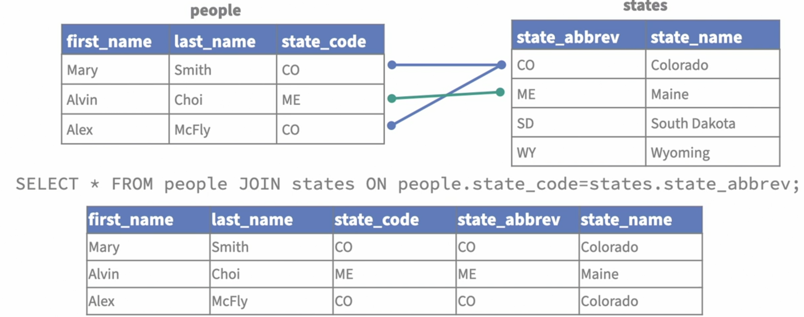
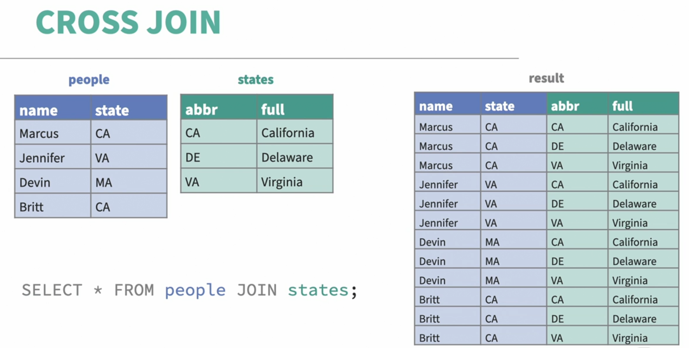
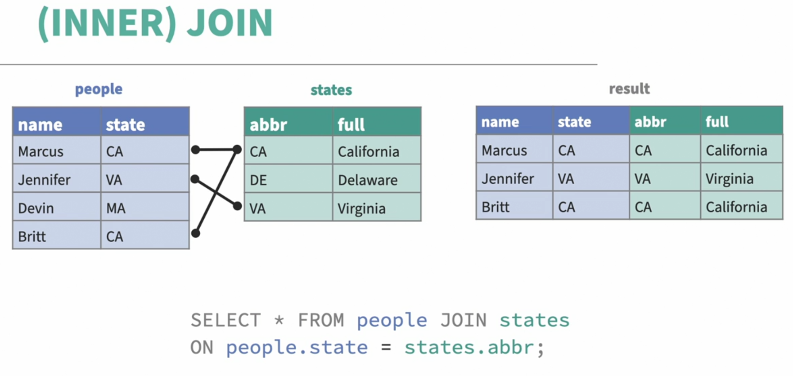
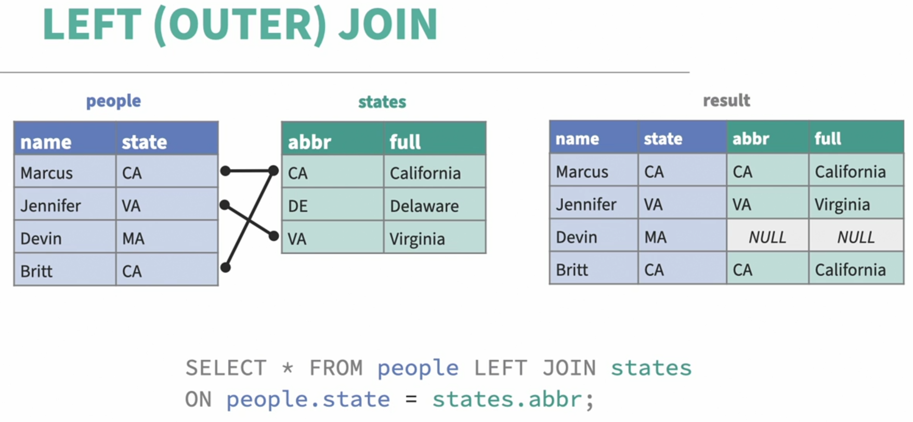
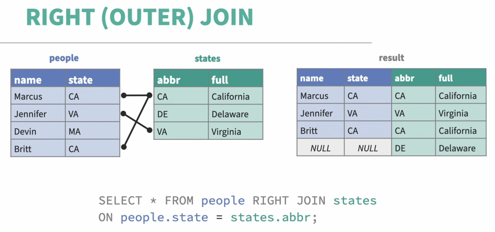
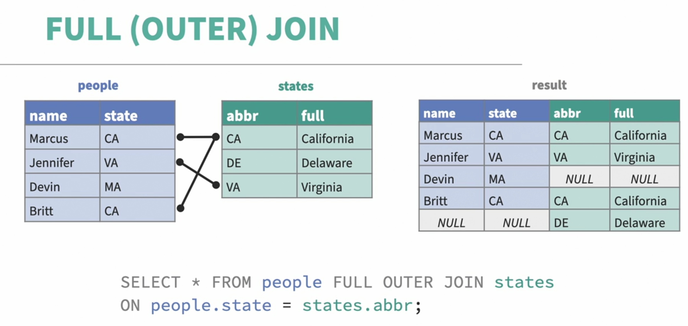

# Learning SQL Programming

## 0. Introduction

### 0.1. Learning SQL programming

- [DB Browser for SQLite](https://sqlitebrowser.org)

### 0.2. Exercise files

- Exercise Files

  - `results.db`
    - is the file to use within DB Browser for SQLite.
  - `quizresults.sql`
    - is a SQL file suitable for importing into other DBMS tools, but will not work with DB Browser for SQLite.
  - `statements.sql`
    - is a listing of each SQL statement used in the course

- Contents of the Quiz Data Database
  - The poeple table
    - Information about fictional quiz participants
    - Name, quiz score, participation gift, and other data
  - The states table
    - Abbreviations, names, and other information about the 50 US states

### 0.3. Exploring DB Browser for SQLite

- Tools for Using SQL

  - To write and use SQL, we need to use software that communicates with a database
  - There are many programs that can use SQL, including many DBMS options
  - Often, setting up a database involves a lot of work
  - `DB Browser for SQLite` will let us get started without a lot of technical configuration (sqlitebrowser.org/dl)

- DB Browser for SQLite

  - Focused on working with SQLite databases, which are widely used in mobile and desktop apps
  - We won't use many features of the DB Browser software right now
  - DB Browser makes it easy to work with SQLite databases for learning or for professional tasks
  - DB Browser is free and works on all major platforms

### 0.4. What is a database

- Database

  - A collection of information, usually involving relationships between the data stored in it

  | name    | city     | color |
  | ------- | -------- | ----- |
  | Marilyn | Austin   | Red   |
  | Tim     | New York | Green |
  | Chloe   | Seattle  | Blue  |

  - Column(filed)
  - Row(record)
  - Fields and records make up a table
  - One or more tables make up a database

- Databases vs. Spreadsheets

  - Both store data in fields and records
  - Database tables can have specific relationships to each other

    - Schema:
      - The layout and definition of how fields, tables, and relationships are set up is called the schema of the database
      - Ref: _Programming Foundations: Databases_

  - Databases allow us to manage data and ask questions about data

### 0.5 What is SQL

- `SQL`

  - Structured Query Language(SQL) lets us formulate questions a database can respond to.

  - Write a question a computer can understand
  - Express what you mean explicitly
  - Often is a series of smaller questions
  - Adopted into many DBMSs

- Pronunciation of SQL

  - Language is called SQL
  - Originally called SEQUEL
  - Pronunciation varies by application
  - In general, pronounce the language as "S-Q-L" and product names (such as SQL Server) as "sequel"

- SQL Statements

  - SQL is `whitespace independent`.

    ```
    SELECT first_name, last_name
      FROM quiz_results
      WHERE state_code = 'CA'
      ORDER BY last_name ASC;
    ```

  - Statements are composed of `clauses`.

    ```
    SELECT first_name, last_name  -- clause
      FROM quiz_results           -- clause
      WHERE state_code = 'CA'     -- clause
      ORDER BY last_name ASC;     -- clause
    ```

  - `Keywords` tell the database to take some action.

    `SELECT` first_name, last_name
    `FROM` quiz_results
    `WHERE` state_code = 'CA'
    `ORDER BY` last_name `ASC`;

  - `Field` and `table names` specify where to look and what to look for.

    SELECT `first_name`, `last_name`
    FROM `quiz_results`
    WHERE `state_code` = 'CA'
    ORDER BY `last_name` ASC;

  - Predicates are conditions, and expressions represent values.

    SELECT first_name, last_name
    FROM quiz_results
    WHERE `state_code = 'CA'` --'CA' is the expression
    ORDER BY last_name ASC;

  - Statements should end with a semicolon.

    SELECT first_name, last_name
    FROm quiz_results
    WHERE state_code = 'CA'
    ORDER BY last_name ASC`;`

  - A SQL statement is any SQL code that takes some kind of action
  - A SQL query is any statement that returns records

- Dual Roles of SQL
  - As a data manipulation language (DML)
    - Edit data in the database
    - Create, read, update, or delete(CRUD) records
  - As a data definition language (DDL)
    - Edit the structure (schema) of the database
    - Add, change, or remove fields or tables

## 1. Ask for Data from a Database

### 1.1: Ask for data with SELECT

- `SELECT`

  - The `SELECT` keyword tells the database we want some information returned to us.

  - Single quote is for literal texts

    ```
    SELECT 'Hello,  World!';
    ```

### 1.2: Narrow down a query with WHERE

- `WHERE`
  - The `WHERE` keyword lets us add selection criteria to a statement.

### 1.3: Adding more criteria to a statement

- Example:

  ```
  SELECT shirt_or_hat, state_code, first_name, last_name
  FROM people
  WHERE state_code='CA' OR(state_code='CO' AND shirt_or_hat='shirt');
  ```

### 1.4: Broadening and limiting responses

- `LIKE '%..'`

  - Return results that match part of a string.
  - The `%` character represents the portion of the string to ignore.
  - Example:

    ```
    SELECT * FROM people
    WHERE company LIKE 'B%N';
    ```

- `LIMIT n [OFFSET m]`

  - Stop returning results after _n_ results have been returned.

  ```
  SELECT * FROM people
  LIMIT 5;
  ```

  ```
  SELECT * FROM people
  LIMIT 5 OFFSET 5;
  ```

### 1.5: Organize responses with ORDER BY

- `ORDER BY field1, field2, ...[ASC|DESC]`

  - Sort the results of a query using _field1_, then _field2_, and so on.

  ```
  SELECT first_name, last_name
  FROM people
  ORDER BY first_name;
  ```

### 1.6: Find information about the data

- `LENGTH`

  ```
  SELECT first_name, LENGTH(first_name)
  FROM people
  ```

- `DISTINCT`

  ```
  SELECT DISTINCT(first_name)
  FROM people
  ORDER BY first_name;
  ```

- `COUNT`

  ```
  SELECT COUNT(*)
  FROM people
  WHERE state_code='CA';
  ```

### 1.7: Challenge - Retrieve data from the database

- Challenge: Summary of Prizes

  - List each person's name, team, and score
  - List which prise each person wants and sort the list using that information
  - Further sort the list by team name
  - Take about 10 minutes

### 1.8: Solution - Retrieve data from the database

```
SELECT shirt_or_hat, team, first_name, last_name, quiz_points
FROM people
ORDER BY shirt_or_hat, team;
```

## 2. Ask for Data from Two or More Tables

### 2.1: Ask for data across two or more tables

- `JOIN`

  - Ask for records across two tables that are associated with each other based on a common piece of information.

- Using JOIN to Connect Tables

  - 

- Example:

  - Explicit JOIN Using `JOIN` keyword

    ```
    SELECT *
    FROM people
    JOIN states ON people.state_code = state.state_abbrev
    WHERE people.first_name LIKE 'J%' AND states.region = 'South'
    ```

  - Implicit JOIN Using `,`

    ```
    SELECT ppl.first_name, st.state_name
    FROM people ppl, states st
    WHERE ppl.state_code = st.state_abbrev;
    ```

### 2.2: Understand JOIN types

- `CROSS JOIN`

  ```
  SELECT * FROM people JOIN states;
  ```

  - 

- `(INNER) JOIN`

  ```
  SELECT * FROM people JOIN states
  ON people.state = states.abbr;
  ```

  - 

- `LEFT (OUTER) JOIN`

  ```
  SELECT * FROM people LEFT JOIN states
  ON people.state = states.abbr;
  ```

  - 

- `RIGHT (OUTER) JOIN`

  ```
  SELECT * FROM people RIGHT JOIN states
  ON people.state = states.abbr;
  ```

  - 

- `FULL (OUTER) JOIN`

  ```
  SELECT * FROM people FULL OUTER JOIN states
  ON people.state = states.abbr;
  ```

  - 

- Support for JOIN types varies across database software.

### 2.3: Grouping results

```
SELECT state_code, quiz_points, COUNT(quiz_points)
FROM people
GROUP BY state_code, quiz_points;
```

### 2.4: Challenge - Practice with JOINs

- Challenge: Explore JOINs

  - 1. Create a summary of how many hats need to be shipped to each state

  - 2. Create a summary showing how many members of each team are in each geographic division

  - Take about 10 minutes

### 2.5: Solution - Practice with JOINs

- 1.

  ```
  SELECT states.state_name, COUNT(people.shirt_or_hat)
  FROM states
  JOIN people ON states.state_abbrev = people.state
  WHERE peple.shirt_or_hat = 'hat'
  GROUP by people.shirt_or_hat, states.state_name;
  ```

- 2.

  ```
  SELECT states.division, people.team, COUNT(people.team)
  FROM states
  JOIN people ON states.state_abbrev = people.state
  GROUP BY states.division, people.team;
  ```

## 3. Data Types, Math, and Helpful Features

### 3.1: Data types in SQL

- Data Type

  - The kind of data stored in a field
  - Can be text, numeric, binary, and so on
  - Certain operations are not possible with certain types

- SQL Data Types

  | Binary              | Date/Time | Numbers          | Text                   | Other   |
  | ------------------- | --------- | ---------------- | ---------------------- | ------- |
  | BINARY              | DATE      | BIGINT           | CHARACTER              | BOOLEAN |
  | BINARY LARGE OBJECT | INTERVAL  | DECIMAL          | CHARACTER LARGE OBJECT |         |
  | BINARY VARYING      | TIME      | DOUBLE PRECISION | VARCHAR                |         |
  |                     | TIMESTAMP | FLOAT            | NCHAR                  |         |
  |                     |           | INTEGER          | NCHAR VARYING          |         |
  |                     |           | NUMERIC          |                        |         |
  |                     |           | SMALLINT         |                        |         |
  |                     |           | REAL             |                        |         |

  - Binary types

    - Store short binary sequences (like 10010)
    - Store long binary sequences (files)

  - Date and time types

    - Store a value that should be treated as date/time data(like 2021-04-05 or 2021-04-05 17:35:00)

  - Number types

    - Store values as integers of various lengths, floating-point numbers, and so on

  - Text types

    - Store values intended to be used as text strings
    - Fixed or variable numbers of characters

  - Boolean type

    - Stores a true or false value

  - NULL
    - Represents a field having no value in it whatsover
    - Not the same as false, no, or zero

### 3.2: Math in SQL

- Most basic: use a `SELECT statement, such as SELECT 4+2;`
- Supports arithmetic operators: `+`, `-`, `*`, `/`, and `%`
- Assumes integer operations unless otherwise specified
- Supports comparison operators: >, <, >=, <=, =, !=, or <>
- Calculation functions: SUM(), AVG(), and so on

- ex:

  ```
  SELECT team, COUNT(*), SUM(quiz_points), SUM(quiz_points)/COUNT(*)
  FROM people
  GROUP BY team;
  ```

### 3.3: Compound Select

- `Subquery(or Subselect)`

  ```
  SELECT first_name, last_name, quiz_points
  FROM people
  WHERE quiz_points = (SELECT MAX(quiz_points) FROM people);
  ```

  ```
  SELECT *
  FROM people
  WHERE state_code=(
    SELECT state_abbrev FROM states WHERE state_name = 'Kansas'
  );
  ```

### 3.4: Transforming data

- Ex):

  - Sarah -> SARAH
  - 9O -> 90
  - Timothy -> Tim
  - California -> Cal1forn1a

- `LOWER`, `UPPER`

  ```
  SELECT LOWER(first_name), UPPER(last_name)
  FROM people;
  ```

- `SUBSTR`

  ```
  SELECT first_name, SUBSTR(last_name, 1, 5)
  FROM people;
  ```

  - `SUBSTR(last_name, -2)`
    - Negative number means choosing 2 characters from the end (last 2 strings)

- `REPLACE`

  ```
  SELECT REPLACE(first_name, "a", "-")
  FROM people;
  ```

- `CAST`

  ```
  SELECT quiz_points
  FROM people
  ORDER BY CAST(quiz_points AS CHAR);
  ```

  ```
  SELECT MAX(CAST(quiz_points AS CHAR))
  FROM people;
  ```

### 3.5: Creating aliases with AS

```
SELECT first_name AS first_name, UPPER(last_name) AS surname
FROM people
WHERE firstname='Laura';
```

### 3.6: Challenge - Calculate participant metrics

- Challenge: Quiz Metrics
  - 1. Show maximum score and average scroe in each state
  - 2. Sort by average score, with the largest at the top of the report
  - Take about 10 minutes

### 3.7: Solution - Calculate participant metrics

```
SELECT state, MAX(quiz_points) AS maxpoints, AVG(quiz_points) AS avgpts
FROM people
GROUP BY state
ORDER BY avgpts DESC;
```

## 4. Add or Modify Data

### 4.1: Add data to a table

- `INSERT` Statement

  - The INSERT keyword adds a record to a table.

  - Syntax:

    ```
    INSERT INTO tablename (field1, field2)
    VALUES (value1, value2);
    ```

  - Ex):

    ```
    INSERT INTO people
    (first_name, last_name)
    VALUES
    ('George', 'White'),
    ('Jenn', 'Smith'),
    ('Carol', NULL);
    ```

### 4.2: Modify data in a table

- `UPDATE`

  - The UPDATE keyword changes data stored in fields in a record.

  - Syntax:

    ```
    UPDATE tablename
    SET field1=value1, field2=value2
    WHERE condition;
    ```

  - Ex):

    ```
    UPDATE people SET company='Megacorp Inc' WHERE company='Fisher LLC'
    ```

### 4.3: Removing data from a table

- `DELETE`

  - Ex):

    ```
    DELETE FROM people WHERE id_number = 1001;
    ```

### 4.4: Challenge - Practice working with data

- Challenge: Maintain Records

  - Process requests to change data in the database

    - TODO 2021-01-29

    ***

    - ADD:
      Walter St. John, 93 points, Baffled Badgers
      Buffalo, NY (hat)

      Emerald Chou, 92 points, Angry Ants
      Topeka, KS (shirt)

    - CHANGE:
      Bonnie Brooks wants a shirt, not a hat!

    - REMOVE:
      Lois Hart has requested to be removed from our list.

### 4.5: Solution - Practice working with data

- INSERT

  ```
  INSERT INTO people
  (
    first_name,
    last_name,
    city,
    state,
    shirt_or_hat,
    quiz_points,
    team,
    signup,
    age
  )
  VALUES
  ('Walter', 'St. John', 'Buffalo', 'NY', 'hat', '93', 'Baffled Badgers', '2021-01-29', NULL),
  ('Emerald', 'Chou', 'Topeka', 'KS', 'shirt', '92', 'Angry Ants', '2021-01-29', 34);
  ```

- UPDATE

  ```
  UPDATE people SET shirt_or_hat = 'shirt' WHERE first_name = 'Bonnie' AND last_name = 'Brooks';
  ```

- DELETE

  ```
  DELETE FROM people WHERE first_name = 'Lois' AND last_name = 'Hart';
  ```

## 5. Conclusion

### 5.1: Overcoming common SQL mistakes

- Typos and syntax errors: read the error and break down the statement
- Text values should be in single quotation mark(')
- Field names with spaces need to be in backticks(`), but avoid spaces in field names if possible
- keep a development journal in plain text
- Copy and paste in plain text rather than formatted text
- Smart quotes(’), rather than straight quotes('), will cause problems
- Share SQL statements as plain-text.sql files or attachments rather than in chat or email
- To find null values, use `IS NULL` or `IS NOT NULL` instead of equality operators like `=`
- Test your matching conditions before using them for a destructive action like `UPDATE` or `DELETE`
- Most database software will run all the SQL statements in a window at once; select the ones you want to run

### 5.2: Next steps
