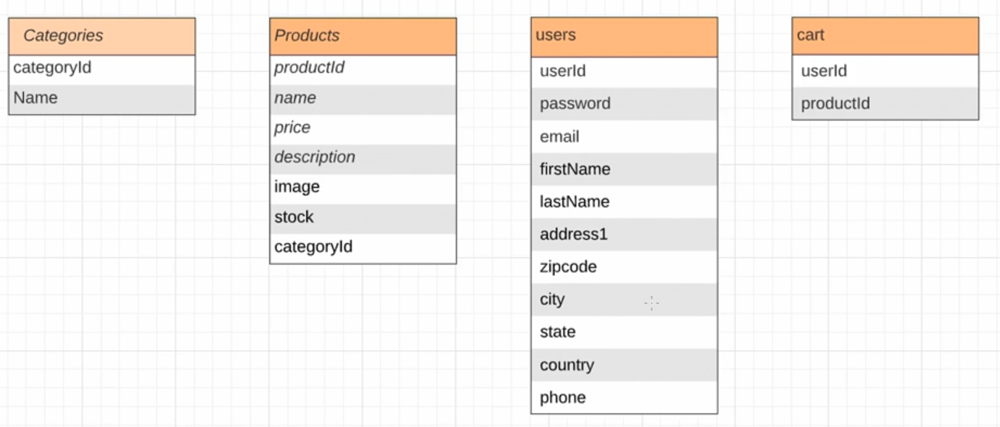
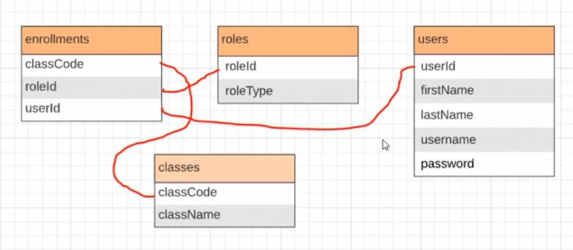

# SQL for Testers

## 0. Introduction

### 0.1: Dive deep into quality

### 0.2: What you should know

## 1. Getting Started

### 1.1: What is SQL and why use it as a tester

- Why Should You Care?

  - Understanding technology leads to better testing of that technology
  - Setting up test data
  - Better debugging
  - Employability

- Why Is It So Popular?
  - Relational databases work well
  - Simple to use
  - Because it is popular

### 1.2: Getting setup with the tools you need

- SQLiteStudio

  - https://sqlitestudio.pl/

- `FAKE_CAR_DATA` table
  - id
  - first_name
  - last_name
  - email
  - vehicle_make
  - vehicle_model
  - vehicle_year

### 1.3: Getting started with SQL queries

```
SELECT * FROM FAKE_CAR_DATA
WHERE vehicle_make="BMW";
```

```
SELECT * FROM FAKE_CAR_DATA
WHERE vehicle_year > 2000;
```

```
SELECT * FROM FAKE_CAR_DATA
WHERE vehicle_year BETWEEN 1995 AND 2000;
```

### 1.4: Understanding more complex SQL queries

```
SELECT * FROM FAKE_CAR_DATA
WHERE vehicle_year BETWEEN 1995 AND 2000
ORDER BY first_name DESC;
```

- [What Is the Order of Execution of an SQL Query?](https://www.designcise.com/web/tutorial/what-is-the-order-of-execution-of-an-sql-query)

## 2. Using SQL for Validation

### 2.1: Setting up a site for testing

- Using SQL fro Testing

  - Get hands-on experience
  - Local databases
  - Local website
  - Thank you to Himani13040
    - Repo: https://github.com/Himani13040/Flask-E-commerce

- Install Python 3

  - https://python.org/downloads

- Install Flask

  ```
  $ pip install flask
  ```

- Set environment variables

  ```
  $ set FLASK_APP=main
  ```

  ```
  $ set FLASK_ENV=development
  ```

- Start up the Flask local server

  ```
  $ flask run
  ```

- Open the app on the browser:

  - http://127.0.0.1:5000/

- Open `database.db` in SQLiteStudio

### 2.2: Validate user workflows

- Add to Cart

  - Click on a product and then click on Add to Cart
  - On DB,

    ```
    SELECT * FROM cart;
    ```

    - Result =>

    | userId | productId |
    | ------ | --------- |
    | 1      | 2         |

  - Get the product details of id `2`

    ```
    SELECT * FROM products
    WHERE productId = 2;
    ```

    - Result =>

      | productId | name            | price | description       | image       | stock | category |
      | --------- | --------------- | ----- | ----------------- | ----------- | ----- | -------- |
      | 2         | Women's t-shirt | 4.99  | @omen Tee hip hip | hip_hip.jpg | 0     | 2        |

    - The `stock` value has been decremented by adding the product into the cart

- Remove an item from the cart

  - Click on `Remove` from UI

  - DB

    ```
    SELECT * FROM cart;
    ```

    => No result

    | userId | productId |
    | ------ | --------- |
    |        |           |

    ```
    SELECT * FROM products
    WHERE productId=2;
    ```

    | productId | name            | price | description       | image       | stock | category |
    | --------- | --------------- | ----- | ----------------- | ----------- | ----- | -------- |
    | 2         | Women's t-shirt | 4.99  | @omen Tee hip hip | hip_hip.jpg | 1     | 2        |

    - The `stock` count has been back to `1`

- Add to Cart for two different users

  - John

    - productId: 1, 2

  - Jane

    - productId: 1, 8

  - DB

    ```
    SELECT * FROM cart;
    ```

    | userId | productId |
    | ------ | --------- |
    | 1      | 1         |
    | 1      | 2         |
    | 2      | 1         |
    | 2      | 8         |

- Remove user2's items from the cart

  - DB

    ```
    SELECT * FROM cart;
    ```

    | userId | productId |
    | ------ | --------- |
    | 1      | 1         |
    | 1      | 2         |

- `address1` field in user 1's profile

  - DB

    ```
    SELECT address1 AS A1 FROM users
    WHERE email="fakeuser1@gmail.com";
    ```

    =>

    | A1                   |
    | -------------------- |
    | 1 Main Street Apt. 2 |

### 2.3: Validate data integrity

- SQL JOIN

  - INNER JOIN

    - UI

      - There are 4 items in a cart

    - DB:

      ```
      SELECT * FROM cart;
      ```

      | userId | productId |
      | ------ | --------- |
      | 1      | 1         |
      | 1      | 2         |
      | 1      | 3         |
      | 1      | 4         |

      ```
      SELECT * FROM products
      INNER JOIN cart
      ON cart.productId = products.productId;
      ```

      | productId | name             | price | description      | image                        | stock | categoryId | userId | productId |
      | --------- | ---------------- | ----- | ---------------- | ---------------------------- | ----- | ---------- | ------ | --------- |
      | 1         | Men's Polo       | 9.99  | Men's Polo Shirt | MensPolo.jpg                 | 1     | 1          | 1      | 1         |
      | 2         | Women's Tshirt 1 | 4.99  | Women Tee 1      | relaxed_fit-front-f8f8f8.jpg | 0     | 2          | 1      | 2         |
      | 3         | Tester Tshirt    | 5.99  | Men's Tshirt 2   | testers-freakin-awesome.jpg  | 0     | 1          | 1      | 3         |
      | 4         | Men's Tshirt     | 9.99  | Men's Tshirt 3   | BrightIdea.jpg               | 1     | 1          | 1      | 4         |

    - Create a join between the `users` and the `cart` tables that gives you the first name of each user who has items in the cart.

      ```
      SELECT DISTINCT users.firstName FROM users
      JOIN cart
      ON cart.userId = users.userId;
      ```

      =>

      | firstName |
      | --------- |
      | John      |

  - OUTER JOIN
    - LEFT (OUTER) JOIN
    - RIGHT (OUTER) JOIN
    - FULL (OUTER) JOIN

## 3. Using SQL for Data Generation

### 3.1: Create new entries in a table

- Add Data to a Table

  - Why Add Data?

    - Create custom scenarios
    - Load scenarios
    - A word of warning: Be aware of where you are modifying data

  - In sample site at http://127.0.0.1/registerationForm

  - DB:

    ```
    SELECT * FROM users;
    ```

    | userId | password                         | email               | firstName | lastName | address1             | zipcode | city          | state      | country | phone      |
    | ------ | -------------------------------- | ------------------- | --------- | -------- | -------------------- | ------- | ------------- | ---------- | ------- | ---------- |
    | 1      | 827ccb0eea8a706c4c34a16891f8437b | fakeuser1@gmail.com | John      | Jones    | 1 Main Street Apt. 2 | A1B 2C3 | Paris         | Ontario    | Canada  | 1234567890 |
    | 2      | 827ccb0eea8a706c4c34a16891f8437b | fakeuser2@gmail.com | Jane      | Jones    | 123 Sunset Crescent  | 85123   | Somewherville | California | USA     | 1234567891 |

    ```
    INSERT INTO users (userId, password, email, firstName, lastName, address1, zipcode, city, state, country, phone)
    VALUES
    (3, "827ccb0eea8a706c4c34a16891f8437b", "fakeuser3@gmail.com", "Abe", "Lincoln", "Whitehouse", 12345, "Washington", "DC", "USA", 1234567654);
    ```

- Generate fake data

  - https://mockaroo.com/

### 3.2: Update existing entries in a table

- `UPDATE`

  ```
  UPDATE products
  SET name = "Very very long name to see what happens with long names"
  WHERE productId = 2;
  ```

  ```
  SELECT * FROM users;
  ```

  ```
  UPDATE users
  SET password = "827ccb0eea8a706c4c34a16891f8437b"
  ```

### 3.3: Deleting data from a table

- Deleting is destructive!

- Scenario 1:

  - Imagin that our database hooks up to another process which can remove products so they are no longer available.
  - We want to test what happens if the product is removed while someone already has it in their cart.

- UI

  - Add a product to a cart

- DB:

  ```
  SELECT * FROM cart;
  ```

  | userId | productId |
  | ------ | --------- |
  | 1      | 1         |

  - Delete

    ```
    DELETE FROM products
    WHERE productId = 1;
    ```

    =>

    Get an error, `FOREIGN KEY constraint failed`

    ```
    DELETE FROM cart;

    SELECT * FROM cart;
    ```

### 3.4: Challenge - Data generation

- Challenges

  - Reset database

    ```
    -- Empty the tables
    DELETE FROM cart;
    DELETE FROM users;
    DELETE FROM products;
    DELETE FROM categories;

    SELECT * FROM products;
    -- re-initialize users table
    INSERT INTO users
    VALUES (1, "827ccb0eea8a706c4c34a16891f8437b", "fakeuser1@gmail.com", "John", "Jones", "1 Main Street Apt. 2", "A1B 2C3", "Paris", "Ontario", "Canada", 1234567890);
    ```

  - Duplicate the rows in the product table so there are twice as many items available in the "store"
  - Add a new category to the categories table called "testers" and then modify the products table so all products that have "tester" in the name belong to that category

### 3.5: Solution - Data generation

- 1:

  ```
  INSERT INTO products
  SELECT productId + 14, name, price, description, image, stock, categoryId FROM products;
  ```

- 2:

  ```
  INSERT INTO categories
  VALUES
  (5, "testers");

  UPDATE products
  SET categoryId = 5
  WHERE name LIKE '%tester%';
  ```

  - In UI
    - You can see a new category link and if you click on it, you can see all the items that belong to that category

## 4. Testing SQL Queries

### 4.1: Transactions

- DB:

  ```
  BEGIN TRANSACTION;

    INSERT INTO cart
    VALUES
    (1, 2),
    (1, 3);

    SELECT * FROM cart;
  ```

  =>

  | userId | productId |
  | ------ | --------- |
  | 1      | 2         |
  | 1      | 3         |

  - When you see the cart from the UI, you cannot see changes because you executed the queries in a transaction;

- To fix the above issue, you should use the following commands with regards to a transaction:

  - ROLLBACK;
  - COMMIT;

  - In UI, if you refresh the page, you can see the same changes as one in the DB

- ```
  BEGIN TRANSACTION;
    INSERT INTO cart
    VALUES
    (1, 4);

    UPDATE products
    SET stock = stock - 1
    WHERE productId = 4;
  COMMIT;
  ```

  - When you run the query without `COMMIT` so the transaction is still active, the relevant tables are locked:

    - In the UI, if you try to remove an item from the cart, you can see a loading spinner

  - If we add `ROLLBACK;` and then execute the queries again, then you can see changes in the UI

### 4.2: Field constraints

- Rules that constrain what you are allowed to do on a given column or table.

  - `products` table

    - productId
      - Data type: INTEGER
      - Primary Key: TRUE
    - ...
    - categoryId

      - Data type: INTEGER
      - Foregin Key: TRUE

    - Change `name` field to `NOT NULL`

      ```
      UPDATE products
      SET name = NULL
      WHERE productId = 1;
      ```

      =>
      Get an error, "NOT NULL constraint failed: products.name"

    - `Check` constraint

      - Add `Check condition` on `price` column

        ```
        products.price > 0
        ```

      ```
      UPDATE products
      SET price = -1
      WHERE productId = 1;
      ```

      => Get an error, "CHECK constraint failed: products"

    - `Unique` constraint

      - Add `Unique` constraint on `image` column

    - `Foreign Key` constraint

      ```
      (categoryId) REFERENCES categories (categoryId)
      ```

      ```
      UPDATE categories
      SET categoryId = 6
      WHERE categoryId = 1;
      ```

      => Get an error, "FOREIGN KEY constraint failed"

      ```
      UPDATE products
      SET categoryId = 6
      WHERE productId = 1;
      ```

      => `FOREGIN KEY constraint failed` because you don't have a category with `6` yet.

    - `Primary Key`
      - Combination of `Unique` and `Not NULL` constraints

### 4.3: Schema validation

- Schema is equivalent to ERD
  

- How Does This Help with Testing?

  - Helps understand the big picture
  - Gives you insights into tests that you could run

### 4.4: Security testing

- OWSP Top Ten

  - https://owasp.org/www-project-top-ten/

    - Injection:
      - Injection flaws, such as SQL, NoSQL, OS, and LDAP injection, occur when untrusted data is sent to an interpreter as part of a command or query. The attacker's hostile data can trick the interpreter into executing unintended commands or accessing data without proper authorization.

- In sample website at http://127.0.0.1:5000/displayCategory?categoryId=1

  - You should see products belong to `Men's` category

  - If we attach ` OR 1=1` at the end of the above URL

    - http://127.0.0.1:5000/displayCategory?categoryId=1%20OR%201=1
    - You will see different results

  - In DB:

    ```
    'SELECT products.productId, products.name, products.price, products.image, categories.name
    FROM products, categories
    WHERE products.categoryId = categories.categoryId AND categories.categoryId = ' + categoryId
    ```

- PortSwigger SQL injection
  - https://portswigger.net/web-security/sql-injection

### 4.5: Performance testing

- SQL Performance Testing

  - How do you test query performance?

- Tips

  - Consider the context
  - Order of execution
  - OR statements can be slow
  - Watch out for wildcard searches

- Index

  - `products` table
    - Add an index on `price` column

- Indexing Trade-Offs

  - Cost to create and maintain
  - Increased query speed

### 4.6: Challenge - Database tests

- Final Challenge

  - A new database, `challenge`

    - `classes`
    - `enrollments`
    - `roles`
    - `users`

  - Draw out the schema for this database
  - What are the names of the students enrolled in the math class?
  - What classes is the person with username `ehorstead2` enrolled in?

- Final Challenge: Modify Data

  - Use a transaction to create a new class, enroll a teacher and two students in the class, and then check the names of the students who have been enrolled before committing the transaction.
  - Change the role of teacher enrolled in the `art` class to be an `administrator` in that class

### 4.7: Solution - Database tests

- 1. Draw out the schema for this database

  - 

- 2. What are the names of the students enrolled in the math class?

  ```
  SELECT * FROM classes;
  ```

  =>

  | classCode | className |
  | --------- | --------- |
  | 1         | Math      |
  | 2         | Language  |
  | 3         | Science   |
  | 4         | Art       |

  ```
  SELECT * FROM roles;
  ```

  =>

  | roleId | roleType |
  | ------ | -------- |
  | 1      | Student  |
  | 2      | Teacher  |
  | 3      | Admin    |

  ```
  SELECT firstName, lastName FROM users, enrollments
  WHERE users.userId = enrollemnts.userId AND enrollments.classCode = 1 AND enrollments.roleId = 1;
  ```

  =>

  | firstName  | lastName |
  | ---------- | -------- |
  | Rosemary   | Enriquez |
  | Enrichetta | Horstead |

- 3. What classes is the person with username `ehorstead2` enrolled in?

  ```
  SELECT classes.className FROM classes
  JOIN enrollments ON classes.classCode = enrollments.classCode
  JOIN users ON users.userId = enrollments.userId
  WHERE users.username = 'ehorstead2';
  ```

  =>

  | className |
  | --------- |
  | Math      |

- 4. Use a transaction to create a new class, enroll a teacher and two students in the class, and then check the names of the students who have been enrolled before committing the transaction.

  ```
  BEGIN TRANSACTION;

    INSERT INTO classes
    VALUES
    (5, "History");

    INSERT INTO enrollments
    VALUES
    (5, 1, 1),
    (5, 1, 2),
    (5, 2, 3);

    SELECT firstName, lastName FROM users, enrollments
    WHERE users.userId = enrollments.userId AND enrollments.classCode = 5 AND enrollments.roleId = 1;

  COMMIT;
  ```

  - Run the query without including `COMMIT` statement

    =>

    | firstName | lastName |
    | --------- | -------- |
    | Rosemary  | Enriquez |
    | Ellen     | Abby     |

  - Run the `COMMIT;` statement

- 5. Change the role of teacher enrolled in the art class to be an administrator in that class

  ```
  SELECT classCode FROM classes WHERE classes.className = 'Art';
  ```

  =>

  | classCode |
  | --------- |
  | 4         |

  ```
  UPDATE enrollments
  SET roleId = 3
  WHERE roleId = 2 AND classCode = 4;
  ```

## 5. Conclusion

### 5.1: Next steps

- What Have You Learned?
  - How to validate data and workflows
  - How to set up test scenarios with SQL
  - How to test SQL
  - How to think about performance and security in database testing
