# Advanced SQL - Logical Query Processing, Part 1

## 0. Introduction

### 0.1. Course introduction

### 0.2. Course agenda

- Introduction
- Constructing the source data set
- Filtering with WHERE
- Grouping and group filtering
- Ordering and paging
- Conclusion

### 0.3. Tooling

- I'll use the term 'Database' for 'Relational Database Management System'
  - SQLite
  - PostgreSQL
  - Oracle
  - Microsoft SQL Server
  - MySQL
- I'll use MS SQL Server
- DBeaver

  - https://dbeaver.io/
  - Free multi-platform database tool for developers, database administrators, analysts and all people who need to work with databases. Supports all popular databases: MySQL, PostgreSQL, SQLite, Oracle, DB2, SQL Server, Sybase, MS Access, Teradata, Firebird, Apache Hive, Phoenix, Presto, etc.

- DB fiddle
  - https://dbfiddle.uk/

### 0.4. Introducing the demo database

- Animal Shelter demo database
  - 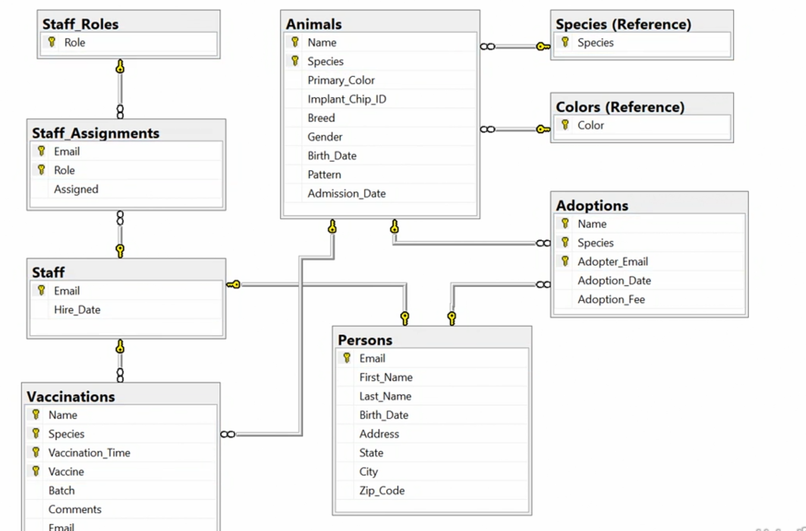
  - [Repo](https://github.com/ami-levin/Animal_Shelter)

### 0.5. Using the code files

- SQL query logical processing order
  - FROM
    - 1. Source Data
  - WHERE
    - 2. Row Filter
  - GROUP BY
    - 3. Grouping
  - HAVING
    - 4. Group Filter
  - SELECT
    - 5. Return Expressions
  - ORDER BY
    - 6. Presentation Order
  - OFFSET FETCH
    - 7. Paging

## 1. Constructing Query Source Data Sets

### 1.1. Single data source queries

- FROM-less SELECT

  ```
  SELECT 'Hello World!'
  ```

  | Dummy Column |
  | ------------ |
  | Dummy Value  |

  => no alias
  'Hello World!'

- Source Data Set Requirements

  - Each set is uniquely aliased
  - Each column is uniquely aliased
  - Sets are unordered

- Side note:

  - The relational model deals exclusively with sets. Sets consist of unique elements.
  - SQL allows for "sets" with duplicate rows called "multi-sets", or "bags".

- Single Data Source

  ```
  SELECT Foo
  FROM XXX
  ```

  - `XXX` can be anything compliant:
    - table
    - view
    - function
    - subquery derived table

- Single Source Data Set

  ```
  SELECT Foo
  FROM Bar;
  ```

  - [code](1.1.sql)

### 1.2. Dual source query processing

- Step 1 - Cartesian Product

  - 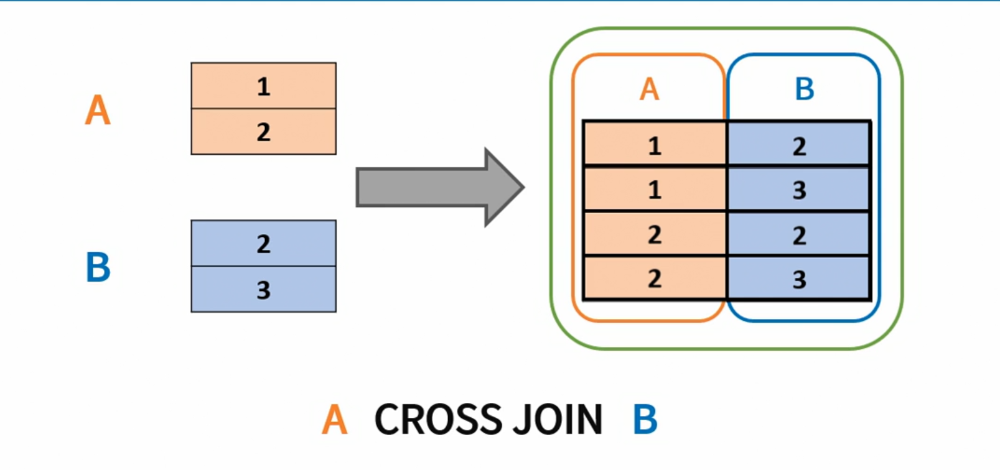

- Step 2 - Qualification

  - 

- Step 3 - Left Reservations

  - 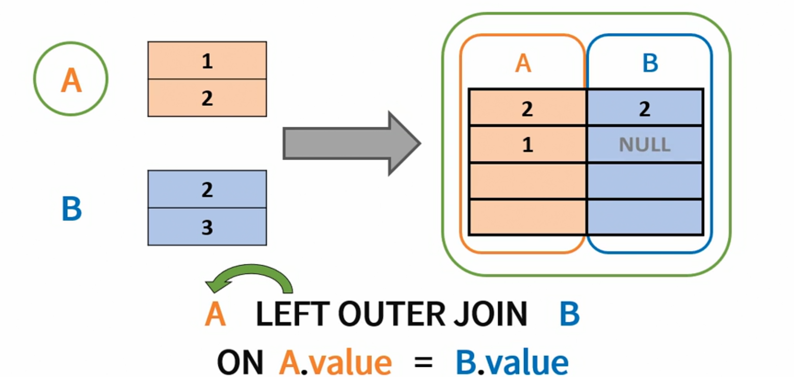

- Step 3 - Right Reservation

  - 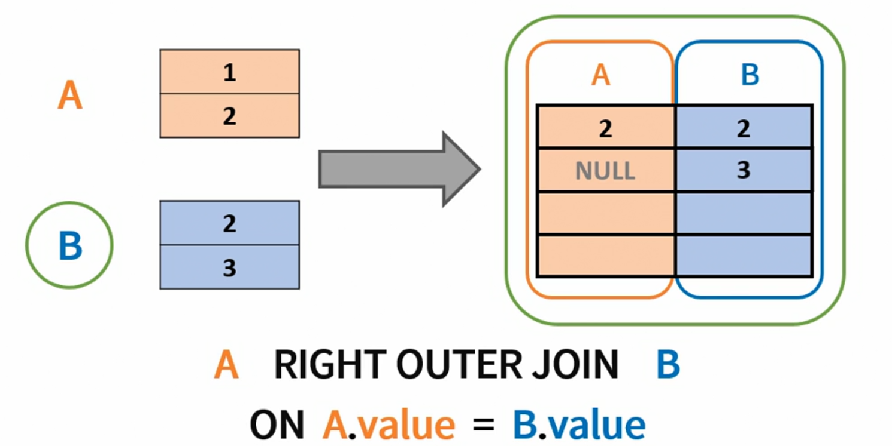

- Step 3 - Full Reservations

  - 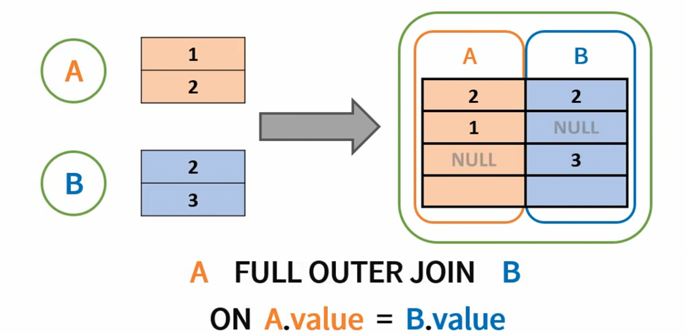

- Join Syntax Shortcuts

  - A INNER JOIN B ON...
    - A JOIN B ON...
  - A LEFT OUTER JOIN B ON...
    - A LEFT JOIN B ON...
  - A RIGHT OUTER JOIN B ON...
    - A RIGHT JOIN B ON...
  - A INNER JOIN B ON A.X = B.X

    - A INNER JOIN B USING (X)

  - Avoid natural join
    - A NATURAL JOIN B
      - Assuming X is the only common alias!
    - Natural Join: Guidelines
      - The associated tables have one or more pairs of identically named columns.
      - The columns must be the same data type.
      - Don’t use ON clause in a natural join.

### 1.3. Joining multiple source data sets

```
SELECT Foo, Bar
FROM A INNER JOIN B
        ON A.X = B.X
      INNER JOIN C
        ON C.Y = B.Y
      INNER JOIN D
        ON D.Z = C.Z
```

- Chiastic Order

  - 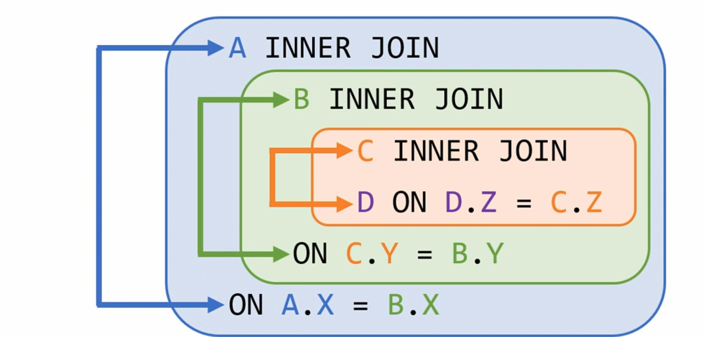

  ```
  ( A
    INNER JOIN
    ( B
      INNER JOIN
      ( C
        INNER JOIN
        D
        ON D.Z = C.Z)
      ON C.Y = B.Y)
    ON A.X = B.X)
  ```

- When the going gets tough, the tough get going.

### 1.4. Challenge - Hybrid multi-table join

- Challenge - Animal vaccinations report
  - Write a query to report animals and their vaccinations.
  - Include animals that have not been vaccinated.
  - The report should show the animal's name, species, breed, and primary color, vaccination time and the vaccine name, the staff member's first name, last name, and role.
  - Guidelines:
    - Use the minimal number of tables required.
    - Use the correct logical join types and force join order as needed.

### 1.5. Solution - Hybrid multi-table join

- 

## 2. Row Filters

### 2.1. Filtering source rows

- WHERE Processing

  - 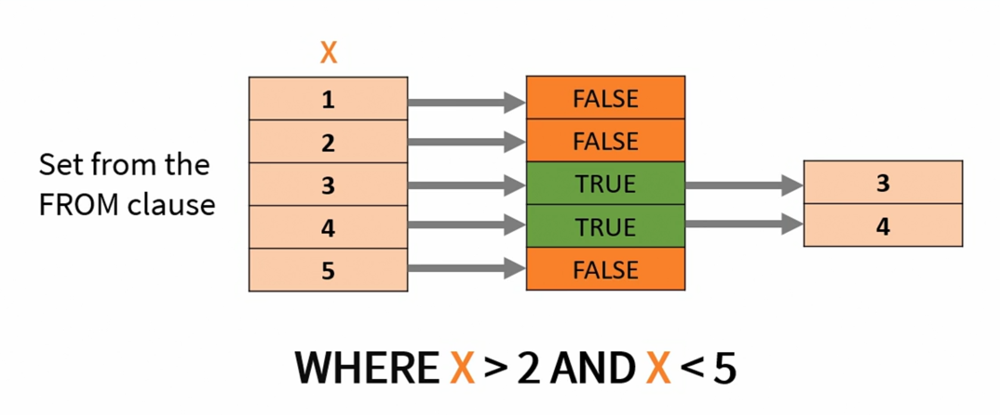

- JOIN vs. WHERE - Round 1

  - JOIN

    ```
    SELECT *
    FROM  A INNER JOIN B
          ON A.X = B.X
            AND A.X > 1;
    ```

    - 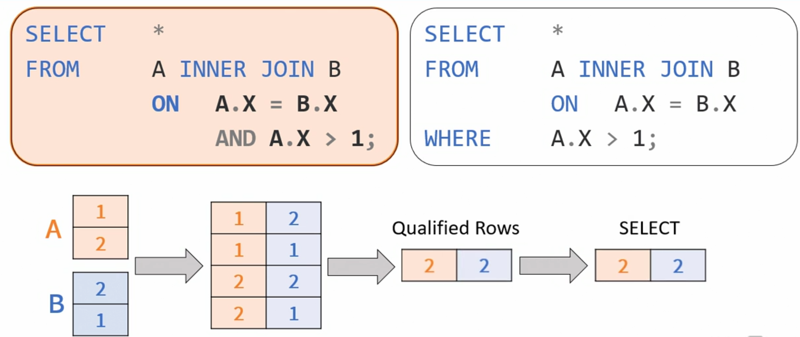

  - WHERE

    ```
    SELECT *
    FROM  A INNER JOIN B
          ON A.X = B.X
    WHERE A.X > 1;
    ```

    - 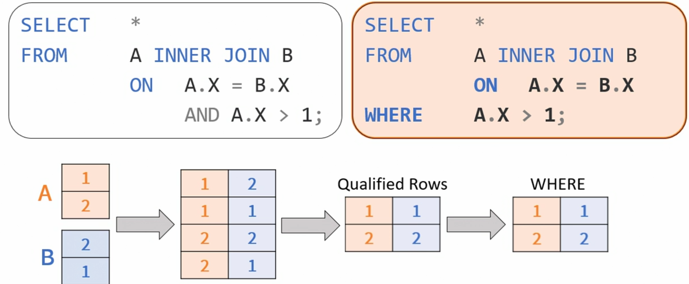
    - 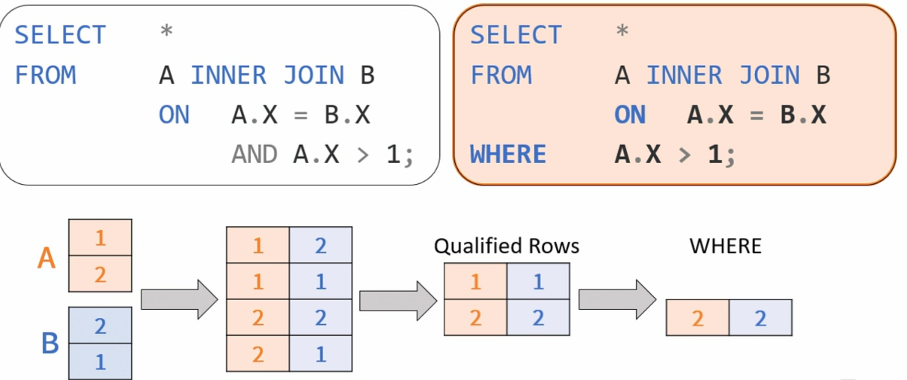

  - While the results of both queries are the same, their logical processing is different.

- JOIN vs. WHERE - Round 2

  - JOIN

    ```
    SELECT *
    FROM  A LEFT JOIN B
          ON A.X = B.X
            AND A.X > 1;
    ```

    - 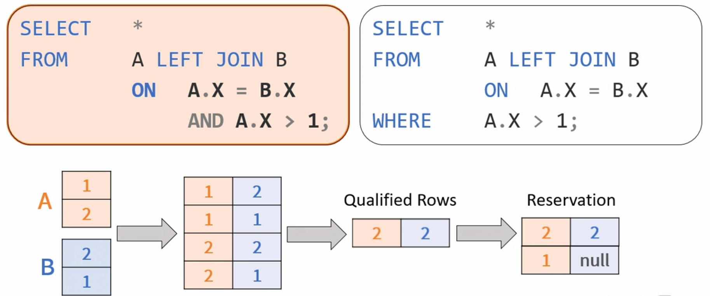

  - WHERE

    ```
    SELECT *
    FROM  A LEFT JOIN B
          ON A.X = B.X
    WHERE A.X > 1;
    ```

    - 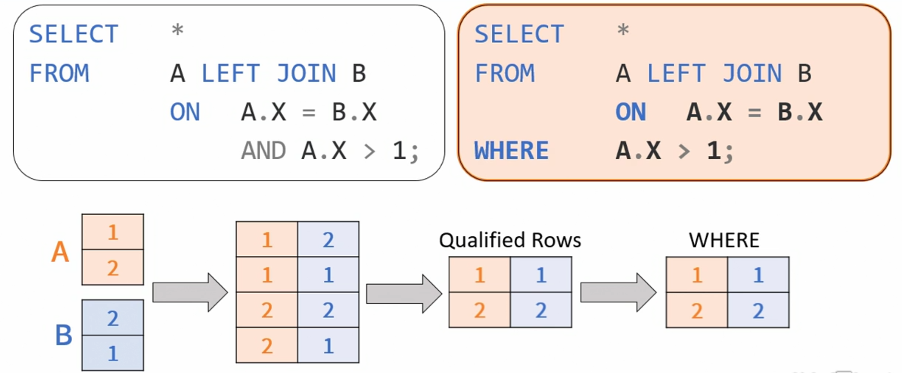
    - 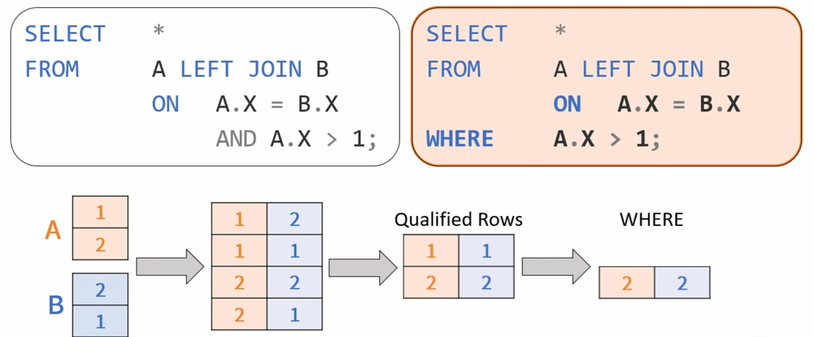

  - For outer joins, moving a predicate from the join qualification to the where clause changes the meaning of the query!

### 2.2. Missing information and ternary logic

- NULL is `NOT` a value.

  - It is an indicator to the absence of a value.

- NULL Types

  - A-Values
    - "The value exists, we just don't know it."
  - I-Values
    - "This attribute is irrelevant for this tuple."

- Ternary Logic Evaluation

  | a       | b       | a OR b  | a AND b | a = b   | NOT a   |
  | ------- | ------- | ------- | ------- | ------- | ------- |
  | True    | True    | True    | True    | True    | False   |
  | True    | False   | True    | False   | False   | False   |
  | True    | Unknown | True    | Unknown | Unknown | False   |
  | False   | True    | True    | False   | False   | True    |
  | False   | Flase   | False   | False   | True    | True    |
  | False   | Unknown | Unknown | False   | Unknown | True    |
  | Unknown | True    | True    | Unknown | Unknown | Unknown |
  | Unknown | False   | Unknown | False   | Unknown | Unknown |
  | Unknown | Unknown | Unknown | Unknown | Unknown | Unknown |

- [code](2.2.sql)

### 2.3. Dealing with ternary logic in SQL

- [code](2.3.sql)

## 3. Grouping

### 3.1. Grouping

- 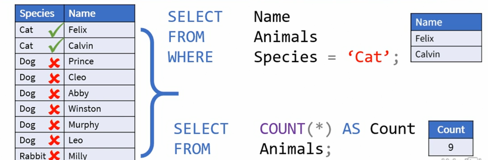

- 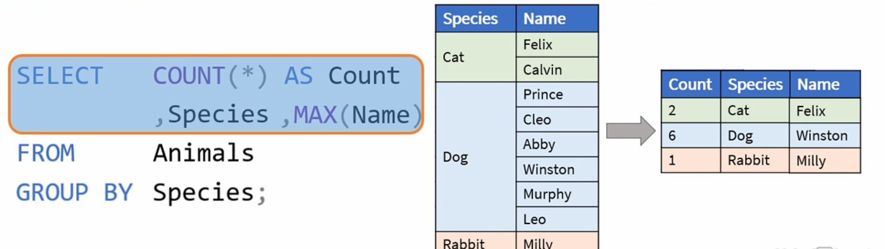

- After the data set is groupd, we can only reference the grouping expressions since they are guaranteed to have the same value for all rows within a group.
- All other expressions must be enclosed in an aggregate function to guarantee the same.

- [code](3.1.sql)

### 3.2. Dealing with NULLs and elimination duplicates

- Grouping NULLs

  - 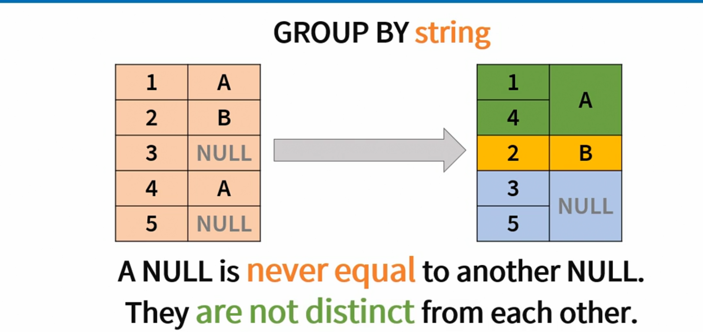
  - A NULL is `never equal` to another NULL.
  - They `are not distinct` from each other.

- Aggregating NULLs

  - 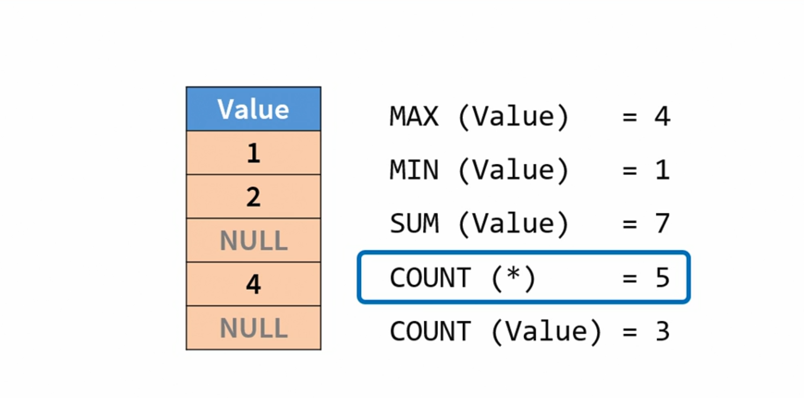

- [code](3.2.sql)

### 3.3. Group filters

- 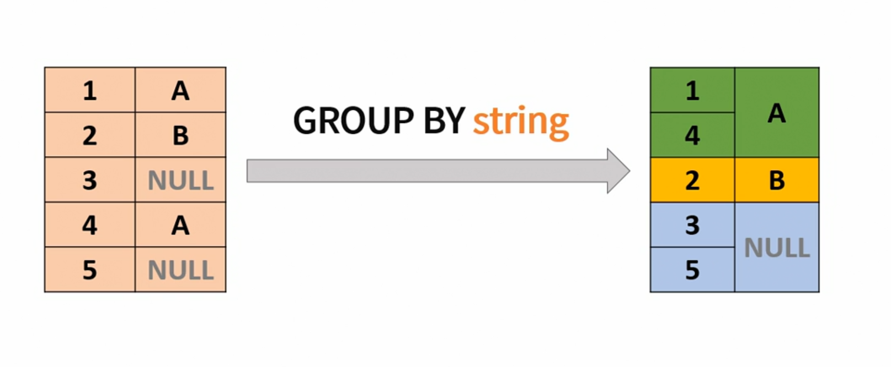
- 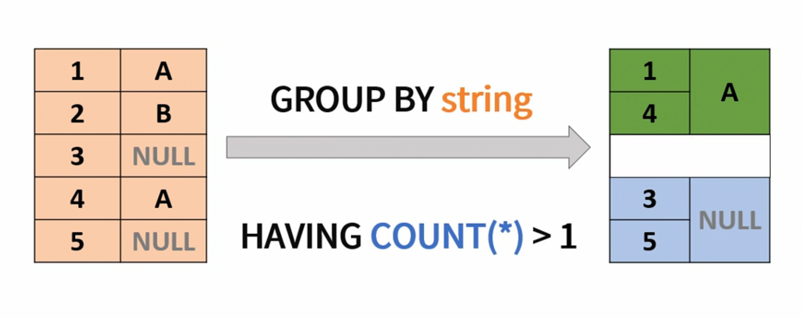
- [code](3.3.sql)

### 3.4. Challenge - Filtering and grouped query

- Challenge - Animal vaccinations report

  - Write a query to report the number of vaccinations each animal has received.
  - Include animals that were never adopted.
  - Exclude all rabbits.
  - Exclude all Rabies vaccinations.
  - Exclude all animals that were last vaccinated on or after October first, 2019.

  - The report should return the following attributes:

    - Animals Name, Species, Primary Color, Breed,
    - and the number of vaccinations this animal has received,

  - Guidelines
    - Use the correct logical join types and force order if needed.
    - Use the correct logical group by expressions.

### 3.5. Solution - Grouped query with Distinct

- [Solution](3.5.sql)

## 4. Ordering and Paging

### 4.1. Presentation ordering in multitier architecture

- Application Tiers
  - Data
  - Business
  - Presentation

### 4.2. Ordering result sets

- Law and Order

- NULL Order

  - PostgreSQL and Oracle

    ```
    ORDER BY Value ASC NULLS LAST
    ```

- [code](4.2.sql)

### 4.3. Paging result sets

- Albert Einstein said,

  - "In theory, theory and practice are the same. In practice, they are not."

- [code](4.3.sql)

## 5. Conclusion

### 5.1. Course review and takeaway

- 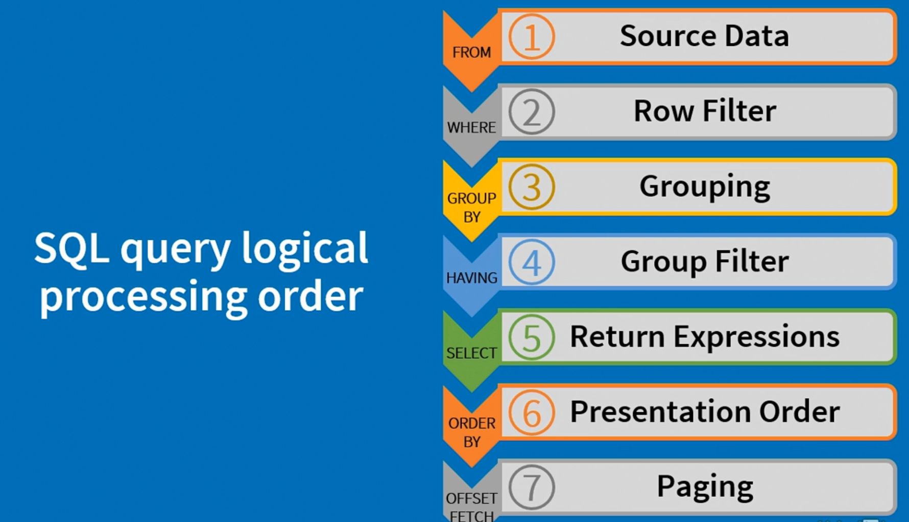
- Further study
  - Subquery Processing
  - Lateral Derived Tables
  - Cursors
  - Ordered Set Functions
  - Windowed Functions
  - Recursive Common Table Expressions
  - All-at-Once Principal
  - Row Pattern Recognition
  - Polymorphic Table Functions

### 5.2. Feedback and additional resources
