# Advanced SQL - Logical Query Processing, Part 2

## 0. Introduction

### 0.1. Course introduction

### 0.2. Agenda

### 0.3. Setting expectations

- IDE
  - Azure Data Studio
    - Supports both PostgreSQL and SQL Server

## 1. Subqueries and Set Operators

### 1.1. Subqueries

- SubqueryProcessing

  - Table expression
  - Scalar expression
  - Row expression

- A scalar is an element of a field which is used to define a vector space. A quantity described by multiple scalars, such as having both direction and magnitude, is called a vector.

- Non-Correlated Subquery

  ```
  SELECT Foo,
          (SELECT AVG(Foot)
            FROM Bart
          ) AS Bar
  FROM FooBar;
  ```

- Correlated Subquery

  ```
  SELECT Foo,
        ( SELECT AVG(Foot)
          FROM Bart
          WHERE Bart.Foot = Foobar.Foo
        ) AS Bar
  FROM FooBar;
  ```

- `EXISTS`

  - Return result only if the subquery returns at least one row

  ```
  SELECT *
  FROM Foo
  WHERE EXISTS (
                  SELECT *
                  FROM Bart
                  WHERE Bart.Foot = Foo.Bar  );
  ```

- [code](1.1.sql)

### 1.2. Set operators

- 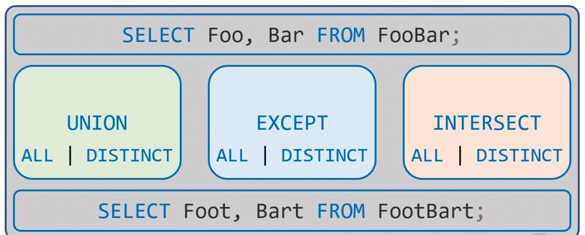
- There are 3 types of set operators

  - `UNION`

    - ALL | DISTINCT

  - `EXCEPT`

    - ALL | DISTINCT

  - `INTERSECT`

    - ALL | DISTINCT

  - Note: Default: `DISTINCT`

- Side note:

  ```
  SELECT ALL * FROM Foo;/*SELECT ALL is default*/
  ```

  - `MULTISET` for every set operators
    - Only supported by Oracle

- Set Operators vs. Joins

  - JOIN
    - Combine two table expressions horizontally
    - 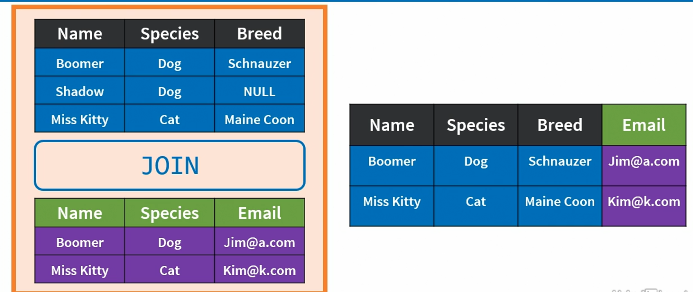
  - Set Operators
    - Combine two table expressions vertically
    - 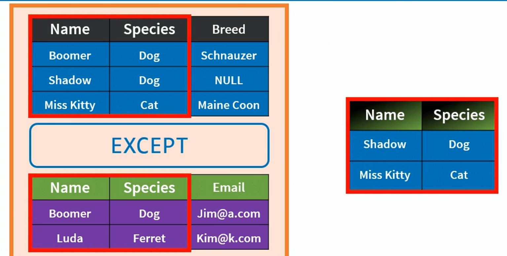
    - 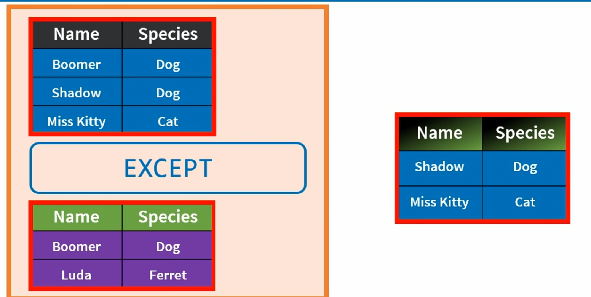

- UNION ALL
  - 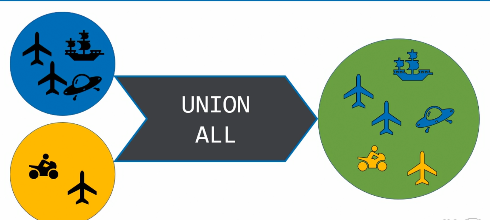
- UNION DISTINCT
  - 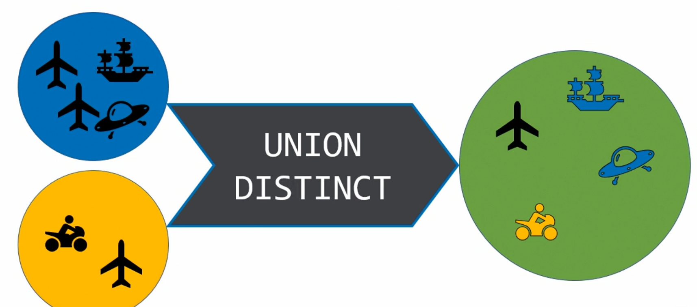
- INTERSECT ALL
  - 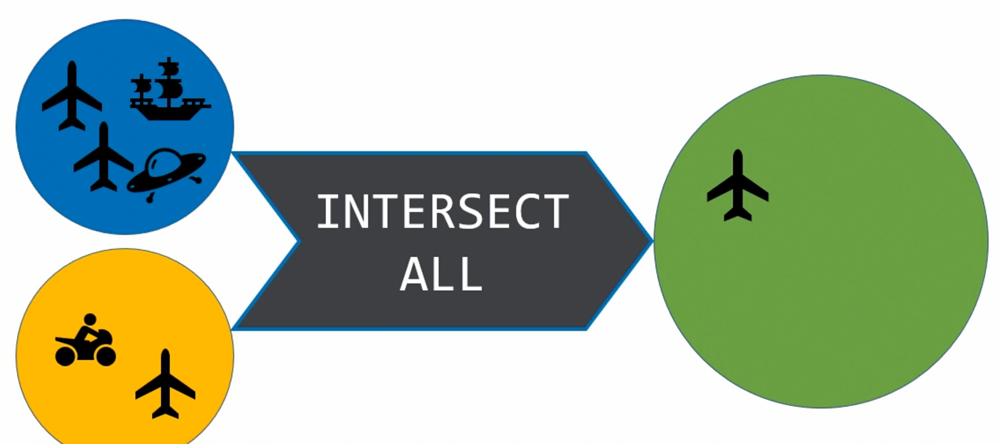
  - Note: PostgreSQL and MariaDB only supports it
- INTERSECT DISTINCT
  - 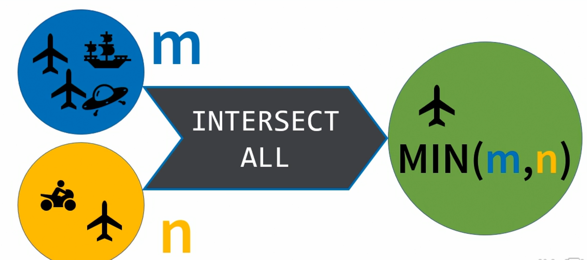
  - 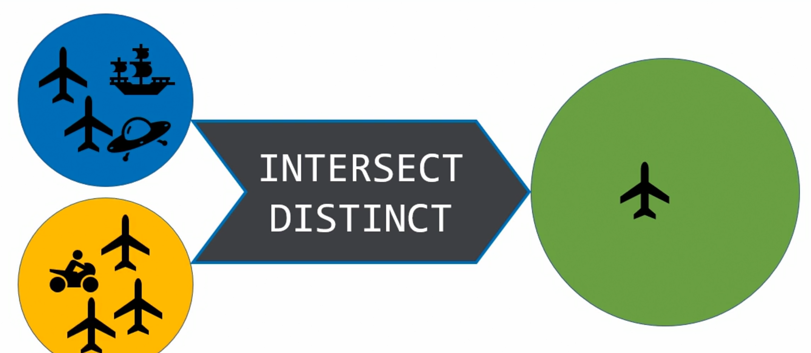
- EXCEPT ALL
  - 
  - 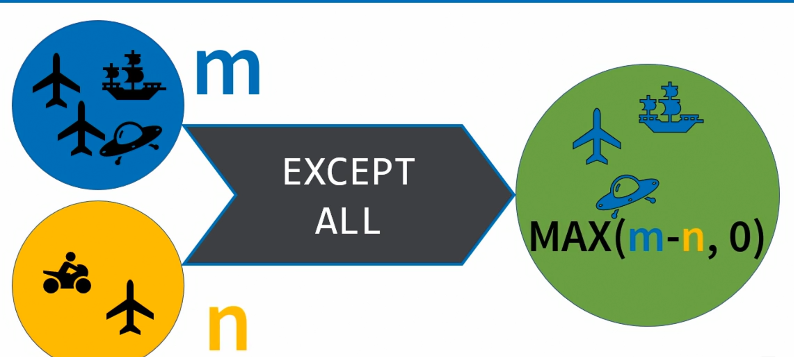
  - Note: PostgreSQL and MariaDB only supports it
- EXCEPT DISTINCT
  - 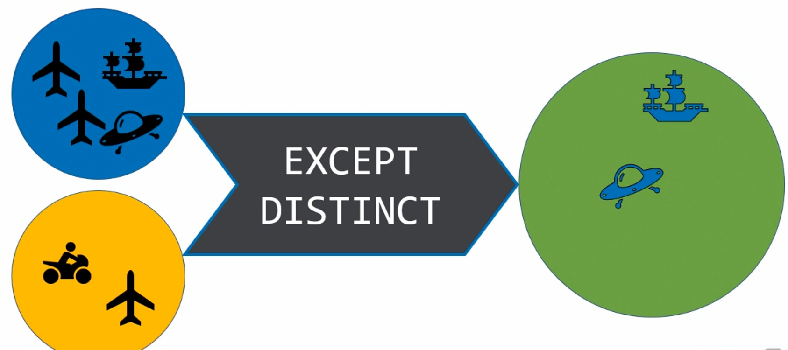
- EXCEPT Direction

  - 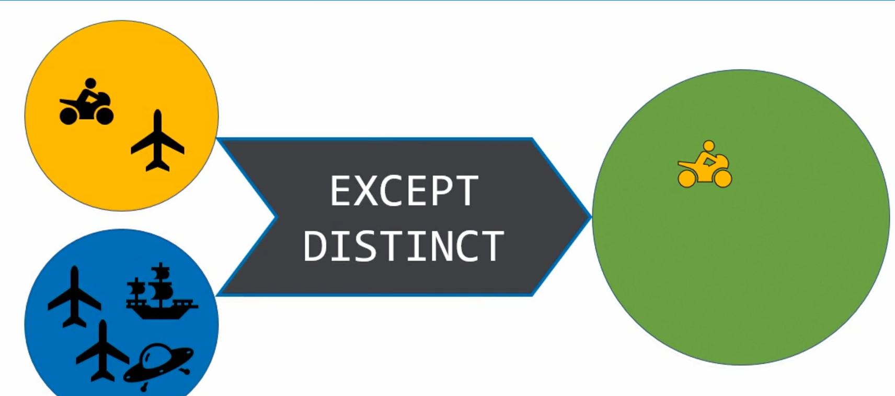
  - 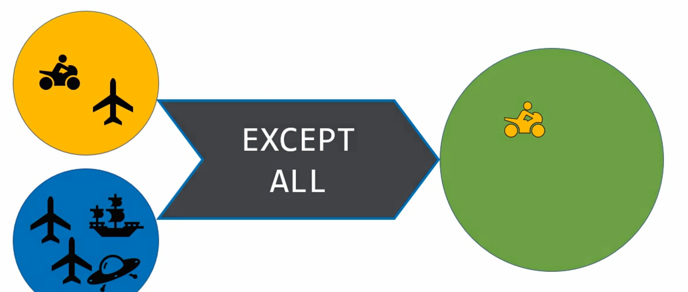

- Set Operators and NULL

  - `X = Y` vs. `X NOT DISTINCT FROM Y`
  - 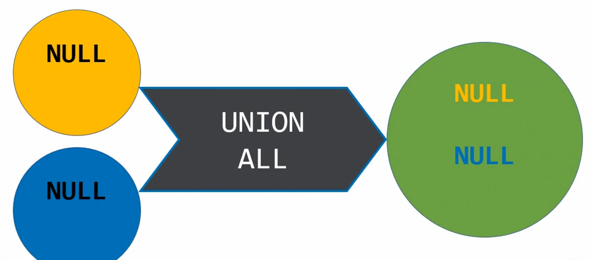
  - 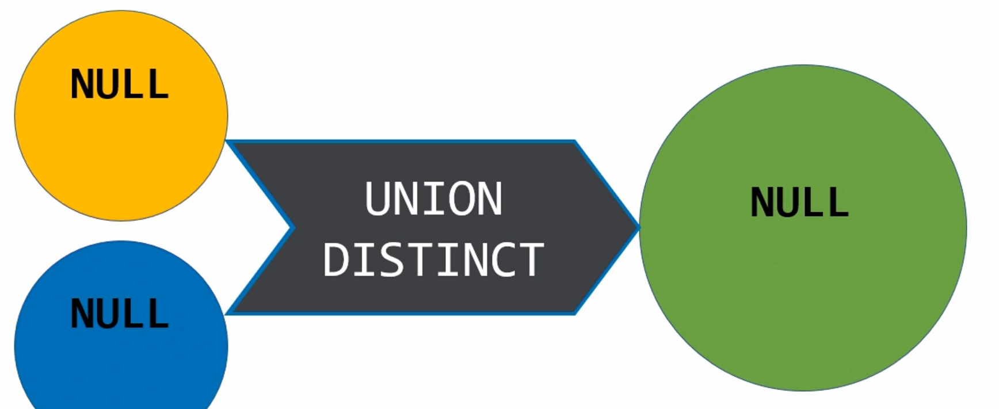

- [code](1.2.sql)
  - Anti Join
  - Semi Join
  - Anti Semi Join
    - Hybrid of Anti and Semi joins

### 1.3. Challenge

- Show which breeds were never adopted.
- NULL breeds need to be considered carefully.
- The answer is that only Turkish Angora Cats were never adopted.
- Try to solve using OUTER JOIN, NOT EXISTS, and NOT IN first.

### 1.4. Solution

- [code](1.4.sql)

## 2. Advanced Joins

### 2.1. Self and inequality joins

- Self Joins

  - A use case:

    - In graph theory and computer science, an adjacency list is a collection of unordered lists used to represent a finite graph. Each list describes the set of neighbors of a vertex in the graph
      - https://en.wikipedia.org/wiki/Adjacency_list

  - Adjacency Lists
    - 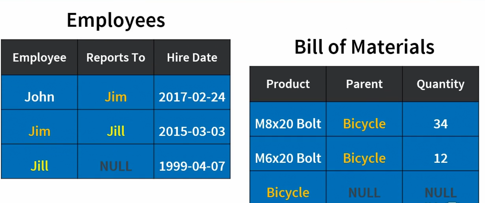

- Non-Equality Joins

  - 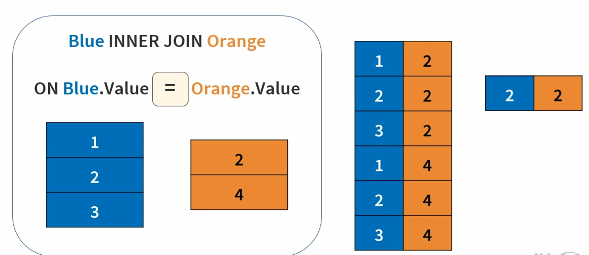
  - 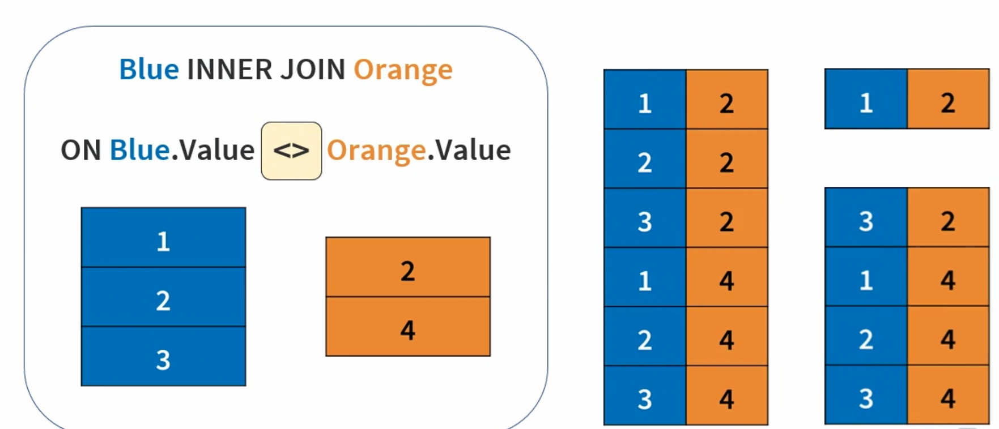
  - 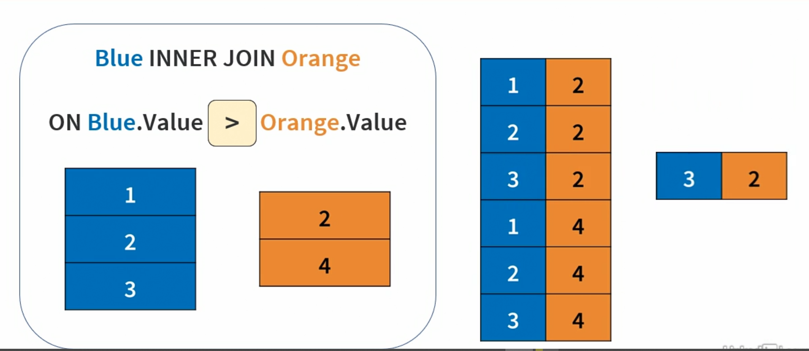

- [code](2.1.sql)

### 2.2. Lateral joins

- 'Stand Alone' Data Sources

  ```
  SELECT *
  FROM Foo AS F1
  CROSS JOIN
  (
    SELECT  Foot,
            COUNT(*) AS Count
    FROM FootBart AS F2
    WHERE F2.Bart = 5
    GROUP BY Foot
  ) AS X;
  ```

  - F1 and F2 are independent

  - If we change the code like this:

    ```
    SELECT *
    FROM Foo AS F1
    CROSS JOIN
    (
      SELECT  Foot,
              COUNT(*) AS Count
      FROM FootBart AS F2
      WHERE F2.Bart = F1.Bar
      GROUP BY Foot
    ) AS X;
    ```

    - We get an error, saying `The multi-part identifier "F1.Bar" could not be bound.` because `F1.Bar` doesn't exist in the context of the subquery.

- [code](2.2.sql)
- Support for LATERAL JOIN
  - Oracle, PostgreSQL, MySQL
- SQL Server can emulate the `LATERAL JOIN` using `CROSS APPLY `and `OUTER APPLY`

### 2.3. Challenge

- Our shelter has been experiencing financial difficulties.

  - !!! PLEASE consider donating to your local animal shelter !!!
  - The board of directors decided to explore additional revenue sources and came up with an idea.
  - Instead of spaying and neutering all animals, the shelter should consider responsible breeding of purebred animals.
  - !!! This is a hypothetical question – ALWAYS spay and neuter your pets !!!

- Your challenge is to figure out which animals are breeding candidates.

- Expected result:

  | Species | Breed          | Male    | Female   |
  | ------- | -------------- | ------- | -------- |
  | Cat     | Sphynx         | Salem   | Nova     |
  | Cat     | Turkish Angora | Tigger  | Ivy      |
  | Dog     | Bullmastiff    | Toby    | Penelope |
  | Dog     | Bullmastiff    | Toby    | Skye     |
  | Dog     | Bullmastiff    | Jake    | Penelope |
  | Dog     | Bullmastiff    | Jake    | Skye     |
  | Dog     | English setter | Frankie | Callie   |
  | Dog     | English setter | Frankie | Nala     |
  | Dog     | English setter | Gus     | Callie   |
  | Dog     | English setter | Gus     | Nala     |
  | Dog     | English setter | Benji   | Callie   |
  | Dog     | English setter | Benji   | Nala     |
  | Dog     | English setter | Mac     | Callie   |
  | Dog     | English setter | Mac     | Nala     |
  | Dog     | Schnauzer      | Boomer  | Emma     |
  | Dog     | Schnauzer      | Boomer  | Lily     |
  | Dog     | Schnauzer      | Brody   | Emma     |
  | Dog     | Schnauzer      | Brody   | Lily     |
  | Dog     | Weimaraner     | Brutus  | Lucy     |
  | Dog     | Weimaraner     | Brutus  | Poppy    |
  | Dog     | Weimaraner     | Brutus  | Roxy     |
  | Dog     | Weimaraner     | Jax     | Lucy     |
  | Dog     | Weimaraner     | Jax     | Poppy    |
  | Dog     | Weimaraner     | Jax     | Roxy     |

- Guidelines:
  - Candidates should be male and female of the same species and breed.
  - You may use any database you wish.
  - Results are ordered by species and breed

### 2.4. Solution

- [code](2.4.sql)

## 3. More on Grouping

### 3.1. Ordered set functions

- Ordered Set Functions

  - Ordered set functions `ARE` aggregate functions!, but which is affected by their orders
  - Syntax:

    ```
    Function (Expression) WITHIN GROUP (ORDER BY Expressions)
    ```

    - 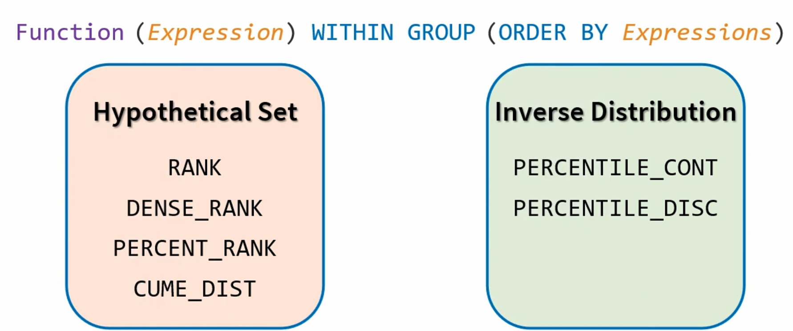
    - 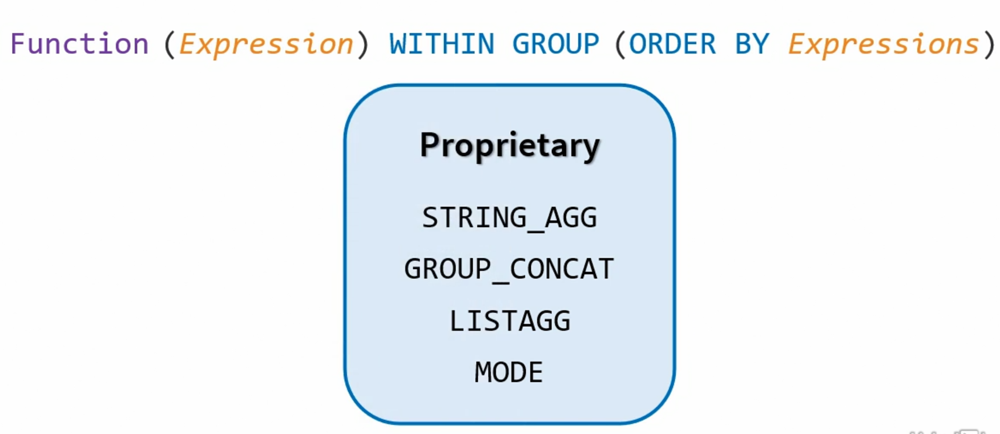

  - [code](3.1.sql)
  - 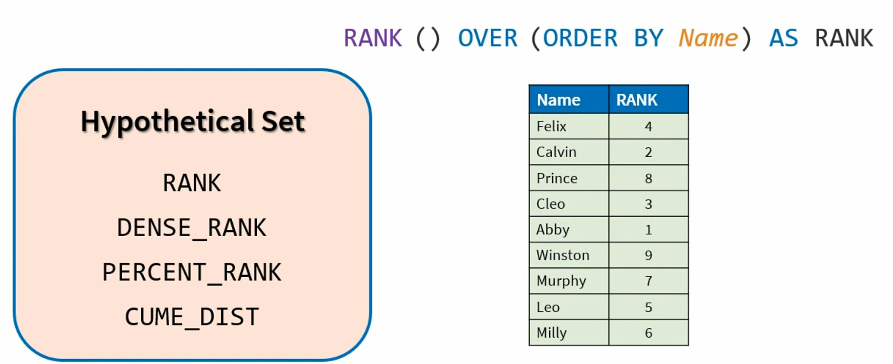
  - 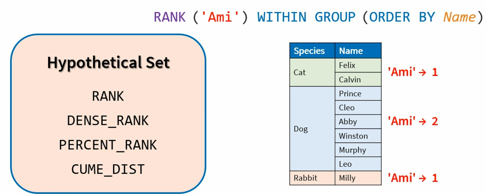
  - Hypothetical Set

    - `RANK`
    - `DENSE_RANK`
    - `PERCENT_RANK`
    - `CUME_DIST`

  - Inverse Distribution

    - `PERCENTILE_CONT`
    - `PERCENTILE_DISC`

    - Differences:
      - `PERCENTILE_CONT` is that it interpolates a value.
      - `PERCENTILE_DISC` picks an existing value.

### 3.2. Grouping sets

- Multi-Level Grouping

  - 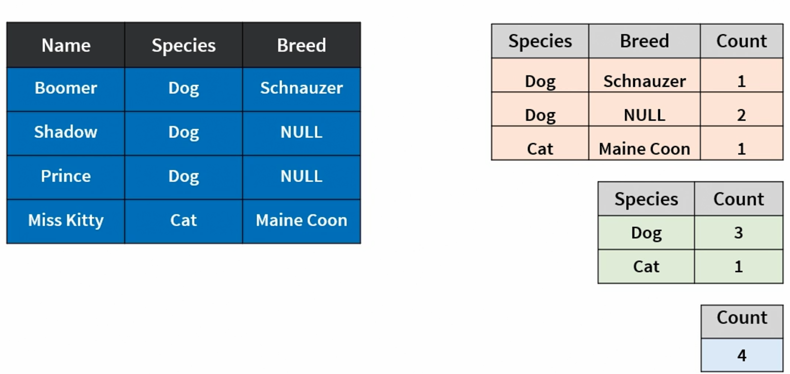
  - [code](3.2.sql)

- Grouping Sets

  ```
  SELECT  YEAR(Adoption_Date) AS Year,
          MONTH(Adoption_Date) AS Month,
          COUNT(*) AS Monthly_Adoptions
  FROM Adoptions
  GROUP BY GROUPING SETS
            (
              (
                YEAR(Adoption_Date),
                MONTH(Adoption_Date)
              )
            );
  ```

  - 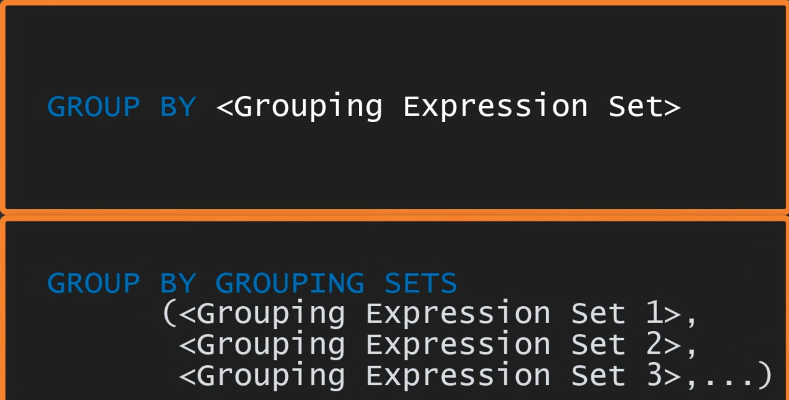

  - Note:

    - A empty grouping set, `()` means a grand value, such as grand total

  - GROUPING(Grouping Expression)
    - Does this row represent ALL values?

### 3.3. Challenge

- Your last challenge is to write a query that returns a statistical report of vaccinations.
  - The report should include the total number of vaccinations for several dimensions:
    - Annual
    - Per species
    - For each species per year
    - By each staff member
    - By each staff member per species
  - And to make it interesting, let's throw the latest vaccination year for each of these groups.
  - Guidelines:
    - ORDER BY Year, Species, First_Name, Last_Name and be careful with the order by aliases...

### 3.4. Solution

- [code](3.4.sql)

## 4. Recursions and Cursors

### 4.1. Recursions

- Recursive WITH Clause

  ```
  WITH RECURSIVE REX AS
  (
    SELECT Foo, Bar
    FROM FooBar /*Anchor query*/
    UNION [ALL|DISTINCT]
    SELECT Foot, Bart
    FROM REX
    WEHRE <Stop Condition> /*Recursive query*/
  )
  ```

  - Note: Except for SQL Server...
  - 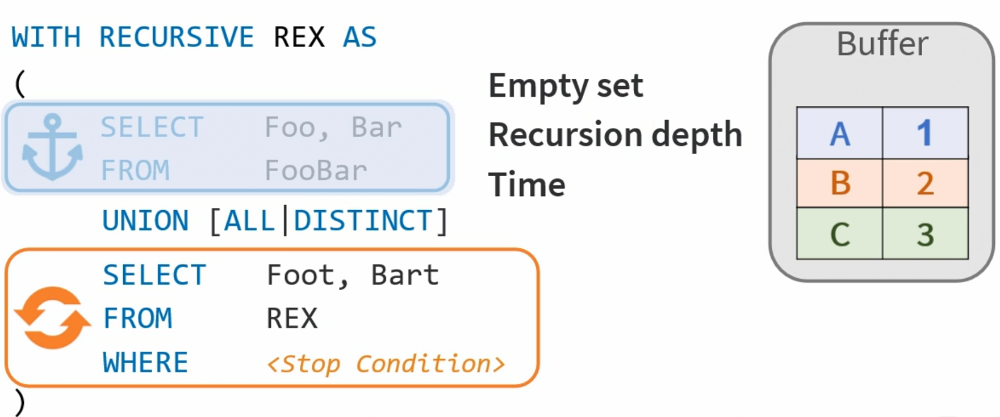
  - [code](4.1.sql)
    - generate_series
      - A set function

### 4.2. The cursors curse

- Cursors

  - Sequential access means that a group of elements, such as data in a memory array or a disk file or on magnetic tape data storage, is accessed in a predetermined, ordered sequence.

    - https://en.wikipedia.org/wiki/Sequential_access

  - 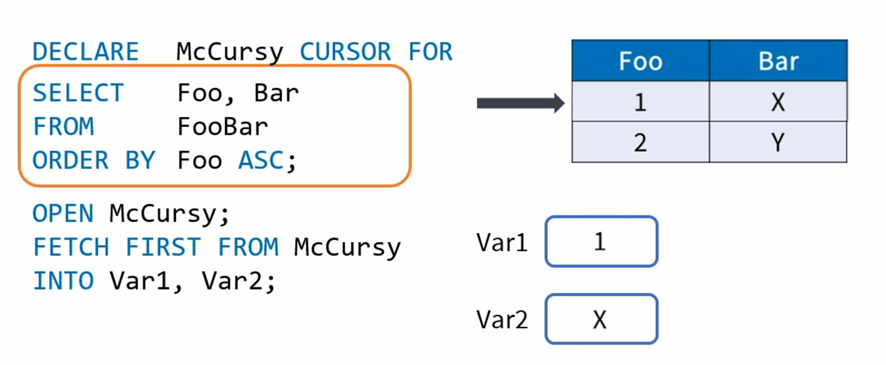
  - 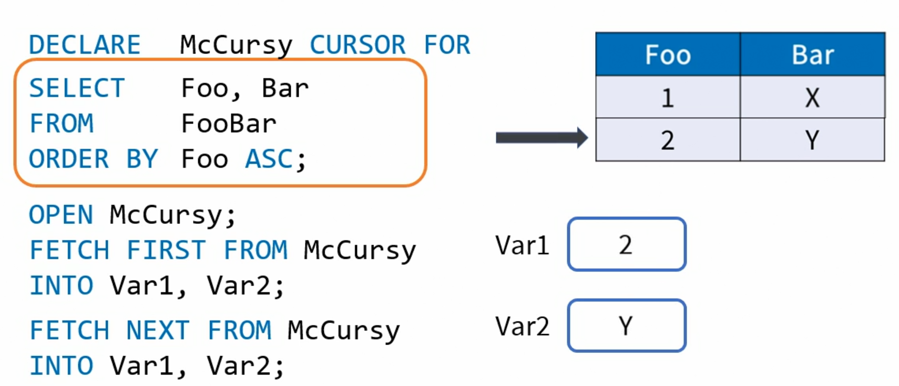
  - SQL is declarative, cursors are not...

  ```
  DECLARE McCursy CURSOR FOR
  SELECT Foo, Bar
  FROM FooBar
  ORDER BY Foo ASC;

  OPEN McCursy;
  FETCH FIRST FROM McCursy
  INTO Var1, Var2;
  ```

- What if a new row is added into the result set for the existing cursor

  - 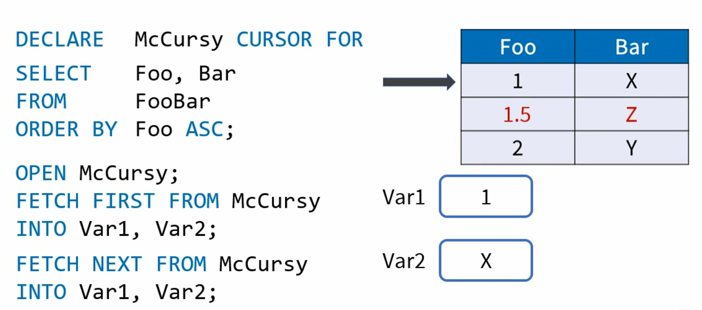

- ISO/IEC CD 9075-2
  - 4.38 Cursors
    - If a holdable cursor is open during an SQL-transaction T and it is held open for a subsequent SQL-transaction, then whether any significant changes made to SQL-data (by T or any subsequent SQL-transaction in which the cursor is held open) are visible through that cursor in the subsequent SQL-transaction before that cursor is closed is determined as follows:
      - If the cursor is insensitive, then significant changes are not visible.
      - If the cursor is sensitive, then the visibility of significant changes is implementation-defined.
      - If the cursor is asensitive, then the visibility of significant changes is implementation-dependent.

## 5. Conclusion

- 
- What's Next?

  - Video Courses
    - Advanced SQL - Window Functions
    - First Look: MySQL 8 for Developers
  - Books:

    - Joe Celko's
    - C.J. Date
    - Itzik Ben-Gan

    - 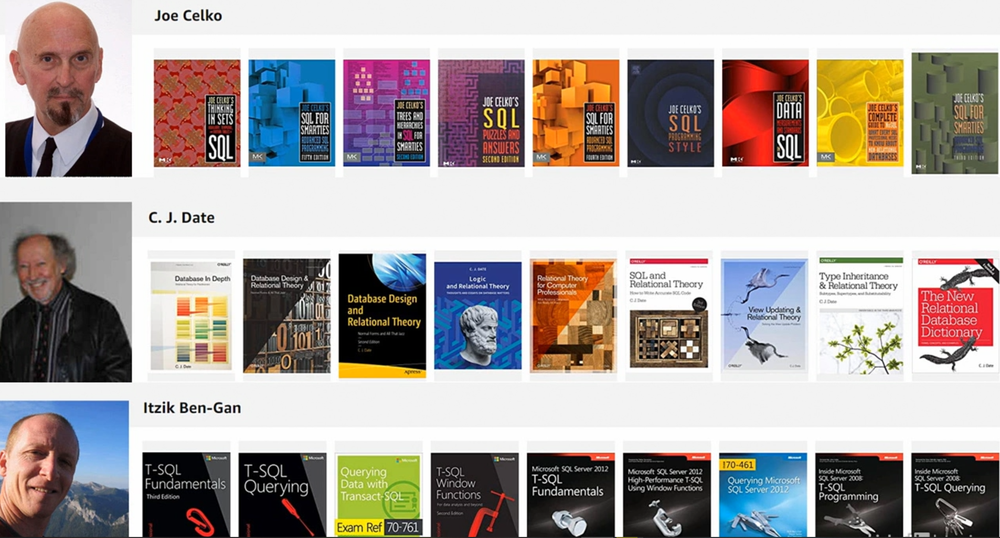
