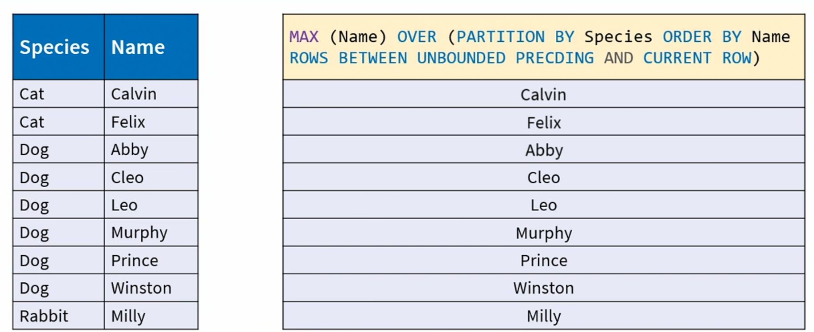

# Advanced SQL - Window Functions

## 0. Introduction

### 0.1. Course introduction

### 0.2. Course agenda

## 1. Tools, Files, and Query Processing Review

### 1.1. Tools and demo database

- Database:
  - PostgreSQL
- IDE:
  - Azure Data Studio
- Online SQL Editor

  - db<>fiddle
    - https://dbfiddle.uk/

- ERD
  - 

### 1.2. Using the demo and exercise files

### 1.3. Logical query processing review

- By syntax

  - 
  - 
  - 
  - 
  - 
  - 
  - 

- By data sets
  - 
  - 
  - 
  - 
  - 
  - 
  - 
  - 
  - 

## 2. Window Functions and the OVER Clause

### 2.1. How window functions fit in query processing

- The "Window" in Window Functions

  - 
  - Window functions are limited to SELECT or ORDER BY clause

- Window Functions Processing
  - 
  - Predicate evaluation order determines the result
    - If we evaluate Previous() first
      - 
      - 
    - If we evaluate other predicate first
      - 
      - 
  - But in SQL, it doesn't make sense, all the predicates are evaluated at the same time.

### 2.2. Overview and filter clause

- The OVER Clause

  ```
  Function (Expressions)
  FILTER (WHERE Predicates)
  OVER (
    [PARTITION BY Expressions]
    [ORDER BY Expressions [NULLS FIRST|LAST]]
    [Frame Type BETWEEN Frame Start AND Frame End]
    [EXCLUDE Frame Exclusion]
  )
  ```

- FILTER is supported for aggregate window functions only!

  ```
  Function (Expressions)
  FILTER (WHERE Predicates)
  OVER ()
  ```

  - Aggregate Window Function Example
    - 

- [code](2.2.sql)

### 2.3. PARTITION BY and ORDER BY

- PARTITION BY

  ```
  Function (Expressions)
  OVER (PARTITION BY Expressions)
  ```

  - Aggregate Window Function Example
    - 

- [code](2.3.sql)

- Dual Purpose ORDER BY

  - Aggregate Frame offset

    ```
    Function (Expressions)
    OVER (ORDER BY Expressions
          [Frame Definition])
    ```

    - Rank
    - Row offset
    - Distribution

## 3. Framing, Exclusions, and Shortcuts

### 3.1. Framing rows and ranges

- Framing

  - 
  - 
  - 
  - 
  - 
  - 
  - 

- Frame Boundaries

  ```
  ORDER BY Expressions ASC | DESC
  ROWS | RANGE | GROUPS
  BETWEEN
    UNBOUNDED PRECEDING
    | 1 PRECEDING | 1 FOLLOWING
    | CURRENT ROW

  AND
    UNBOUNDED FOLLOWING
    | N PRECEDING | N FOLLOWING
    | CURRENT ROW
  ```

  - 
  - 
  - 
  - 
  - 
  - 

- Aggregate Window Function Example
  - 
  - 
  - 
  - 
  - 

### 3.2. Practical framing examples

- [code](3.2.sql)

### 3.3. Defaults, shortcuts, exclusions, and null handling

- Frame boundary shortcuts

  ```
  BETWEEN {N | UNBOUNDED} PRECEDING AND CURRENT ROW

  BETWEEN CURRENT ROW AND {N | UNBOUNDED} FOLLOWING

  BETWEEN CURRENT ROW AND CURRENT ROW
  ```

  =>

  ```
  {N|UNBOUNDED} PRECEDING

  {N|UNBOUNDED} FOLLOWING

  CURRENT ROW
  ```

  - ROWS|RANGE|GROUPS CURRENT ROW

    - The rule of thumb is to avoid any syntax shortcuts

  - Specifying ORDER BY without explicit frame boundaries will assume a default frame of `RANGE BETWEEN UNBOUNDED PRECEDING AND CURRENT ROW`

- Frame Exclusions

  - Optional clause, most databases don't support it...
  - 
  - 
  - 
  - 

- NULL Handling

  - Aggregate Functions ignore NULLs.
  - Rank and distribution respect NULLs.
  - Frame boundaries respect NULLs.
  - Syntax:

    ```
    Function (Expression)
    OVER (...ORDER BY Expressions
              [NULLS { FIRST | LAST }]...)
    ```

    - It works for the query's ORDER BY clause too.

  - Offset function

    ```
    Offset Function (Expression)
              [{ RESPECT | IGNORE } NULLS]
    OVER (...)
    ```

    - AFAIK only Oracle currently supports it

- The WINDOW Clause

  ```
  SELECT  MIN(Z) OVER  (  PARTITION BY X ORDER BY Y
                          ROWS  BETWEEN UNBOUNDED PRECEDING
                                AND CURRENT ROW
                        ) AS MIN_Z,
          MIN(Z) OVER  ( PARTITION BY X ORDER BY Y
                        ROWS BETWEEN UNBOUNDED PRECEDING
                              AND CURRENT ROW
                      ) AS MIN_Z
  FROM Table;
  ```

  - To make concise the above by eliminating the duplicated WINDOW clause

    ```
    SELECT  MIN(Z) OVER W AS MIN_Z
            MAX(Z) OVER W AS MAX_Z
    FROM Table
    WINDOW W AS (
                PARTITION BY X
                ORDER BY Y
                ROWS BETWEEN UNBOUNDED PRECEDING
                             AND CURRENT ROW
                );
    ```

## 4. Aggregate Window Functions

### 4.1. Aggregate grouped functions

- Group aggregate function

  ```
  SELECT COUNT(*) AS Count, Species, MAX(Name)
  FROM Animals
  GROUP BY Species;
  ```

  - Aggregate functions accept a set of elements, and return a single one.

  - 
  - 
  - 

- Window vs. Group Aggregate Functions
  - 

### 4.2. Aggregate window functions

- Aggregate Function Categories(Window Aggregate Functions)

  - Common arithmetic
    - Average
    - Count
    - Sum
    - Maximum/Minimum
  - Boolean
    - EVERY, ANY and SOME...
  - Array aggregation
  - Statistical
    - Variance
    - Deviation
    - Regression
    - Inverse distribution
    - Hypothetical
  - Proprietary
    - Bitwise
    - Approximates

- [code](4.2.sql)

### 4.3. Combining grouped and window aggregate functions

- 

  ```
  SELECT Species,
          COUNT(*) AS Group,
          COUNT(*) OVER() AS Window
  FROM Animals
  GROUP BY Species;
  ```

  =>

  | Species | Group | Window |
  | ------- | ----- | ------ |
  | Cat     | 2     | 3      |
  | Dog     | 6     | 3      |
  | Rabbit  | 1     | 3      |

- If we instead use `COUNT(Name)`, get an error

  ```
  SELECT Species,
          COUNT(*) AS Group,
          COUNT(Name) OVER() AS Window
  FROM Animals
  GROUP BY Species;
  ```

- How many non-NULL names total?

  ```
  SELECT  Species,
          COUNT(*) AS Group,
          SUM(COUNT(Name)) OVER() AS Window
  FROM Animals
  GROUP BY Species;
  ```

  =>

  | Species | Group | Window |
  | ------- | ----- | ------ |
  | Cat     | 2     | 9      |
  | Dog     | 6     | 9      |
  | Rabbit  | 1     | 9      |

- [code](4.3.sql)

### 4.4. Challenge - Aggregate window functions

- Warm up challenge - Annual vaccinations report

  - Write a query that returns all years in which animals were vaccinated, and the total number of vaccinations given that year.
  - In addition, the following two columns should be included in the results:
    - 1. The average number of vaccinations given in the previous two years.
    - 2. The percent difference between the current year's number of vaccinations, and the average of the previous two years.
  - For the first year, return a NULL for both additional columns.
  - Hint: Cast averages and division expressions to DECIMAL(5, 2)
  - Expected result sorted by year ASC:

    | year | number_of_vaccinations | previous_2_years_average | percent_change |
    | ---- | ---------------------- | ------------------------ | -------------- |
    | 2016 | 11                     | NULL                     | NULL           |
    | 2017 | 23                     | 11.00                    | 209.09         |
    | 2018 | 32                     | 17                       | 188.24         |
    | 2019 | 29                     | 27.50                    | 105.45         |

- Extra challenge: Try to find an alternative solution and post it in the Q&A section.
  - Solutions that either perform better, are simpler, or highly creative, will receive an honorary mention.

### 4.5. Solution - Aggregate window functions

- [code](4.5.sql)

  - In `annual_vaccinations_with_previous_2_year_average` CTE

    - Make sure to use `RANGE` instead of `ROW`

      - RANGE

        ```
        ...
        , annual_vaccinations_with_previous_2_year_average
        AS
        SELECT 	*,
            CAST (AVG (number_of_vaccinations)
                OVER (ORDER BY year ASC
                  RANGE BETWEEN 2 PRECEDING AND 1 PRECEDING
                  -- Watch out for frame type...
                  )
              AS DECIMAL (5, 2)
              )
            AS previous_2_years_average
        FROM 	annual_vaccinations
        WHERE year <> 2018
        )
        SELECT * FROM annual_vaccinations_with_previous_2_year_average ORDER BY year;
        ```

        => The pair: 2017: 23 for current 2019

        | year | number_of_vaccinations | previous_2_years_average |
        | ---- | ---------------------- | ------------------------ |
        | 2016 | 11                     | NULL                     |
        | 2017 | 23                     | 11.00                    |
        | 2019 | 29                     | 23.00                    |

      - ROW

        ```
        ...
        , annual_vaccinations_with_previous_2_year_average
        AS
        SELECT 	*,
            CAST (AVG (number_of_vaccinations)
                OVER (ORDER BY year ASC
                  ROW BETWEEN 2 PRECEDING AND 1 PRECEDING
                  -- Watch out for frame type...
                  )
              AS DECIMAL (5, 2)
              )
            AS previous_2_years_average
        FROM 	annual_vaccinations
        WHERE year <> 2018
        )
        SELECT * FROM annual_vaccinations_with_previous_2_year_average ORDER BY year;
        ```

        => The pair 2016 and 2017 for 2019 current row

        | year | number_of_vaccinations | previous_2_years_average |
        | ---- | ---------------------- | ------------------------ |
        | 2016 | 11                     | NULL                     |
        | 2017 | 23                     | 11.00                    |
        | 2019 | 29                     | 17.00                    |

## 5. Rank and Distribution Window Functions

### 5.1. The concept of rank

- In math, Weak order / Total preorder

- Rank Window Functions

  - Rank category
    - RANK
    - DENSE_RANK
  - Own categories
    - ROW_NUMBER
    - NTILE

- Rank Window Functions Syntax

  ```
  Rank Function ()
  OVER  (
        [PARTITION BY Expressions]
        ORDER BY Expressions
        )
  ```

### 5.2. ROW_NUMBER and NTILE

- [code](5.2.sql)

- NTILE

  ```
  NTILE (n)
  OVER ([PARTITION BY Expressions] ORDER BY Expressions)

  1, 2, 3...{n OR the number of partiion rows}
  ```

  - 

### 5.3. RANK and DENSE_RANK

- Syntax:

  ```
  RANK () | DENSE_RANK ()
  OVER (
        [PARTITION BY Expressions]
        ORDER BY Expressions
        )
  ```

### 5.4. Distribution window functions

- 
- 

- Distribution functions compute a relative rank of a row R within the window partition of R[...], expressed as an approximate numeric ratio between 0.0 and 1.0.

- SQL supports two variants of distribution window functions, `percent rank` and `cumulative distribution`.

  ```
  CUME_DIST () | PERCENT_RANK ()
  OVER  (
        [PARTITION BY Expressions]
        ORDER BY Expressions
        )
  ```

- 
- [code](5.4.sql)

### 5.5. Challenge - Rank window functions

- Animals temperature exception report

  - Write a query that returns the top 25% of animals per species that had the fewest "temperature exceptions".
    - Ignore animals that had no routine checkups.
    - A "temperature exception" is a checkup temperature measurement that is either equal to or exceeds +/- 0.5% from the specie's average.
    - If two or more animals of the same species have the same number of temperature exceptions, those with the more recent exceptions should be returned.
    - There is no need to return additional tied animals over the 25% mark.
    - If the number of animals for a species does not divide by 4 without remainder, you may return 1 more animal, but not less.
  - Hint: CAST averages to DECIMAL(5, 2).

  - Expected results sorted by species ASC, number_of_exceptions DESC, latest_exception DESC:

    | species | name     | number_of_exceptions | latest_exception    |
    | ------- | -------- | -------------------- | ------------------- |
    | Cat     | Cleo     | 1                    | 2019-09-20 09:45:00 |
    | Cat     | Cosmo    | 0                    | [NULL]              |
    | Cat     | Kiki     | 0                    | [NULL]              |
    | Cat     | Penny    | 0                    | [NULL]              |
    | Cat     | Patches  | 0                    | [NULL]              |
    | Dog     | Gizmo    | 1                    | 2019-10-07 08:51:00 |
    | Dog     | Riley    | 1                    | 2019-07-25 10:48:00 |
    | Dog     | Mocha    | 1                    | 2019-05-14 11:10:00 |
    | Dog     | Emma     | 1                    | 2019-05-07 11:09:00 |
    | Dog     | Samson   | 1                    | 2019-03-27 09:04:00 |
    | Dog     | Bailey   | 0                    | [NULL]              |
    | Dog     | Luke     | 0                    | [NULL]              |
    | Dog     | Benny    | 0                    | [NULL]              |
    | Dog     | Boomer   | 0                    | [NULL]              |
    | Dog     | Rusty    | 0                    | [NULL]              |
    | Dog     | Millie   | 0                    | [NULL]              |
    | Dog     | Beau     | 0                    | [NULL]              |
    | Rabbit  | Humphrey | 1                    | 2018-12-19 08:32:00 |
    | Rabbit  | April    | 0                    | [NULL]              |

### 5.6. Solution - Rank window functions

- [code](5.6.sql)

## 6. Offset Window Functions

### 6.1. Offset window functions

- Offset window functions enable access to individual partition rows, and they come in two flavors. A pointer to another row can be either based on a current position or on an absolute position regardless of the current one.

- Offset Window Functions
  - Row offset functions(LEAD, LAG)
    - Offset from current row
    - No frame.
  - Frame offset functions(FIRST_VALUE, LAST_VALUE, NTH_VALUE)
    - Offset from frame boundaries
    - Mandatory frame.

### 6.2. Row offset window functions

- Row Offset Window Functions

  ```
  Row Offset Function (Expression [, Offset, Default])
  [{IGNORE | RESPECT} NULLS]
  OVER ([PARTITION BY Expressions]
        ORDER BY Expressions)
  ```

  - Offset: 1 by default
  - Default: NULL by default
  - [{IGNORE | RESPECT} NULLS]
    - RESPECT NULLS by default
  - ORDER BY

    - does not imply framing

  - 

### 6.3. Frame offset window functions

- Syntax:

  ```
  Frame Offset Function (Expression, Offset*)
  [FROM {FIRST | LAST}]*
  [{IGNORE | RESPECT} NULLS]
  OVER  ([PARTITION BY Expressions]
          ORDER BY Expressions
          Frame Specifications)

  * NTH_VALUE only
  ```

  - [FROM {FIRST | LAST}]

    - Most databases don't support it...

  - Frame Specifications
    - If not specified,
      `RANGE BETWEEN UNBOUNDED PRECEDING AND CURRENT ROW` is default

- 
- [code](6.3.sql)

### 6.4. Challenge - Offset window functions

- Top improved adoption quarters

  - Write a query that returns the top 5 most improved quarters in terms of the number of adoptions, both per species, and overall.
  - Improvement means the increase in number of adoptions compared to the previous calendar quarter.
  - The first quarter in which animals were adopted for each species and for all species, does not constitute an improvement from zero, and should be treated as no improvement.
  - In case there are quarters that are tied in terms of adoption improvement, return the most recent ones.

- Hint: Quarters can be identified by their first day.

- Expected results sorted by species ASC, adoption_difference_from_previous_quarter DESC and quarter_start ASC:

  | species     | year | quarter | adoption_difference_from_previous_quarter | quarterly_adoptions |
  | ----------- | ---- | ------- | ----------------------------------------- | ------------------- |
  | All species | 2019 | 3       | 7                                         | 11                  |
  | All species | 2018 | 2       | 4                                         | 8                   |
  | All species | 2019 | 4       | 3                                         | 14                  |
  | All species | 2017 | 3       | 2                                         | 3                   |
  | All species | 2018 | 1       | 2                                         | 4                   |
  | Cat         | 2019 | 4       | 4                                         | 6                   |
  | Cat         | 2018 | 3       | 2                                         | 3                   |
  | Cat         | 2019 | 2       | 2                                         | 2                   |
  | Cat         | 2018 | 1       | 1                                         | 2                   |
  | Cat         | 2019 | 3       | 0                                         | 2                   |
  | Dog         | 2019 | 3       | 7                                         | 8                   |
  | Dog         | 2018 | 2       | 4                                         | 6                   |
  | Dog         | 2017 | 3       | 2                                         | 2                   |
  | Dog         | 2018 | 1       | 2                                         | 2                   |
  | Dog         | 2019 | 1       | 1                                         | 4                   |
  | Rabbit      | 2019 | 1       | 2                                         | 2                   |
  | Rabbit      | 2017 | 4       | 1                                         | 1                   |
  | Rabbit      | 2018 | 2       | 1                                         | 1                   |
  | Rabbit      | 2019 | 4       | 1                                         | 2                   |
  | Rabbit      | 2019 | 3       | 0                                         | 1                   |

- Extra challenge: !BUG HUNT!
  - Check the alternative solution at the bottom of the solution file for details.

### 6.5. Solution - Offset window functions

- [code](6.5.sql)

## 7. Conclusion

### 7.1. Review, conclusion, and next steps

- Resources:

  - `Edgar F. Codd`
  - https://en.wikipedia.org/wiki/Edgar_F._Codd
  - https://amzn.to/2OIMOQg

  - `Chris Date`
  - https://en.wikipedia.org/wiki/Christopher_J._Date
  - https://amzn.to/31KbZXS

  - `Joe Celko`
  - https://en.wikipedia.org/wiki/Joe_Celko
  - https://amzn.to/2SDQzYh

  - `David McGoveran`
  - https://en.wikipedia.org/wiki/David_McGoveran

  - `Fabian Pascal`
  - https://en.wikipedia.org/wiki/Fabian_Pascal
  - http://www.dbdebunk.com/

  - `Hugh Darwen`
  - https://en.wikipedia.org/wiki/Hugh_Darwen

- Triple bonus points challenge - Annual average animal species vaccinations report

  - !!! DISCLAIMER !!! This one is far from trivial, so be patient and careful.

  - Write a query that returns all years in which animals were vaccinated, and the total number of vaccinations given that year, per species.
  - In addition, the following three columns should be included in the results:

    - 1. The average number of vaccinations per shelter animal of that species in that year.
    - 2. The average number of vaccinations per shelter animal of that species in the previous 2 years.
    - 3. The percent difference between columns 1 and 2 above.

  - Guidelines

    - 1. The average number of animals in any given year should take into account when animals were admitted, and when they were adopted.

      - To simplify the solution, it should be done on a yearly resolution.
      - This means that you should consider an animal that was admitted on any date as if it was admitted on January 1st of that year.
      - Similarly, consider an animal that was adopted on any date as if it was adopted on January 1st of that year.
      - For example - If in 2016, the first year, 10 cats and 5 dogs were admitted, and 2 cats and 2 dogs were adopted, consider the number of shelter animals for 2016 to be 8 cats, 3 dogs and 0 rabbits.
      - This carries over to the next year for which you will need to add admissions, subtract adoptions, and so on.
      - Of course, if you want to calculate this on a daily basis and only then average it out for the year, you are welcome to do so for extra bonus points.
      - My suggested solution does not.

    - 2. Consider that there may be years without adoptions or without admissions for any species.

      - You may assume that there are no years without both adoptions and admissions for a species.
      - For my suggested solution it does not matter, but it may for others.

    - 3. There may also be years without vaccinations for any species, but you are not required to show them.

  - Recommendation: Cast averages and expressions with division operators to `DECIMAL (5, 2)`
  - Expected result sorted by `species ASC, year ASC`:

    | species | year | number_of_vaccinations | average_vaccinations_per_animal | previous_2_years_average | percent_change |
    | ------- | ---- | ---------------------- | ------------------------------- | ------------------------ | -------------- |
    | Cat     | 2016 | 2                      | 0.5                             | NULL                     | NULL           |
    | Cat     | 2017 | 7                      | 0.78                            | 0.5                      | 156            |
    | Cat     | 2018 | 9                      | 1.29                            | 0.64                     | 201.56         |
    | Cat     | 2019 | 10                     | 1.25                            | 1.04                     | 120.19         |
    | Dog     | 2016 | 7                      | 0.44                            | NULL                     | NULL           |
    | Dog     | 2017 | 15                     | 0.56                            | 0.44                     | 127.27         |
    | Dog     | 2018 | 18                     | 0.6                             | 0.5                      | 120            |
    | Dog     | 2019 | 17                     | 0.85                            | 0.58                     | 146.55         |
    | Rabbit  | 2016 | 2                      | 1                               | NULL                     | NULL           |
    | Rabbit  | 2017 | 1                      | 0.2                             | 1                        | 20             |
    | Rabbit  | 2018 | 5                      | 1                               | 0.6                      | 166.67         |
    | Rabbit  | 2019 | 2                      | 1                               | 0.6                      | 166.67         |

- Solution
  - [code](7.1.sql)
  - [another code](7.2.sql)
