# Advanced SQL for Query Tuning and Performance Optimization

## 0. Introduction

### 0.1. Reduce query response time with query tuning

### 0.2. What you should know

- Background Knowledge
  - Familiar with relational database design
  - Used SQL for querying
  - Some familiarity with storage systems

## 1. How SQL Executes a Query

### 1.1. From declarative SQL to a procedural execution plan

- From Declarative SQL to a Procedural Execution Plan
- SQL Is the Language of Tables
- SQL IS Declarative

  - You specify what you want
  - Not how to get it

    ```
    SELECT
      customer_id, fname, lname, status_level
    FROM
      customers
    WHERE
      last_purchase_date > TO_DATE('01-Jan-2018', 'DD-MMM-YYYY')
    ```

- SQL Queries Specify Sets of Data

- Procedural Language Structure

  ```
  for I in range(0, 10):
    for j in range(0, 10):
      print(i*j)
  ```

  - Many programming languages are procedural
  - You specify how to do something
  - Directly manipulate data structures in an order determined by your code

- SQL Uses Execution Plans

  - SQL query processors take declarative statements
  - And create procedural plans
  - Which are a set of steps that scan, filter, and join data

- Efficient Execution Plans

  - Execution plans can be efficient or inefficient
  - Inefficient: scanning a table of 10,000,000 rows to find 100 rows that have customer_id starting with 3014
  - Efficient: using an index to find exactly where customer_ids that start with 3014 are located

- This course
  - Understand query plan steps
  - Understand trade-offs in ways to implement query plans
  - Learn techniques that lead to efficient plans

### 1.2. Scanning tables and indexes

- Scanning Is Simple

  - Scanning looks at each row
  - Fetch data block containing row
  - Apply filter or condition
  - Cost of query based on number of rows in the table

- But Not That Simple

  - We are assuming row data stored together in data blocks on disk
  - Not the case with columnar storage
  - Used in data warehouses and big data databases

- Cost Based on Number of Rows

  - Scanning small tables is efficient
  - Scanning large tables can be efficient if few queries
  - Scanning large tables repeatedly is inefficient

- Indexing Reduces Full Table Scans
- Indexes Save Scanning

  - Indexes are ordered
  - Faster to search index for an attribute value
  - Points to location of row
  - Example: filter by checking index for match, then retrieve row

- Indexes Are Optimized for Search
- Types of Indexes
  - B-tree, for equality and range queries
  - Hash indexes, for equality
  - Bitmap, for inclusion
  - Specialized indexed, for geo-spatial or user-defined indexing strategies

### 1.3. Joining tables

- How to Match Rows?

  - Foreign keys in one table
  - Primary key in another table
  - How to find matching keys?

- Join types

  - Nested Loop Join
    - Compare all rows in both tables to each other.
  - Hash Join
    - Calculate hash value of key and join based on matching hash values.
  - Sort Merge Join
    - Sort both tables and then join rows while taking advantage of order.

- Nested Loop Joins

  - Loop through one table
  - For each row, loop through the other table
  - At each step, compare keys
  - Simple to implement
  - Can be expensive

- Hash Joins

  - Compute hash values of key values in smaller table
  - Store in hash table, which has hash value and row attributes
  - Scan larger table; find rows from smaller hash table

- Sort Merge Joins
  - Sort both tables
  - Compare rows like nested loop join, but...
  - Stop when it is not possible to find a match later in the table because of the sort order
  - Scan the driving table only once

### 1.4. Partitioning data

- What Is Partitioning?

  - Storing table data in multiple sub-tables, known as partitions
  - Used to improve query, load, and delete operations
  - Used for large tables
  - When subset of data is accessed or changed
  - Can be expensive

- Large Tables = Long Scans

  - Table => Index

- Partition

  - Table => Partition 1, ... Partion5

- Faster Scans
- Partition Key

  - Jan 2019, Feb 2019, ..., May 2019

- Local Indexes

  - To access a row in a particular partition

- Global Indexes
  - Across all partitions

## 2. PostgreSQL Tools for Tuning

### 2.1. Installing PostgreSQL

- https://wwww.postgresql.org/download

### 2.2. Overview of pgAdmin

- [db](db/mock_staff.sql)

### 2.3. Explain and analyze

```
EXPLAIN SELECT * FROM staff
```

=>

| QUERY PLAN                                              |
| ------------------------------------------------------- |
| Seq Scan on staff (cost=0.00..24.00 rows=1000 width=75) |

```
EXPLAIN ANALYZE SELECT * FROM staff
```

=>

| QUERY PLAN                                                                                           |
| ---------------------------------------------------------------------------------------------------- |
| Seq Scan on staff (cost=0.00..24.00 rows=1000 width=75) (actual time=0.007..0.079 rows=1000 loops=1) |
| Planning Time: 0.035 ms                                                                              |
| Execution Time: 0.113 ms                                                                             |

### 2.4. Example plan - Selecting with a WHERE clause

```
EXPLAIN SELECT * FROM staff WHERE salary > 75000
```

=>

| QUERY PLAN                                             |
| ------------------------------------------------------ |
| Seq Scan on staff (cost=0.00..26.50 rows=715 width=75) |
| Filter: (salary > 75000)                               |

```
EXPLAIN ANALYZE SELECT * FROM staff WHERE salary > 75000
```

=>

| QUERY PLAN                                                                                         |
| -------------------------------------------------------------------------------------------------- |
| Seq Scan on staff (cost=0.00..26.50 rows=715 width=75) (actual time=0.010..0.118 rows=717 loops=1) |
| Filter: (salary > 75000)                                                                           |
| Rows Removed by Filter: 283                                                                        |
| Planning Time: 0.044 ms                                                                            |
| Execution Time: 0.144 ms                                                                           |

### 2.5. Indexes

- Create an index

  ```
  CREATE INDEX idx_staff_salary ON staff(salary)
  ```

- Full table scan

  ```
  EXPLAIN SELECT * FROM staff
  ```

  =>

  | QUERY PLAN                                              |
  | ------------------------------------------------------- |
  | Seq Scan on staff (cost=0.00..24.00 rows=1000 width=75) |

  ```
  EXPLAIN ANALYZE SELECT * FROM staff WHERE salary > 75000
  ```

  =>

  | QUERY PLAN                                                                                         |
  | -------------------------------------------------------------------------------------------------- |
  | Seq Scan on staff (cost=0.00..26.50 rows=715 width=75) (actual time=0.011..0.137 rows=717 loops=1) |
  | Filter: (salary > 75000)                                                                           |
  | Rows Removed by Filter: 283                                                                        |
  | Planning Time: 0.062 ms                                                                            |
  | Execution Time: 0.168 ms                                                                           |

- Use the created index

  ```
  EXPLAIN ANALYZE SELECT * FROM staff WHERE salary > 150000
  ```

  =>

  | QUERY PLAN                                                                                                             |
  | ---------------------------------------------------------------------------------------------------------------------- |
  | Index Scan using idx_staff_salary on staff (cost=0.28..8.29 rows=1 width=75) (actual time=0.004..0.004 rows=0 loops=1) |
  | Index Cond: (salary > 150000)                                                                                          |
  | Planning Time: 0.141 ms                                                                                                |
  | Execution Time: 0.027 ms                                                                                               |

## 3. Types of Indexes

### 3.1. Indexing

- Example Data Model

  - 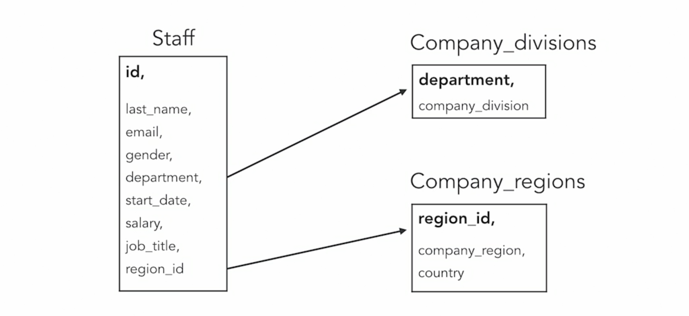

- Purpose of Indexes

  - Speed up access to data
  - Help enforce constaints
  - Indexes are ordered
  - Typically smaller than tables

- Indexing Reduces Scanning

  - 1. Main Memory
    - 100 ns
  - 2. Read 1 MB SSD
    - 1,000,000 ns (1 ms)
  - 3. Read 1 MB HDD
    - 20,000,000 ns (20 ms)

- Implementing Indexes

  - Data structure separate from table
  - Sometimes duplicates some data, for example, key
  - Organized differently than table data

- Additional Data Structure
- Types of Indexes
  - B-tree
  - Bitmap
  - Hash
  - Special purpose indexes

### 3.2. B-tree indexes

- Balanced tree

  - 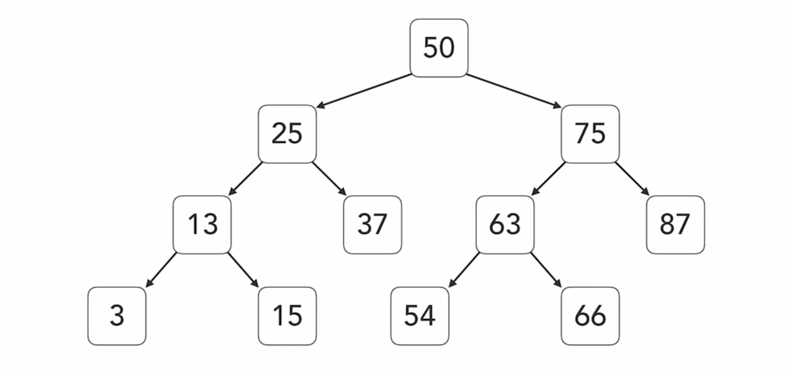

- B-Tree Indexes: Example Path

  - 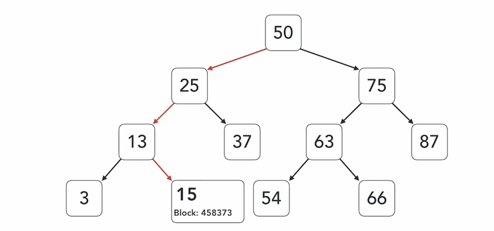

- B-Tree Uses
  - Most common type of index
  - Used when a large number of possible values in a column (high cardinality)
  - Rebalances as needed
  - Time to access is based on depth of the tree (logarithmic time)

### 3.3. B-tree index example plan

```
EXPLAIN SELECT * FROM staff WHERE email = 'bphillips5@time.com'
```

=>

| QUERY PLAN                                            |
| ----------------------------------------------------- |
| Seq Scan on staff (cost=0.00..26.50 rows=1 width=75)  |
| Filter: ((email)::text = 'bphillips5@time.com'::text) |

- Create an index on `email` column

  ```
  CREATE INDEX idx_staff_email ON staff(email);
  ```

  ```
  EXPLAIN SELECT * FROM staff WHERE email = 'bphillips5@time.com'
  ```

  =>

  | QUERY PLAN                                                                  |
  | --------------------------------------------------------------------------- |
  | Index Scan using idx_staff_email on staff (cost=0.28..8.29 rows=1 width=75) |
  | Index Cond: ((email)::text = 'bphillips5@time.com'::text)                   |

### 3.4. Bitmap indexes

- Bitmap Indexes

  - 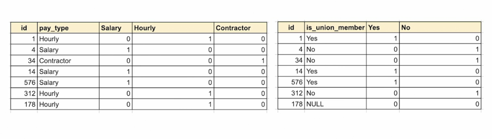

- Bitmap Operations

  ```
  (is_union_member = 'Yes') AND (pay_type = 'Hourly')
  ```

  - 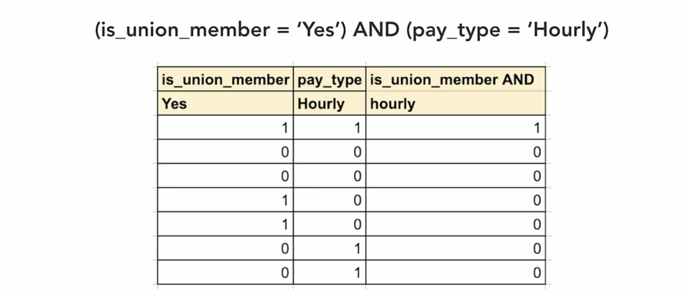

- Bitmap Uses

  - Used when small number of possible values in a column (low cardinality)
  - Filter by bitwise operations, such as AND, OR, and NOT
  - Time to access is based on time to perform bitwise operations
  - Read-intensive use cases, few writes

- Bitmap Index Availability
  - Some databases allow you to create bitmap indexes explicitly
  - PostgreSQL does not
  - But PostgreSQL builds bitmap indexed on the fly as needed

### 3.5. Bitmap index example plan

```
SELECT DISTINCT
  job_title
FROM
  staff
ORDER BY job_title
```

```
SELECT
  *
FROM
  staff
WHERE
  job_title = 'Operator'
```

- Create an index on `job_title`

  ```
  CREATE INDEX idx_staff_job_title ON staff(job_title);
  ```

  ```
  EXPLAIN SELECT
    *
  FROM
    staff
  WHERE
    job_title = 'Operator'
  ```

  =>

  | QUERY PLAN                                                                    |
  | ----------------------------------------------------------------------------- |
  | Bitmap Heap Scan on staff (cost=4.36..18.36 rows=11 width=75)                 |
  | Recheck Cond: ((job_title)::text = 'Operator'::text)                          |
  | -> Bitmap Index Scan on idx_staff_job_title (cost=0.00..4.36 rows=11 width=0) |
  | Index Cond: ((job_title)::text = 'Operator'::text)                            |

### 3.6. Hash indexes

- Hash Functions

  ```
  f(x) = y
  ```

  - Function for mapping arbitrary length data to a fixed-size string
  - Hash values virtually unique
  - Even slight changes in input produce new hash

- Hash Values

  | String      | Hash Value                       |
  | ----------- | -------------------------------- |
  | Washington  | 339155f3163207352de00b02f47d01bc |
  | Washingtons | 234b403f4cd28f915f0e72287ce4cc04 |
  | Davis       | a9fc0069d92d179158b442521af5c4f5 |
  | davis       | 0b03c29a1a0c412d1fc544330232ee28 |

  - Size of hash value depends on algorithm used
  - No ordering preserving with hash functions
  - Similar inputs have vastly different outputs

- Note:
  - 1. Equality Only
    - Hash indexes used when "=" is used, but not for ranges of values.
  - 2. Smaller Size Than B-Tree
    - Latest versions of PostgreSQL (10+) have improved hash indexes.
  - 3. As Fast as B-Tree
    - Builds and lookups are comparable; advantage is size; may fit in memory.

### 3.7. Hash index example plan

- If the index already exists, use `DROP INDEX idx_staff_email` to remove it.

- Create an index

  ```
  CREATE INDEX idx_staff_email ON staff USING HASH (email);
  ```

- Explain

  ```
  EXPLAIN SELECT
    *
  FROM
    staff
  WHERE
    email = 'bphillips5@time.com'
  ```

  =>

  | QUERY PLAN                                                                  |
  | --------------------------------------------------------------------------- |
  | Index Scan using idx_staff_email on staff (cost=0.00..8.02 rows=1 width=75) |
  | Index Cond: ((email)::text = 'bphillips5@time.com'::text)                   |

### 3.8. PostgreSQL-specific indexes

- Specialized Indexes

  - Used in PostgreSQL, but may not have equivalents in other relational databases
  - GIST
  - SP-GIST
  - GIN
  - BRIN

- GIST

  - Generalized Search Tree
  - Not a single type of index
  - Framework for implementing custom indexes

- SP-GIST

  - Space-partitioned GIST
  - Supports partitioned search trees
  - Used for nonbalanced data structures
  - Partitions do not have to be same size

- GIN

  - Used for text indexing
  - Lookups are faster than GIST
  - Builds are slower than GIST
  - Indexes are 2-3 times larger than GIST

- BRIN

  - Block range indexing
  - Used for large data sets
  - Divides data into ordered blocks
  - Keeps min and max values
  - Search only blocks that may have match

    |         |
    | ------- |
    | 0-50    |
    | 51-100  |
    | 100-150 |
    | 151-200 |

## 4. Tuning Joins

### 4.1. What affects joins performance

- Joins

  - INNER JOIN
  - LEFT OUTER JOIN
  - RIGHT OUTER JOIN
  - FULL OUTER JOIN

- INNER JOIN

  ```
  SELECT
    *
  FROM
    comapny_region cr
  INNER JOIN
    staff s
  ON
    cr.region_id = s.region_id
  ```

  - Most common join
  - Return rows from both tables that have corresponding row in other table
  - Performed when joining in WHERE clause

- LEFT OUTER JOIN

  ```
  SELECT
    *
  FROM
    comapny_region cr
  LEFT OUTER JOIN
    staff s
  ON
    cr.region_id = s.region_id
  ```

  - Returns all rows from left table
  - Returns rows from right table that have matching key

- RIGHT OUTER JOIN

  ```
  SELECT
    *
  FROM
    comapny_region cr
  RIGHT OUTER JOIN
    staff s
  ON
    cr.region_id = s.region_id
  ```

  - Returns all rows from right table
  - Returns rows from left table that have matching key

- FULL OUTER JOIN

  ```
  SELECT
    *
  FROM
    comapny_region cr
  FULL OUTER JOIN
    staff s
  ON
    cr.region_id = s.region_id
  ```

  - Returns all rows from both tables

- Joins

  - 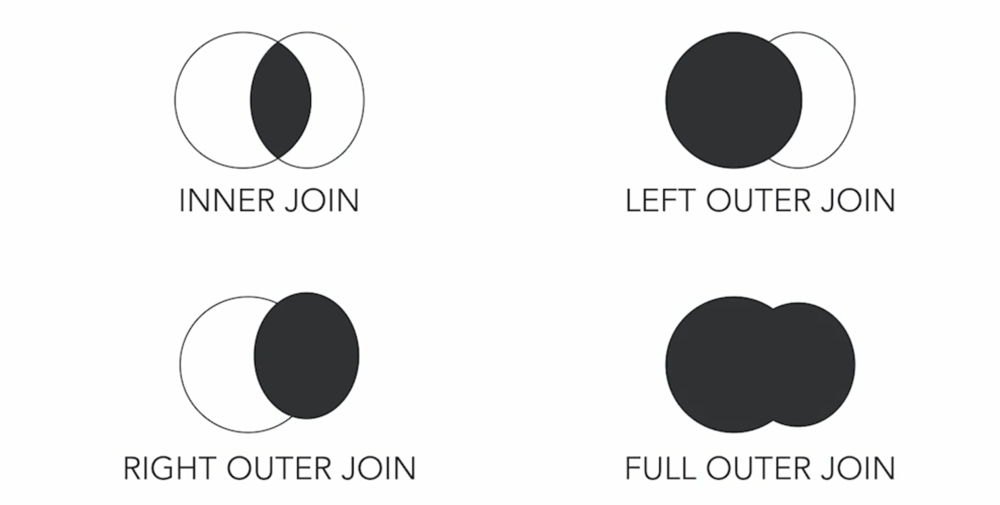

- Note:
  - 1. Prefer INNER JOINs
    - Often fastest
  - 2. OUTER and FULL JOINs
    - Require additional steps in addition to INNER JOIN
  - 3. When need to NULLs
    - LEFT, RIGHT, and FULL OUTER JOINS used when need to NULLs

### 4.2. Nested loops

- Nested Loop Joins

  - Two loops
  - Outer loop iterates over one table, the driver table
  - Inner loop iterates over other table, the join table
  - Outer loop runs once
  - Inner loop runs once for each row in join table

- Nested Loop Example

  - 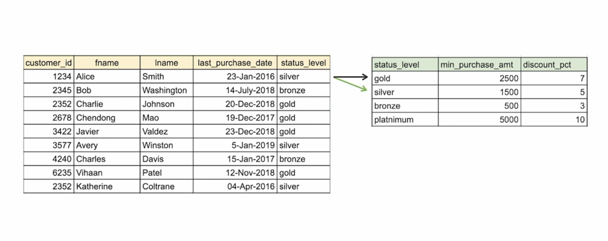

- When to Use Nested Loops

  - Works with all join conditions
  - Low overhead
  - Works well with small tables
  - Works well with small driver tables, and joined column is indexed

- Limitations of Nested Loops
  - Can be slow
  - If tables do not fit in memory, even slower performance
  - Indexes can improve the performance of nested loop joins, especially covered indexes

### 4.3. Nested loop example plan

- Query

  ```
  SELECT
    s.id, s.last_name, s.job_title, cr.country
  FROM
    staff s
  INNER JOIN
    company_regions cr
  ON
    s.region_id = cr.region_id
  ```

- Explain

  ```
  EXPLAIN SELECT
    s.id, s.last_name, s.job_title, cr.country
  FROM
    staff s
  INNER JOIN
    company_regions cr
  ON
    s.region_id = cr.region_id
  ```

  =>

  | QUERY PLAN                                                             |
  | ---------------------------------------------------------------------- |
  | Hash Join (cost=22.38..49.02 rows=1000 width=88)                       |
  | Hash Cond: (s.region_id = cr.region_id)                                |
  | -> Seq Scan on staff s (cost=0.00..24.00 rows=1000 width=34)           |
  | -> Hash (cost=15.50..15.50 rows=550 width=62)                          |
  | -> Seq Scan on company_regions cr (cost=0.00..15.50 rows=550 width=62) |

- Planner method configuration

  ```
  set enable_nestloop=true;
  set enable_hashjoin=false;
  set enable_mergejoin=false;

  EXPLAIN SELECT
    s.id, s.last_name, s.job_title, cr.country
  FROM
    staff s
  INNER JOIN
    company_regions cr
  ON
    s.region_id = cr.region_id
  ```

  =>

  | QUERY PLAN                                                                                       |
  | ------------------------------------------------------------------------------------------------ |
  | Nested Loop (cost=0.16..50.69 rows=1000 width=88)                                                |
  | -> Seq Scan on staff s (cost=0.00..24.00 rows=1000 width=34)                                     |
  | -> Memoize (cost=0.16..0.23 rows=1 width=62)                                                     |
  | Cache Key: s.region_id                                                                           |
  | Cache Mode: logical                                                                              |
  | -> Index Scan using company_regions_pkey on company_regions cr (cost=0.15..0.22 rows=1 width=62) |
  | Index Cond: (region_id = s.region_id)                                                            |

### 4.4. Hash joins

- Hash Functions
- Build Hash Table

  | Hash Value | Row ID |
  | ---------- | ------ |
  | 1          | 7882   |
  | 2          | 84845  |
  | 3          | 92928  |

  - Use the smaller of the two tables
  - Compute hash value of primary key value
  - Store in table

- Probe Hash Table

  - Step through large table
  - Compute hash value of primary or foreign key value
  - Lookup corresponding value in hash table

- Note:
  - 1. Equality Only
    - Hash joins used when "=" is used, but not other operators
  - 2. Time Based on Table Size
    - Rows in smaller table for build; rows in larger table for probe table
  - 3. Fast Lookup
    - Hash value is index into array of row identifiers

### 4.5. Hash join example plan

- Query

  ```
  set enable_nestloop=false;
  set enable_hashjoin=true;
  set enable_mergejoin=false;

  SELECT
    s.id, s.last_name, s.job_title, cr.country
  FROM
    staff s
  INNER JOIN
    company_regions cr
  ON
    s.region_id = cr.region_id
  ```

- Query plan

  ```
  set enable_nestloop=false;
  set enable_hashjoin=true;
  set enable_mergejoin=false;

  EXPLAIN SELECT
    s.id, s.last_name, s.job_title, cr.country
  FROM
    staff s
  INNER JOIN
    company_regions cr
  ON
    s.region_id = cr.region_id
  ```

  =>

  | QUERY PLAN                                                             |
  | ---------------------------------------------------------------------- |
  | Hash Join (cost=22.38..49.02 rows=1000 width=88)                       |
  | Hash Cond: (s.region_id = cr.region_id)                                |
  | -> Seq Scan on staff s (cost=0.00..24.00 rows=1000 width=34)           |
  | -> Hash (cost=15.50..15.50 rows=550 width=62)                          |
  | -> Seq Scan on company_regions cr (cost=0.00..15.50 rows=550 width=62) |

### 4.6. Merge joins

- Sorting

  - Merge join also known as sort merge
  - First step is sorting tables
  - Takes advantage of ordering to reduce the number of rows checked

- Merging

  - 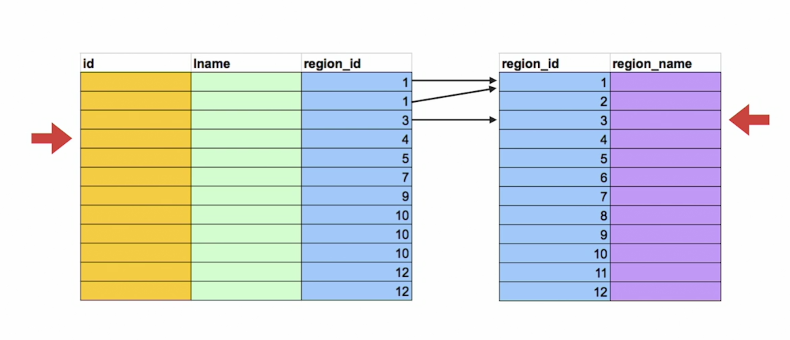

- Note:
  - 1. Equality Only
    - Merge joins used when "=" is used but not other operators
  - 2. Time Based on Table Size
    - Time to sort and time to scan
  - 3. Large table joins
    - Works well when tables do not fit in memory

### 4.7. Merge join example

- Query plan

  ```
  set enable_nestLoop=false;
  set enable_hashjoin=false;
  set enable_mergejoin=true;

  EXPLAIN SELECT
    s.id, s.last_name, s.job_title, cr.country
  FROM
    staff s
  INNER JOIN
    company_regions cr
  ON
    s.region_id = cr.region_id
  ```

  =>

  | QUERY PLAN"                                                             |
  | ----------------------------------------------------------------------- |
  | Merge Join (cost=114.36..132.11 rows=1000 width=88)"                    |
  | Merge Cond: (s.region_id = cr.region_id)"                               |
  | -> Sort (cost=73.83..76.33 rows=1000 width=34)"                         |
  | Sort Key: s.region_id"                                                  |
  | -> Seq Scan on staff s (cost=0.00..24.00 rows=1000 width=34)"           |
  | -> Sort (cost=40.53..41.91 rows=550 width=62)"                          |
  | Sort Key: cr.region_id"                                                 |
  | -> Seq Scan on company_regions cr (cost=0.00..15.50 rows=550 width=62)" |

### 4.8. Subqueries vs. joins

- Subqueries

  ```
  SELECT
    s.id, s.id, s.last_name, s.department,
    ( SELECT
        company_regions
      FROM
        company_regions cr
      WHERE
        cr.region_id = s.region_id ) region_name
    FROM
      staff s
  ```

  - Returns a value from a related table

- Joins vs. Subqueries

  ```
  SELECT
    s.id, s.last_name, s.department, cr.company_regions region_name
  FROM
    company_regions cr
  INNER JOIN
    staff s
  ON
    cr.region_id = s.region_id
  ```

  - Same logical outcome
  - SQL queries specify "what"
  - More than one way to express the same thing

  - Note:
    - 1. Conventional Wisdom
      - Always use joins; they are more efficient
    - 2. Improved Query Plans
      - Qury plan builders are more effective at optimizing subqueries
    - 3. Maximize Clarity
      - Both will work well in many cases. Opt for what makes intention clear.

## 5. Partitioning Data

### 5.1. Horizontal vs. vertical partitioning

- Horizontal Partitioning

  - Large tables can be difficult to query efficiently
  - Split tables by rows into partitions
  - Treat each partition like a table

  - Benefits of Horizontal Partitioning

    - Limit scans to subset of partitions
    - Local indexes for each partition
    - Efficient adding and deleting

  - Use case:
    - 1. Data Warehouses
      - Partition on time
      - Query on time
      - Delete by time
    - 2. Timeseries
      - Most likely query latest data
      - Summarize data in older partitions
    - 3. Naturally Partition Data
      - Retailer, by geography
      - Data science, by product category

- Vertical Partitioning

  - Implement as separate tables
  - No partitioning-specific definitions are required
  - Separate columns into multiple tables
  - Keep frequently queries columns together
  - Use same primary key in all tables

  - Benefits of Vertical Partitioning

    - Increases number of rows in data block
    - Global indexes for each partition
    - Can reduce I/O
    - Columnar data storage offer similar benefits

  - Use cases:
    - 1. Data Warehouses
      - Partition on groups of attributes
    - 2. Many Attributes
      - Wide variety of products, each with different attributes
    - 3. Data Analytics
      - Statistics on subset of attributes; after factor analysis

### 5.2. Partition by range

- Range Partitioning

  - Type of horizontal partitioning
  - Partition on non-overlapping keys
  - Partition by date is common
  - Numeric range
  - Alphabetic range

- Note:

  - 1. Partition Key
    - Determines which partition is used for data
  - 2. Partition Bounds
    - Minimum and maximum values allowed in the partition
  - 3. Constraints
    - Each partition can have its own indexes, constraints, and defaults

- IoT Example

  ```
  CREATE TABLE iot_measurement
    ( location_id int not null,
      measure_date date not null,
      temp_celcius int,
      rel_humidity_pct int )
    PARTITION BY RANGE (measure_date);
  ```

  ```
  CREATE TABLE iot_measurement_wk1_2019 PARTITION OF iot_measurement
    FOR VALUES FROM('2019-01-01') TO('2019-01-08');
  CREATE TABLE iot_measurement_wk2_2019 PARTITION OF iot_measurement
    FOR VALUES FROM('2019-01-08') TO('2019-01-15');
  CREATE TABLE iot_measurement_wk3_2019 PARTITION OF iot_measurement
    FOR VALUES FROM('2019-01-15') TO('2019-01-22');
  ```

- Use case
  - Query latest data
  - Comparative queries, for example, same time last year
  - Report within range, for example, numeric identifier range
  - Drop data after a period of time

### 5.3. Partition by range example

```
CREATE TABLE  iot_measurement
(
  location_id int not null,
  measure_date date not null,
  temp_celcius int,
  rel_humidity_pct int)
PARTITION BY RANGE (measure_date);

CREATE TABLE iot_measurement_wk1_2019 PARTITION OF iot_measurement
FOR VALUES FROM ('2019-01-01') TO ('2019-01-08');

CREATE TABLE iot_measurement_wk2_2019 PARTITION OF iot_measurement
FOR VALUES FROM ('2019-01-08') TO ('2019-01-15');

CREATE TABLE iot_measurement_wk3_2019 PARTITION OF iot_measurement
FOR VALUES FROM ('2019-01-15') TO ('2019-01-22');
```

### 5.4. Partition by list

- List Partitioning

  - Type of horizontal partitioning
  - Partition on non-overlapping keys
  - Partition on value or list of values

- Note:

  - 1. Partition Key
    - Determines which partition is used for data
  - 2. Partition Bounds
    - List of values for a partition
  - 3. Constraints
    - Each partition can have its own indexes, constraints, and defaults

- Product Catalog Example

  ```
  CREATE TABLE products
    ( prod_id int not null,
      prod_name text not null,
      prod_short_descr text not null,
      prod_long_descr text not null,
      prod_category varchar )
  PARTITION BY LIST (prod_category);

  CREATE TABLE product_clothing PARTITION OF products
    FOR VALUES IN ('casual_clothing', 'business_attire', 'formal_clothing');

  CREATE TABLE product_electronics PARTITION OF products
    FOR VALUES IN ('mobile_phones', 'tables', 'laptop_computers');

  CREATE TABLE product_kitchen PARTITION OF products
    FOR VALUES IN ('food_processor', 'cutlery', 'blenders');
  ```

- When to Use Partition by List
  - Data logically groups into subgroups
  - Often query within subgroups
  - Data not time oriented enough to warrant range partition by time

### 5.5. Partition by list example

```
CREATE TABLE products
  ( prod_id int not null,
    prod_name text not null,
    prod_short_descr text not null,
    prod_long_descr text not null,
    prod_category varchar not null )
PARTITION BY LIST (prod_category);

CREATE TABLE product_clothing PARTITION OF products
  FOR VALUES IN ('casual_clothing', 'business_attire', 'formal_clothing');

CREATE TABLE product_electronics PARTITION OF products
  FOR VALUES IN ('mobile_phones', 'tablets', 'laptop_computers');

CREATE TABLE produc_kitchen PARTITION OF products
  FOR VALUES IN ('food_processor', 'cutlery', 'blenders');
```

### 5.6. Partition by hash

- Hash Partitioning

  - Ex):
    - MOD 3, Remainder 0
    - MOD 3, Remainder 1
    - MOD 3, Remainder 2
  - Type of horizontal partitioning
  - Partition on modulus of hash of partition key

- Note:

  - 1. Partition Key
    - Determines which partition is used for data
  - 2. Modulus
    - Number of partitions
  - 3. Availability
    - PostgreSQL 11+, Oracle, MySQL

- Web Path Analysis Example

  ```
  CREATE TABLE customer_interaction
    ( ci_id int not null,
      ci_url text not null,
      time_at_url int not null,
      click_sequence int not null)
  PARTITION BY HASH (ci_id);


  CREATE TABLE customer_interaction_1 PARTITION OF customer_interaction
    FOR VALUES WITH (MODULUS 5, REMAINDER 0);
  CREATE TABLE customer_interaction_2 PARTITION OF customer_interaction
    FOR VALUES WITH (MODULUS 5, REMAINDER 1);
  CREATE TABLE customer_interaction_3 PARTITION OF customer_interaction
    FOR VALUES WITH (MODULUS 5, REMAINDER 2);
  CREATE TABLE customer_interaction_4 PARTITION OF customer_interaction
    FOR VALUES WITH (MODULUS 5, REMAINDER 3);
  CREATE TABLE customer_interaction_5 PARTITION OF customer_interaction
    FOR VALUES WITH (MODULUS 5, REMAINDER 4);
  ```

- When to Use Partition by Hash
  - Data does not logically group into subgroups
  - Want even distribution of data across partitions
  - No need for subgroup-specific operations, for example, drop a partition

### 5.7. Partition by hash example

```
CREATE TABLE customer_interaction
  ( ci_id int not null,
    ci_url text not null,
    time_at_url int not null,
    click_sequence int not null)
PARTITION BY HASH (ci_id);


CREATE TABLE customer_interaction_1 PARTITION OF customer_interaction
  FOR VALUES WITH (MODULUS 5, REMAINDER 0);
CREATE TABLE customer_interaction_2 PARTITION OF customer_interaction
  FOR VALUES WITH (MODULUS 5, REMAINDER 1);
CREATE TABLE customer_interaction_3 PARTITION OF customer_interaction
  FOR VALUES WITH (MODULUS 5, REMAINDER 2);
CREATE TABLE customer_interaction_4 PARTITION OF customer_interaction
  FOR VALUES WITH (MODULUS 5, REMAINDER 3);
CREATE TABLE customer_interaction_5 PARTITION OF customer_interaction
  FOR VALUES WITH (MODULUS 5, REMAINDER 4);
```

## 6. Materialized Views

### 6.1. Materialized views

- Introduction to Materialized Views

  - Precomputed queries
  - Join and store results
  - Apply other operations

- Use case:

  - 1. Duplicate Data
    - Trading space for time
  - 2. Updates
    - Updates to sources require updates to materialized views
  - 3. Potential Inconsistency
    - `REFRESH MATERIALIZED VIEW` command

- Materialized View Example

  ```
  CREATE MATERIALIZED VIEW mv_staff AS
    SELECT
      s.last_name, s.department, s.job_title, cr.company_regions
    FROM
      staff s
    INNER JOIN
      company_regions cr
    ON
      s.region_id = cr.region_id
  ```

- When to Use Materialized Views
  - Time more important than storage space
  - Can tolerate some inconsistencies
  - Or can refresh after each update to sources

### 6.2. Creating materialized views

```
CREATE MATERIALIZED VIEW mv_staff AS
  SELECT
      s.last_name, s.department, s.job_title, cr.company_regions
    FROM
      staff s
    INNER JOIN
      company_regions cr
    ON
      s.region_id = cr.region_id
```

### 6.3. Refreshing materialized views

```
SELECT * FROM mv_staff;

REFRESH MATERIALIZED VIEW mv_staff;
```

## 7. Other Optimization Techniques

### 7.1. Collect statistics about data in tables

- Collectiong Statistics and Other Housekeeping

- What Schemas Contain

  - Tables
  - Indexes
  - Constraints
  - Views
  - Materialized views
  - And statistics about the distribution of data in tables

- Note:

  - 1. Size of Data
    - Number of rows, amount of storage used
  - 2. Frequency Data
    - Fraction of nulls, number of distinct values, frequent values
  - 3. Distribution
    - Histogram describing spread of data

- Normal Distribution

  - 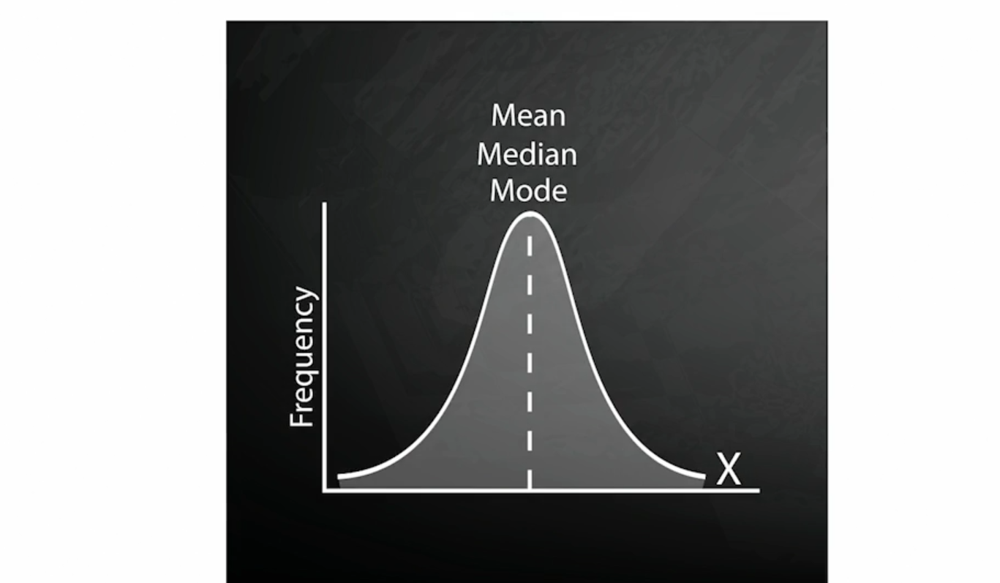

- Nagative Skew Distribution

  - 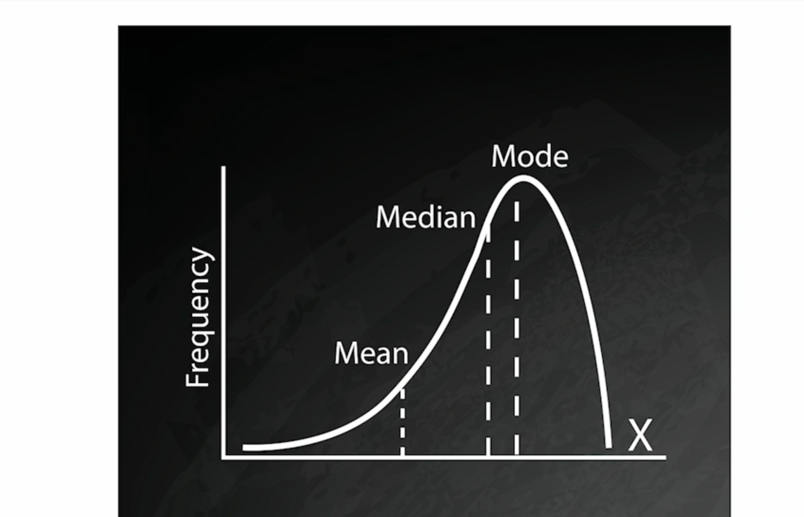

- Positive Skew Distribution

  - 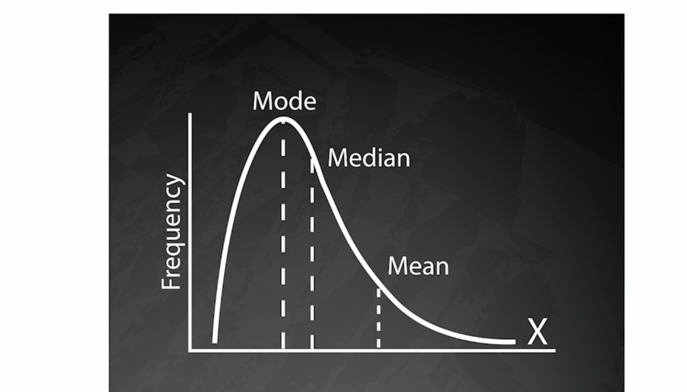

- Historgram Approximate Distribution

  - 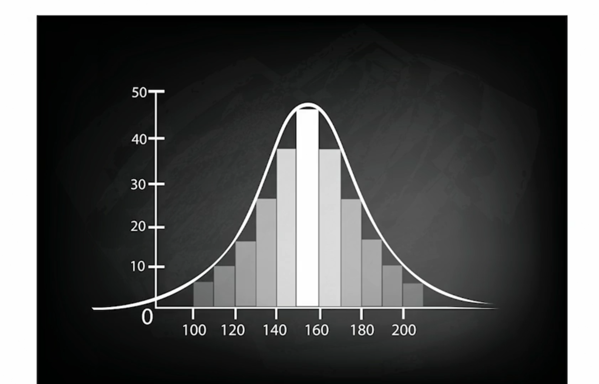

- Postgres ANALYZE Command

  - Collect statistics on columns, tables, or schemas
  - Not human readable/useful
  - Run automatically by AUTOVACUUM daemon or manually

- Postgres VACUUM Command

  - Reclaim space of updated data
  - VACUUM reclaims space
  - VACUUM(FULL) [tablename] locks tables and reclaims more space
  - VACUUM(FULL, ANALYZE) [tablename] performs full vacuum and collects statistics

- Postgres REINDEX Command
  - Rebuilds corrupted indexes
  - Shouldn't be needed, but there are bugs
  - Cleans up unused pages in B-tree indexes
  - REINDEX INDEX [indexname]
  - REINDEX TABLE [tablename]

### 7.2. Hints to the query optimizer

- Suggest Optimizations

  ```
  SELECT /*+ INDEX(sales_transaction st_cust_idx) +*/
    c.last_name, c.city, c.postal_code,
    st.last_purchase_amt, st.total_purchase_amt_to_date
  FROM
    customers c
  INNER JOIN
    sales_transaction st
  ON
    c.id = st.customer_id
  ```

  - Some databases accept hints
  - Extra-SQL statements suggesting methods
  - Pushing boundary between declarative and procedural code

- Some Database Support Inline Hints

  - Oracle
  - EnterpriseDB (based on Postgres)
  - MySQL
  - SQL Server

- Other Hints

  | EnterpriseDB | Oracle       | MySQL          |
  | ------------ | ------------ | -------------- |
  | FULL_TABLE   | FULL         |                |
  | INDEX        | INDEX        | USE_INDEX      |
  | NO_INDEX     | NO_INDEX     | IGNORE_INDEX   |
  | USE_HASH     | HASH         |                |
  | NO_USE_HASH  | NO_USE_HASH  |                |
  | USE_MERGE    | USE_MERGE    | INDEX_MERGE    |
  | NO_USE_MERGE | NO_USE_MERGE | NO_INDEX_MERGE |
  | USE_NL       | USE_NL       | BLK_NL         |
  | NO_USE_NL    | NO_USE_NL    | NO_BLK_NL      |

- Postgres Uses Parameters

  - SET command
  - SET enable_hashjoin=off
  - SET enable_nestloop=on
  - When using SSDs, try setting `random_page_cost` and `seq_page_cost` to same value

- Some Caveats
  - `ANALYZE` and `VACUUM`
  - Try other optimization techniques first
  - Verify query plan is consistently suboptimal
  - Watch for changes in amount or distribution of data

### 7.3. Parallel query execution

- Parallel Execution

  - Query optimizer may determine all or part of a query can run in parallel
  - Executes parts of plan in parallel
  - Then gathers results

- Parallel Query Details

  - 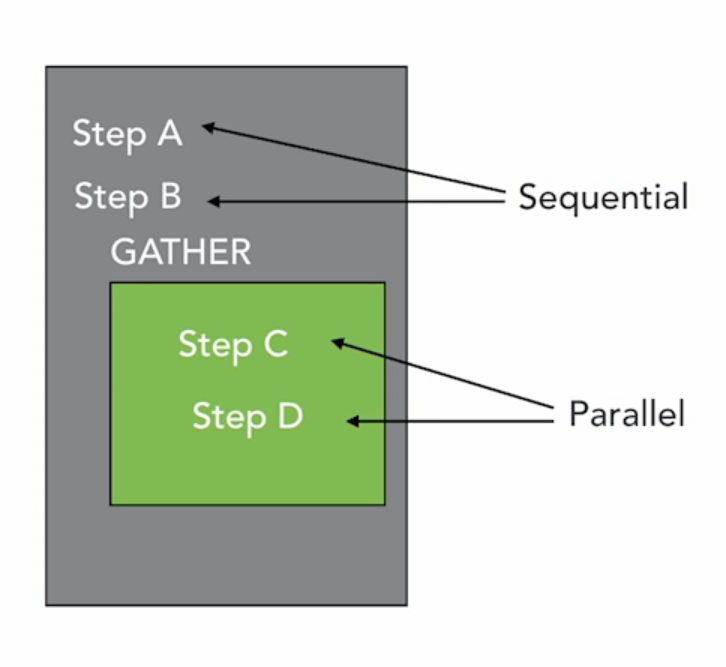

  - `GATHER` or `GATHER MERGE` appears in query plan
  - All steps below `GATHER`/`GATHER MERGE` are executed in parallel
  - Number of parallel processes limited by `max_parallel_workers` and `max_worker_processes` parameters

- In Order to Have Parallel Query

  - `max_parallel_workers_per_gather` parameter must be greater than 0
  - `dynamic_shared_memory_type` parameter must not be "none"
  - Database must not be running in single-user mode
  - Query does not write data or lock rows
  - Does not use a function marked `PARALLEL UNSAFE` (e.g., user defined functions)

- Parallel May Be Less Efficient
  - Parallel plans must exceed `parallel_setup_cost` and `parallel_tuple_cost` parameters
  - Parallel index scans are only supported for B-tree indexes
  - Inner side of nested loop and merge join is nonparallel
  - Hash joins are parallel but each process creates a copy of the hash table

### 7.4. Miscellaneous tips

- Improving SELECT Queries
- Indexing

  - Create indexes on join columns, same for columns used in WHERE clauses
  - Use covering indexes
  - Don't filter on a column using equality to NULL
    (Example: `col1=NULL` use `IS NULL`)
  - Don't use functions in WHERE clauses unless you have a functional index

- Index Range Scan

  - If a plan uses index ranger scan,keep the range as small as possible
  - Use equality with conditions
  - `LIKE 'ABC%'` can use and index; `LIKE '%ABC'` cannot
  - Use indexes to avoid sorts with `ORDER BY`

- Filtering and Data Types
  - When filtering on a range condition, especially dates, use continuous conditions, such as TRUNC(sysdate) and TRUNC(sysdate+1)
  - Don't separate date and time into separate columns; use a date time datatype
  - Don't store numeric data as char, varchar, or text; use a numeric type

## 8. Conclusion

### 8.1. Next steps

- Additional courses in our library
  - Advanced NoSQL for Data Science
  - SQL Tips, Tricks, & Techniques
- Review your specific database documentation
- Practice with EXPLAIN
