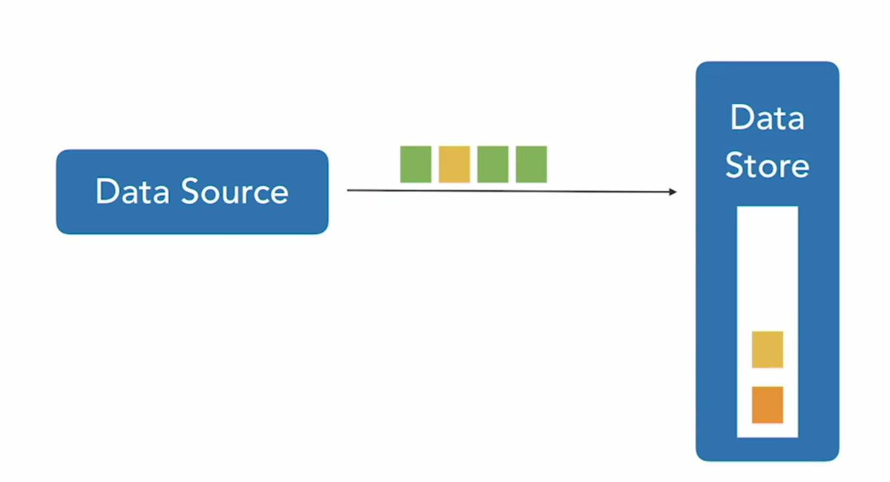
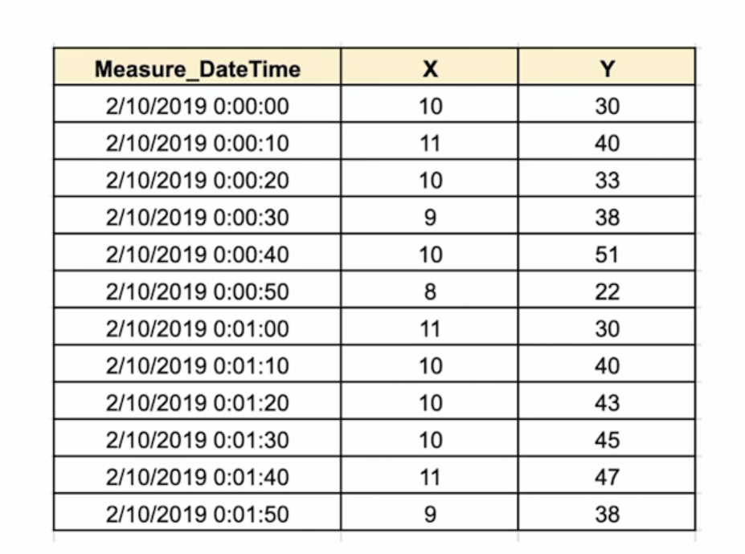
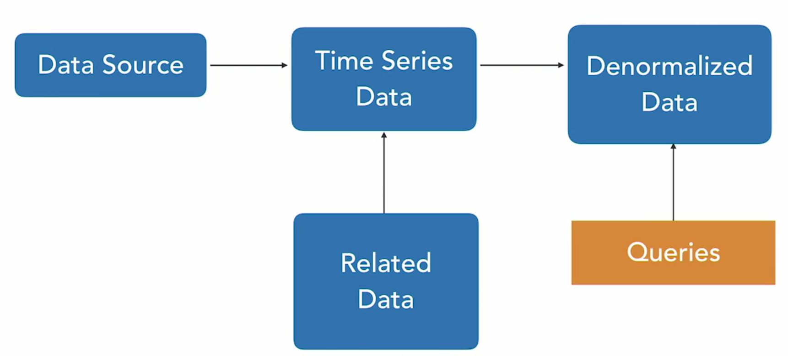

# Advanced SQL for Data Science - Time Series

## 0. Introduction

### 0.1. Learn time series data analysis with SQL

- Examples of Time Series

  - Stock market data
  - Tide time tables
  - Performance monitoring
  - Health monitoring
  - Population statistics
  - Business performance

- Data Ingest

  - 

- Query Patterns

  - Latest data
  - Compare time periods
  - Summarize time window

- Sliding Window

  - Window is a set of contiguous rows
  - Sliding windows moves through table one row at a time

- Tumbliing Windows

- Denormalized Data

  - Joining done once
  - Useful when data queried multiple times
  - Or, if query response time is more important than storage or preprocessing time

- Trade-Offs
  - Pros
    - Faster query response
    - Point-in-time history
  - Cons
    - Storage
    - More complex ingest

### 0.2. What you should know

- What You Should Know
  - SQL SELECT statements
  - Tables and views
  - Subqueries and joins

## 1. Introduction to Time Series Data

### 1.1. Characteristics of time series data

- Time Series Data

  - 
  - Sequence of data points
  - Timestamp
  - Regular intervals
  - Measurements

- Frequency

  | Measurement        | Time Unit    |
  | ------------------ | ------------ |
  | CPU Utilization    | Microseconds |
  | Network I/O        | Seconds      |
  | Units Produced     | Minutes      |
  | Customers Served   | Hours        |
  | Packages Delivered | Days         |
  | Auto Accidents     | Month        |
  | Company Profit     | Quarterly    |
  | Births and Deaths  | Annually     |

  - Fixed interval between measurements
  - Varies by application

- Unit of Measure

  | Measurement        | Uints of Measure |
  | ------------------ | ---------------- |
  | CPU Utilization    | Percentage       |
  | Network I/O        | MB               |
  | Units Produced     | Count            |
  | Customers Served   | Count            |
  | Packages Delivered | Count            |
  | Auto Accidents     | Count            |
  | Company Profit     | Monetary unit    |
  | Births and Deaths  | Count            |

  - What do numbers represent?
  - Varies by application

- Metric Types

  - Counter - monotonically increasing accumulator
  - Gauge - numerical measure that can go up or down
  - Summary - calculates values over time window, such as counts or rates
  - Histograms - counts of items over buckets

- This Course
  - Time series in relational databases
  - Query with SQL
  - Data modeling choices
  - Time series analysis

### 1.2. Examples of time series data

- Examples of Time Series
  - Stock market data
  - Tide time tables
  - Performance monitoring
  - Health monitoring
  - Population statistics
  - Business performance

### 1.3. Writing time series data

- Data Ingest

  - 

- Sequentially Write

  - Write data to disk in order it arrives
  - Potential for large tables
    - Which can be difficult to query and manage

- Horizontaling Partitioning

  - Split tables by rows into partitions
  - Treat each partition like a table

- Range Partitioning

  - Type of horizontal partitioning
  - Partition on non-overlapping keys
  - Partition by date is common

- When to Use Partition by Range
  - Query latest data
  - Comparative queries, for example, same time last year
  - Drop or summarize data after a period of time
  - All common in time series data

### 1.4. Querying time series data

- Query Patterns
  - Latest data
  - Compare time periods
  - Summarize time window
- Granularity

  - Latest data is finest grained
  - As data ages, less likely to query fine-grained data
  - Summarize and aggregate data at larger time intervals

- Information Drivers
  - Latest data: What is current CPU utilization? Why is throughput down?
  - Older data: What is average CPU utilization? Are we running efficiently?

## 2. Installing Database and Tools

### 2.1. Installing PostgreSQL

### 2.2. Creating schema and tables

- [code](2.2.sql)

### 2.3. Timing a query

- pgAdmin
  - Query History

### 2.4. Evaluating query performance with EXPLAIN

- [code](2.4.sql)

## 3. Querying Time Series Data

### 3.1. Time window queries and aggregates

- Time Window

  - Window is a set of contiguous rows
  - Size of window is number of rows

- Example Time Series Table

  ```
  CREATE TABLE time_series.utilization
  (
    event_time timestamp without time zone NOT NULL,
    server_id integer NOT NULL,
    cpu_utilization real,
    free_memory real,
    session_cnt integer,
    CONSTRAINT utilization_pkey PRIMARY KEY (event_time, server_id)
  );
  ```

- Example Query on Window

  ```
  SELECT
    u.event_time, u.server_id, u.cpu_utilization,
    u.free_memory, u.session_cont
  FROM
    utilization u
  WHERE
    u.event_time BETWEEN
      to_timestamp('2019-05-01 00:01:00', 'YYYY-MM-DD hh24:mis:ss') AND
      to_timestamp('2019-05-01 00:30:00', 'YYYY-MM-DD hh24:mis:ss')
  ORDER BY
    event_time, server_id
  ```

- Example Aggregate Query

  ```
  SELECT
    avg(u.cpu_utilization),
    avg(u.session_cont)
  FROM
    utilization u
  WHERE
    u.event_time BETWEEN
      to_timestamp('2019-05-01 00:01:00', 'YYYY-MM-DD hh24:mis:ss') AND
      to_timestamp('2019-05-01 00:30:00', 'YYYY-MM-DD hh24:mis:ss')
  ```

### 3.2. Sliding windows

- Sliding Window

  - Window is a set of contiguous rows
  - Sliding windows moves through table one row at a time

- Sliding Window Use Cases
  - Monitoring change over time
  - Continuous time series
  - No logical boundaries

### 3.3. Tumbling windows

- Window is a set of contiguous rows
- Sliding windows moves through table one window at a time

- Tumbling Window Use Cases
  - Monitoring change over time
  - Logical grouping of data by time
  - Useful for aggregate summaries about time periods

### 3.4. Joining two time series

- Joining on Time

  - Two time series may have different measurements over same time period
  - Useful to combine multiple measurements

- Potential Problems Joining on Time

  - Times may have different precision
  - More precise, less likely to match
  - Same hour, minute, seconds `12:15:37.45` does not match `12:15:37.46` clock skew
  - Clock skew

- Truncate Time

  - Drop most precise time elements
  - Use second or minute, for example
  - Truncating sub-seconds will lead to a match between `12:15:37.45` and `12:15:37.46`
  - May have multiple rows with truncated time

- Aggregate over Time Window

  - GROUP BY time
  - Choose degree of precision
  - Use aggregate functions
  - Produces one row per time period

- Trade-Offs
  - Pros
    - Ability to join
    - Account for some clock skew
    - Summarize data
  - Cons
    - Loss of precision
    - Loss of detail

### 3.5. Denormalizing time series data

- Denormalizing

  - Combine columns from multiple tables in a single table
  - Pre-joining
  - Supported by materialized views

- Denormalized Data

  - Joining done once
  - Useful when data required multiple times
  - Or, if query response time is more important than storage or preprocessing time

- Ingest Pipeline

  - 

- Trade-Offs
  - Pros
    - Faster query response
    - Point-in-time history
  - Cons
    - Storage
    - More complex ingest

## 4. Modeling Time Series Data

### 4.1. Example data set 1 - Temperature by time and location

- [Load_Time_Series_Data](4.1.sql)

- Query

  ```
  SELECT * FROM time_series.location_temp
  ORDER BY event_time, location_id
  LIMIT 100
  ```

  =>

  | event_time          | temp_celcius | location_id |
  | ------------------- | ------------ | ----------- |
  | 2019-03-04 19:48:06 | 29           | loc0        |
  | 2019-03-04 19:48:06 | 31           | loc1        |
  | 2019-03-04 19:48:06 | 28           | loc2        |
  | 2019-03-04 19:48:06 | 24           | loc3        |
  | ...                 |              |             |

### 4.2. Indexing data set 1 - Time index only

- [Location Index Only](4.2.sql)

### 4.3. Indexing data set 1 - Time and location index

- [Time and Location Index](4.3.sql)

### 4.4. Creating a partitioned table

- [Partition by Time](4.4.sql)

### 4.5. Querying a partitioned table

- [Query Partitioned Table](4.5.sql)

### 4.6. Example data set 2 - CPU utilization and application type

- [Load_Utilization_Data](4.6.sql)

- Query:

  ```
  SELECT
    *
  FROM
    time_series.utilization
  LIMIT 100
  ```

  =>

  | event_time          | server_id | cpu_utilization | free_memory | session_cnt |
  | ------------------- | --------- | --------------- | ----------- | ----------- |
  | 2019-03-05 08:06:14 | 100       | 0.57            | 0.51        | 47          |
  | 2019-03-05 08:11:14 | 100       | 0.47            | 0.62        | 43          |
  | ...                 |           |                 |             |             |

### 4.7. Indexing data set 2 - Time and type Indexing

- [Utilization by Time and Sessions](4.7.sql)

## 5. Commonly Used Functions for Time Series

### 5.1. Lead

- [Lead](5.1.sql)

  - Query 1 result

    | dept_id | server_id | cpu_utilization | lead |
    | ------- | --------- | --------------- | ---- |
    | 0       | 140       | 0.87            | 0.87 |
    | 0       | 140       | 0.87            | 0.86 |
    | 0       | 140       | 0.86            | 0.86 |
    | 0       | 140       | 0.86            | 0.86 |
    | 0       | 140       | 0.86            | 0.86 |

  - Query 2 result

    | dept_id | server_id | cpu_utilization | lead |
    | ------- | --------- | --------------- | ---- |
    | 0       | 140       | 0.87            | 0.86 |
    | 0       | 140       | 0.87            | 0.86 |
    | 0       | 140       | 0.86            | 0.86 |
    | 0       | 140       | 0.86            | 0.86 |
    | 0       | 140       | 0.86            | 0.86 |

### 5.2. Lag

- [Lag](5.2.sql)

- Query 1 result

  | dept_id | server_id | cpu_utilization | lag    |
  | ------- | --------- | --------------- | ------ |
  | 0       | 140       | 0.87            | [null] |
  | 0       | 140       | 0.87            | 0.87   |
  | 0       | 140       | 0.86            | 0.87   |
  | 0       | 140       | 0.86            | 0.86   |
  | 0       | 140       | 0.86            | 0.86   |

### 5.3. Rank

- [Rank](5.3.sql)

- Query 1 result

  | dept_id | server_id | cpu_utilization | rank |
  | ------- | --------- | --------------- | ---- |
  | 0       | 140       | 0.87            | 1    |
  | 0       | 140       | 0.87            | 1    |
  | 0       | 140       | 0.86            | 3    |
  | 0       | 140       | 0.86            | 3    |
  | 0       | 140       | 0.86            | 3    |

### 5.4 Percent rank

- [Percent Rank](5.4.sql)
  - Divided by total number of rows
- Query 1 result

  | dept_id | server_id | cpu_utilization | percent_rank        |
  | ------- | --------- | --------------- | ------------------- |
  | 0       | 140       | 0.87            | 0                   |
  | 0       | 140       | 0.87            | 0                   |
  | 0       | 140       | 0.86            | 0.00209643605870021 |
  | 0       | 140       | 0.86            | 0.00209643605870021 |
  | 0       | 140       | 0.86            | 0.00209643605870021 |

## 6. Time Series Analysis

### 6.1. Common Table Expressions and recursion

- [Common Table Expressions](6.1.sql)
- Query result

  | event_date          | avg_temp            |
  | ------------------- | ------------------- |
  | 2019-03-04 00:00:00 | 28.0652941176470588 |
  |                     |                     |

### 6.2. Caculating aggregates over windows

- [Aggregates over Windows](6.2.sql)

- Query result

  | server_id | cpu_utilization | avg               |
  | --------- | --------------- | ----------------- |
  | 100       | 0.57            | 0.486492146060105 |
  | 100       | 0.47            | 0.486492146060105 |

### 6.3. Previous day comparison

- [Comparison](6.3.sql)
- Query result

  | event_date          | avg_temp            | avg_temp            |
  | ------------------- | ------------------- | ------------------- |
  | 2019-03-04 00:00:00 | 28.0652941176470588 | [null]              |
  | 2019-03-05 00:00:00 | 28.0688833333333333 | 28.0652941176470588 |

### 6.4. Moving averages

- [Moving Average](6.4.sql)
- Query result

  | event_time          | server_id | hourly_cpu_util   |
  | ------------------- | --------- | ----------------- |
  | 2019-03-05 08:06:14 | 100       | 0.569999992847443 |
  | 2019-03-05 08:06:16 | 101       | 0.715000003576279 |

### 6.5. Weighted moving averages

- [Weighted Moving Average](6.5.sql)
- Query result(3 days weighted average)

  | event_date          | round | ?column? |
  | ------------------- | ----- | -------- |
  | 2019-03-04 00:00:00 | 28.07 | [null]   |
  | 2019-03-05 00:00:00 | 28.07 | [null]   |
  | 2019-03-06 00:00:00 | 28.06 | [null]   |
  | 2019-03-07 00:00:00 | 28.07 | 28.06500 |
  | 2019-03-08 00:00:00 | 28.06 | 28.06667 |

### 6.6. Forecasting with linear regression

- [Forecasting Linear Regression](6.6.sql)
- Query result

  | predicted_value   |
  | ----------------- |
  | 0.363047333224612 |

### 6.7. Exponential moving average

- Exponential Moving Average

  - A type of moving average
  - Weights decrease exponentially
  - Used to smooth trends when large variance in data

- Smoothing Parameter

  - Typically 2 / (1 + number of intervals)
  - For example, for 7 days the smoothing parameter is 0.25
  - Called lambda

- Lambda Formula
  - (current*period_value * lambda) + (previous*period_EWMA * (1 - lambda))
  - Recursive
  - Could be calculated using Common Table Expressions but not recommended for large data sets
  - Use user defined function instead

## 7. Conclusion

### 7.1. Next steps

- Using SQL for data science
- Tuning SQL queries
- Using R for advanced time series statistics
