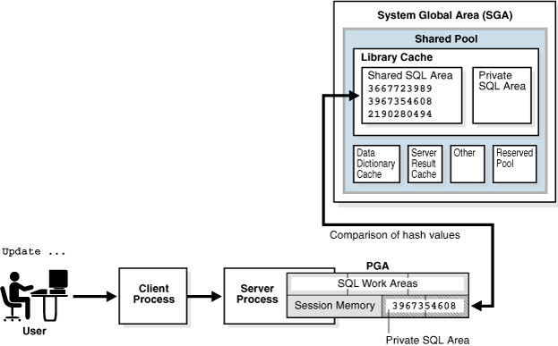
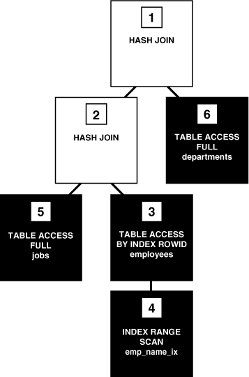
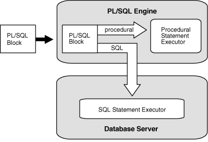

# SQL Certification

## 0. Overview

- Gain an understanding of schemas and different types of commands, maintenance and control of table, aliases, constraints and clauses, relational algebra, sub-queries and normalization, and joins and functions. Get an introduction to views and complex queries. Understand transactions, indexes, triggers, cursors, and stored procedures.

## 1. Introduction to SQL

### 1.1. What is a Database?

- A database is an organized collection of structured information, or data, typically stored electronically in a computer system. A database is usually controlled by a database management system (DBMS). Together, the data and the DBMS, along with the applications that are associated with them, are referred to as a database system, often shortened to just database.

- Data within the most common types of databases in operation today is typically modeled in rows and columns in a series of tables to make processing and data querying efficient. The data can then be easily accessed, managed, modified, updated, controlled, and organized. Most databases use structured query language (SQL) for writing and querying data.

### 1.2. Introduction to DBMS

- A database typically requires a comprehensive database software program known as a database management system (DBMS). A DBMS serves as an interface between the database and its end users or programs, allowing users to retrieve, update, and manage how the information is organized and optimized. A DBMS also facilitates oversight and control of databases, enabling a variety of administrative operations such as performance monitoring, tuning, and backup and recovery.

- Some examples of popular database software or DBMSs include MySQL, Microsoft Access, Microsoft SQL Server, FileMaker Pro, Oracle Database, and dBASE.

### 1.3. Advantages and Disadvantages of DBMS

- Advantages of Database

  - 1. Data Abstraction

    - Data abstraction means, to hide the complexity of data from the basic users.
    - DBMS abstracts the data from the users, which is not useful for the users. It shows only those data which are useful to the users.

  - 2. Controlling Data Redundancy

    - Data redundancy means having multiple copies of the same data.
    - DBMS controls the data redundancy and integrates all data into a single database file.
    - Controlling the data redundancy also helps to save our storage space and increase retrieval and update speed.

  - 3. Minimized Data inconsistency

    - Data inconsistency means that different files may contain different information about a particular object or person.
    - If DBMS has reduced the data redundancy then the database system leads the better data consistency.
    - Our data items appear only once (no redundancy) so the updated values are immediately available to all users.

  - 4. Data Manipulation Easily

    - In DBMS, Data can be manipulated easily, because data is centralized so once the data structure is defined, we can change in the data like- insertion, modification, or deletion.

  - 5. Data can be shared

    - Data can be shared easily by multiple applications in centralized DBMS. The applications can be developed without having to create any newly stored files.
    - The DBMS helps to develop a friendly environment where end-users can access and manage data.

  - 6. Data Security

    - Data is very important for any business organization. The more users access the data, the higher risks of data security breaches. If someone stole business data then it would be very bad for business. So a company will never want any outsider to come and access the company's data. The business organization invests plenty amount of time, effort, and money to ensure that its data are used by only authorized users.
    - DBMS provides data security means protecting your precious data from unauthorized access. Data can be accessed only by authorized users of the organization.
    - A database can be accessed only by proper authentication usually by verifying login and password.

  - 7. Support Multi-users Views

    - Multi-users can view the data at the same time.
    - Using the database, many users can access the data at the same time which increases our working speed.
    - DBMS gives the ability for its multiple authorized users to access the same database from different locations, in different ways, to complete its different works.

  - 8. Concurrent Access

    - Several users can access the database concurrently.

  - 9. Helps for Decision Making
    - Better organized data and improved data access give us better quality information which helps for making better decisions.

- Disadvantages of Database

  - 1. Cost of Hardware and Software

    - To run the DBMS software, we need a high-speed processor and a large memory size is required which causes expensive hardware is needed.

  - 2. Cost of Data Conversion

    - When a computer file-based system is replaced with a database system, then the data stored in data files must be converted into database files.
    - It is the difficult and time-consuming method to convert the data of data files into database.

  - 3. Cost of Staff Traning
    - DBMS are often complex systems, so training is required for the users to use the DBMS.
    - The organization has to be paid plenty of amount for the training of workers to run the database management system.

### 1.4. Types of Database Management Systems

- The main Four Types of Database Management Systems are:

  - Hierarchical database
  - Network database
  - Relational database
  - Object-Oriented database

- `Hierarchical DBMS`

  - In a Hierarchical database, model data is organized in a tree-like structure. Data is Stored Hierarchically (top-down or bottom-up) format. Data is represented using a parent-child relationship. In Hierarchical DBMS, parents may have many children, but children have only one parent.

- `Network Model`

  - The network database model allows each child to have multiple parents. It helps you to address the need to model more complex relationships like the orders/parts many-to-many relationship. In this model, entities are organized in a graph which can be accessed through several paths.

- `Relational Model`

  - Relational DBMS is the most widely used DBMS model because it is one of the easiest. This model is based on normalizing data in the rows and columns of the tables. Relational model is stored in fixed structures and manipulated using SQL.

- `Object-Oriented Model`
  - In the Object-oriented Model data is stored in the form of objects. The structure is called classes which display data within it. It is one of the components of DBMS that defines a database as a collection of objects that stores both data members’ values and operations.

### 1.5. Introdution to SQL

- `SQL` is a standard language for accessing and manipulating databases.

- What is SQL?

  - SQL stands for Structured Query Language
  - SQL lets you access and manipulate databases
  - SQL became a standard of the American National Standards Institute (ANSI) in 1986, and of the International Organization for Standardization (ISO) in 1987

- What Can SQL do?

  - SQL can execute queries against a database
  - SQL can retrieve data from a database
  - SQL can insert records in a database
  - SQL can update records in a database
  - SQL can delete records from a database
  - SQL can create new databases
  - SQL can create new tables in a database
  - SQL can create stored procedures in a database
  - SQL can create views in a database
  - SQL can set permissions on tables, procedures, and views

- SQL is a Standard - BUT....

  - Although SQL is an ANSI/ISO standard, there are different versions of the SQL language.

  - However, to be compliant with the ANSI standard, they all support at least the major commands (such as SELECT, UPDATE, DELETE, INSERT, WHERE) in a similar manner.

  - `Note`: Most of the SQL database programs also have their own proprietary extensions in addition to the SQL standard!

- Using SQL in Your Web Site

  - To build a web site that shows data from a database, you will need:

    - An RDBMS database program (i.e. MS Access, SQL Server, MySQL)
    - To use a server-side scripting language, like PHP or ASP
    - To use SQL to get the data you want
    - To use HTML / CSS to style the page

- RDBMS

  - RDBMS stands for Relational Database Management System.

  - RDBMS is the basis for SQL, and for all modern database systems such as MS SQL Server, IBM DB2, Oracle, MySQL, and Microsoft Access.

  - The data in RDBMS is stored in database objects called tables. A table is a collection of related data entries and it consists of columns and rows.

  - Example:

    ```
    SELECT * FROM Customers;
    ```

    | CustomerID | CustomerName                       | ContactName  | Address                       | City        | PostalCode | Country |
    | ---------- | ---------------------------------- | ------------ | ----------------------------- | ----------- | ---------- | ------- |
    | 1          | Alfreds Futterkiste                | Maria Anders | Obere Str. 57                 | Berlin      | 12209      | Germany |
    | 2          | Ana Trujillo Emparedados y helados | Ana Trujillo | Avda. de la Constitución 2222 | México D.F. | 05021      | Mexico  |

  - Every table is broken up into smaller entities called fields. The fields in the Customers table consist of CustomerID, CustomerName, ContactName, Address, City, PostalCode and Country. A field is a column in a table that is designed to maintain specific information about every record in the table.

  - A record, also called a row, is each individual entry that exists in a table. For example, there are 91 records in the above Customers table. A record is a horizontal entity in a table.

  - A column is a vertical entity in a table that contains all information associated with a specific field in a table.

### 1.6. History of SQL

- The SQL programming language was developed in the 1970s by IBM researchers Raymond Boyce and Donald Chamberlin. The programming language, known then as SEQUEL, was created following Edgar Frank Codd’s paper, “A Relational Model of Data for Large Shared Data Banks,” in 1970.

### 1.7. SQL Statement Classes

- `Data Definition Language (DDL) Statements`

  - Data definition language (DDL) statements let you to perform these tasks:

    - Create, alter, and drop schema objects
    - Grant and revoke privileges and roles
    - Analyze information on a table, index, or cluster
    - Establish auditing options
    - Add comments to the data dictionary

  - The `CREATE`, `ALTER`, and `DROP` commands require exclusive access to the specified object. For example, an `ALTER TABLE` statement fails if another user has an open transaction on the specified table.
  - The `GRANT`, `REVOKE`, `ANALYZE`, `AUDIT`, and `COMMENT` commands do not require exclusive access to the specified object. For example, you can analyze a table while other users are updating the table.
  - Oracle Database implicitly commits the current transaction before and after every DDL statement.

  - The DDL statements are:

    ```
    ALTER ... (All statements beginning with ALTER)
    ANALYZE
    ASSOCIATE STATISTICS
    AUDIT
    COMMENT
    CREATE ... (All statements beginning with CREATE)
    DISASSOCIATE STATISTICS
    DROP ... (All statements beginning with DROP)
    FLASHBACK ... (All statements beginning with FLASHBACK)
    GRANT
    NOAUDIT
    PURGE
    RENAME
    REVOKE
    TRUNCATE
    UNDROP
    ```

- `Data Manipulation Language (DML) Statements`

  - Data manipulation language (DML) statements access and manipulate data in existing schema objects. These statements do not implicitly commit the current transaction. The data manipulation language statements are:

    ```
    CALL
    DELETE
    EXPLAIN PLAN
    INSERT
    LOCK TABLE
    MERGE
    SELECT
    UPDATE
    ```

  - The `SELECT` statement is a limited form of DML statement in that it can only access data in the database. It cannot manipulate data in the database, although it can operate on the accessed data before returning the results of the query.
  - The `CALL` and `EXPLAIN PLAN` statements are supported in PL/SQL only when executed dynamically. All other DML statements are fully supported in PL/SQL.

- `Transaction Control Statements`

  - Transaction control statements manage changes made by DML statements. The transaction control statements are:

    ```
    COMMIT
    ROLLBACK
    SAVEPOINT
    SET TRANSACTION
    ```

  - All transaction control statements, except certain forms of the COMMIT and ROLLBACK commands, are supported in PL/SQL.

- `Session Control Statements`

  - Session control statements dynamically manage the properties of a user session. These statements do not implicitly commit the current transaction.

  - PL/SQL does not support session control statements. The session control statements are:

    ```
    ALTER SESSION
    SET ROLE
    ```

- `System Control Statement`

  - The single system control statement, `ALTER SYSTEM`, dynamically manages the properties of an Oracle Database instance. This statement does not implicitly commit the current transaction and is not supported in PL/SQL

- `Embedded SQL Statements`
  - Embedded SQL statements place DDL, DML, and transaction control statements within a procedural language program. Embedded SQL is supported by the Oracle precompilers

### 1.8. SQL Process

- About SQL Processing

  - `SQL processing` is the parsing, optimization, row source generation, and execution of a SQL statement. Depending on the statement, the database may omit some of these stages.

  - 

  - SQL Parsing

    - The first stage of SQL processing is `parsing`.
    - The parsing stage involves separating the pieces of a SQL statement into a data structure that other routines can process. The database parses a statement when instructed by the application, which means that only the application­, and not the database itself, can reduce the number of parses.
    - When an application issues a SQL statement, the application makes a `parse call` to the database to prepare the statement for execution. The parse call opens or creates a `cursor`, which is a handle for the session-specific `private SQL area` that holds a parsed SQL statement and other processing information. The cursor and private SQL area are in the program global area (PGA).
    - During the parse call, the database performs the following checks:
      - Syntax Check
      - Semantic Check
      - Shared Pool Check
    - The preceding checks identify the errors that can be found before statement execution. Some errors cannot be caught by parsing. For example, the database can encounter deadlocks or errors in data conversion only during statement execution.
    - Syntax Check

      - Oracle Database must check each SQL statement for syntactic validity.
      - A statement that breaks a rule for well-formed SQL syntax fails the check. For example, the following statement fails because the keyword FROM is misspelled as FORM:

        ```
        SQL> SELECT * FORM employees;
        SELECT * FORM employees
                *
        ERROR at line 1:
        ORA-00923: FROM keyword not found where expected
        ```

    - Semantic Check

      - The semantics of a statement are its meaning. A semantic check determines whether a statement is meaningful, for example, whether the objects and columns in the statement exist.
      - A syntactically correct statement can fail a semantic check, as shown in the following example of a query of a nonexistent table:

        ```
        SQL> SELECT * FROM nonexistent_table;
        SELECT * FROM nonexistent_table
                      *
        ERROR at line 1:
        ORA-00942: table or view does not exist
        ```

    - Shared Pool Check
      - During the parse, the database performs a shared pool check to determine whether it can skip resource-intensive steps of statement processing.
      - To this end, the database uses a hashing algorithm to generate a hash value for every SQL statement. The statement hash value is the SQL ID shown in V$SQL.SQL_ID. This hash value is deterministic within a version of Oracle Database, so the same statement in a single instance or in different instances has the same SQL ID.
      - When a user submits a SQL statement, the database searches the `shared SQL area` to see if an existing parsed statement has the same hash value. The hash value of a SQL statement is distinct from the following values:
        - Memory address for the statement
          - Oracle Database uses the SQL ID to perform a keyed read in a lookup table. In this way, the database obtains possible memory addresses of the statement.
        - Hash value of an `execution plan` for the statement
          - A SQL statement can have multiple plans in the shared pool. Typically, each plan has a different hash value. If the same SQL ID has multiple plan hash values, then the database knows that multiple plans exist for this SQL ID.
    - Parse operations fall into the following categories, depending on the type of statement submitted and the result of the hash check:

      - Hard parse

        - If Oracle Database cannot reuse existing code, then it must build a new executable version of the application code. This operation is known as a `hard parse`, or a `library cache miss`.
          - Note: The database always performs a hard parse of DDL.
        - During the hard parse, the database accesses the library cache and data dictionary cache numerous times to check the data dictionary. When the database accesses these areas, it uses a serialization device called a `latch` on required objects so that their definition does not change. Latch contention increases statement execution time and decreases concurrency.

      - Soft parse
        - A `soft parse` is any parse that is not a hard parse. If the submitted statement is the same as a reusable SQL statement in the shared pool, then Oracle Database reuses the existing code. This reuse of code is also called a `library cache hit`.
        - Soft parses can vary in how much work they perform. For example, configuring the session shared SQL area can sometimes reduce the amount of latching in the soft parses, making them "softer."
      - In general, a soft parse is preferable to a hard parse because the database skips the optimization and row source generation steps, proceeding straight to execution.

      - 
      - If a check determines that a statement in the shared pool has the same hash value, then the database performs semantic and environment checks to determine whether the statements have the same meaning. Identical syntax is not sufficient. For example, suppose two different users log in to the database and issue the following SQL statements:

        ```
        CREATE TABLE my_table ( some_col INTEGER );
        SELECT * FROM my_table;
        ```

        - The SELECT statements for the two users are syntactically identical, but two separate schema objects are named my_table. This semantic difference means that the second statement cannot reuse the code for the first statement.
        - Even if two statements are semantically identical, an environmental difference can force a hard parse. In this context, the `optimizer environment` is the totality of session settings that can affect execution plan generation, such as the work area size or optimizer settings (for example, the optimizer mode). Consider the following series of SQL statements executed by a single user:

          ```
          ALTER SESSION SET OPTIMIZER_MODE=ALL_ROWS;
          ALTER SYSTEM FLUSH SHARED_POOL;               # optimizer environment 1
          SELECT * FROM sh.sales;

          ALTER SESSION SET OPTIMIZER_MODE=FIRST_ROWS;  # optimizer environment 2
          SELECT * FROM sh.sales;

          ALTER SESSION SET SQL_TRACE=true;             # optimizer environment 3
          SELECT * FROM sh.sales;
          ```

          - In the preceding example, the same SELECT statement is executed in three different optimizer environments. Consequently, the database creates three separate shared SQL areas for these statements and forces a hard parse of each statement.

  - SQL Optimization

    - During the optimization stage, Oracle Database must perform a hard parse at least once for every unique DML statement and performs the optimization during this parse.

    - The database never optimizes DDL unless it includes a DML component such as a subquery that requires optimization.

  - SQL Row Source Generation

    - The `row source generator` is software that receives the optimal execution plan from the optimizer and produces an iterative execution plan that is usable by the rest of the database.

    - The iterative plan is a binary program that, when executed by the SQL engine, produces the result set. The plan takes the form of a combination of steps. Each step returns a `row set`. The next step either uses the rows in this set, or the last step returns the rows to the application issuing the SQL statement.

    - A `row source` is a row set returned by a step in the execution plan along with a control structure that can iteratively process the rows. The row source can be a table, view, or result of a join or grouping operation.

    - The row source generator produces a `row source tree`, which is a collection of row sources. The row source tree shows the following information:

      - An ordering of the tables referenced by the statement

      - An access method for each table mentioned in the statement

      - A join method for tables affected by join operations in the statement

      - Data operations such as filter, sort, or aggregation

    - Example 3-1 Execution Plan

      - This example shows the execution plan of a `SELECT` statement when `AUTOTRACE` is enabled. The statement selects the last name, job title, and department name for all employees whose last names begin with the letter A. The execution plan for this statement is the output of the row source generator.

        ```
        SELECT e.last_name, j.job_title, d.department_name
        FROM   hr.employees e, hr.departments d, hr.jobs j
        WHERE  e.department_id = d.department_id
        AND    e.job_id = j.job_id
        AND    e.last_name LIKE 'A%';

        Execution Plan
        ----------------------------------------------------------
        Plan hash value: 975837011

        --------------------------------------------------------------------------------
        | Id| Operation                     | Name        |Rows|Bytes|Cost(%CPU)|Time  |
        --------------------------------------------------------------------------------
        | 0 | SELECT STATEMENT              |             |  3 | 189 | 7(15)| 00:00:01 |
        |*1 |  HASH JOIN                    |             |  3 | 189 | 7(15)| 00:00:01 |
        |*2 |   HASH JOIN                   |             |  3 | 141 | 5(20)| 00:00:01 |
        | 3 |    TABLE ACCESS BY INDEX ROWID| EMPLOYEES   |  3 |  60 | 2 (0)| 00:00:01 |
        |*4 |     INDEX RANGE SCAN          | EMP_NAME_IX |  3 |     | 1 (0)| 00:00:01 |
        | 5 |    TABLE ACCESS FULL          | JOBS        | 19 | 513 | 2 (0)| 00:00:01 |
        | 6 |   TABLE ACCESS FULL           | DEPARTMENTS | 27 | 432 | 2 (0)| 00:00:01 |
        --------------------------------------------------------------------------------

        Predicate Information (identified by operation id):
        ---------------------------------------------------

          1 - access("E"."DEPARTMENT_ID"="D"."DEPARTMENT_ID")
          2 - access("E"."JOB_ID"="J"."JOB_ID")
          4 - access("E"."LAST_NAME" LIKE 'A%')
              filter("E"."LAST_NAME" LIKE 'A%')
        ```

  - SQL Execution

    - During execution, the SQL engine executes each row source in the tree produced by the row source generator. This step is the only mandatory step in DML processing.
    - `Figure 3-3` is an `execution tree`, also called a _parse tree_, that shows the flow of row sources from one step to another in the plan in `Example 3-1`. In general, the order of the steps in execution is the _reverse_ of the order in the plan, so you read the plan from the bottom up.
    - Each step in an execution plan has an ID number. The numbers in `Figure 3-3` correspond to the Id column in the plan shown in `Example 3-1`. Initial spaces in the `Operation` column of the plan indicate hierarchical relationships. For example, if the name of an operation is preceded by two spaces, then this operation is a child of an operation preceded by one space. Operations preceded by one space are children of the `SELECT` statement itself.

    - Figure 3-3 Row Source Tree

      - 

    - In Figure 3-3, each node of the tree acts as a row source, which means that each step of the execution plan in `Example 3-1` either retrieves rows from the database or accepts rows from one or more row sources as input. The SQL engine executes each row source as follows:

      - Steps indicated by the black boxes physically retrieve data from an object in the database. These steps are the access paths, or techniques for retrieving data from the database.

        - Step 6 uses a full table scan to retrieve all rows from the departments table.

        - Step 5 uses a full table scan to retrieve all rows from the jobs table.

        - Step 4 scans the `emp_name_ix` index in order, looking for each key that begins with the letter A and retrieving the corresponding rowid. For example, the rowid corresponding to `Atkinson` is `AAAPzRAAFAAAABSAAe`.

        - Step 3 retrieves from the `employees` table the rows whose rowids were returned by Step 4. For example, the database uses rowid `AAAPzRAAFAAAABSAAe` to retrieve the row for `Atkinson`.

      - Steps indicated by the clear boxes operate on row sources.

        - Step 2 performs a `hash join`, accepting row sources from Steps 3 and 5, joining each row from the Step 5 row source to its corresponding row in Step 3, and returning the resulting rows to Step 1.

          - For example, the row for employee `Atkinson` is associated with the job name `Stock Clerk`.

        - Step 1 performs another hash join, accepting row sources from Steps 2 and 6, joining each row from the Step 6 source to its corresponding row in Step 2, and returning the result to the client.

          - For example, the row for employee `Atkinson` is associated with the department named `Shipping`.

    - In some execution plans the steps are iterative and in others sequential. The hash join shown in `Example 3-1` is sequential. The database completes the steps in their entirety based on the join order. The database starts with the index range scan of `emp_name_ix`. Using the rowids that it retrieves from the index, the database reads the matching rows in the `employees` table, and then scans the jobs table. After it retrieves the rows from the jobs table, the database performs the hash join.

    - During execution, the database reads the data from disk into memory if the data is not in memory. The database also takes out any locks and latches necessary to ensure data integrity and logs any changes made during the SQL execution. The final stage of processing a SQL statement is closing the cursor.

- How Oracle Database Processes DML

  - Most DML statements have a query component. In a query, execution of a cursor places the results of the query into a set of rows called the `result set`.

  - How Row Sets Are Fetched

    - Result set rows can be fetched either a row at a time or in groups.

    - In the fetch stage, the database selects rows and, if requested by the query, orders the rows. Each successive fetch retrieves another row of the result until the last row has been fetched.

    - In general, the database cannot determine for certain the number of rows to be retrieved by a query until the last row is fetched. Oracle Database retrieves the data in response to fetch calls, so that the more rows the database reads, the more work it performs. For some queries the database returns the first row as quickly as possible, whereas for others it creates the entire result set before returning the first row.

  - Read Consistency

    - In general, a query retrieves data by using the Oracle Database read consistency mechanism, which guarantees that all data blocks read by a query are consistent to a single point in time.

    - Read consistency uses undo data to show past versions of data. For an example, suppose a query must read 100 data blocks in a full table scan. The query processes the first 10 blocks while DML in a different session modifies block 75. When the first session reaches block 75, it realizes the change and uses undo data to retrieve the old, unmodified version of the data and construct a noncurrent version of block 75 in memory.

  - Data Changes

    - DML statements that must change data use read consistency to retrieve only the data that matched the search criteria when the modification began.

    - Afterward, these statements retrieve the data blocks as they exist in their current state and make the required modifications. The database must perform other actions related to the modification of the data such as generating redo and undo data.

  - How Oracle Database Processes DDL

    - Oracle Database processes DDL differently from DML.

      - For example, when you create a table, the database does not optimize the CREATE TABLE statement. Instead, Oracle Database parses the DDL statement and carries out the command.

      - The database processes DDL differently because it is a means of defining an object in the data dictionary. Typically, Oracle Database must parse and execute many `recursive SQL` statements to execute a DDL statement. Suppose you create a table as follows:

        ```
        CREATE TABLE mytable (mycolumn INTEGER);
        ```

      - Typically, the database would run dozens of recursive statements to execute the preceding statement. The recursive SQL would perform actions such as the following:

        - Issue a `COMMIT` before executing the `CREATE TABLE` statement

        - Verify that user privileges are sufficient to create the table

        - Determine which tablespace the table should reside in

        - Ensure that the tablespace quota has not been exceeded

        - Ensure that no object in the schema has the same name

        - Insert rows that define the table into the data dictionary

        - Issue a `COMMIT` if the DDL statement succeeded or a `ROLLBACK` if it did not

### 1.9. SQL Language Elements and PL/SQL

#### 1.9.1. ACCESSIBLE BY Clause

- The `ACCESSIBLE BY` clause restricts access to a unit or subprogram by other units.

- Examples:

  ```
  PROCEDURE top_protected_proc
    ACCESSIBLE BY (PROCEDURE top_trusted_proc)
  AS
  BEGIN
    DBMS_OUTPUT.PUT_LINE('Executed top_protected_proc.');
  END;

  PROCEDURE top_trusted_proc AS
  BEGIN
    DBMS_OUTPUT.PUT_LINE('top_trusted_proc calls top_protected_proc');
    top_protected_proc;
  END;


  EXEC top_trusted_proc;
  top_trusted_proc calls top_protected_proc
  Executed top_protected_proc.


  EXEC top_protected_proc;
  BEGIN top_protected_proc; END;

  PLS-00904: insufficient privilege to access object TOP_PROTECTED_PROC

  ```

#### 1.9.2. AGGREGATE Clause

- Identifies the function as an `aggregate function`, or one that evaluates a group of rows and returns a single row.

  - You can specify aggregate functions in the select list, HAVING clause, and ORDER BY clause.

- _Example 13-33 Pipelined Table Function as Aggregate Function_

  ```
  DROP TABLE gradereport;
  CREATE TABLE gradereport (
    student VARCHAR2(30),
    subject VARCHAR2(30),
    weight NUMBER,
    grade NUMBER
  );

  INSERT INTO gradereport (student, subject, weight, grade)
  VALUES ('Mark', 'Physics', 4, 4);

  INSERT INTO gradereport (student, subject, weight, grade)
  VALUES ('Mark','Chemistry', 4, 3);

  INSERT INTO gradereport (student, subject, weight, grade)
  VALUES ('Mark','Maths', 3, 3);

  INSERT INTO gradereport (student, subject, weight, grade)
  VALUES ('Mark','Economics', 3, 4);
  ```

  ```
  CREATE PACKAGE pkg_gpa AUTHID DEFINER IS
    TYPE gpa IS TABLE OF NUMBER;
    FUNCTION weighted_average(input_values SYS_REFCURSOR)
      RETURN gpa PIPELINED;
  END pkg_gpa;

  CREATE PACKAGE BODY pkg_gpa IS
    FUNCTION weighted_average (input_values SYS_REFCURSOR)
      RETURN gpa PIPELINED
    IS
      grade         NUMBER;
      total         NUMBER := 0;
      total_weight  NUMBER := 0;
      weight        NUMBER := 0;
    BEGIN
      LOOP
        FETCH input_values INTO weight, grade;
        EXIT WHEN input_values%NOTFOUND;
        total_weight := total_weight + weight;  -- Accumulate weighted average
        total := total + grade*weight;
      END LOOP;
      PIPE ROW (total / total_weight);
      RETURN; -- returns single result
    END weighted_average;
  END pkg_gpa;
  ```

  - This query shows how the table function can be invoked without the optional TABLE operator.

    ```
    SELECT w.column_value "weighted result"
    FROM pkg_gpa.weighted_average (
        CURSOR (SELECT weight, grade FROM gradereport)
      ) w;
    ```

  - Result:

    ```
    weighted result
    ---------------
                3.5

    1 row selected.
    ```

#### 1.9.3. Assignment Statement

- The assignment statement sets the value of a data item to a valid value.

- _Example 3-24 Assigning Values to Variables with Assignment Statement_

  - This example declares several variables (specifying initial values for some) and then uses assignment statements to assign the values of expressions to them.

  ```
  DECLARE  -- You can assign initial values here
    wages          NUMBER;
    hours_worked   NUMBER := 40;
    hourly_salary  NUMBER := 22.50;
    bonus          NUMBER := 150;
    country        VARCHAR2(128);
    counter        NUMBER := 0;
    done           BOOLEAN;
    valid_id       BOOLEAN;
    emp_rec1       employees%ROWTYPE;
    emp_rec2       employees%ROWTYPE;
    TYPE commissions IS TABLE OF NUMBER INDEX BY PLS_INTEGER;
    comm_tab       commissions;

  BEGIN  -- You can assign values here too
    wages := (hours_worked * hourly_salary) + bonus;
    country := 'France';
    country := UPPER('Canada');
    done := (counter > 100);
    valid_id := TRUE;
    emp_rec1.first_name := 'Antonio';
    emp_rec1.last_name := 'Ortiz';
    emp_rec1 := emp_rec2;
    comm_tab(5) := 20000 * 0.15;
  END;
  /
  ```

#### 1.9.4. AUTONOMOUS_TRANSACTION Pragma

- The `AUTONOMOUS_TRANSACTION` pragma marks a routine as `autonomous`; that is, independent of the main transaction.

- _Example 7-43 Declaring Autonomous Function in Package_

  - This example marks a package function as autonomous.

  ```
  CREATE OR REPLACE PACKAGE emp_actions AUTHID DEFINER AS  -- package specification
    FUNCTION raise_salary (emp_id NUMBER, sal_raise NUMBER)
    RETURN NUMBER;
  END emp_actions;
  /
  CREATE OR REPLACE PACKAGE BODY emp_actions AS  -- package body
    -- code for function raise_salary
    FUNCTION raise_salary (emp_id NUMBER, sal_raise NUMBER)
    RETURN NUMBER IS
      PRAGMA AUTONOMOUS_TRANSACTION;
      new_sal NUMBER(8,2);
    BEGIN
      UPDATE employees SET salary =
        salary + sal_raise WHERE employee_id = emp_id;
      COMMIT;
      SELECT salary INTO new_sal FROM employees
        WHERE employee_id = emp_id;
      RETURN new_sal;
    END raise_salary;
  END emp_actions;
  /
  ```

#### 1.9.5. Basic LOOP Statement

- With each iteration of the basic `LOOP` statement, its statements run and control returns to the top of the loop. The `LOOP` statement ends when a statement inside the loop transfers control outside the loop or raises an exception.

- _Example 14-4 Nested, Labeled Basic LOOP Statements with EXIT WHEN Statements_

  - In this example, one basic `LOOP` statement is nested inside the other, and both have labels. The inner loop has two `EXIT WHEN` statements; one that exits the inner loop and one that exits the outer loop.

  ```
  DECLARE
    s  PLS_INTEGER := 0;
    i  PLS_INTEGER := 0;
    j  PLS_INTEGER;
  BEGIN
    <<outer_loop>>
    LOOP
      i := i + 1;
      j := 0;
      <<inner_loop>>
      LOOP
        j := j + 1;
        s := s + i * j; -- Sum several products
        EXIT inner_loop WHEN (j > 5);
        EXIT outer_loop WHEN ((i * j) > 15);
      END LOOP inner_loop;
    END LOOP outer_loop;
    DBMS_OUTPUT.PUT_LINE
      ('The sum of products equals: ' || TO_CHAR(s));
  END;
  /
  ```

#### 1.9.6. Block

- The `block`, which groups related declarations and statements, is the basic unit of a PL/SQL source program.

- _Example 2-1 PL/SQL Block Structure_

  - This example shows the basic structure of a PL/SQL block.

  ```
  << label >> (optional)
  DECLARE    -- Declarative part (optional)
    -- Declarations of local types, variables, & subprograms

  BEGIN      -- Executable part (required)
    -- Statements (which can use items declared in declarative part)

  [EXCEPTION -- Exception-handling part (optional)
    -- Exception handlers for exceptions (errors) raised in executable part]
  END;
  ```

#### 1.9.7. Call Specification

- A `call specification` declares a Java method or a C language subprogram so that it can be invoked from PL/SQL. You can also use the SQL `CALL` statement to invoke such a method or subprogram.

- _Example 14-6 External Function Example_

  - The hypothetical following statement creates a PL/SQL standalone function `get_val` that registers the C subprogram `c_get_val` as an external function. (The parameters have been omitted from this example.)

  ```
  CREATE FUNCTION get_val
   ( x_val IN NUMBER,
    y_val IN NUMBER,
    image IN LONG RAW )
   RETURN BINARY_INTEGER AS LANGUAGE C
      NAME "c_get_val"
      LIBRARY c_utils
      PARAMETERS (...);
  ```

#### 1.9.8. CASE Statement

- The `CASE` statement chooses from a sequence of conditions and runs a corresponding statement.

- _Example 4-2 Printing BOOLEAN Values_

  - In this example, the procedure accepts a `BOOLEAN` parameter and uses a `CASE` statement to print `Unknown` if the value of the parameter is `NULL`, `Yes` if it is `TRUE`, and `No` if it is `FALSE`.

  ```
  PROCEDURE print_boolean (b BOOLEAN)
  AS
  BEGIN
    DBMS_OUTPUT.PUT_LINE (
      CASE
        WHEN b IS NULL THEN 'Unknown'
        WHEN b THEN 'Yes'
        WHEN NOT b THEN 'No'
      END
    );
  END;

  BEGIN
    print_boolean(TRUE);
    print_boolean(FALSE);
    print_boolean(NULL);
  END;
  ```

  - Result:

    ```
    Yes
    No
    Unknown
    ```

#### 1.9.9. CLOSE Statement

- The `CLOSE` statement closes a named cursor, freeing its resources for reuse.

- _Example 7-6 FETCH Statements Inside LOOP Statements_

  ```
  DECLARE
    CURSOR c1 IS
      SELECT last_name, job_id FROM employees
      WHERE REGEXP_LIKE (job_id, 'S[HT]_CLERK')
      ORDER BY last_name;

    v_lastname  employees.last_name%TYPE;  -- variable for last_name
    v_jobid     employees.job_id%TYPE;     -- variable for job_id

    CURSOR c2 IS
      SELECT * FROM employees
      WHERE REGEXP_LIKE (job_id, '[ACADFIMKSA]_M[ANGR]')
      ORDER BY job_id;

    v_employees employees%ROWTYPE;  -- record variable for row of table

  BEGIN
    OPEN c1;
    LOOP  -- Fetches 2 columns into variables
      FETCH c1 INTO v_lastname, v_jobid;
      EXIT WHEN c1%NOTFOUND;
      DBMS_OUTPUT.PUT_LINE( RPAD(v_lastname, 25, ' ') || v_jobid );
    END LOOP;
    CLOSE c1;
    DBMS_OUTPUT.PUT_LINE( '-------------------------------------' );

    OPEN c2;
    LOOP  -- Fetches entire row into the v_employees record
      FETCH c2 INTO v_employees;
      EXIT WHEN c2%NOTFOUND;
      DBMS_OUTPUT.PUT_LINE( RPAD(v_employees.last_name, 25, ' ') ||
                                v_employees.job_id );
    END LOOP;
    CLOSE c2;
  END;
  /
  ```

  - Result:

    ```
    Atkinson                 ST_CLERK
    Bell                     SH_CLERK
    Bissot                   ST_CLERK
    ...
    Walsh                    SH_CLERK
    -------------------------------------
    Higgins                  AC_MGR
    Greenberg                FI_MGR
    Hartstein                MK_MAN
    ...
    Zlotkey                  SA_MAN
    ```

#### 1.9.10. Collection Method Invocation

- A collection method is a PL/SQL subprogram that either returns information about a collection or operates on a collection.

- _Example 6-23 DELETE Method with Nested Table_

  - This example declares a nested table variable, initializing it with six elements; deletes and then restores the second element; deletes a range of elements and then restores one of them; and then deletes all elements. The restored elements occupy the same memory as the corresponding deleted elements. The procedure print_nt prints the nested table variable after initialization and after each `DELETE` operation. The type `nt_type` and procedure `print_nt` are defined in Example 6-6.

  ```
  DECLARE
    nt nt_type := nt_type(11, 22, 33, 44, 55, 66);
  BEGIN
    print_nt(nt);

    nt.DELETE(2);     -- Delete second element
    print_nt(nt);

    nt(2) := 2222;    -- Restore second element
    print_nt(nt);

    nt.DELETE(2, 4);  -- Delete range of elements
    print_nt(nt);

    nt(3) := 3333;    -- Restore third element
    print_nt(nt);

    nt.DELETE;        -- Delete all elements
    print_nt(nt);
  END;
  /
  ```

  - Result:

    ```
    nt.(1) = 11
    nt.(2) = 22
    nt.(3) = 33
    nt.(4) = 44
    nt.(5) = 55
    nt.(6) = 66
    ---
    nt.(1) = 11
    nt.(3) = 33
    nt.(4) = 44
    nt.(5) = 55
    nt.(6) = 66
    ---
    nt.(1) = 11
    nt.(2) = 2222
    nt.(3) = 33
    nt.(4) = 44
    nt.(5) = 55
    nt.(6) = 66
    ---
    nt.(1) = 11
    nt.(5) = 55
    nt.(6) = 66
    ---
    nt.(1) = 11
    nt.(3) = 3333
    nt.(5) = 55
    nt.(6) = 66
    ---
    nt is empty
    ---
    ```

#### 1.9.11. Collection Variable Declaration

- A `collection variable` is a composite variable whose internal components, called elements, have the same data type.

- _Example 6-1 Associative Array Indexed by String_

  - This example defines a type of associative array indexed by string, declares a variable of that type, populates the variable with three elements, changes the value of one element, and prints the values (in sort order, not creation order). (`FIRST` and `NEXT` are collection methods, described in "Collection Methods".)

  ```
  DECLARE
    -- Associative array indexed by string:

    TYPE population IS TABLE OF NUMBER  -- Associative array type
      INDEX BY VARCHAR2(64);            --  indexed by string

    city_population  population;        -- Associative array variable
    i  VARCHAR2(64);                    -- Scalar variable

  BEGIN
    -- Add elements (key-value pairs) to associative array:

    city_population('Smallville')  := 2000;
    city_population('Midland')     := 750000;
    city_population('Megalopolis') := 1000000;

    -- Change value associated with key 'Smallville':

    city_population('Smallville') := 2001;

    -- Print associative array:

    i := city_population.FIRST;  -- Get first element of array

    WHILE i IS NOT NULL LOOP
      DBMS_Output.PUT_LINE
        ('Population of ' || i || ' is ' || city_population(i));
      i := city_population.NEXT(i);  -- Get next element of array
    END LOOP;
  END;
  /

  ```

#### 1.9.12. Comment

- A comment is source program text that the PL/SQL compiler ignores. Its primary purpose is to document code, but you can also use it to disable obsolete or unfinished pieces of code (that is, you can turn the code into comments). PL/SQL has both single-line and multiline comments.

- _Example 3-6 Single-Line Comments_

  ```
  DECLARE
    howmany     NUMBER;
    num_tables  NUMBER;
  BEGIN
    -- Begin processing
    SELECT COUNT(*) INTO howmany
    FROM USER_OBJECTS
    WHERE OBJECT_TYPE = 'TABLE'; -- Check number of tables
    num_tables := howmany;       -- Compute another value
  END;
  /

  ```

- _Example 3-7 Multiline Comments_

  ```
  DECLARE
    some_condition  BOOLEAN;
    pi              NUMBER := 3.1415926;
    radius          NUMBER := 15;
    area            NUMBER;
  BEGIN
    /* Perform some simple tests and assignments */

    IF 2 + 2 = 4 THEN
      some_condition := TRUE;
    /* We expect this THEN to always be performed */
    END IF;

    /* This line computes the area of a circle using pi,
    which is the ratio between the circumference and diameter.
    After the area is computed, the result is displayed. */

    area := pi * radius**2;
    DBMS_OUTPUT.PUT_LINE('The area is: ' || TO_CHAR(area));
  END;
  /

  ```

#### 1.9.13. COMPILE Clause

- The compile clause explicitly recompiles a stored unit that has become invalid, thus eliminating the need for implicit runtime recompilation and preventing associated runtime compilation errors and performance overhead.

#### 1.9.14. Constant Declaration

- A constant holds a value that does not change. A constant declaration specifies the name, data type, and value of the constant and allocates storage for it. The declaration can also impose the `NOT NULL` constraint.

- _Example 3-12 Constant Declarations_

  - This example declares three constants with scalar data types.

  ```
  DECLARE
    credit_limit     CONSTANT REAL    := 5000.00;  -- SQL data type
    max_days_in_year CONSTANT INTEGER := 366;      -- SQL data type
    urban_legend     CONSTANT BOOLEAN := FALSE;    -- PL/SQL-only data type
  BEGIN
    NULL;
  END;
  /
  ```

#### 1.9.15. CONTINUE Statement

- The `CONTINUE` statement exits the current iteration of a loop, either conditionally or unconditionally, and transfers control to the next iteration of either the current loop or an enclosing labeled loop.

- _Example 14-7 CONTINUE Statement in Basic LOOP Statement_

  - In this example, the CONTINUE statement inside the basic LOOP statement transfers control unconditionally to the next iteration of the current loop.

  ```
  DECLARE
    x NUMBER := 0;
  BEGIN
    LOOP -- After CONTINUE statement, control resumes here
      DBMS_OUTPUT.PUT_LINE ('Inside loop:  x = ' || TO_CHAR(x));
      x := x + 1;
      IF x < 3 THEN
        CONTINUE;
      END IF;
      DBMS_OUTPUT.PUT_LINE
        ('Inside loop, after CONTINUE:  x = ' || TO_CHAR(x));
      EXIT WHEN x = 5;
    END LOOP;

    DBMS_OUTPUT.PUT_LINE (' After loop:  x = ' || TO_CHAR(x));
  END;
  /

  ```

  - Result:

    ```
    Inside loop:  x = 0
    Inside loop:  x = 1
    Inside loop:  x = 2
    Inside loop, after CONTINUE:  x = 3
    Inside loop:  x = 3
    Inside loop, after CONTINUE:  x = 4
    Inside loop:  x = 4
    Inside loop, after CONTINUE:  x = 5
    After loop:  x = 5
    ```

#### 1.9.16. COVERAGE Pragma

- The `COVERAGE` pragma marks PL/SQL code which is infeasible to test for coverage. These marks improve coverage metric accuracy.

- _Example 14-9 Marking a Single Basic Block as Infeasible to Test for Coverage_

  - This example shows the placement of the pragma `COVERAGE` preceding the assignments to z and zl basic blocks. These two basic blocks will be ignored for coverage calculation. The first `COVERAGE` pragma (marked 1) marks the first assignment to z infeasible; the second (marked 2) marks the third assignment to z. In each case, the affected basic block runs from the identifier z to the following `END IF`.

  ```
  IF (x>0) THEN
    y :=2;
  ELSE
    PRAGMA COVERAGE (’NOT_FEASIBLE’);  -- 1
    z:=3;
  END IF;
  IF (y>0) THEN
    z :=2;
  ELSE
    PRAGMA COVERAGE (’NOT_FEASIBLE’); -- 2
    z :=3;
  END IF;
  ```

#### 1.9.17. Cursor FOR LOOP Statement

- The cursor `FOR LOOP` statement implicitly declares its loop index as a record variable of the row type that a specified cursor returns, and then opens a cursor.

- _Example 7-18 Implicit Cursor FOR LOOP Statement_

  - In this example, an implicit cursor `FOR LOOP` statement prints the last name and job ID of every clerk whose manager has an ID greater than 120.

  ```
  BEGIN
    FOR item IN (
      SELECT last_name, job_id
      FROM employees
      WHERE job_id LIKE '%CLERK%'
      AND manager_id > 120
      ORDER BY last_name
    )
    LOOP
      DBMS_OUTPUT.PUT_LINE
        ('Name = ' || item.last_name || ', Job = ' || item.job_id);
    END LOOP;
  END;
  /
  ```

  - Result:
    ```
    Name = Atkinson, Job = ST_CLERK
    Name = Bell, Job = SH_CLERK
    Name = Bissot, Job = ST_CLERK
    ...
    Name = Walsh, Job = SH_CLERK
    ```

- _Example 7-19 Explicit Cursor FOR LOOP Statement_

  - This example is like Example 7-18, except that it uses an explicit cursor FOR LOOP statement.

  ```
  DECLARE
    CURSOR c1 IS
      SELECT last_name, job_id FROM employees
      WHERE job_id LIKE '%CLERK%' AND manager_id > 120
      ORDER BY last_name;
  BEGIN
    FOR item IN c1
    LOOP
      DBMS_OUTPUT.PUT_LINE
        ('Name = ' || item.last_name || ', Job = ' || item.job_id);
    END LOOP;
  END;
  /
  ```

#### 1.9.18. Cursor Variable Declaration

- A cursor variable is like an explicit cursor that is not limited to one query.

  - To create a cursor variable, either declare a variable of the predefined type `SYS_REFCURSOR` or define a `REF CURSOR` type and then declare a variable of that type.

- _Example 7-24 Cursor Variable Declarations_

  - This example defines strong and weak `REF CURSOR` types, variables of those types, and a variable of the predefined type `SYS_REFCURSOR`.

  ```
  DECLARE
    TYPE empcurtyp IS REF CURSOR RETURN employees%ROWTYPE;  -- strong type
    TYPE genericcurtyp IS REF CURSOR;                       -- weak type

    cursor1  empcurtyp;       -- strong cursor variable
    cursor2  genericcurtyp;   -- weak cursor variable
    my_cursor SYS_REFCURSOR;  -- weak cursor variable

    TYPE deptcurtyp IS REF CURSOR RETURN departments%ROWTYPE;  -- strong type
    dept_cv deptcurtyp;  -- strong cursor variable
  BEGIN
    NULL;
  END;
  /

  ```

#### 1.9.19. Datatype Attribute

- The data type attribute of an ADT element.
  - A `datatype` allows you to declare the data type of record variables fields, constants, functions return value, collection variables and collection types elements.

#### 1.9.20. DEFAULT COLLATION Clause

- Collation (also called sort ordering) determines if a character string equals, precedes, or follows another string when the two strings are compared and sorted. Oracle Database collations order strings following rules for sorted text used in different languages.

#### 1.9.21. DELETE Statement Extension

- The PL/SQL extension to the _`where_clause`_ of the SQL `DELETE` statement lets you specify a `CURRENT OF` clause, which restricts the `DELETE` statement to the current row of the specified cursor.

#### 1.9.22. DEPRECATE Pragma

- The `DEPRECATE` pragma marks a PL/SQL element as deprecated. The compiler issues warnings for uses of pragma `DEPRECATE` or of deprecated elements.

- _Example 14-13 Enabling the Deprecation Warnings_

  - This example shows how to set the PLSQL_WARNINGS parameter to enable these warnings in a session.

  ```
  ALTER SESSION SET PLSQL_WARNINGS='ENABLE:(6019,6020,6021,6022)';
  ```

- _Example 14-14 Deprecation of a PL/SQL Package_

  - This example shows the deprecation of a PL/SQL package as a whole. Warnings will be issued for any reference to package pack1, and to the procedures foo and bar when used outside of the package and its body.

  ```
  PACKAGE pack1 AS
  PRAGMA DEPRECATE(pack1);
    PROCEDURE foo;
    PROCEDURE bar;
  END pack1;

  ```

#### 1.9.23. DETERMINISTIC Clause

- The deterministic option marks a function that returns predictable results and has no side effects.

#### 1.9.24. Element Specification

- An element specification specifies each attribute of the ADT.

#### 1.9.25. EXCEPTION_INIT Pragma

- The `EXCEPTION_INIT` pragma associates a user-defined exception name with an error code.

- _Example 12-5 Naming Internally Defined Exception_

  ```
  DECLARE
    deadlock_detected EXCEPTION;
    PRAGMA EXCEPTION_INIT(deadlock_detected, -60);
  BEGIN
    ...
  EXCEPTION
    WHEN deadlock_detected THEN
      ...
  END;
  /
  ```

#### 1.9.26. Exception Declaration

- An exception declaration declares the name of a user-defined exception.
- _Example 12-5 Naming Internally Defined Exception_
  - the same as above

#### 1.9.27. Exception Handler

- An exception handler processes a raised exception.
- _Example 12-3 Single Exception Handler for Multiple Exceptions_

  ```
  CREATE OR REPLACE PROCEDURE select_item (
    t_column VARCHAR2,
    t_name   VARCHAR2
  ) AUTHID DEFINER
  IS
    temp VARCHAR2(30);
  BEGIN
    temp := t_column;  -- For error message if next SELECT fails

    -- Fails if table t_name does not have column t_column:

    SELECT COLUMN_NAME INTO temp
    FROM USER_TAB_COLS
    WHERE TABLE_NAME = UPPER(t_name)
    AND COLUMN_NAME = UPPER(t_column);

    temp := t_name;  -- For error message if next SELECT fails

    -- Fails if there is no table named t_name:

    SELECT OBJECT_NAME INTO temp
    FROM USER_OBJECTS
    WHERE OBJECT_NAME = UPPER(t_name)
    AND OBJECT_TYPE = 'TABLE';

  EXCEPTION
    WHEN NO_DATA_FOUND THEN
      DBMS_OUTPUT.PUT_LINE ('No Data found for SELECT on ' || temp);
    WHEN OTHERS THEN
      DBMS_OUTPUT.PUT_LINE ('Unexpected error');
      RAISE;
  END;
  /

  ```

#### 1.9.28. EXECUTE IMMEDIATE Statement

- The `EXECUTE IMMEDIATE` statement builds and runs a dynamic SQL statement in a single operation.

- _Example 8-1 Invoking Subprogram from Dynamic PL/SQL Block_

  - In this example, the dynamic PL/SQL block is an anonymous PL/SQL block that invokes a subprogram created at schema level.

  ```
  -- Subprogram that dynamic PL/SQL block invokes:
  CREATE OR REPLACE PROCEDURE create_dept (
    deptid IN OUT NUMBER,
    dname  IN     VARCHAR2,
    mgrid  IN     NUMBER,
    locid  IN     NUMBER
  ) AUTHID DEFINER AS
  BEGIN
    deptid := departments_seq.NEXTVAL;

    INSERT INTO departments (
      department_id,
      department_name,
      manager_id,
      location_id
    )
    VALUES (deptid, dname, mgrid, locid);
  END;
  /
  DECLARE
    plsql_block VARCHAR2(500);
    new_deptid  NUMBER(4);
    new_dname   VARCHAR2(30) := 'Advertising';
    new_mgrid   NUMBER(6)    := 200;
    new_locid   NUMBER(4)    := 1700;
  BEGIN
  -- Dynamic PL/SQL block invokes subprogram:
    plsql_block := 'BEGIN create_dept(:a, :b, :c, :d); END;';

  /* Specify bind variables in USING clause.
      Specify mode for first parameter.
      Modes of other parameters are correct by default. */

    EXECUTE IMMEDIATE plsql_block
      USING IN OUT new_deptid, new_dname, new_mgrid, new_locid;
  END;
  /
  ```

#### 1.9.29. EXIT Statement

- The `EXIT` statement exits the current iteration of a loop, either conditionally or unconditionally, and transfers control to the end of either the current loop or an enclosing labeled loop.

- _Example 14-26 Basic LOOP Statement with EXIT Statement_

  - In this example, the `EXIT` statement inside the basic `LOOP` statement transfers control unconditionally to the end of the current loop.

  ```
  DECLARE
    x NUMBER := 0;
  BEGIN
    LOOP
      DBMS_OUTPUT.PUT_LINE ('Inside loop:  x = ' || TO_CHAR(x));
      x := x + 1;
      IF x > 3 THEN
        EXIT;
      END IF;
    END LOOP;
    -- After EXIT, control resumes here
    DBMS_OUTPUT.PUT_LINE(' After loop:  x = ' || TO_CHAR(x));
  END;
  /

  ```

  - Result:

    ```
    Inside loop:  x = 0
    Inside loop:  x = 1
    Inside loop:  x = 2
    Inside loop:  x = 3
    After loop:  x = 4
    ```

#### 1.9.30. Explicit Cursor Declaration and Definition

- An `explicit cursor` is a named pointer to a private SQL area that stores information for processing a specific query or DML statement—typically, one that returns or affects multiple rows.

- _Example 7-5 Explicit Cursor Declaration and Definition_

  ```
  DECLARE
    CURSOR c1 RETURN departments%ROWTYPE;    -- Declare c1

    CURSOR c2 IS                             -- Declare and define c2
      SELECT employee_id, job_id, salary FROM employees
      WHERE salary > 2000;

    CURSOR c1 RETURN departments%ROWTYPE IS  -- Define c1,
      SELECT * FROM departments              -- repeating return type
      WHERE department_id = 110;

    CURSOR c3 RETURN locations%ROWTYPE;      -- Declare c3

    CURSOR c3 IS                             -- Define c3,
      SELECT * FROM locations                -- omitting return type
      WHERE country_id = 'JP';
  BEGIN
    NULL;
  END;
  /
  ```

#### 1.9.31. Expression

- An expression is an arbitrarily complex combination of operands (variables, constants, literals, operators, function invocations, and placeholders) and operators.

- _Example 3-28 Concatenation Operator_

  ```
  DECLARE
    x VARCHAR2(4) := 'suit';
    y VARCHAR2(4) := 'case';
  BEGIN
    DBMS_OUTPUT.PUT_LINE (x || y);
  END;
  /

  ```

#### 1.9.32. FETCH Statement

- The `FETCH` statement retrieves rows of data from the result set of a multiple-row query—one row at a time, several rows at a time, or all rows at once—and stores the data in variables, records, or collections.

- _Example 6-57 FETCH Assigns Values to Record that Function Returns_

  - In this example, each variable of `RECORD` type `EmpRecTyp` represents a partial row of the `employees` table—the columns `employee_id` and `salary`. Both the cursor and the function return a value of type `EmpRecTyp`. In the function, a `FETCH` statement assigns the values of the columns `employee_id` and `salary` to the corresponding fields of a local variable of type `EmpRecTyp`.

  ```
  DECLARE
    TYPE EmpRecTyp IS RECORD (
      emp_id  employees.employee_id%TYPE,
      salary  employees.salary%TYPE
    );

    CURSOR desc_salary RETURN EmpRecTyp IS
      SELECT employee_id, salary
      FROM employees
      ORDER BY salary DESC;

    highest_paid_emp       EmpRecTyp;
    next_highest_paid_emp  EmpRecTyp;

    FUNCTION nth_highest_salary (n INTEGER) RETURN EmpRecTyp IS
      emp_rec  EmpRecTyp;
    BEGIN
      OPEN desc_salary;
      FOR i IN 1..n LOOP
        FETCH desc_salary INTO emp_rec;
      END LOOP;
      CLOSE desc_salary;
      RETURN emp_rec;
    END nth_highest_salary;

  BEGIN
    highest_paid_emp := nth_highest_salary(1);
    next_highest_paid_emp := nth_highest_salary(2);

    DBMS_OUTPUT.PUT_LINE(
      'Highest Paid: #' ||
      highest_paid_emp.emp_id || ', $' ||
      highest_paid_emp.salary
    );
    DBMS_OUTPUT.PUT_LINE(
      'Next Highest Paid: #' ||
      next_highest_paid_emp.emp_id || ', $' ||
      next_highest_paid_emp.salary
    );
  END;
  /

  ```

#### 1.9.33. FOR LOOP Statement

- With each iteration of the `FOR LOOP` statement, its statements run, its index is either incremented or decremented, and control returns to the top of the loop.

- _Example 5-19 Simple Step Filter Using FOR LOOP Stepped Range Iterator_

  - This example illustrates a simple step filter. This filter is used in signal processing and other reduction applications. The predicate specifies that every Kth element of the original collection is passed to the collection being created.

  ```
  FOR i IN start..finish LOOP
    IF (i - start) MOD k = 0 THEN
        newcol(i) := col(i)
    END IF;
  END LOOP;

  ```

#### 1.9.34. FORALL Statement

- The `FORALL` statement runs one DML statement multiple times, with different values in the `VALUES` and `WHERE` clauses.

- _Example 13-8 DELETE Statement in FORALL Statement_

  ```
  DROP TABLE employees_temp;
  CREATE TABLE employees_temp AS SELECT * FROM employees;

  DECLARE
    TYPE NumList IS VARRAY(20) OF NUMBER;
    depts NumList := NumList(10, 30, 70);  -- department numbers
  BEGIN
    FORALL i IN depts.FIRST..depts.LAST
      DELETE FROM employees_temp
      WHERE department_id = depts(i);
  END;
  /
  ```

#### 1.9.35. Formal Parameter Declaration

- A formal parameter declaration specifies the name and data type of the parameter, and (optionally) its mode and default value.

- _Example 3-26 Assigning Value to Variable as IN OUT Subprogram Parameter_

  - This example passes the variable `new_sal` to the procedure `adjust_salary`. The procedure assigns a value to the corresponding formal parameter, `sal`. Because `sal` is an `IN OUT` parameter, the variable `new_sal` retains the assigned value after the procedure finishes running.

  ```
  DECLARE
    emp_salary  NUMBER(8,2);

    PROCEDURE adjust_salary (
      emp        NUMBER,
      sal IN OUT NUMBER,
      adjustment NUMBER
    ) IS
    BEGIN
      sal := sal + adjustment;
    END;

  BEGIN
    SELECT salary INTO emp_salary
    FROM employees
    WHERE employee_id = 100;

    DBMS_OUTPUT.PUT_LINE
    ('Before invoking procedure, emp_salary: ' || emp_salary);

    adjust_salary (100, emp_salary, 1000);

    DBMS_OUTPUT.PUT_LINE
    ('After invoking procedure, emp_salary: ' || emp_salary);
  END;
  /

  ```

  - Result:

    ```
    Before invoking procedure, emp_salary: 24000
    After invoking procedure, emp_salary: 25000
    ```

#### 1.9.36. Function Declaration and Definition

- Before invoking a function, you must declare and define it. You can either declare it first (with `function_declaration`) and then define it later in the same block, subprogram, or package (with `function_definition`) or declare and define it at the same time (with `function_definition`).

  - A `function` is a subprogram that returns a value. The data type of the value is the data type of the function. A function invocation (or call) is an expression, whose data type is that of the function.

  - A function declaration is also called a `function specification` or `function spec`.

- _Example 9-2 Declaring, Defining, and Invoking a Simple PL/SQL Function_

  - In this example, an anonymous block simultaneously declares and defines a function and invokes it.

  ```
  DECLARE
    -- Declare and define function

    FUNCTION square (original NUMBER)   -- parameter list
      RETURN NUMBER                     -- RETURN clause
    AS
                                        -- Declarative part begins
      original_squared NUMBER;
    BEGIN                               -- Executable part begins
      original_squared := original * original;
      RETURN original_squared;          -- RETURN statement
    END;
  BEGIN
    DBMS_OUTPUT.PUT_LINE(square(100));  -- invocation
  END;
  /

  ```

  - Result:

    ```
    10000
    ```

#### 1.9.37. GOTO Statement

- The `GOTO` statement transfers control to a labeled block or statement.

- _Example 14-31 GOTO Statement_

  - A label can appear before a statement.

  ```
  DECLARE
    p  VARCHAR2(30);
    n  PLS_INTEGER := 37;
  BEGIN
    FOR j in 2..ROUND(SQRT(n)) LOOP
      IF n MOD j = 0 THEN
        p := ' is not a prime number';
        GOTO print_now;
      END IF;
    END LOOP;

    p := ' is a prime number';

    <<print_now>>
    DBMS_OUTPUT.PUT_LINE(TO_CHAR(n) || p);
  END;
  /

  ```

  - Result:

    ```
    37 is a prime number
    ```

#### 1.9.38. IF Statement

- The `IF` statement either runs or skips a sequence of one or more statements, depending on the value of a `BOOLEAN` expression.

- _Example 5-2 IF THEN ELSE Statement_

  - In this example, the statement between `THEN` and `ELSE` runs if and only if the value of `sales` is greater than `quota`+200; otherwise, the statement between `ELSE` and `END IF` runs.

  ```
  DECLARE
    PROCEDURE p (
      sales  NUMBER,
      quota  NUMBER,
      emp_id NUMBER
    )
    IS
      bonus  NUMBER := 0;
    BEGIN
      IF sales > (quota + 200) THEN
        bonus := (sales - quota)/4;
      ELSE
        bonus := 50;
      END IF;

      DBMS_OUTPUT.PUT_LINE('bonus = ' || bonus);

      UPDATE employees
      SET salary = salary + bonus
      WHERE employee_id = emp_id;
    END p;
  BEGIN
    p(10100, 10000, 120);
    p(10500, 10000, 121);
  END;
  /
  ```

  - Result:

    ```
    bonus = 50
    bonus = 125
    ```

#### 1.9.39. Implicit Cursor Attribute

- An implicit cursor has attributes that return information about the most recently run `SELECT` or DML statement that is not associated with a named cursor.

- _Example 7-3 SQL%FOUND Implicit Cursor Attribute_

  - uses `SQL%FOUND` to determine if a DELETE statement affected any rows.

  ```
  DROP TABLE dept_temp;
  CREATE TABLE dept_temp AS
    SELECT * FROM departments;

  CREATE OR REPLACE PROCEDURE p (
    dept_no NUMBER
  ) AUTHID CURRENT_USER AS
  BEGIN
    DELETE FROM dept_temp
    WHERE department_id = dept_no;

    IF SQL%FOUND THEN
      DBMS_OUTPUT.PUT_LINE (
        'Delete succeeded for department number ' || dept_no
      );
    ELSE
      DBMS_OUTPUT.PUT_LINE ('No department number ' || dept_no);
    END IF;
  END;
  /
  BEGIN
    p(270);
    p(400);
  END;
  /

  ```

  - Result:

    ```
    Delete succeeded for department number 270
    No department number 400
    ```

#### 1.9.40. INLINE Pragma

- The `INLINE` pragma specifies whether a subprogram invocation is to be inlined.

  - Inlining replaces a subprogram invocation with a copy of the invoked subprogram (if the invoked and invoking subprograms are in the same program unit).

- _Example 13-1 Specifying that Subprogram Is To Be Inlined_

  - In this example, if `PLSQL_OPTIMIZE_LEVEL=2`, the `INLINE` pragma affects the procedure invocations `p1(1)` and `p1(2)`, but not the procedure invocations `p1(3)` and `p1(4)`.

  ```
  PROCEDURE p1 (x PLS_INTEGER) IS ...
  ...
  PRAGMA INLINE (p1, 'YES');
  x:= p1(1) + p1(2) + 17;    -- These 2 invocations to p1 are inlined
  ...
  x:= p1(3) + p1(4) + 17;    -- These 2 invocations to p1 are not inlined
  ...

  ```

#### 1.9.41. Invoker’s Rights and Definer’s Rights Clause

- Specifies the `AUTHID` property of a stored PL/SQL subprogram. The `AUTHID` property affects the name resolution and privilege checking of SQL statements that the unit issues at run time.

#### 1.9.42. INSERT Statement Extension

- The PL/SQL extension to the SQL `INSERT` statement lets you specify a record name in the `values_clause` of the `single_table_insert` instead of specifying a column list in the `insert_into_clause`

  - Effectively, this form of the `INSERT` statement inserts the record into the table; actually, it adds a row to the table and gives each column of the row the value of the corresponding record field.

- _Example 6-60 Initializing Table by Inserting Record of Default Values_

  - This example creates the table `schedule` and initializes it by putting default values in a record and inserting the record into the table for each week. (The `COLUMN` formatting commands are from `SQL*Plus`.)

  ```
  DROP TABLE schedule;
  CREATE TABLE schedule (
    week  NUMBER,
    Mon   VARCHAR2(10),
    Tue   VARCHAR2(10),
    Wed   VARCHAR2(10),
    Thu   VARCHAR2(10),
    Fri   VARCHAR2(10),
    Sat   VARCHAR2(10),
    Sun   VARCHAR2(10)
  );

  DECLARE
    default_week  schedule%ROWTYPE;
    i             NUMBER;
  BEGIN
    default_week.Mon := '0800-1700';
    default_week.Tue := '0800-1700';
    default_week.Wed := '0800-1700';
    default_week.Thu := '0800-1700';
    default_week.Fri := '0800-1700';
    default_week.Sat := 'Day Off';
    default_week.Sun := 'Day Off';

    FOR i IN 1..6 LOOP
      default_week.week    := i;

      INSERT INTO schedule VALUES default_week;
    END LOOP;
  END;
  /

  COLUMN week FORMAT 99
  COLUMN Mon  FORMAT A9
  COLUMN Tue  FORMAT A9
  COLUMN Wed  FORMAT A9
  COLUMN Thu  FORMAT A9
  COLUMN Fri  FORMAT A9
  COLUMN Sat  FORMAT A9
  COLUMN Sun  FORMAT A9

  SELECT * FROM schedule;

  ```

#### 1.9.43. Iterator

- The iterator specifies an iterand and the iteration controls.

- _Example 5-25 Using Dynamic SQL As An Iteration Control_

  - This example shows the iteration control generates all the records from a dynamic SQL. It prints the last_name and employee_id of all employees having an employee_id less than 103. It executes the loop body when the stopping predicate is `TRUE`.

  ```
  DECLARE
    cursor_str VARCHAR2(500) := 'SELECT last_name, employee_id FROM hr.employees ORDER BY last_name';
    TYPE rec_t IS RECORD (last_name VARCHAR2(25),
                          employee_id NUMBER);
  BEGIN
    FOR r rec_t IN VALUES OF (EXECUTE IMMEDIATE cursor_str) WHEN r.employee_id < 103 LOOP
        DBMS_OUTPUT.PUT_LINE(r.last_name || ', ' || r.employee_id);
    END LOOP;
  END;
  /
  ```

  - Result:

    ```
    De Haan, 102
    King, 100
    Kochhar, 101

    ```

#### 1.9.44. Named Cursor Attribute

- Every named cursor (explicit cursor or cursor variable) has four attributes, each of which returns information about the execution of a DML statement.

- Examples

  - Example 7-14, "%ISOPEN Explicit Cursor Attribute"

    ```
    DECLARE
      CURSOR c1 IS
        SELECT last_name, salary FROM employees
        WHERE ROWNUM < 11;

      the_name employees.last_name%TYPE;
      the_salary employees.salary%TYPE;
    BEGIN
      IF NOT c1%ISOPEN THEN
        OPEN c1;
      END IF;

      FETCH c1 INTO the_name, the_salary;

      IF c1%ISOPEN THEN
        CLOSE c1;
      END IF;
    END;
    /
    ```

  - Example 7-15, "%FOUND Explicit Cursor Attribute"
  - Example 7-16, "%NOTFOUND Explicit Cursor Attribute"
  - Example 7-17, "%ROWCOUNT Explicit Cursor Attribute"

#### 1.9.45. NULL Statement

- The `NULL` statement is a ''no-op" (no operation)—it only passes control to the next statement.

- _Example 5-29 NULL Statement Showing No Action_

  - The `NULL` statement emphasizes that only salespersons receive commissions.

  ```
  DECLARE
    v_job_id  VARCHAR2(10);
    v_emp_id  NUMBER(6) := 110;
  BEGIN
    SELECT job_id INTO v_job_id
    FROM employees
    WHERE employee_id = v_emp_id;

    IF v_job_id = 'SA_REP' THEN
      UPDATE employees
      SET commission_pct = commission_pct * 1.2;
    ELSE
      NULL;  -- Employee is not a sales rep
    END IF;
  END;
  /
  ```

#### 1.9.46. OPEN Statement

- The `OPEN` statement opens an explicit cursor, allocates database resources to process the associated query, identifies the result set, and positions the cursor before the first row of the result set.

  - If the query has a `FOR UPDATE` clause, the OPEN statement locks the rows of the result set.

- _Example 7-11 Explicit Cursor that Accepts Parameters_

  ```
  DECLARE
    CURSOR c (job VARCHAR2, max_sal NUMBER) IS
      SELECT last_name, first_name, (salary - max_sal) overpayment
      FROM employees
      WHERE job_id = job
      AND salary > max_sal
      ORDER BY salary;

    PROCEDURE print_overpaid IS
      last_name_   employees.last_name%TYPE;
      first_name_  employees.first_name%TYPE;
      overpayment_      employees.salary%TYPE;
    BEGIN
      LOOP
        FETCH c INTO last_name_, first_name_, overpayment_;
        EXIT WHEN c%NOTFOUND;
        DBMS_OUTPUT.PUT_LINE(last_name_ || ', ' || first_name_ ||
          ' (by ' || overpayment_ || ')');
      END LOOP;
    END print_overpaid;

  BEGIN
    DBMS_OUTPUT.PUT_LINE('----------------------');
    DBMS_OUTPUT.PUT_LINE('Overpaid Stock Clerks:');
    DBMS_OUTPUT.PUT_LINE('----------------------');
    OPEN c('ST_CLERK', 5000);
    print_overpaid;
    CLOSE c;

    DBMS_OUTPUT.PUT_LINE('-------------------------------');
    DBMS_OUTPUT.PUT_LINE('Overpaid Sales Representatives:');
    DBMS_OUTPUT.PUT_LINE('-------------------------------');
    OPEN c('SA_REP', 10000);
    print_overpaid;
    CLOSE c;
  END;
  /

  ```

#### 1.9.47. OPEN FOR Statement

- The `OPEN FOR` statement associates a cursor variable with a query, allocates database resources to process the query, identifies the result set, and positions the cursor before the first row of the result set.

- _Example 7-26 Fetching Data with Cursor Variables_

  - This example uses one cursor variable to do what Example 7-6 does with two explicit cursors. The first `OPEN FOR` statement includes the query itself. The second `OPEN FOR` statement references a variable whose value is a query.

  ```
  DECLARE
    cv SYS_REFCURSOR;  -- cursor variable

    v_lastname  employees.last_name%TYPE;  -- variable for last_name
    v_jobid     employees.job_id%TYPE;     -- variable for job_id

    query_2 VARCHAR2(200) :=
      'SELECT * FROM employees
      WHERE REGEXP_LIKE (job_id, ''[ACADFIMKSA]_M[ANGR]'')
      ORDER BY job_id';

    v_employees employees%ROWTYPE;  -- record variable row of table

  BEGIN
    OPEN cv FOR
      SELECT last_name, job_id FROM employees
      WHERE REGEXP_LIKE (job_id, 'S[HT]_CLERK')
      ORDER BY last_name;

    LOOP  -- Fetches 2 columns into variables
      FETCH cv INTO v_lastname, v_jobid;
      EXIT WHEN cv%NOTFOUND;
      DBMS_OUTPUT.PUT_LINE( RPAD(v_lastname, 25, ' ') || v_jobid );
    END LOOP;

    DBMS_OUTPUT.PUT_LINE( '-------------------------------------' );

    OPEN cv FOR query_2;

    LOOP  -- Fetches entire row into the v_employees record
      FETCH cv INTO v_employees;
      EXIT WHEN cv%NOTFOUND;
      DBMS_OUTPUT.PUT_LINE( RPAD(v_employees.last_name, 25, ' ') ||
                                v_employees.job_id );
    END LOOP;

    CLOSE cv;
  END;
  /

  ```

  - Result:

    ```
    Atkinson                 ST_CLERK
    Bell                     SH_CLERK
    Bissot                   ST_CLERK
    ...
    Walsh                    SH_CLERK
    -------------------------------------
    Higgins                  AC_MGR
    Greenberg                FI_MGR
    Hartstein                MK_MAN
    ...
    Zlotkey                  SA_MAN

    ```

#### 1.9.48. PARALLEL_ENABLE Clause

- Enables the function for parallel execution, making it safe for use in concurrent sessions of parallel DML evaluations.

  - Indicates that the function can run from a parallel execution server of a parallel query operation.

#### 1.9.49. PIPE ROW Statement

- The `PIPE ROW` statement, which can appear only in the body of a pipelined table function, returns a table row (but not control) to the invoker of the function.

- _Example 13-29 Creating and Invoking Pipelined Table Function_

  - This example creates a package that includes a pipelined table function, `f1`, and then selects from the collection of rows that `f1` returns

  ```
  CREATE OR REPLACE PACKAGE pkg1 AUTHID DEFINER AS
    TYPE numset_t IS TABLE OF NUMBER;
    FUNCTION f1(x NUMBER) RETURN numset_t PIPELINED;
  END pkg1;
  /
  ```

  - Create a pipelined table function `f1` that returns a collection of elements (1,2,3,... x).

    ```
    CREATE OR REPLACE PACKAGE BODY pkg1 AS
      FUNCTION f1(x NUMBER) RETURN numset_t PIPELINED IS
      BEGIN
        FOR i IN 1..x LOOP
          PIPE ROW(i);
        END LOOP;
        RETURN;
      END f1;
    END pkg1;
    ```

    ```
    SELECT * FROM TABLE(pkg1.f1(5));
    ```

  - Result:

    ```
    COLUMN_VALUE
    ------------
              1
              2
              3
              4
              5

    5 rows selected.
    ```

#### 1.9.50. PIPELINED Clause

- Instructs the database to iteratively return the results of a `table function` or `polymorphic table function` .

  - Use only with a table function, to specify that it is pipelined. A pipelined table function returns a row to its invoker immediately after processing that row and continues to process rows. To return a row (but not control) to the invoker, the function uses the "PIPE ROW Statement".

  - A table function returns a collection type.

  - A polymorphic table function is a table function whose return type is determined by the arguments.

- _Example 13-29 Creating and Invoking Pipelined Table Function_

#### 1.9.51. Procedure Declaration and Definition

- Before invoking a procedure, you must declare and define it. You can either declare it first (with `procedure_declaration`) and then define it later in the same block, subprogram, or package (with `procedure_definition`) or declare and define it at the same time (with `procedure_definition`).

  - A `procedure` is a subprogram that performs a specific action. A procedure invocation (or call) is a statement.

  - A procedure declaration is also called a `procedure specification` or `procedure spec`.

- _Example 9-1 Declaring, Defining, and Invoking a Simple PL/SQL Procedure_

  - In this example, an anonymous block simultaneously declares and defines a procedure and invokes it three times. The third invocation raises the exception that the exception-handling part of the procedure handles.

  ```
  DECLARE
    first_name employees.first_name%TYPE;
    last_name  employees.last_name%TYPE;
    email      employees.email%TYPE;
    employer   VARCHAR2(8) := 'AcmeCorp';

    -- Declare and define procedure

    PROCEDURE create_email (  -- Subprogram heading begins
      name1   VARCHAR2,
      name2   VARCHAR2,
      company VARCHAR2
    )                         -- Subprogram heading ends
    IS
                              -- Declarative part begins
      error_message VARCHAR2(30) := 'Email address is too long.';
    BEGIN                     -- Executable part begins
      email := name1 || '.' || name2 || '@' || company;
    EXCEPTION                      -- Exception-handling part begins
      WHEN VALUE_ERROR THEN
        DBMS_OUTPUT.PUT_LINE(error_message);
    END create_email;

  BEGIN
    first_name := 'John';
    last_name  := 'Doe';

    create_email(first_name, last_name, employer);  -- invocation
    DBMS_OUTPUT.PUT_LINE ('With first name first, email is: ' || email);

    create_email(last_name, first_name, employer);  -- invocation
    DBMS_OUTPUT.PUT_LINE ('With last name first, email is: ' || email);

    first_name := 'Elizabeth';
    last_name  := 'MacDonald';
    create_email(first_name, last_name, employer);  -- invocation
  END;
  /

  ```

  - Result:

    ```
    With first name first, email is: John.Doe@AcmeCorp
    With last name first, email is: Doe.John@AcmeCorp
    Email address is too long.
    ```

#### 1.9.52. Qualified Expression

- Using qualified expressions, you can declare and define a complex value in a compact form where the value is needed.

  - A qualified expression is this context has this structure:

    ```
    qualified_expression ::= typemark ( aggregate )

    aggregate ::=  ( positional_association  |  named_association ) [ others_choice ]

    positional_association ::= ( expr )+

    named_association ::= identifier => expr [,]+
    ```

- _Example 6-52 Assigning Values to RECORD Type Variables Using Qualified Expressions_

  - This example shows the declaration, initialization, and definition of `RECORD` type variables.

  - Type rec_t is defined and partially initialized in package pkg.

  - Variable v_rec1 is declared with that type and assigned initial values using a positional aggregate.

  - Variable v_rec2 is declared with that type as well and assigned initial values using a named association aggregate.

  - Variable v_rec3 is assigned the NULL values.

  - The procedure print_rec displays the values of the local variable v_rec1, followed by the procedure parameter pi_rec variable values. If no parameter is passed to the procedure, it displays the initial values set in the procedure definition.

  ```
  CREATE PACKAGE pkg IS
    TYPE rec_t IS RECORD
    (year PLS_INTEGER := 2,
      name VARCHAR2 (100) );
  END;
  /
  DECLARE
    v_rec1 pkg.rec_t := pkg.rec_t(1847,'ONE EIGHT FOUR SEVEN');
    v_rec2 pkg.rec_t := pkg.rec_t(year => 1, name => 'ONE');
    v_rec3 pkg.rec_t := pkg.rec_t(NULL,NULL);

  PROCEDURE print_rec ( pi_rec pkg.rec_t := pkg.rec_t(1847+1,  'a'||'b')) IS
    v_rec1 pkg.rec_t := pkg.rec_t(2847,'TWO EIGHT FOUR SEVEN');
  BEGIN
    DBMS_OUTPUT.PUT_LINE(NVL(v_rec1.year,0) ||' ' ||NVL(v_rec1.name,'N/A'));
    DBMS_OUTPUT.PUT_LINE(NVL(pi_rec.year,0) ||' ' ||NVL(pi_rec.name,'N/A'));
  END;
  BEGIN
    print_rec(v_rec1);
    print_rec(v_rec2);
    print_rec(v_rec3);
    print_rec();
  END;
  /
  ```

  - Result:

    ```
    2847 TWO EIGHT FOUR SEVEN
    1847 ONE EIGHT FOUR SEVEN
    2847 TWO EIGHT FOUR SEVEN
    1 ONE
    2847 TWO EIGHT FOUR SEVEN
    0 N/A
    2847 TWO EIGHT FOUR SEVEN
    1848 ab

    ```

#### 1.9.53. RAISE Statement

- The `RAISE` statement explicitly raises an exception.

- _Example 12-10 Declaring, Raising, and Handling User-Defined Exception_

  ```
  CREATE PROCEDURE account_status (
    due_date DATE,
    today    DATE
  ) AUTHID DEFINER
  IS
    past_due  EXCEPTION;  -- declare exception
  BEGIN
    IF due_date < today THEN
      RAISE past_due;  -- explicitly raise exception
    END IF;
  EXCEPTION
    WHEN past_due THEN  -- handle exception
      DBMS_OUTPUT.PUT_LINE ('Account past due.');
  END;
  /

  BEGIN
    account_status (TO_DATE('01-JUL-2010', 'DD-MON-YYYY'),
                    TO_DATE('09-JUL-2010', 'DD-MON-YYYY'));
  END;
  /

  ```

  - Result:

    ```
    Account past due.
    ```

#### 1.9.54. Record Variable Declaration

- A `record variable` is a composite variable whose internal components, called fields, can have different data types. The value of a record variable and the values of its fields can change.

  - You reference an entire record variable by its name. You reference a record field with the syntax _record.field_.
  - You can create a record variable in any of these ways:

    - Define a record type and then declare a variable of that type.

    - Use `%ROWTYPE` to declare a record variable that represents either a full or partial row of a database table or view.

    - Use `%TYPE` to declare a record variable of the same type as a previously declared record variable.

- _Example 6-41 RECORD Type Definition and Variable Declaration_

  - This example defines a `RECORD` type named `DeptRecTyp`, specifying an initial value for each field. Then it declares a variable of that type named `dept_rec` and prints its fields.

  ```
  DECLARE
    TYPE DeptRecTyp IS RECORD (
      dept_id    NUMBER(4) NOT NULL := 10,
      dept_name  VARCHAR2(30) NOT NULL := 'Administration',
      mgr_id     NUMBER(6) := 200,
      loc_id     NUMBER(4) := 1700
    );

    dept_rec DeptRecTyp;
  BEGIN
    DBMS_OUTPUT.PUT_LINE('dept_id:   ' || dept_rec.dept_id);
    DBMS_OUTPUT.PUT_LINE('dept_name: ' || dept_rec.dept_name);
    DBMS_OUTPUT.PUT_LINE('mgr_id:    ' || dept_rec.mgr_id);
    DBMS_OUTPUT.PUT_LINE('loc_id:    ' || dept_rec.loc_id);
  END;
  /
  ```

  - Result:

    ```
    dept_id:   10
    dept_name: Administration
    mgr_id:    200
    loc_id:    1700
    ```

#### 1.9.55. RESTRICT_REFERENCES Pragma

- The `RESTRICT_REFERENCES` pragma asserts that a user-defined subprogram does not read or write database tables or package variables.
  - Note:The `RESTRICT_REFERENCES` pragma is deprecated. Oracle recommends using `DETERMINISTIC` and `PARALLEL_ENABLE` instead of `RESTRICT_REFERENCES`.

#### 1.9.56. RETURN Statement

- The `RETURN` statement immediately ends the execution of the subprogram or anonymous block that contains it.

  - In a function, the RETURN statement assigns a specified value to the function identifier and returns control to the invoker, where execution resumes immediately after the invocation (possibly inside the invoking statement). Every execution path in a function must lead to a RETURN statement (otherwise, the PL/SQL compiler issues compile-time warning PLW-05005).
  - In a procedure, the RETURN statement returns control to the invoker, where execution resumes immediately after the invocation.
  - In an anonymous block, the RETURN statement exits its own block and all enclosing blocks.
  - A subprogram or anonymous block can contain multiple RETURN statements.
  - Note:The RETURN statement differs from the RETURN clause in a function heading, which specifies the data type of the return value.

- _Example 9-3 Execution Resumes After RETURN Statement in Function_

  ```
  DECLARE
    x INTEGER;

    FUNCTION f (n INTEGER)
    RETURN INTEGER
    IS
    BEGIN
      RETURN (n*n);
    END;

  BEGIN
    DBMS_OUTPUT.PUT_LINE (
      'f returns ' || f(2) || '. Execution returns here (1).'
    );

    x := f(2);
    DBMS_OUTPUT.PUT_LINE('Execution returns here (2).');
  END;
  /
  ```

  - Result:

    ```
    f returns 4. Execution returns here (1).Execution returns here (2).
    ```

#### 1.9.57. RETURNING INTO Clause

- The `RETURNING INTO` clause specifies the variables in which to store the values returned by the statement to which the clause belongs.

  - The variables can be either individual variables or collections. If the statement affects no rows, then the values of the variables are undefined.

  - The static RETURNING INTO clause belongs to a DELETE, INSERT, or UPDATE statement. The dynamic RETURNING INTO clause belongs to the EXECUTE IMMEDIATE statement.

  - Note:You cannot use the RETURNING INTO clause for remote or parallel deletes.

- _Example 6-58 UPDATE Statement Assigns Values to Record Variable_

  - In this example, the `UPDATE` statement updates the salary of an employee and returns the name and new salary of the employee in a record variable.

  ```
  DECLARE
    TYPE EmpRec IS RECORD (
      last_name  employees.last_name%TYPE,
      salary     employees.salary%TYPE
    );
    emp_info    EmpRec;
    old_salary  employees.salary%TYPE;
  BEGIN
    SELECT salary INTO old_salary
    FROM employees
    WHERE employee_id = 100;

    UPDATE employees
      SET salary = salary * 1.1
      WHERE employee_id = 100
      RETURNING last_name, salary INTO emp_info;

    DBMS_OUTPUT.PUT_LINE (
      'Salary of ' || emp_info.last_name || ' raised from ' ||
      old_salary || ' to ' || emp_info.salary
    );
  END;
  /

  ```

  - Result:

    ```
    Salary of King raised from 24000 to 26400
    ```

#### 1.9.58. RESULT_CACHE Clause

- Indicates to store the function results into the server result cache.

- _Example 9-37 Declaring and Defining Result-Cached Function_

  ```
  CREATE OR REPLACE PACKAGE department_pkg AUTHID DEFINER IS

    TYPE dept_info_record IS RECORD (
      dept_name  departments.department_name%TYPE,
      mgr_name   employees.last_name%TYPE,
      dept_size  PLS_INTEGER
    );

    -- Function declaration

    FUNCTION get_dept_info (dept_id NUMBER)
      RETURN dept_info_record
      RESULT_CACHE;

  END department_pkg;
  /
  CREATE OR REPLACE PACKAGE BODY department_pkg IS
    -- Function definition
    FUNCTION get_dept_info (dept_id NUMBER)
      RETURN dept_info_record
      RESULT_CACHE
    IS
      rec  dept_info_record;
    BEGIN
      SELECT department_name INTO rec.dept_name
      FROM departments
      WHERE department_id = dept_id;

      SELECT e.last_name INTO rec.mgr_name
      FROM departments d, employees e
      WHERE d.department_id = dept_id
      AND d.manager_id = e.employee_id;

      SELECT COUNT(*) INTO rec.dept_size
      FROM EMPLOYEES
      WHERE department_id = dept_id;

      RETURN rec;
    END get_dept_info;
  END department_pkg;
  /

  ```

#### 1.9.59. %ROWTYPE Attribute

- The `%ROWTYPE` attribute lets you declare a record that represents either a full or partial row of a database table or view.

- _Example 6-45 %ROWTYPE Variable Represents Full Database Table Row_

  - This example declares a record variable that represents a row of the table `departments`, assigns values to its fields, and prints them.

  ```
  DECLARE
    dept_rec departments%ROWTYPE;
  BEGIN
    -- Assign values to fields:

    dept_rec.department_id   := 10;
    dept_rec.department_name := 'Administration';
    dept_rec.manager_id      := 200;
    dept_rec.location_id     := 1700;

    -- Print fields:

    DBMS_OUTPUT.PUT_LINE('dept_id:   ' || dept_rec.department_id);
    DBMS_OUTPUT.PUT_LINE('dept_name: ' || dept_rec.department_name);
    DBMS_OUTPUT.PUT_LINE('mgr_id:    ' || dept_rec.manager_id);
    DBMS_OUTPUT.PUT_LINE('loc_id:    ' || dept_rec.location_id);
  END;
  /
  ```

  - Result:

    ```
    dept_id:   10
    dept_name: Administration
    mgr_id:    200
    loc_id:    1700
    ```

#### 1.9.60. Scalar Variable Declaration

- A scalar variable stores a value with no internal components. The value can change. A scalar variable declaration specifies the name and data type of the variable and allocates storage for it.

  - The declaration can also assign an initial value and impose the NOT NULL constraint.
  - You reference a scalar variable by its name.

- _Example 3-11 Scalar Variable Declarations_

  - This example declares several variables with scalar data types.

  ```
  DECLARE
    part_number       NUMBER(6);     -- SQL data type
    part_name         VARCHAR2(20);  -- SQL data type
    in_stock          BOOLEAN;       -- PL/SQL-only data type
    part_price        NUMBER(6,2);   -- SQL data type
    part_description  VARCHAR2(50);  -- SQL data type
  BEGIN
    NULL;
  END;
  /
  ```

#### 1.9.61. SELECT INTO Statement

- The `SELECT INTO` statement retrieves values from one or more database tables (as the SQL `SELECT` statement does) and stores them in variables (which the SQL `SELECT` statement does not do).

- _Example 3-25 Assigning Value to Variable with SELECT INTO Statement_

  - This example uses a `SELECT INTO` statement to assign to the variable `bonus` the value that is 10% of the salary of the employee whose `employee_id` is 100.

  ```
  DECLARE
    bonus   NUMBER(8,2);
  BEGIN
    SELECT salary * 0.10 INTO bonus
    FROM employees
    WHERE employee_id = 100;
  END;

  DBMS_OUTPUT.PUT_LINE('bonus = ' || TO_CHAR(bonus));
  /

  ```

  - Result:

    ```
    bonus = 2400
    ```

#### 1.9.62. SERIALLY_REUSABLE Pragma

- The `SERIALLY_REUSABLE` pragma specifies that the package state is needed for only one call to the server (for example, an OCI call to the database or a stored procedure invocation through a database link).

  - After this call, the storage for the package variables can be reused, reducing the memory overhead for long-running sessions.

  - This pragma is appropriate for packages that declare large temporary work areas that are used once in the same session.

- Example 11-4 Creating SERIALLY_REUSABLE Packages

  ```
  -- Create bodiless SERIALLY_REUSABLE package:

  CREATE OR REPLACE PACKAGE bodiless_pkg AUTHID DEFINER IS
    PRAGMA SERIALLY_REUSABLE;
    n NUMBER := 5;
  END;
  /

  -- Create SERIALLY_REUSABLE package with specification and body:

  CREATE OR REPLACE PACKAGE pkg AUTHID DEFINER IS
    PRAGMA SERIALLY_REUSABLE;
    n NUMBER := 5;
  END;
  /

  CREATE OR REPLACE PACKAGE BODY pkg IS
    PRAGMA SERIALLY_REUSABLE;
  BEGIN
    n := 5;
  END;
  /
  ```

#### 1.9.63. SHARING Clause

- The `SHARING` clause applies only when creating an object in an application root in the context of an application maintenance. This type of object is called an application common object and it can be shared with the application PDBs that belong to the application root.

#### 1.9.64. SQL_MACRO Clause

- The `SQL_MACRO` clause marks a function as a SQL macro which can be used as either a scalar expression or a table expression.

  - A `TABLE` macro is a function annotated as a SQL_MACRO and defined as a TABLE type.
  - A `SCALAR` macro is a function annotated as a SQL_MACRO and defined as a SCALAR type.

- Example 14-36 Emp_doc: Using a Scalar Macro to Convert Columns into a JSON or XML Document

  - The emp_doc SQL macro converts employee fields into a document string (JSON or XML).

    ```
    The macro is implemented as a tree of nested macros with the following call graph structure.
    emp_doc()
      ==> emp_json()
              ==> name_string()
              ==> email_string()
                    ==> name_string()
              ==> date_string()
      ==> emp_xml
              ==> name_string()
              ==> email_string()
                    ==> name_string()
              ==> date_string()
    ```

  - The date_string function converts a date in a string formatted as a four digits year, month (01-12) and day of the month (1-31).

    ```
    CREATE FUNCTION date_string(dat DATE)
                        RETURN VARCHAR2 SQL_MACRO(SCALAR) IS
    BEGIN
      RETURN q'{
                TO_CHAR(dat, 'YYYY-MM-DD')
              }';
    END;
    /
    ```

  - The name_string function sets the first letter of each words in the first_name and last_name in uppercase and all other letters in lowercase. It concatenates the formatted first name with a space and the formatted last name, and removes leading and trailing spaces from the resulting string.

    ```
    CREATE FUNCTION name_string(first_name VARCHAR2,
                                    last_name VARCHAR2)
                        RETURN VARCHAR2 SQL_MACRO(SCALAR) IS
    BEGIN
      RETURN q'{
              TRIM(INITCAP(first_name) || ' ' || INITCAP(last_name))
              }';
    END;
    /
    ```

  - The email_string sets the email address using the name_string function with the first_name and last_name and replacing all spaces with a period, and appending a default domain name of example.com.

    ```
    CREATE FUNCTION email_string(first_name VARCHAR2,
                                      last_name VARCHAR2,
                                      host_name VARCHAR2 DEFAULT 'example.com')
                        RETURN VARCHAR2 SQL_MACRO(SCALAR) IS
    BEGIN
      RETURN q'{
              REPLACE(LOWER(name_string(first_name, last_name)),' ','.') || '@' || host_name
              }';
    END;
    /
    ```

  - The emp_json SQL macro returns a JSON document string.

    ```
    CREATE FUNCTION emp_json(first_name VARCHAR2 DEFAULT NULL,
                                  last_name VARCHAR2 DEFAULT NULL,
                                  hire_date DATE DEFAULT NULL,
                                  phone_num VARCHAR2 DEFAULT NULL)
                        RETURN VARCHAR2 SQL_MACRO(SCALAR) IS
    BEGIN
      RETURN q'{
              JSON_OBJECT(
                'name'      : name_string(first_name, last_name),
                'email'     : email_string(first_name, last_name),
                'phone'     : phone_num,
                'hire_date' : date_string(hire_date)
                ABSENT ON NULL)
              }';
    END;
    /

    ```

  - The emp_xml SQL macro returns an XML document string.

    ```
    CREATE FUNCTION emp_xml(first_name VARCHAR2 DEFAULT NULL,
                                last_name VARCHAR2 DEFAULT NULL,
                                hire_date DATE DEFAULT NULL,
                                phone_num VARCHAR2 DEFAULT NULL)
                        RETURN VARCHAR2 SQL_MACRO(SCALAR) IS
    BEGIN
      RETURN q'{
          XMLELEMENT("xml",
                      CASE WHEN first_name || last_name IS NOT NULL THEN
                        XMLELEMENT("name", name_string(first_name, last_name))
                      END,
                      CASE WHEN first_name || last_name IS NOT NULL THEN
                        XMLELEMENT("email", email_string(first_name, last_name))
                      END,
                      CASE WHEN hire_date IS NOT NULL THEN
                        XMLELEMENT("hire_date", date_string(hire_date))
                      END,
                      CASE WHEN phone_num IS NOT NULL THEN
                        XMLELEMENT("phone", phone_num)
                      END)
              }';
    END;
    /
    ```

  - The emp_doc SQL macro returns employee fields into a JSON (default) or XML document string.

    ```
    CREATE FUNCTION emp_doc(first_name VARCHAR2 DEFAULT NULL,
                                last_name VARCHAR2 DEFAULT NULL,
                                hire_date DATE DEFAULT NULL,
                                phone_num VARCHAR2 DEFAULT NULL,
                                doc_type VARCHAR2 DEFAULT 'json')
                        RETURN VARCHAR2 SQL_MACRO(SCALAR) IS
    BEGIN
      RETURN q'{
        DECODE(LOWER(doc_type),
                'json', emp_json(first_name, last_name, hire_date, phone_num),
                'xml', emp_xml(first_name, last_name, hire_date, phone_num))
            }';
    END;
    /
    ```

  - This query shows the emp_doc SQL macro used in a scalar expression to list all employees in a JSON document string in department 30.

    ```
    SELECT department_id,
                emp_doc(first_name => e.first_name, hire_date => e.hire_date) doc
    FROM hr.employees e
    WHERE department_id = 30
    ORDER BY last_name;
    ```

    - Result:

      ```

      30 {"name":"Shelli","email":"shelli@example.com","hire_date":"2005-12-24"}
      30 {"name":"Karen","email":"karen@example.com","hire_date":"2007-08-10"}
      30 {"name":"Guy","email":"guy@example.com","hire_date":"2006-11-15"}
      30 {"name":"Alexander","email":"alexander@example.com","hire_date":"2003-05-19"}
      30 {"name":"Den","email":"den@example.com","hire_date":"2002-12-07"}
      30 {"name":"Sigal","email":"sigal@example.com","hire_date":"2005-07-24"}

      ```

  - This query shows the emp_doc SQL macro used in a scalar expression to list all employees in a XML document string.

    ```
    SELECT deptno,
                emp_doc(first_name => ename, hire_date => hiredate, doc_type => 'xml') doc
    FROM scott.emp
    ORDER BY ename;
    ```

    - Result:

      ```
      20 <xml><name>Adams</name><email>adams@example.com</email><hire_date>1987-05-23</hire_date></xml>
      30 <xml><name>Allen</name><email>allen@example.com</email><hire_date>1981-02-20</hire_date></xml>
      30 <xml><name>Blake</name><email>blake@example.com</email><hire_date>1981-05-01</hire_date></xml>
      10 <xml><name>Clark</name><email>clark@example.com</email><hire_date>1981-06-09</hire_date></xml>
      20 <xml><name>Ford</name><email>ford@example.com</email><hire_date>1981-12-03</hire_date></xml>
      ...
      30 <xml><name>Ward</name><email>ward@example.com</email><hire_date>1981-02-22</hire_date></xml>

      ```

  ```
  VARIABLE surname VARCHAR2(100)
  EXEC :surname := 'ellison'
  WITH e AS (SELECT emp.*, :surname lname FROM emp WHERE deptno IN (10,20))
  SELECT deptno,
        emp_doc(first_name => ename, last_name => lname, hire_date => hiredate) doc
  FROM e
  ORDER BY ename;

  ```

  - Result:

    ```
    10 {"name":"Clark Ellison","email":"clark.ellison@example.com","hire_date":"1981-06-09"}
    20 {"name":"Ford Ellison","email":"ford.ellison@example.com","hire_date":"1981-12-03"}
    20 {"name":"Jones Ellison","email":"jones.ellison@example.com","hire_date":"1981-04-02"}
    10 {"name":"King Ellison","email":"king.ellison@example.com","hire_date":"1981-11-17"}
    10 {"name":"Miller Ellison","email":"miller.ellison@example.com","hire_date":"1982-01-23"}
    20 {"name":"Scott Ellison","email":"scott.ellison@example.com","hire_date":"1987-04-19"}
    20 {"name":"Smith Ellison","email":"smith.ellison@example.com","hire_date":"1980-12-17"}

    ```

#### 1.9.65. SQLCODE Function

- In an exception handler, the `SQLCODE` function returns the numeric code of the exception being handled. (Outside an exception handler, `SQLCODE` returns 0.)

- _Example 12-23 Displaying SQLCODE and SQLERRM Values_

  ```
  DROP TABLE errors;
  CREATE TABLE errors (
    code      NUMBER,
    message   VARCHAR2(64)
  );

  CREATE OR REPLACE PROCEDURE p AUTHID DEFINER AS
    name    EMPLOYEES.LAST_NAME%TYPE;
    v_code  NUMBER;
    v_errm  VARCHAR2(64);
  BEGIN
    SELECT last_name INTO name
    FROM EMPLOYEES
    WHERE EMPLOYEE_ID = -1;
  EXCEPTION
    WHEN OTHERS THEN
      v_code := SQLCODE;
      v_errm := SUBSTR(SQLERRM, 1, 64);
      DBMS_OUTPUT.PUT_LINE
        ('Error code ' || v_code || ': ' || v_errm);

      /* Invoke another procedure,
        declared with PRAGMA AUTONOMOUS_TRANSACTION,
        to insert information about errors. */

      INSERT INTO errors (code, message)
      VALUES (v_code, v_errm);

      RAISE;
  END;
  /
  ```

#### 1.9.66. SQLERRM Function

- The `SQLERRM` function returns the error message associated with an error code.

- _Example 12-23 Displaying SQLCODE and SQLERRM Values_

#### 1.9.67. SUPPRESSES_WARNING_6009 Pragma

- The `SUPPRESSES_WARNING_6009` pragma marks a subroutine to indicate that the `PLW-06009` warning is suppressed at its call site in an `OTHERS` exception handler. The marked subroutine has the same effect as a `RAISE` statement and suppresses the `PLW-06009` compiler warning.

- Example 14-42 SUPPRESSES_WARNING_6009 Pragma in a Procedure

  - This example shows a standalone procedure p1 marked with the `SUPPRESSES_WARNING_6009` pragma. The p1 procedure is invoked from an `OTHERS` exception handler in procedure p2, which does not raise an exception explicitly.

    ```
    CREATE PROCEDURE p1
    AUTHID DEFINER
    IS
        PRAGMA SUPPRESSES_WARNING_6009(p1);
    BEGIN
        RAISE_APPLICATION_ERROR(-20000, 'Unexpected error raised');
    END;
    /
    ```

  - The `PLW-06009` warning is not issued when compiling procedure p2.

    ```
    CREATE PROCEDURE p2
    AUTHID DEFINER
    IS
    BEGIN
      DBMS_OUTPUT.PUT_LINE('In procedure p2');
    EXCEPTION
      WHEN OTHERS THEN
        p1;
    END p2;
    /
    ```

#### 1.9.68. %TYPE Attribute

- The `%TYPE` attribute lets you declare a constant, variable, collection element, record field, or subprogram parameter to be of the same data type as a previously declared variable or column (without knowing what that type is).

  - The item declared with %TYPE is the `referencing item`, and the previously declared item is the `referenced item`.
  - The referencing item inherits the following from the referenced item:

    - Data type and size

    - Constraints (unless the referenced item is a column)

- _Example 3-15 Declaring Variable of Same Type as Column_

  - In this example, the variable `surname` inherits the data type and size of the column `employees.last_name`, which has a `NOT NULL` constraint. Because `surname` does not inherit the `NOT NULL` constraint, its declaration does not need an initial value.

  ```
  DECLARE
    surname  employees.last_name%TYPE;
  BEGIN
    DBMS_OUTPUT.PUT_LINE('surname=' || surname);
  END;
  /
  ```

  - Result:

    ```
    surname=
    ```

#### 1.9.69. UDF Pragma

- The `UDF` pragma tells the compiler that the PL/SQL unit is a user defined function that is used primarily in SQL statements, which might improve its performance.

#### 1.9.70. UPDATE Statement Extensions

- PL/SQL extends the `update_set_clause` and `where_clause` of the SQL `UPDATE` statement as follows:

  - In the `update_set_clause`, you can specify a record. For each selected row, the UPDATE statement updates each column with the value of the corresponding record field.

  - In the `where_clause`, you can specify a `CURRENT OF` clause, which restricts the `UPDATE` statement to the current row of the specified cursor.

- _Example 6-61 Updating Rows with Record_

  - This example updates the first three weeks of the table `schedule` (defined in Example 6-60) by putting the new values in a record and updating the first three rows of the table with that record.

  ```
  DECLARE
    default_week  schedule%ROWTYPE;
  BEGIN
    default_week.Mon := 'Day Off';
    default_week.Tue := '0900-1800';
    default_week.Wed := '0900-1800';
    default_week.Thu := '0900-1800';
    default_week.Fri := '0900-1800';
    default_week.Sat := '0900-1800';
    default_week.Sun := 'Day Off';

    FOR i IN 1..3 LOOP
      default_week.week    := i;

      UPDATE schedule
      SET ROW = default_week
      WHERE week = i;
    END LOOP;
  END;
  /

  SELECT * FROM schedule;

  ```

  - Result:

    ```
    WEEK MON       TUE       WED       THU       FRI       SAT       SUN
    ---- --------- --------- --------- --------- --------- --------- ---------
      1 Day Off   0900-1800 0900-1800 0900-1800 0900-1800 0900-1800 Day Off
      2 Day Off   0900-1800 0900-1800 0900-1800 0900-1800 0900-1800 Day Off
      3 Day Off   0900-1800 0900-1800 0900-1800 0900-1800 0900-1800 Day Off
      4 0800-1700 0800-1700 0800-1700 0800-1700 0800-1700 Day Off   Day Off
      5 0800-1700 0800-1700 0800-1700 0800-1700 0800-1700 Day Off   Day Off
      6 0800-1700 0800-1700 0800-1700 0800-1700 0800-1700 Day Off   Day Off

    ```

#### 1.9.71. WHILE LOOP Statement

- The `WHILE LOOP` statement runs one or more statements while a condition is `TRUE`.

- _Example 14-47 WHILE LOOP Statements_

  - The statements in the first `WHILE LOOP` statement never run, and the statements in the second `WHILE LOOP` statement run once.

  ```
  DECLARE
    done  BOOLEAN := FALSE;
  BEGIN
    WHILE done LOOP
      DBMS_OUTPUT.PUT_LINE ('This line does not print.');
      done := TRUE;  -- This assignment is not made.
    END LOOP;

    WHILE NOT done LOOP
      DBMS_OUTPUT.PUT_LINE ('Hello, world!');
      done := TRUE;
    END LOOP;
  END;
  /

  ```

  - Result:

    ```
    Hello, world!
    ```

#### 1.9.72. Overview of PL/SQL

- PL/SQL, the Oracle procedural extension of SQL, is a portable, high-performance transaction-processing language.

- Advantages of PL/SQL

  - PL/SQL has these advantages:

    - Tight Integration with SQL
    - High Performance
    - High Productivity
    - Portability
    - Scalability
    - Manageability
    - Support for Object-Oriented Programming

- Main Features of PL/SQL

  - PL/SQL combines the data-manipulating power of SQL with the processing power of procedural languages.
  - When you can solve a problem with SQL, you can issue SQL statements from your PL/SQL program, without learning new APIs.

  - Like other procedural programming languages, PL/SQL lets you declare constants and variables, control program flow, define subprograms, and trap runtime errors.

  - You can break complex problems into easily understandable subprograms, which you can reuse in multiple applications.

  - Topics:

    - Error Handling

      - When an error occurs, PL/SQL raises an exception. Normal execution stops and control transfers to the exception-handling part of the PL/SQL block. You do not have to check every operation to ensure that it succeeded, as in a C program.

    - Blocks

      - The basic unit of a PL/SQL source program is the `block`, which groups related declarations and statements.

      - A PL/SQL block is defined by the keywords DECLARE, BEGIN, EXCEPTION, and END. These keywords divide the block into a declarative part, an executable part, and an exception-handling part. Only the executable part is required. A block can have a label.

      - Declarations are local to the block and cease to exist when the block completes execution, helping to avoid cluttered namespaces for variables and subprograms.

      - Blocks can be nested: Because a block is an executable statement, it can appear in another block wherever an executable statement is allowed.

      - _Example 2-1 PL/SQL Block Structure_

        ```
        << label >> (optional)
        DECLARE    -- Declarative part (optional)
          -- Declarations of local types, variables, & subprograms

        BEGIN      -- Executable part (required)
          -- Statements (which can use items declared in declarative part)

        [EXCEPTION -- Exception-handling part (optional)
          -- Exception handlers for exceptions (errors) raised in executable part]
        END;
        ```

    - Variables and Constants

      - PL/SQL lets you declare variables and constants, and then use them wherever you can use an expression.

    - Subprograms

      - A PL/SQL subprogram is a named PL/SQL block that can be invoked repeatedly.

    - Packages

      - A package is a schema object that groups logically related PL/SQL types, variables, constants, subprograms, cursors, and exceptions.

    - Triggers

      - A trigger is a named PL/SQL unit that is stored in the database and run in response to an event that occurs in the database.

    - Input and Output

      - Most PL/SQL input and output (I/O) is done with SQL statements that store data in database tables or query those tables. All other PL/SQL I/O is done with PL/SQL packages that Oracle Database supplies.

    - Data Abstraction

      - Data abstraction lets you work with the essential properties of data without being too involved with details.

      - Topics:

        - Cursors

          - A cursor is a pointer to a private SQL area that stores information about processing a specific SQL statement or PL/SQL SELECT INTO statement.

        - Composite Variables

          - A `composite variable` has internal components, which you can access individually.

          - You can pass entire composite variables to subprograms as parameters. PL/SQL has two kinds of composite variables, collections and records.

          - In a `collection`, the internal components are always of the same data type, and are called `elements`. You access each element by its unique index. Lists and arrays are classic examples of collections.

          - In a `record`, the internal components can be of different data types, and are called `fields`. You access each field by its name. A record variable can hold a table row, or some columns from a table row.

        - Using the %ROWTYPE Attribute

          - The `%ROWTYPE` attribute lets you declare a record that represents either a full or partial row of a database table or view.

        - Using the %TYPE Attribute

          - The `%TYPE` attribute lets you declare a data item of the same data type as a previously declared variable or column (without knowing what that type is).

        - Abstract Data Types

          - An `Abstract Data Type (ADT)` consists of a data structure and subprograms that manipulate the data.

          - The variables that form the data structure are called `attributes`. The subprograms that manipulate the attributes are called `methods`.

          - ADTs are stored in the database. Instances of ADTs can be stored in tables and used as PL/SQL variables.

          - ADTs let you reduce complexity by separating a large system into logical components, which you can reuse.

    - Control Statements

      - PL/SQL has three categories of control statements:

        - `Conditional selection statements`, which let you run different statements for different data values.

        - `Loop statements`, which let you repeat the same statements with a series of different data values.

        - `Sequential control statements`, which allow you to go to a specified, labeled statement, or to do nothing.

    - Conditional Compilation

      - Conditional compilation lets you customize the functionality in a PL/SQL application without removing source text.

      - For example, you can:

        - Use new features with the latest database release, and disable them when running the application in an older database release.

        - Activate debugging or tracing statements in the development environment, and hide them when running the application at a production site.

    - Processing a Query Result Set One Row at a Time

      - PL/SQL lets you issue a SQL query and process the rows of the result set one at a time.

      - _Example 2-2 Processing Query Result Rows One at a Time_

        ```
        BEGIN
          FOR someone IN (
            SELECT * FROM employees
            WHERE employee_id < 120
            ORDER BY employee_id
          )
          LOOP
            DBMS_OUTPUT.PUT_LINE('First name = ' || someone.first_name ||
                                ', Last name = ' || someone.last_name);
          END LOOP;
        END;
        /
        ```

        - Result:

          ```
          First name = Steven, Last name = King
          First name = Neena, Last name = Kochhar
          First name = Lex, Last name = De Haan
          First name = Alexander, Last name = Hunold
          First name = Bruce, Last name = Ernst
          First name = David, Last name = Austin
          First name = Valli, Last name = Pataballa
          First name = Diana, Last name = Lorentz
          First name = Nancy, Last name = Greenberg
          First name = Daniel, Last name = Faviet
          First name = John, Last name = Chen
          First name = Ismael, Last name = Sciarra
          First name = Jose Manuel, Last name = Urman
          First name = Luis, Last name = Popp
          First name = Den, Last name = Raphaely
          First name = Alexander, Last name = Khoo
          First name = Shelli, Last name = Baida
          First name = Sigal, Last name = Tobias
          First name = Guy, Last name = Himuro
          First name = Karen, Last name = Colmenares
          ```

- Architecture of PL/SQL

  - PL/SQL Engine

    - The PL/SQL compilation and runtime system is an engine that compiles and runs PL/SQL units.

    - The engine can be installed in the database or in an application development tool, such as Oracle Forms.

    - In either environment, the PL/SQL engine accepts as input any valid PL/SQL unit. The engine runs procedural statements, but sends SQL statements to the SQL engine in the database, as shown in Figure 2-1.

    - 

  - PL/SQL Units and Compilation Parameters

    - PL/SQL units are affected by PL/SQL compilation parameters (a category of database initialization parameters). Different PL/SQL units—for example, a package specification and its body—can have different compilation parameter settings.

    - A PL/SQL unit is one of these:

      - PL/SQL anonymous block

      - FUNCTION

      - LIBRARY

      - PACKAGE

      - PACKAGE BODY

      - PROCEDURE

      - TRIGGER

      - TYPE

      - TYPE BODY

### 1.10. Dynamic SQL

- `Dynamic SQL` is a programming methodology for generating and running SQL statements at run time.
  - It is useful when writing general-purpose and flexible programs like ad hoc query systems, when writing programs that must run database definition language (DDL) statements, or when you do not know at compile time the full text of a SQL statement or the number or data types of its input and output variables.
- PL/SQL provides two ways to write dynamic SQL:

  - Native dynamic SQL, a PL/SQL language (that is, native) feature for building and running dynamic SQL statements

  - DBMS_SQL package, an API for building, running, and describing dynamic SQL statements

- When You Need Dynamic SQL

  - In PL/SQL, you need dynamic SQL to run:
    - SQL whose text is unknown at compile time
    - SQL that is not supported as static SQL

- Native Dynamic SQL

  - Native dynamic SQL processes most dynamic SQL statements with the EXECUTE IMMEDIATE statement.
  - If the dynamic SQL statement is a SELECT statement that returns multiple rows, native dynamic SQL gives you these choices:

    - Use the EXECUTE IMMEDIATE statement with the BULK COLLECT INTO clause.

    - Use the OPEN FOR, FETCH, and CLOSE statements.

  - EXECUTE IMMEDIATE Statement

    - _Example 8-1 Invoking Subprogram from Dynamic PL/SQL Block_

      - In this example, the dynamic PL/SQL block is an anonymous PL/SQL block that invokes a subprogram created at schema level.

      ```
      -- Subprogram that dynamic PL/SQL block invokes:
      CREATE OR REPLACE PROCEDURE create_dept (
        deptid IN OUT NUMBER,
        dname  IN     VARCHAR2,
        mgrid  IN     NUMBER,
        locid  IN     NUMBER
      ) AUTHID DEFINER AS
      BEGIN
        deptid := departments_seq.NEXTVAL;

        INSERT INTO departments (
          department_id,
          department_name,
          manager_id,
          location_id
        )
        VALUES (deptid, dname, mgrid, locid);
      END;
      /
      DECLARE
        plsql_block VARCHAR2(500);
        new_deptid  NUMBER(4);
        new_dname   VARCHAR2(30) := 'Advertising';
        new_mgrid   NUMBER(6)    := 200;
        new_locid   NUMBER(4)    := 1700;
      BEGIN
      -- Dynamic PL/SQL block invokes subprogram:
        plsql_block := 'BEGIN create_dept(:a, :b, :c, :d); END;';

      /* Specify bind variables in USING clause.
          Specify mode for first parameter.
          Modes of other parameters are correct by default. */

        EXECUTE IMMEDIATE plsql_block
          USING IN OUT new_deptid, new_dname, new_mgrid, new_locid;
      END;
      /
      ```

  - OPEN FOR, FETCH, and CLOSE Statements

    - _Example 8-8 Native Dynamic SQL with OPEN FOR, FETCH, and CLOSE Statements_

      - This example lists all employees who are managers, retrieving result set rows one at a time.

      ```
      DECLARE
        TYPE EmpCurTyp  IS REF CURSOR;
        v_emp_cursor    EmpCurTyp;
        emp_record      employees%ROWTYPE;
        v_stmt_str      VARCHAR2(200);
        v_e_job         employees.job%TYPE;
      BEGIN
        -- Dynamic SQL statement with placeholder:
        v_stmt_str := 'SELECT * FROM employees WHERE job_id = :j';

        -- Open cursor & specify bind variable in USING clause:
        OPEN v_emp_cursor FOR v_stmt_str USING 'MANAGER';

        -- Fetch rows from result set one at a time:
        LOOP
          FETCH v_emp_cursor INTO emp_record;
          EXIT WHEN v_emp_cursor%NOTFOUND;
        END LOOP;

        -- Close cursor:
        CLOSE v_emp_cursor;
      END;
      /
      ```

  - Repeated Placeholder Names in Dynamic SQL Statements

    - _Example 8-10 Repeated Placeholder Names in Dynamic PL/SQL Block_

      - In this example, all references to the first unique placeholder name, `:x`, are associated with the first bind variable in the `USING` clause, `a`, and the second unique placeholder name, `:y`, is associated with the second bind variable in the `USING` clause, `b`.

      ```
      CREATE PROCEDURE calc_stats (
        w NUMBER,
        x NUMBER,
        y NUMBER,
        z NUMBER )
      IS
      BEGIN
        DBMS_OUTPUT.PUT_LINE(w + x + y + z);
      END;
      /
      DECLARE
        a NUMBER := 4;
        b NUMBER := 7;
        plsql_block VARCHAR2(100);
      BEGIN
        plsql_block := 'BEGIN calc_stats(:x, :x, :y, :x); END;';
        EXECUTE IMMEDIATE plsql_block USING a, b;  -- calc_stats(a, a, b, a)
      END;
      /
      ```

- DBMS_SQL Package

  - The DBMS_SQL package defines an entity called a SQL cursor number. Because the SQL cursor number is a PL/SQL integer, you can pass it across call boundaries and store it.

  - You must use the DBMS_SQL package to run a dynamic SQL statement if any of the following are true:

    - You do not know the SELECT list until run time.

    - You do not know until run time what placeholders in a SELECT or DML statement must be bound.

    - You want a stored subprogram to return a query result implicitly (not through an OUT REF CURSOR parameter), which requires the DBMS_SQL.RETURN_RESULT procedure.

  - In these situations, you must use native dynamic SQL instead of the DBMS_SQL package:

    - The dynamic SQL statement retrieves rows into records.

    - You want to use the SQL cursor attribute %FOUND, %ISOPEN, %NOTFOUND, or %ROWCOUNT after issuing a dynamic SQL statement that is an INSERT, UPDATE, DELETE, MERGE, or single-row SELECT statement.

  - When you need both the DBMS_SQL package and native dynamic SQL, you can switch between them, using the functions `DBMS_SQL.TO_REFCURSOR` and `DBMS_SQL.TO_CURSOR_NUMBER`.

  - Topics

    - DBMS_SQL.RETURN_RESULT Procedure

    - DBMS_SQL.GET_NEXT_RESULT Procedure

    - DBMS_SQL.TO_REFCURSOR Function

    - DBMS_SQL.TO_CURSOR_NUMBER Function

- SQL Injection

  - SQL injection maliciously exploits applications that use client-supplied data in SQL statements, thereby gaining unauthorized access to a database to view or manipulate restricted data.

  - SQL Injection Techniques

    - All SQL injection techniques exploit a single vulnerability: String input is not correctly validated and is concatenated into a dynamic SQL statement.

    - Statement Modification

      - `Statement modification` means deliberately altering a dynamic SQL statement so that it runs in a way unintended by the application developer.

      - _Example 8-16 Procedure Vulnerable to Statement Modification_

        - This example creates a procedure that is vulnerable to statement modification and then invokes that procedure with and without statement modification. With statement modification, the procedure returns a supposedly secret record.

        - Create vulnerable procedure:

          ```
          CREATE OR REPLACE PROCEDURE get_record (
            user_name    IN  VARCHAR2,
            service_type IN  VARCHAR2,
            rec          OUT VARCHAR2
          ) AUTHID DEFINER
          IS
            query VARCHAR2(4000);
          BEGIN
            -- Following SELECT statement is vulnerable to modification
            -- because it uses concatenation to build WHERE clause.
            query := 'SELECT value FROM secret_records WHERE user_name='''
                    || user_name
                    || ''' AND service_type='''
                    || service_type
                    || '''';
            DBMS_OUTPUT.PUT_LINE('Query: ' || query);
            EXECUTE IMMEDIATE query INTO rec ;
            DBMS_OUTPUT.PUT_LINE('Rec: ' || rec );
          END;
          /
          ```

        - Demonstrate procedure without SQL injection:

          ```
          SET SERVEROUTPUT ON;

          DECLARE
            record_value VARCHAR2(4000);
          BEGIN
            get_record('Andy', 'Waiter', record_value);
          END;
          /
          ```

          - Result:

            ```
            Query: SELECT value FROM secret_records WHERE user_name='Andy' AND
            service_type='Waiter'
            Rec: Serve dinner at Cafe Pete
            ```

        - Example of statement modification:

          ```
          DECLARE
            record_value VARCHAR2(4000);
          BEGIN
            get_record(
            'Anybody '' OR service_type=''Merger''--',
            'Anything',
            record_value);
          END;
          /
          ```

          - Result:

            ```
            Query: SELECT value FROM secret_records WHERE user_name='Anybody ' OR
            service_type='Merger'--' AND service_type='Anything'
            Rec: Buy company XYZ

            PL/SQL procedure successfully completed.
            ```

    - Statement Injection

      - `Statement injection` means that a user appends one or more SQL statements to a dynamic SQL statement.

        - Anonymous PL/SQL blocks are vulnerable to this technique.

      - _Example 8-17 Procedure Vulnerable to Statement Injection_

        - This example creates a procedure that is vulnerable to statement injection and then invokes that procedure with and without statement injection. With statement injection, the procedure deletes the supposedly secret record exposed in Example 8-16.

        - Create vulnerable procedure:

          ```
          CREATE OR REPLACE PROCEDURE p (
            user_name    IN  VARCHAR2,
            service_type IN  VARCHAR2
          ) AUTHID DEFINER
          IS
            block1 VARCHAR2(4000);
          BEGIN
            -- Following block is vulnerable to statement injection
            -- because it is built by concatenation.
            block1 :=
              'BEGIN
              DBMS_OUTPUT.PUT_LINE(''user_name: ' || user_name || ''');'
              || 'DBMS_OUTPUT.PUT_LINE(''service_type: ' || service_type || ''');
              END;';

            DBMS_OUTPUT.PUT_LINE('Block1: ' || block1);

            EXECUTE IMMEDIATE block1;
          END;
          /
          ```

        - Demonstrate procedure without SQL injection:

          ```
          SET SERVEROUTPUT ON;

          BEGIN
            p('Andy', 'Waiter');
          END;
          /
          ```

          - Result:

            ```
            Block1: BEGIN
                    DBMS_OUTPUT.PUT_LINE('user_name: Andy');
                    DBMS_OUTPUT.PUT_LINE('service_type: Waiter');
                  END;
            user_name: Andy
            service_type: Waiter
            ```

          - SQL\*Plus formatting command:

            ```
            COLUMN date_created FORMAT A12;
            ```

          - Query:

            ```
            SELECT * FROM secret_records ORDER BY user_name;
            ```

            - Result:

              ```
              USER_NAME SERVICE_TYPE VALUE                          DATE_CREATED
              --------- ------------ ------------------------------ ------------
              Andy      Waiter       Serve dinner at Cafe Pete      28-APR-10
              Chuck     Merger       Buy company XYZ                28-APR-10
              ```

        - Example of statement modification:

          ```
          BEGIN
            p('Anybody', 'Anything'');
            DELETE FROM secret_records WHERE service_type=INITCAP(''Merger');
          END;
          /
          ```

          - Result:

            ```
            Block1: BEGIN
                  DBMS_OUTPUT.PUT_LINE('user_name: Anybody');
                  DBMS_OUTPUT.PUT_LINE('service_type: Anything');
                  DELETE FROM secret_records WHERE service_type=INITCAP('Merger');
                END;
            user_name: Anybody
            service_type: Anything

            PL/SQL procedure successfully completed.
            ```

          - Query:

            ```
            SELECT * FROM secret_records;
            ```

          - Result:

            ```
            USER_NAME SERVICE_TYPE VALUE                          DATE_CREATED
            --------- ------------ ------------------------------ ------------
            Andy      Waiter       Serve dinner at Cafe Pete      18-MAR-09

            1 row selected.
            ```

    - Data Type Conversion

      - A less known SQL injection technique uses NLS session parameters to modify or inject SQL statements.

      - A datetime or numeric value that is concatenated into the text of a dynamic SQL statement must be converted to the VARCHAR2 data type. The conversion can be either implicit (when the value is an operand of the concatenation operator) or explicit (when the value is the argument of the TO_CHAR function). This data type conversion depends on the NLS settings of the database session that runs the dynamic SQL statement. The conversion of datetime values uses format models specified in the parameters NLS_DATE_FORMAT, NLS_TIMESTAMP_FORMAT, or NLS_TIMESTAMP_TZ_FORMAT, depending on the particular datetime data type. The conversion of numeric values applies decimal and group separators specified in the parameter NLS_NUMERIC_CHARACTERS.

      - One datetime format model is "text". The text is copied into the conversion result. For example, if the value of NLS_DATE_FORMAT is '"Month:" Month', then in June, TO_CHAR(SYSDATE) returns 'Month: June'. The datetime format model can be abused as shown in Example 8-18.

      - _Example 8-18 Procedure Vulnerable to SQL Injection Through Data Type Conversion_

        ```
        SELECT * FROM secret_records;
        ```

        - Result:

          ```
          USER_NAME SERVICE_TYPE VALUE                          DATE_CREATE
          --------- ------------ ------------------------------ -----------
          Andy      Waiter       Serve dinner at Cafe Pete      28-APR-2010
          Chuck     Merger       Buy company XYZ                28-APR-2010
          ```

        - Create vulnerable procedure:

          ```
          -- Return records not older than a month

          CREATE OR REPLACE PROCEDURE get_recent_record (
            user_name    IN  VARCHAR2,
            service_type IN  VARCHAR2,
            rec          OUT VARCHAR2
          ) AUTHID DEFINER
          IS
            query VARCHAR2(4000);
          BEGIN
            /* Following SELECT statement is vulnerable to modification
              because it uses concatenation to build WHERE clause
              and because SYSDATE depends on the value of NLS_DATE_FORMAT. */

            query := 'SELECT value FROM secret_records WHERE user_name='''
                    || user_name
                    || ''' AND service_type='''
                    || service_type
                    || ''' AND date_created>'''
                    || (SYSDATE - 30)
                    || '''';

            DBMS_OUTPUT.PUT_LINE('Query: ' || query);
            EXECUTE IMMEDIATE query INTO rec;
            DBMS_OUTPUT.PUT_LINE('Rec: ' || rec);
          END;
          /
          ```

        - Demonstrate procedure without SQL injection:

          ```
          SET SERVEROUTPUT ON;
          ALTER SESSION SET NLS_DATE_FORMAT='DD-MON-YYYY';

          DECLARE
            record_value VARCHAR2(4000);
          BEGIN
            get_recent_record('Andy', 'Waiter', record_value);
          END;
          /
          ```

          - Result:

            ```
            Query: SELECT value FROM secret_records WHERE user_name='Andy' AND
            service_type='Waiter' AND date_created>'29-MAR-2010'
            Rec: Serve dinner at Cafe Pete
            ```

        - Example of statement modification:

          ```
          ALTER SESSION SET NLS_DATE_FORMAT='"'' OR service_type=''Merger"';

          DECLARE
          record_value VARCHAR2(4000);
          BEGIN
          get_recent_record('Anybody', 'Anything', record_value);
          END;
          /
          ```

          - Result:

            ```
            Query: SELECT value FROM secret_records WHERE user_name='Anybody' AND
            service_type='Anything' AND date_created>'' OR service_type='Merger'
            Rec: Buy company XYZ

            PL/SQL procedure successfully completed.
            ```

  - Guards Against SQL Injection

    - Bind Variables

      - The database uses the values of bind variables exclusively and does not interpret their contents in any way. (Bind variables also improve performance.)

      - _Example 8-19 Bind Variables Guarding Against SQL Injection_

        - Create invulnerable procedure:

          ```
          CREATE OR REPLACE PROCEDURE get_record_2 (
            user_name    IN  VARCHAR2,
            service_type IN  VARCHAR2,
            rec          OUT VARCHAR2
          ) AUTHID DEFINER
          IS
            query VARCHAR2(4000);
          BEGIN
            query := 'SELECT value FROM secret_records
                      WHERE user_name=:a
                      AND service_type=:b';

            DBMS_OUTPUT.PUT_LINE('Query: ' || query);

            EXECUTE IMMEDIATE query INTO rec USING user_name, service_type;

            DBMS_OUTPUT.PUT_LINE('Rec: ' || rec);
          END;
          /
          ```

        - Demonstrate procedure without SQL injection:

          ```
          SET SERVEROUTPUT ON;
          DECLARE
            record_value VARCHAR2(4000);
          BEGIN
            get_record_2('Andy', 'Waiter', record_value);
          END;
          /
          ```

          - Result:

            ```
            Query: SELECT value FROM secret_records
                        WHERE user_name=:a
                        AND service_type=:b
            Rec: Serve dinner at Cafe Pete

            PL/SQL procedure successfully completed.
            ```

        - Try statement modification:

          ```
          DECLARE
            record_value VARCHAR2(4000);
          BEGIN
            get_record_2('Anybody '' OR service_type=''Merger''--',
                        'Anything',
                        record_value);
          END;
          /
          ```

        - Result:

          ```
          Query: SELECT value FROM secret_records
                      WHERE user_name=:a
                      AND service_type=:b
          DECLARE
          *
          ERROR at line 1:
          ORA-01403: no data found
          ORA-06512: at "HR.GET_RECORD_2", line 15
          ORA-06512: at line 4
          ```

    - Validation Checks

      - Always have your program validate user input to ensure that it is what is intended.

        - For example, if the user is passing a department number for a DELETE statement, check the validity of this department number by selecting from the departments table. Similarly, if a user enters the name of a table to be deleted, check that this table exists by selecting from the static data dictionary view ALL_TABLES.

        - In validation-checking code, the subprograms in the DBMS_ASSERT package are often useful. For example, you can use the DBMS_ASSERT.ENQUOTE_LITERAL function to enclose a string literal in quotation marks, as Example 8-20 does. This prevents a malicious user from injecting text between an opening quotation mark and its corresponding closing quotation mark.

      - _Example 8-20 Validation Checks Guarding Against SQL Injection_

        - In this example, the procedure `raise_emp_salary` checks the validity of the column name that was passed to it before it updates the `employees` table, and then the anonymous block invokes the procedure from both a dynamic PL/SQL block and a dynamic SQL statement.

        ```
        CREATE OR REPLACE PROCEDURE raise_emp_salary (
          column_value  NUMBER,
          emp_column    VARCHAR2,
          amount NUMBER ) AUTHID DEFINER
        IS
          v_column  VARCHAR2(30);
          sql_stmt  VARCHAR2(200);
        BEGIN
          -- Check validity of column name that was given as input:
          SELECT column_name INTO v_column
          FROM USER_TAB_COLS
          WHERE TABLE_NAME = 'EMPLOYEES'
          AND COLUMN_NAME = emp_column;

          sql_stmt := 'UPDATE employees SET salary = salary + :1 WHERE '
            || DBMS_ASSERT.ENQUOTE_NAME(v_column,FALSE) || ' = :2';

          EXECUTE IMMEDIATE sql_stmt USING amount, column_value;

          -- If column name is valid:
          IF SQL%ROWCOUNT > 0 THEN
            DBMS_OUTPUT.PUT_LINE('Salaries were updated for: '
              || emp_column || ' = ' || column_value);
          END IF;

          -- If column name is not valid:
          EXCEPTION
            WHEN NO_DATA_FOUND THEN
              DBMS_OUTPUT.PUT_LINE ('Invalid Column: ' || emp_column);
        END raise_emp_salary;
        /

        DECLARE
          plsql_block  VARCHAR2(500);
        BEGIN
          -- Invoke raise_emp_salary from a dynamic PL/SQL block:
          plsql_block :=
            'BEGIN raise_emp_salary(:cvalue, :cname, :amt); END;';

          EXECUTE IMMEDIATE plsql_block
            USING 110, 'DEPARTMENT_ID', 10;

          -- Invoke raise_emp_salary from a dynamic SQL statement:
          EXECUTE IMMEDIATE 'BEGIN raise_emp_salary(:cvalue, :cname, :amt); END;'
            USING 112, 'EMPLOYEE_ID', 10;
        END;
        /
        ```

      - Result:

        ```
        Salaries were updated for: DEPARTMENT_ID = 110
        Salaries were updated for: EMPLOYEE_ID = 112
        ```

    - Explicit Format Models

      - Using explicit locale-independent format models to construct SQL is recommended not only from a security perspective, but also to ensure that the dynamic SQL statement runs correctly in any globalization environment.

      - If you use datetime and numeric values that are concatenated into the text of a SQL or PL/SQL statement, and you cannot pass them as bind variables, convert them to text using explicit format models that are independent from the values of the NLS parameters of the running session. Ensure that the converted values have the format of SQL datetime or numeric literals.

      - _Example 8-21 Explicit Format Models Guarding Against SQL Injection_

        - This procedure is invulnerable to SQL injection because it converts the datetime parameter value, SYSDATE - 30, to a VARCHAR2 value explicitly, using the TO_CHAR function and a locale-independent format model (not implicitly, as in the vulnerable procedure in Example 8-18).

        - Create invulnerable procedure:

          ```
          -- Return records not older than a month

          CREATE OR REPLACE PROCEDURE get_recent_record (
            user_name     IN  VARCHAR2,
            service_type  IN  VARCHAR2,
            rec           OUT VARCHAR2
          ) AUTHID DEFINER
          IS
            query VARCHAR2(4000);
          BEGIN
            /* Following SELECT statement is vulnerable to modification
              because it uses concatenation to build WHERE clause. */

            query := 'SELECT value FROM secret_records WHERE user_name='''
                    || user_name
                    || ''' AND service_type='''
                    || service_type
                    || ''' AND date_created> DATE '''
                    || TO_CHAR(SYSDATE - 30,'YYYY-MM-DD')
                    || '''';

            DBMS_OUTPUT.PUT_LINE('Query: ' || query);
            EXECUTE IMMEDIATE query INTO rec;
            DBMS_OUTPUT.PUT_LINE('Rec: ' || rec);
          END;
          /
          ```

        - Try statement modification:

          ```
          ALTER SESSION SET NLS_DATE_FORMAT='"'' OR service_type=''Merger"';

          DECLARE
            record_value VARCHAR2(4000);
          BEGIN
            get_recent_record('Anybody', 'Anything', record_value);
          END;
          /
          ```

        - Result:

          ```
          Query: SELECT value FROM secret_records WHERE user_name='Anybody' AND
          service_type='Anything' AND date_created> DATE '2010-03-29'
          DECLARE
          *
          ERROR at line 1:
          ORA-01403: no data found
          ORA-06512: at "SYS.GET_RECENT_RECORD", line 21
          ORA-06512: at line 4
          ```

## 2. SQL Basic Objects

### 2.1. SQL Basic Objects

- SQL objects are schemas, journals, catalogs, tables, aliases, views, indexes, constraints, triggers, sequences, stored procedures, user-defined functions, user-defined types, global variables, and SQL packages. SQL creates and maintains these objects as system objects.

- `Schemas`

  - A schema provides a logical grouping of SQL objects. A schema consists of a library, a journal, a journal receiver, a catalog, and, optionally, a data dictionary.

- `Journals and journal receivers`

  - A journal and a journal receiver are used to record changes to tables and views in the database.

- `Catalogs`

  - An SQL catalog is a collection of tables and views that describe tables, views, indexes, procedures, functions, sequences, triggers, variables, constraints, programs, packages, and XSR objects.

- `Tables, rows, and columns`

  - A table is a two-dimensional arrangement of data that consists of rows and columns.

- `Aliases`

  - An alias is an alternate name for a table or view.

- `Views`

  - A view appears like a table to an application program. However, a view contains no data and only logically represents one or more tables over which it is created.

- `Indexes`

  - An SQL index is a subset of the data in the columns of a table that are logically arranged in either ascending or descending order.

- `Constraints`

  - A constraint is a rule enforced by the database manager to limit the values that can be inserted, deleted, or updated in a table.

- `Triggers`

  - A trigger is a set of actions that runs automatically whenever a specified event occurs to a specified table or view.

- `Stored procedures`

  - A stored procedure is a program that can be called with the SQL CALL statement.

- `Sequences`

  - A sequence is a data area object that provides a quick and easy way of generating unique numbers.

- `Global variables`

  - A global variable is a named variable that can be created, accessed, and modified using SQL.

- `User-defined functions`

  - A user-defined function is a program that can be called like any built-in functions.

- `User-defined types`

  - A user-defined type is a data type that you can define independently of the data types that are provided by the database management system.

- `XSR objects`

  - An XSR object is one or more XML schema documents that have been registered in the XML schema repository with the same name.

- `SQL packages`

  - An SQL package is an object that contains the control structure produced when the SQL statements in an application program are bound to a remote relational database management system (DBMS).

### 2.2. Data Types

### 2.3. Operators

## 3. Schemas and Different Types of Commands

### 3.1. Introduction to Schema

- What is Schema in SQL?
  - A schema is a collection of logical structures of data, or schema objects.

### 3.2. Creating, Altering, Scripting, and Dropping Databases

### 3.3. Data Definition Language

- Data definition language (DDL) describes the portion of SQL that creates, alters, and deletes database objects. These database objects include schemas, tables, views, sequences, catalogs, indexes, variables, masks, permissions, and aliases.

- List of DDL commands:

  - `CREATE`: This command is used to create the database or its objects (like table, index, function, views, store procedure, and triggers).
  - `DROP`: This command is used to delete objects from the database.
  - `ALTER`: This is used to alter the structure of the database.
  - `TRUNCATE`: This is used to remove all records from a table, including all spaces allocated for the records are removed.
  - `COMMENT`: This is used to add comments to the data dictionary.
  - `RENAME`: This is used to rename an object existing in the database.

### 3.4. Altering Various Database Objects

### 3.5. Data Control Language

- As database security administrator, you use Data Control Language (DCL) SQL commands to control user access to database objects and their contents.

  - List of DCL commands:

    - `GRANT`: This command gives users access privileges to the database.
    - `REVOKE`: This command withdraws the user’s access privileges given by using the GRANT command.

### 3.6. Data Manipulation Language-Inserting, Updating, Deleting from Database Objects

- A data manipulation language (DML) is a computer programming language used for adding (inserting), deleting, and modifying (updating) data in a database.

- List of DML commands:

  - `INSERT` : It is used to insert data into a table.
  - `UPDATE`: It is used to update existing data within a table.
  - `DELETE` : It is used to delete records from a database table.
  - `LOCK`: Table control concurrency.
  - `CALL`: Call a PL/SQL or JAVA subprogram.
  - `EXPLAIN PLAN`: It describes the access path to data.

### 3.7. Metadata

- Oracle metadata

  - Oracle Database provides information about all of the `tables`, `views`, `columns`, and `procedures` in a database. This information about information is known as `metadata`.[1] It is stored in two locations: data dictionary tables (accessed via built-in views) and a metadata registry.

    - Other relational database management systems support an ANSI-standard equivalent called information schema.

  - Views for metadata

    - The main built-in views accessing Oracle RDBMS data dictionary tables are few, and are as follows:

      - ALL_OBJECTS – list of all objects in the current database that are accessible to the current user;
      - ALL_TABLES – list of all tables in the current database that are accessible to the current user;
      - ALL_VIEWS – list of all views in the current database that are accessible to the current user;
      - ALL_TAB_COLUMNS – list of all columns in the database that are accessible to the current user;
      - ALL_ARGUMENTS – lists the arguments of functions and procedures that are accessible to the current user;
      - ALL_ERRORS – lists descriptions of errors on all stored objects (views, procedures, functions, packages, and package bodies) that are accessible to the current user;
      - ALL_OBJECT_SIZE – included for backward compatibility with Oracle version 5;
      - ALL_PROCEDURES – (from Oracle 9 onwards) lists all functions and procedures (along with associated properties) that are accessible to the current user;
      - ALL_SOURCE – describes the text (i.e. PL/SQL) source of the stored objects accessible to the current user;
      - ALL_TRIGGERS – list all the triggers accessible to the current user.

    - In addition there are equivalent views prefixed "USER*" which show only the objects owned by the current user (i.e. a more restricted view of metadata) and prefixed "DBA*" which show all objects in the database (i.e. an unrestricted global view of metadata for the database instance). Naturally the access to "DBA\_" metadata views requires specific privileges.

### 3.8. Derived Tables, Temporary Tables and Table Variables

- Dervied Tables

  - A derived table is an expression that generates a table within the scope of a query `FROM` clause. For example, a subquery in a `SELECT` statement `FROM` clause is a derived table:

    ```
    SELECT ... FROM (subquery) [AS] tbl_name ...
    ```

    - The [AS] tbl_name clause is mandatory because every table in a FROM clause must have a name. Any columns in the derived table must have unique names.

  - Derived tables are subject to these restrictions:

    - A derived table cannot be a correlated subquery.

    - A derived table cannot contain references to other tables of the same SELECT.

    - A derived table cannot contain outer references. This is a MySQL restriction, not a restriction of the SQL standard.

- Temporary Tables

  - There are RDBMS, which support temporary tables. Temporary Tables are a great feature that lets you store and process intermediate results by using the same selection, update, and join capabilities that you can use with typical SQL Server tables.

  - The temporary tables could be very useful in some cases to keep temporary data. The most important thing that should be known for temporary tables is that they will be deleted when the current client session terminates.

- Table Variable
  - This acts like a variable and exists for a particular batch of query execution. It gets dropped once it comes out of the batch. This is also created in the tempdb database but not the memory. This also allows you to create a primary key, identity at the time of Table variable declaration but not non-clustered index.

## 4. Maintenance and Control of table

### 4.1. Introduction

### 4.2. SELECT Statement

- The SELECT statement is used to select data from a database.

- Syntax:

  ```
  SELECT column1, column2, ...
  FROM table_name;
  ```

### 4.3. INSERT Statement

- The INSERT INTO statement is used to insert new records in a table.

- Syntax:

  ```
  INSERT INTO table_name (column1, column2, column3, ...)
  VALUES (value1, value2, value3, ...);
  ```

  ```
  INSERT INTO table_name
  VALUES (value1, value2, value3, ...);
  ```

### 4.4. UPDATE Statement

- The UPDATE statement is used to modify the existing records in a table.

- Syntax:

  ```
  UPDATE table_name
  SET column1 = value1, column2 = value2, ...
  WHERE condition;
  ```

### 4.5. DELETE Statement

- The DELETE statement is used to delete existing records in a table.

- Syntax:

  ```
  DELETE FROM table_name WHERE condition;
  ```

### 4.6. GRANT Statement

- Use the GRANT statement to give privileges to a specific user or role, or to all users, to perform actions on database objects. You can also use the GRANT statement to grant a role to a user, to PUBLIC, or to another role.

- Syntax for tables

  ```
  GRANT privilege-type ON [TABLE] { table-Name | view-Name } TO grantees
  ```

- Syntax for routines

  ```
  GRANT EXECUTE ON { FUNCTION | PROCEDURE } routine-designator TO grantees
  ```

- Syntax for sequence generators

  ```
  GRANT USAGE ON SEQUENCE [ schemaName. ] SQL92Identifier TO grantees
  ```

- Syntax for user-defined types

  ```
  GRANT USAGE ON TYPE [ schemaName. ] SQL92Identifier TO grantees
  ```

- Syntax for roles

  ```
  GRANT roleName [ {, roleName }* ] TO grantees
  ```

- privilege-types

  ```
  ALL PRIVILEGES | privilege-list
  ```

- privilege-list

  ```
  table-privilege {, table-privilege }*
  ```

- table-privilege

  ```
  DELETE |
  INSERT |
  REFERENCES [column list] |
  SELECT [column list] |
  TRIGGER |
  UPDATE [column list]
  ```

- column list
  ```
  ( column-identifier {, column-identifier}* )
  ```
- Use cases:

  - Use the ALL PRIVILEGES privilege type to grant all of the privileges to the user or role for the specified table. You can also grant one or more table privileges by specifying a privilege-list.

  - Use the DELETE privilege type to grant permission to delete rows from the specified table.

  - Use the INSERT privilege type to grant permission to insert rows into the specified table.

  - Use the REFERENCES privilege type to grant permission to create a foreign key reference to the specified table. If a column list is specified with the REFERENCES privilege, the permission is valid on only the foreign key reference to the specified columns.

  - Use the SELECT privilege type to grant permission to perform SELECT statements or SelectExpressions on a table or view. If a column list is specified with the SELECT privilege, the permission is valid on only those columns. If no column list is specified, then the privilege is valid on all of the columns in the table.

    - For queries that do not select a specific column from the tables involved in a SELECT statement or SelectExpression (for example, queries that use COUNT(\*)), the user must have at least one column-level SELECT privilege or table-level SELECT privilege.

  - Use the TRIGGER privilege type to grant permission to create a trigger on the specified table.

  - Use the UPDATE privilege type to grant permission to use the UPDATE statement on the specified table. If a column list is specified, the permission applies only to the specified columns. To update a row using a statement that includes a WHERE clause, you must have the SELECT privilege on the columns in the row that you want to update.

- grantees

  ```
  { AuthorizationIdentifier | roleName | PUBLIC }
  [, { AuthorizationIdentifier | roleName | PUBLIC } ] *
  ```

  - You can grant privileges or roles to specific users or roles or to all users. Use the keyword PUBLIC to specify all users. When PUBLIC is specified, the privileges or roles affect all current and future users. The privileges granted to PUBLIC and to individual users or roles are independent privileges. For example, a SELECT privilege on table t is granted to both PUBLIC and to the authorization ID harry. The SELECT privilege is later revoked from the authorization ID harry, but Harry can access the table t through the PUBLIC privilege.

  - Either the object owner or the database owner can grant privileges to a user or to a role. Only the database owner can grant a role to a user or to another role.

- routine-designator

  ```
  {
    function-name | procedure-name
  }
  ```

- Examples

  - To grant the SELECT privilege on table t to the authorization IDs maria and harry, use the following syntax:

    ```
    GRANT SELECT ON TABLE t TO maria,harry
    ```

  - To grant the UPDATE and TRIGGER privileges on table t to the authorization IDs anita and zhi, use the following syntax:

    ```
    GRANT UPDATE, TRIGGER ON TABLE t TO anita,zhi
    ```

  - To grant the SELECT privilege on table s.v to all users, use the following syntax:

    ```
    GRANT SELECT ON TABLE s.v to PUBLIC
    ```

  - To grant the EXECUTE privilege on procedure p to the authorization ID george, use the following syntax:

    ```
    GRANT EXECUTE ON PROCEDURE p TO george
    ```

  - To grant the role purchases_reader_role to the authorization IDs george and maria, use the following syntax:

    ```
    GRANT purchases_reader_role TO george,maria
    ```

  - To grant the SELECT privilege on table t to the role purchases_reader_role, use the following syntax:

    ```
    GRANT SELECT ON TABLE t TO purchases_reader_role
    ```

  - To grant the USAGE privilege on the sequence generator order_id to the role sales_role, use the following syntax:

    ```
    GRANT USAGE ON SEQUENCE order_id TO sales_role;
    ```

  - To grant the USAGE privilege on the user-defined type price to the role finance_role, use the following syntax:

    ```
    GRANT USAGE ON TYPE price TO finance_role;
    ```

### 4.7. REVOKE Statement

- Use the REVOKE statement to remove privileges from a specific user or role, or from all users, to perform actions on database objects. You can also use the REVOKE statement to revoke a role from a user, from PUBLIC, or from another role.

- Syntax for tables

  ```
  REVOKE privilege-type ON [ TABLE ] { table-Name | view-Name } FROM grantees
  ```

  - Revoking a privilege without specifying a column list revokes the privilege for all of the columns in the table.

- Syntax for routines

  ```
  REVOKE EXECUTE ON { FUNCTION | PROCEDURE } routine-designator FROM grantees  RESTRICT
  ```

  - You must use the RESTRICT clause on REVOKE statements for routines. The RESTRICT clause specifies that the EXECUTE privilege cannot be revoked if the specified routine is used in a view, trigger, or constraint, and the privilege is being revoked from the owner of the view, trigger, or constraint.

- Syntax for sequence generators

  ```
  REVOKE USAGE ON SEQUENCE [ schemaName. ] SQL92Identifier FROM grantees RESTRICT
  ```

  - In order to use a sequence generator, you must have the USAGE privilege on it. This privilege can be revoked from users and roles. Only RESTRICTed revokes are allowed. This means that the REVOKE statement cannot make a view, trigger, or constraint unusable by its owner. The USAGE privilege cannot be revoked from the schema owner. See CREATE SEQUENCE statement for more information.

  - The sequence name is composed of an optional schemaName and a SQL92Identifier. If a schemaName is not provided, the current schema is the default schema. If a qualified sequence name is specified, the schema name cannot begin with SYS.

- Syntax for user-defined types

  ```
  REVOKE USAGE ON TYPE  [ schemaName. ] SQL92Identifier FROM grantees RESTRICT
  ```

  - In order to use a user-defined type, you must have the USAGE privilege on it. This privilege can be revoked from users and roles. Only RESTRICTed revokes are allowed. This means that the REVOKE statement cannot make a view, trigger, or constraint unusable by its owner. The USAGE privilege cannot be revoked from the schema owner. See CREATE TYPE statement for more information.

  - The type name is composed of an optional schemaName and a SQL92Identifier. If a schemaName is not provided, the current schema is the default schema. If a qualified type name is specified, the schema name cannot begin with SYS.

- Syntax for roles

  ```
  REVOKE roleName [ {, roleName }* ] FROM grantees
  ```

- Examples

  - To revoke the SELECT privilege on table t from the authorization IDs maria and harry, use the following syntax:

    ```
    REVOKE SELECT ON TABLE t FROM maria,harry
    ```

  - To revoke the UPDATE and TRIGGER privileges on table t from the authorization IDs anita and zhi, use the following syntax:

    ```
    REVOKE UPDATE, TRIGGER ON TABLE t FROM anita,zhi
    ```

  - To revoke the SELECT privilege on table s.v from all users, use the following syntax:

    ```
    REVOKE SELECT ON TABLE s.v FROM PUBLIC
    ```

  - To revoke the UPDATE privilege on columns c1 and c2 of table s.v from all users, use the following syntax:

    ```
    REVOKE UPDATE (c1,c2) ON TABLE s.v FROM PUBLIC
    ```

  - To revoke the EXECUTE privilege on procedure p from the authorization ID george, use the following syntax:

    ```
    REVOKE EXECUTE ON PROCEDURE p FROM george RESTRICT
    ```

  - To revoke the role purchases_reader_role from the authorization IDs george and maria, use the following syntax:

    ```
    REVOKE purchases_reader_role FROM george,maria
    ```

  - To revoke the SELECT privilege on table t from the role purchases_reader_role, use the following syntax:

    ```
    REVOKE SELECT ON TABLE t FROM purchases_reader_role
    ```

  - To revoke the USAGE privilege on the sequence generator order_id from the role sales_role, use the following syntax:

    ```
    REVOKE USAGE ON SEQUENCE order_id FROM sales_role;
    ```

  - To revoke the USAGE privilege on the user-defined type price from the role finance_role, use the following syntax:

    ```
    REVOKE USAGE ON TYPE price FROM finance_role;
    ```

## 5. Aliases, Constraints and Clauses

### 5.1. Aliases

### 5.2. Constraints

### 5.3. Clauses

### 5.4. Types of Constraints

## 6. Relational Algebra

### 6.1. Basics of Relational Algebra

### 6.2. Projection

### 6.3. Selection

### 6.4. Renaming and Union

### 6.5. Intersection and Assignment

### 6.6. Cartesian Product

## 7. Sub Queries and Normalization

### 7.1. Introduction to Sub Query

### 7.2. Building Nested Sub Query

### 7.3. Normalization

### 7.4. First Normal Form

### 7.5. Second Normal Form

### 7.6. Third Normal Form

### 7.7. Other Normal Forms

### 7.8. Correlated Sub Query

## 8. Joins and Functions

### 8.1. The JOIN Clause

### 8.2. Inner Join

### 8.3. Outer Join

### 8.4. Functions

### 8.5. Cross Join

### 8.6. Aggregate Functions

### 8.7. Scalar Functions

## 9. Introduction to Views and Complex Queries

### 9.1. Views

### 9.2. Advantages and Disadvantages of Views

### 9.3. Nested Queries or Subqueries Contd.

### 9.4. Complex Queries

### 9.5. Nested Queries or Subqueries

### 9.6. Example of Complex Queries

## 10. Understanding Transactions and Indexes

### 10.1. Multiuser Databases

### 10.2. Transaction

### 10.3. Index

### 10.4. Types of Index

## 11. Understanding Triggers, Cursors and Stored procedures

### 11.1. Introduction to Triggers

### 11.2. Types of Triggers

### 11.3. Introduction to Cursors

### 11.4. Types of Cursors

### 11.5. Introduction to Stored Procedures

### 11.6. Advantages and Disadvantages of Cusors
