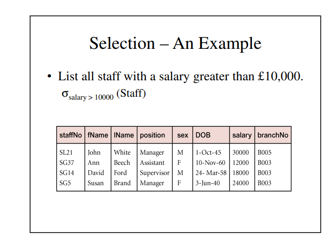
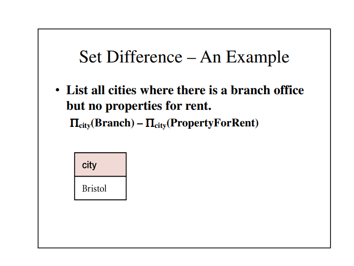
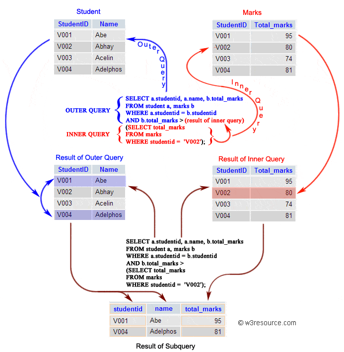

# SQL Certification

## 0. Overview

- Gain an understanding of schemas and different types of commands, maintenance and control of table, aliases, constraints and clauses, relational algebra, sub-queries and normalization, and joins and functions. Get an introduction to views and complex queries. Understand transactions, indexes, triggers, cursors, and stored procedures.

## 1. Introduction to SQL

### 1.1. What is a Database?

- A database is an organized collection of structured information, or data, typically stored electronically in a computer system. A database is usually controlled by a database management system (DBMS). Together, the data and the DBMS, along with the applications that are associated with them, are referred to as a database system, often shortened to just database.

- Data within the most common types of databases in operation today is typically modeled in rows and columns in a series of tables to make processing and data querying efficient. The data can then be easily accessed, managed, modified, updated, controlled, and organized. Most databases use structured query language (SQL) for writing and querying data.

### 1.2. Introduction to DBMS

- A database typically requires a comprehensive database software program known as a database management system (DBMS). A DBMS serves as an interface between the database and its end users or programs, allowing users to retrieve, update, and manage how the information is organized and optimized. A DBMS also facilitates oversight and control of databases, enabling a variety of administrative operations such as performance monitoring, tuning, and backup and recovery.

- Some examples of popular database software or DBMSs include MySQL, Microsoft Access, Microsoft SQL Server, FileMaker Pro, Oracle Database, and dBASE.

### 1.3. Advantages and Disadvantages of DBMS

- Advantages of Database

  - 1. Data Abstraction

    - Data abstraction means, to hide the complexity of data from the basic users.
    - DBMS abstracts the data from the users, which is not useful for the users. It shows only those data which are useful to the users.

  - 2. Controlling Data Redundancy

    - Data redundancy means having multiple copies of the same data.
    - DBMS controls the data redundancy and integrates all data into a single database file.
    - Controlling the data redundancy also helps to save our storage space and increase retrieval and update speed.

  - 3. Minimized Data inconsistency

    - Data inconsistency means that different files may contain different information about a particular object or person.
    - If DBMS has reduced the data redundancy then the database system leads the better data consistency.
    - Our data items appear only once (no redundancy) so the updated values are immediately available to all users.

  - 4. Data Manipulation Easily

    - In DBMS, Data can be manipulated easily, because data is centralized so once the data structure is defined, we can change in the data like- insertion, modification, or deletion.

  - 5. Data can be shared

    - Data can be shared easily by multiple applications in centralized DBMS. The applications can be developed without having to create any newly stored files.
    - The DBMS helps to develop a friendly environment where end-users can access and manage data.

  - 6. Data Security

    - Data is very important for any business organization. The more users access the data, the higher risks of data security breaches. If someone stole business data then it would be very bad for business. So a company will never want any outsider to come and access the company's data. The business organization invests plenty amount of time, effort, and money to ensure that its data are used by only authorized users.
    - DBMS provides data security means protecting your precious data from unauthorized access. Data can be accessed only by authorized users of the organization.
    - A database can be accessed only by proper authentication usually by verifying login and password.

  - 7. Support Multi-users Views

    - Multi-users can view the data at the same time.
    - Using the database, many users can access the data at the same time which increases our working speed.
    - DBMS gives the ability for its multiple authorized users to access the same database from different locations, in different ways, to complete its different works.

  - 8. Concurrent Access

    - Several users can access the database concurrently.

  - 9. Helps for Decision Making
    - Better organized data and improved data access give us better quality information which helps for making better decisions.

- Disadvantages of Database

  - 1. Cost of Hardware and Software

    - To run the DBMS software, we need a high-speed processor and a large memory size is required which causes expensive hardware is needed.

  - 2. Cost of Data Conversion

    - When a computer file-based system is replaced with a database system, then the data stored in data files must be converted into database files.
    - It is the difficult and time-consuming method to convert the data of data files into database.

  - 3. Cost of Staff Traning
    - DBMS are often complex systems, so training is required for the users to use the DBMS.
    - The organization has to be paid plenty of amount for the training of workers to run the database management system.

### 1.4. Types of Database Management Systems

- The main Four Types of Database Management Systems are:

  - Hierarchical database
  - Network database
  - Relational database
  - Object-Oriented database

- `Hierarchical DBMS`

  - In a Hierarchical database, model data is organized in a tree-like structure. Data is Stored Hierarchically (top-down or bottom-up) format. Data is represented using a parent-child relationship. In Hierarchical DBMS, parents may have many children, but children have only one parent.

- `Network Model`

  - The network database model allows each child to have multiple parents. It helps you to address the need to model more complex relationships like the orders/parts many-to-many relationship. In this model, entities are organized in a graph which can be accessed through several paths.

- `Relational Model`

  - Relational DBMS is the most widely used DBMS model because it is one of the easiest. This model is based on normalizing data in the rows and columns of the tables. Relational model is stored in fixed structures and manipulated using SQL.

- `Object-Oriented Model`
  - In the Object-oriented Model data is stored in the form of objects. The structure is called classes which display data within it. It is one of the components of DBMS that defines a database as a collection of objects that stores both data members’ values and operations.

### 1.5. Introdution to SQL

- `SQL` is a standard language for accessing and manipulating databases.

- What is SQL?

  - SQL stands for Structured Query Language
  - SQL lets you access and manipulate databases
  - SQL became a standard of the American National Standards Institute (ANSI) in 1986, and of the International Organization for Standardization (ISO) in 1987

- What Can SQL do?

  - SQL can execute queries against a database
  - SQL can retrieve data from a database
  - SQL can insert records in a database
  - SQL can update records in a database
  - SQL can delete records from a database
  - SQL can create new databases
  - SQL can create new tables in a database
  - SQL can create stored procedures in a database
  - SQL can create views in a database
  - SQL can set permissions on tables, procedures, and views

- SQL is a Standard - BUT....

  - Although SQL is an ANSI/ISO standard, there are different versions of the SQL language.

  - However, to be compliant with the ANSI standard, they all support at least the major commands (such as SELECT, UPDATE, DELETE, INSERT, WHERE) in a similar manner.

  - `Note`: Most of the SQL database programs also have their own proprietary extensions in addition to the SQL standard!

- Using SQL in Your Web Site

  - To build a web site that shows data from a database, you will need:

    - An RDBMS database program (i.e. MS Access, SQL Server, MySQL)
    - To use a server-side scripting language, like PHP or ASP
    - To use SQL to get the data you want
    - To use HTML / CSS to style the page

- RDBMS

  - RDBMS stands for Relational Database Management System.

  - RDBMS is the basis for SQL, and for all modern database systems such as MS SQL Server, IBM DB2, Oracle, MySQL, and Microsoft Access.

  - The data in RDBMS is stored in database objects called tables. A table is a collection of related data entries and it consists of columns and rows.

  - Example:

    ```
    SELECT * FROM Customers;
    ```

    | CustomerID | CustomerName                       | ContactName  | Address                       | City        | PostalCode | Country |
    | ---------- | ---------------------------------- | ------------ | ----------------------------- | ----------- | ---------- | ------- |
    | 1          | Alfreds Futterkiste                | Maria Anders | Obere Str. 57                 | Berlin      | 12209      | Germany |
    | 2          | Ana Trujillo Emparedados y helados | Ana Trujillo | Avda. de la Constitución 2222 | México D.F. | 05021      | Mexico  |

  - Every table is broken up into smaller entities called fields. The fields in the Customers table consist of CustomerID, CustomerName, ContactName, Address, City, PostalCode and Country. A field is a column in a table that is designed to maintain specific information about every record in the table.

  - A record, also called a row, is each individual entry that exists in a table. For example, there are 91 records in the above Customers table. A record is a horizontal entity in a table.

  - A column is a vertical entity in a table that contains all information associated with a specific field in a table.

### 1.6. History of SQL

- The SQL programming language was developed in the 1970s by IBM researchers Raymond Boyce and Donald Chamberlin. The programming language, known then as SEQUEL, was created following Edgar Frank Codd’s paper, “A Relational Model of Data for Large Shared Data Banks,” in 1970.

### 1.7. SQL Statement Classes

- `Data Definition Language (DDL) Statements`

  - Data definition language (DDL) statements let you to perform these tasks:

    - Create, alter, and drop schema objects
    - Grant and revoke privileges and roles
    - Analyze information on a table, index, or cluster
    - Establish auditing options
    - Add comments to the data dictionary

  - The `CREATE`, `ALTER`, and `DROP` commands require exclusive access to the specified object. For example, an `ALTER TABLE` statement fails if another user has an open transaction on the specified table.
  - The `GRANT`, `REVOKE`, `ANALYZE`, `AUDIT`, and `COMMENT` commands do not require exclusive access to the specified object. For example, you can analyze a table while other users are updating the table.
  - Oracle Database implicitly commits the current transaction before and after every DDL statement.

  - The DDL statements are:

    ```
    ALTER ... (All statements beginning with ALTER)
    ANALYZE
    ASSOCIATE STATISTICS
    AUDIT
    COMMENT
    CREATE ... (All statements beginning with CREATE)
    DISASSOCIATE STATISTICS
    DROP ... (All statements beginning with DROP)
    FLASHBACK ... (All statements beginning with FLASHBACK)
    GRANT
    NOAUDIT
    PURGE
    RENAME
    REVOKE
    TRUNCATE
    UNDROP
    ```

- `Data Manipulation Language (DML) Statements`

  - Data manipulation language (DML) statements access and manipulate data in existing schema objects. These statements do not implicitly commit the current transaction. The data manipulation language statements are:

    ```
    CALL
    DELETE
    EXPLAIN PLAN
    INSERT
    LOCK TABLE
    MERGE
    SELECT
    UPDATE
    ```

  - The `SELECT` statement is a limited form of DML statement in that it can only access data in the database. It cannot manipulate data in the database, although it can operate on the accessed data before returning the results of the query.
  - The `CALL` and `EXPLAIN PLAN` statements are supported in PL/SQL only when executed dynamically. All other DML statements are fully supported in PL/SQL.

- `Transaction Control Statements`

  - Transaction control statements manage changes made by DML statements. The transaction control statements are:

    ```
    COMMIT
    ROLLBACK
    SAVEPOINT
    SET TRANSACTION
    ```

  - All transaction control statements, except certain forms of the COMMIT and ROLLBACK commands, are supported in PL/SQL.

- `Session Control Statements`

  - Session control statements dynamically manage the properties of a user session. These statements do not implicitly commit the current transaction.

  - PL/SQL does not support session control statements. The session control statements are:

    ```
    ALTER SESSION
    SET ROLE
    ```

- `System Control Statement`

  - The single system control statement, `ALTER SYSTEM`, dynamically manages the properties of an Oracle Database instance. This statement does not implicitly commit the current transaction and is not supported in PL/SQL

- `Embedded SQL Statements`
  - Embedded SQL statements place DDL, DML, and transaction control statements within a procedural language program. Embedded SQL is supported by the Oracle precompilers

### 1.8. SQL Process

- About SQL Processing

  - `SQL processing` is the parsing, optimization, row source generation, and execution of a SQL statement. Depending on the statement, the database may omit some of these stages.

  - 

  - SQL Parsing

    - The first stage of SQL processing is `parsing`.
    - The parsing stage involves separating the pieces of a SQL statement into a data structure that other routines can process. The database parses a statement when instructed by the application, which means that only the application­, and not the database itself, can reduce the number of parses.
    - When an application issues a SQL statement, the application makes a `parse call` to the database to prepare the statement for execution. The parse call opens or creates a `cursor`, which is a handle for the session-specific `private SQL area` that holds a parsed SQL statement and other processing information. The cursor and private SQL area are in the program global area (PGA).
    - During the parse call, the database performs the following checks:
      - Syntax Check
      - Semantic Check
      - Shared Pool Check
    - The preceding checks identify the errors that can be found before statement execution. Some errors cannot be caught by parsing. For example, the database can encounter deadlocks or errors in data conversion only during statement execution.
    - Syntax Check

      - Oracle Database must check each SQL statement for syntactic validity.
      - A statement that breaks a rule for well-formed SQL syntax fails the check. For example, the following statement fails because the keyword FROM is misspelled as FORM:

        ```
        SQL> SELECT * FORM employees;
        SELECT * FORM employees
                *
        ERROR at line 1:
        ORA-00923: FROM keyword not found where expected
        ```

    - Semantic Check

      - The semantics of a statement are its meaning. A semantic check determines whether a statement is meaningful, for example, whether the objects and columns in the statement exist.
      - A syntactically correct statement can fail a semantic check, as shown in the following example of a query of a nonexistent table:

        ```
        SQL> SELECT * FROM nonexistent_table;
        SELECT * FROM nonexistent_table
                      *
        ERROR at line 1:
        ORA-00942: table or view does not exist
        ```

    - Shared Pool Check
      - During the parse, the database performs a shared pool check to determine whether it can skip resource-intensive steps of statement processing.
      - To this end, the database uses a hashing algorithm to generate a hash value for every SQL statement. The statement hash value is the SQL ID shown in V$SQL.SQL_ID. This hash value is deterministic within a version of Oracle Database, so the same statement in a single instance or in different instances has the same SQL ID.
      - When a user submits a SQL statement, the database searches the `shared SQL area` to see if an existing parsed statement has the same hash value. The hash value of a SQL statement is distinct from the following values:
        - Memory address for the statement
          - Oracle Database uses the SQL ID to perform a keyed read in a lookup table. In this way, the database obtains possible memory addresses of the statement.
        - Hash value of an `execution plan` for the statement
          - A SQL statement can have multiple plans in the shared pool. Typically, each plan has a different hash value. If the same SQL ID has multiple plan hash values, then the database knows that multiple plans exist for this SQL ID.
    - Parse operations fall into the following categories, depending on the type of statement submitted and the result of the hash check:

      - Hard parse

        - If Oracle Database cannot reuse existing code, then it must build a new executable version of the application code. This operation is known as a `hard parse`, or a `library cache miss`.
          - Note: The database always performs a hard parse of DDL.
        - During the hard parse, the database accesses the library cache and data dictionary cache numerous times to check the data dictionary. When the database accesses these areas, it uses a serialization device called a `latch` on required objects so that their definition does not change. Latch contention increases statement execution time and decreases concurrency.

      - Soft parse
        - A `soft parse` is any parse that is not a hard parse. If the submitted statement is the same as a reusable SQL statement in the shared pool, then Oracle Database reuses the existing code. This reuse of code is also called a `library cache hit`.
        - Soft parses can vary in how much work they perform. For example, configuring the session shared SQL area can sometimes reduce the amount of latching in the soft parses, making them "softer."
      - In general, a soft parse is preferable to a hard parse because the database skips the optimization and row source generation steps, proceeding straight to execution.

      - 
      - If a check determines that a statement in the shared pool has the same hash value, then the database performs semantic and environment checks to determine whether the statements have the same meaning. Identical syntax is not sufficient. For example, suppose two different users log in to the database and issue the following SQL statements:

        ```
        CREATE TABLE my_table ( some_col INTEGER );
        SELECT * FROM my_table;
        ```

        - The SELECT statements for the two users are syntactically identical, but two separate schema objects are named my_table. This semantic difference means that the second statement cannot reuse the code for the first statement.
        - Even if two statements are semantically identical, an environmental difference can force a hard parse. In this context, the `optimizer environment` is the totality of session settings that can affect execution plan generation, such as the work area size or optimizer settings (for example, the optimizer mode). Consider the following series of SQL statements executed by a single user:

          ```
          ALTER SESSION SET OPTIMIZER_MODE=ALL_ROWS;
          ALTER SYSTEM FLUSH SHARED_POOL;               # optimizer environment 1
          SELECT * FROM sh.sales;

          ALTER SESSION SET OPTIMIZER_MODE=FIRST_ROWS;  # optimizer environment 2
          SELECT * FROM sh.sales;

          ALTER SESSION SET SQL_TRACE=true;             # optimizer environment 3
          SELECT * FROM sh.sales;
          ```

          - In the preceding example, the same SELECT statement is executed in three different optimizer environments. Consequently, the database creates three separate shared SQL areas for these statements and forces a hard parse of each statement.

  - SQL Optimization

    - During the optimization stage, Oracle Database must perform a hard parse at least once for every unique DML statement and performs the optimization during this parse.

    - The database never optimizes DDL unless it includes a DML component such as a subquery that requires optimization.

  - SQL Row Source Generation

    - The `row source generator` is software that receives the optimal execution plan from the optimizer and produces an iterative execution plan that is usable by the rest of the database.

    - The iterative plan is a binary program that, when executed by the SQL engine, produces the result set. The plan takes the form of a combination of steps. Each step returns a `row set`. The next step either uses the rows in this set, or the last step returns the rows to the application issuing the SQL statement.

    - A `row source` is a row set returned by a step in the execution plan along with a control structure that can iteratively process the rows. The row source can be a table, view, or result of a join or grouping operation.

    - The row source generator produces a `row source tree`, which is a collection of row sources. The row source tree shows the following information:

      - An ordering of the tables referenced by the statement

      - An access method for each table mentioned in the statement

      - A join method for tables affected by join operations in the statement

      - Data operations such as filter, sort, or aggregation

    - Example 3-1 Execution Plan

      - This example shows the execution plan of a `SELECT` statement when `AUTOTRACE` is enabled. The statement selects the last name, job title, and department name for all employees whose last names begin with the letter A. The execution plan for this statement is the output of the row source generator.

        ```
        SELECT e.last_name, j.job_title, d.department_name
        FROM   hr.employees e, hr.departments d, hr.jobs j
        WHERE  e.department_id = d.department_id
        AND    e.job_id = j.job_id
        AND    e.last_name LIKE 'A%';

        Execution Plan
        ----------------------------------------------------------
        Plan hash value: 975837011

        --------------------------------------------------------------------------------
        | Id| Operation                     | Name        |Rows|Bytes|Cost(%CPU)|Time  |
        --------------------------------------------------------------------------------
        | 0 | SELECT STATEMENT              |             |  3 | 189 | 7(15)| 00:00:01 |
        |*1 |  HASH JOIN                    |             |  3 | 189 | 7(15)| 00:00:01 |
        |*2 |   HASH JOIN                   |             |  3 | 141 | 5(20)| 00:00:01 |
        | 3 |    TABLE ACCESS BY INDEX ROWID| EMPLOYEES   |  3 |  60 | 2 (0)| 00:00:01 |
        |*4 |     INDEX RANGE SCAN          | EMP_NAME_IX |  3 |     | 1 (0)| 00:00:01 |
        | 5 |    TABLE ACCESS FULL          | JOBS        | 19 | 513 | 2 (0)| 00:00:01 |
        | 6 |   TABLE ACCESS FULL           | DEPARTMENTS | 27 | 432 | 2 (0)| 00:00:01 |
        --------------------------------------------------------------------------------

        Predicate Information (identified by operation id):
        ---------------------------------------------------

          1 - access("E"."DEPARTMENT_ID"="D"."DEPARTMENT_ID")
          2 - access("E"."JOB_ID"="J"."JOB_ID")
          4 - access("E"."LAST_NAME" LIKE 'A%')
              filter("E"."LAST_NAME" LIKE 'A%')
        ```

  - SQL Execution

    - During execution, the SQL engine executes each row source in the tree produced by the row source generator. This step is the only mandatory step in DML processing.
    - `Figure 3-3` is an `execution tree`, also called a _parse tree_, that shows the flow of row sources from one step to another in the plan in `Example 3-1`. In general, the order of the steps in execution is the _reverse_ of the order in the plan, so you read the plan from the bottom up.
    - Each step in an execution plan has an ID number. The numbers in `Figure 3-3` correspond to the Id column in the plan shown in `Example 3-1`. Initial spaces in the `Operation` column of the plan indicate hierarchical relationships. For example, if the name of an operation is preceded by two spaces, then this operation is a child of an operation preceded by one space. Operations preceded by one space are children of the `SELECT` statement itself.

    - Figure 3-3 Row Source Tree

      - 

    - In Figure 3-3, each node of the tree acts as a row source, which means that each step of the execution plan in `Example 3-1` either retrieves rows from the database or accepts rows from one or more row sources as input. The SQL engine executes each row source as follows:

      - Steps indicated by the black boxes physically retrieve data from an object in the database. These steps are the access paths, or techniques for retrieving data from the database.

        - Step 6 uses a full table scan to retrieve all rows from the departments table.

        - Step 5 uses a full table scan to retrieve all rows from the jobs table.

        - Step 4 scans the `emp_name_ix` index in order, looking for each key that begins with the letter A and retrieving the corresponding rowid. For example, the rowid corresponding to `Atkinson` is `AAAPzRAAFAAAABSAAe`.

        - Step 3 retrieves from the `employees` table the rows whose rowids were returned by Step 4. For example, the database uses rowid `AAAPzRAAFAAAABSAAe` to retrieve the row for `Atkinson`.

      - Steps indicated by the clear boxes operate on row sources.

        - Step 2 performs a `hash join`, accepting row sources from Steps 3 and 5, joining each row from the Step 5 row source to its corresponding row in Step 3, and returning the resulting rows to Step 1.

          - For example, the row for employee `Atkinson` is associated with the job name `Stock Clerk`.

        - Step 1 performs another hash join, accepting row sources from Steps 2 and 6, joining each row from the Step 6 source to its corresponding row in Step 2, and returning the result to the client.

          - For example, the row for employee `Atkinson` is associated with the department named `Shipping`.

    - In some execution plans the steps are iterative and in others sequential. The hash join shown in `Example 3-1` is sequential. The database completes the steps in their entirety based on the join order. The database starts with the index range scan of `emp_name_ix`. Using the rowids that it retrieves from the index, the database reads the matching rows in the `employees` table, and then scans the jobs table. After it retrieves the rows from the jobs table, the database performs the hash join.

    - During execution, the database reads the data from disk into memory if the data is not in memory. The database also takes out any locks and latches necessary to ensure data integrity and logs any changes made during the SQL execution. The final stage of processing a SQL statement is closing the cursor.

- How Oracle Database Processes DML

  - Most DML statements have a query component. In a query, execution of a cursor places the results of the query into a set of rows called the `result set`.

  - How Row Sets Are Fetched

    - Result set rows can be fetched either a row at a time or in groups.

    - In the fetch stage, the database selects rows and, if requested by the query, orders the rows. Each successive fetch retrieves another row of the result until the last row has been fetched.

    - In general, the database cannot determine for certain the number of rows to be retrieved by a query until the last row is fetched. Oracle Database retrieves the data in response to fetch calls, so that the more rows the database reads, the more work it performs. For some queries the database returns the first row as quickly as possible, whereas for others it creates the entire result set before returning the first row.

  - Read Consistency

    - In general, a query retrieves data by using the Oracle Database read consistency mechanism, which guarantees that all data blocks read by a query are consistent to a single point in time.

    - Read consistency uses undo data to show past versions of data. For an example, suppose a query must read 100 data blocks in a full table scan. The query processes the first 10 blocks while DML in a different session modifies block 75. When the first session reaches block 75, it realizes the change and uses undo data to retrieve the old, unmodified version of the data and construct a noncurrent version of block 75 in memory.

  - Data Changes

    - DML statements that must change data use read consistency to retrieve only the data that matched the search criteria when the modification began.

    - Afterward, these statements retrieve the data blocks as they exist in their current state and make the required modifications. The database must perform other actions related to the modification of the data such as generating redo and undo data.

  - How Oracle Database Processes DDL

    - Oracle Database processes DDL differently from DML.

      - For example, when you create a table, the database does not optimize the CREATE TABLE statement. Instead, Oracle Database parses the DDL statement and carries out the command.

      - The database processes DDL differently because it is a means of defining an object in the data dictionary. Typically, Oracle Database must parse and execute many `recursive SQL` statements to execute a DDL statement. Suppose you create a table as follows:

        ```
        CREATE TABLE mytable (mycolumn INTEGER);
        ```

      - Typically, the database would run dozens of recursive statements to execute the preceding statement. The recursive SQL would perform actions such as the following:

        - Issue a `COMMIT` before executing the `CREATE TABLE` statement

        - Verify that user privileges are sufficient to create the table

        - Determine which tablespace the table should reside in

        - Ensure that the tablespace quota has not been exceeded

        - Ensure that no object in the schema has the same name

        - Insert rows that define the table into the data dictionary

        - Issue a `COMMIT` if the DDL statement succeeded or a `ROLLBACK` if it did not

### 1.9. SQL Language Elements and PL/SQL

#### 1.9.1. ACCESSIBLE BY Clause

- The `ACCESSIBLE BY` clause restricts access to a unit or subprogram by other units.

- Examples:

  ```
  PROCEDURE top_protected_proc
    ACCESSIBLE BY (PROCEDURE top_trusted_proc)
  AS
  BEGIN
    DBMS_OUTPUT.PUT_LINE('Executed top_protected_proc.');
  END;

  PROCEDURE top_trusted_proc AS
  BEGIN
    DBMS_OUTPUT.PUT_LINE('top_trusted_proc calls top_protected_proc');
    top_protected_proc;
  END;


  EXEC top_trusted_proc;
  top_trusted_proc calls top_protected_proc
  Executed top_protected_proc.


  EXEC top_protected_proc;
  BEGIN top_protected_proc; END;

  PLS-00904: insufficient privilege to access object TOP_PROTECTED_PROC

  ```

#### 1.9.2. AGGREGATE Clause

- Identifies the function as an `aggregate function`, or one that evaluates a group of rows and returns a single row.

  - You can specify aggregate functions in the select list, HAVING clause, and ORDER BY clause.

- _Example 13-33 Pipelined Table Function as Aggregate Function_

  ```
  DROP TABLE gradereport;
  CREATE TABLE gradereport (
    student VARCHAR2(30),
    subject VARCHAR2(30),
    weight NUMBER,
    grade NUMBER
  );

  INSERT INTO gradereport (student, subject, weight, grade)
  VALUES ('Mark', 'Physics', 4, 4);

  INSERT INTO gradereport (student, subject, weight, grade)
  VALUES ('Mark','Chemistry', 4, 3);

  INSERT INTO gradereport (student, subject, weight, grade)
  VALUES ('Mark','Maths', 3, 3);

  INSERT INTO gradereport (student, subject, weight, grade)
  VALUES ('Mark','Economics', 3, 4);
  ```

  ```
  CREATE PACKAGE pkg_gpa AUTHID DEFINER IS
    TYPE gpa IS TABLE OF NUMBER;
    FUNCTION weighted_average(input_values SYS_REFCURSOR)
      RETURN gpa PIPELINED;
  END pkg_gpa;

  CREATE PACKAGE BODY pkg_gpa IS
    FUNCTION weighted_average (input_values SYS_REFCURSOR)
      RETURN gpa PIPELINED
    IS
      grade         NUMBER;
      total         NUMBER := 0;
      total_weight  NUMBER := 0;
      weight        NUMBER := 0;
    BEGIN
      LOOP
        FETCH input_values INTO weight, grade;
        EXIT WHEN input_values%NOTFOUND;
        total_weight := total_weight + weight;  -- Accumulate weighted average
        total := total + grade*weight;
      END LOOP;
      PIPE ROW (total / total_weight);
      RETURN; -- returns single result
    END weighted_average;
  END pkg_gpa;
  ```

  - This query shows how the table function can be invoked without the optional TABLE operator.

    ```
    SELECT w.column_value "weighted result"
    FROM pkg_gpa.weighted_average (
        CURSOR (SELECT weight, grade FROM gradereport)
      ) w;
    ```

  - Result:

    ```
    weighted result
    ---------------
                3.5

    1 row selected.
    ```

#### 1.9.3. Assignment Statement

- The assignment statement sets the value of a data item to a valid value.

- _Example 3-24 Assigning Values to Variables with Assignment Statement_

  - This example declares several variables (specifying initial values for some) and then uses assignment statements to assign the values of expressions to them.

  ```
  DECLARE  -- You can assign initial values here
    wages          NUMBER;
    hours_worked   NUMBER := 40;
    hourly_salary  NUMBER := 22.50;
    bonus          NUMBER := 150;
    country        VARCHAR2(128);
    counter        NUMBER := 0;
    done           BOOLEAN;
    valid_id       BOOLEAN;
    emp_rec1       employees%ROWTYPE;
    emp_rec2       employees%ROWTYPE;
    TYPE commissions IS TABLE OF NUMBER INDEX BY PLS_INTEGER;
    comm_tab       commissions;

  BEGIN  -- You can assign values here too
    wages := (hours_worked * hourly_salary) + bonus;
    country := 'France';
    country := UPPER('Canada');
    done := (counter > 100);
    valid_id := TRUE;
    emp_rec1.first_name := 'Antonio';
    emp_rec1.last_name := 'Ortiz';
    emp_rec1 := emp_rec2;
    comm_tab(5) := 20000 * 0.15;
  END;
  /
  ```

#### 1.9.4. AUTONOMOUS_TRANSACTION Pragma

- The `AUTONOMOUS_TRANSACTION` pragma marks a routine as `autonomous`; that is, independent of the main transaction.

- _Example 7-43 Declaring Autonomous Function in Package_

  - This example marks a package function as autonomous.

  ```
  CREATE OR REPLACE PACKAGE emp_actions AUTHID DEFINER AS  -- package specification
    FUNCTION raise_salary (emp_id NUMBER, sal_raise NUMBER)
    RETURN NUMBER;
  END emp_actions;
  /
  CREATE OR REPLACE PACKAGE BODY emp_actions AS  -- package body
    -- code for function raise_salary
    FUNCTION raise_salary (emp_id NUMBER, sal_raise NUMBER)
    RETURN NUMBER IS
      PRAGMA AUTONOMOUS_TRANSACTION;
      new_sal NUMBER(8,2);
    BEGIN
      UPDATE employees SET salary =
        salary + sal_raise WHERE employee_id = emp_id;
      COMMIT;
      SELECT salary INTO new_sal FROM employees
        WHERE employee_id = emp_id;
      RETURN new_sal;
    END raise_salary;
  END emp_actions;
  /
  ```

#### 1.9.5. Basic LOOP Statement

- With each iteration of the basic `LOOP` statement, its statements run and control returns to the top of the loop. The `LOOP` statement ends when a statement inside the loop transfers control outside the loop or raises an exception.

- _Example 14-4 Nested, Labeled Basic LOOP Statements with EXIT WHEN Statements_

  - In this example, one basic `LOOP` statement is nested inside the other, and both have labels. The inner loop has two `EXIT WHEN` statements; one that exits the inner loop and one that exits the outer loop.

  ```
  DECLARE
    s  PLS_INTEGER := 0;
    i  PLS_INTEGER := 0;
    j  PLS_INTEGER;
  BEGIN
    <<outer_loop>>
    LOOP
      i := i + 1;
      j := 0;
      <<inner_loop>>
      LOOP
        j := j + 1;
        s := s + i * j; -- Sum several products
        EXIT inner_loop WHEN (j > 5);
        EXIT outer_loop WHEN ((i * j) > 15);
      END LOOP inner_loop;
    END LOOP outer_loop;
    DBMS_OUTPUT.PUT_LINE
      ('The sum of products equals: ' || TO_CHAR(s));
  END;
  /
  ```

#### 1.9.6. Block

- The `block`, which groups related declarations and statements, is the basic unit of a PL/SQL source program.

- _Example 2-1 PL/SQL Block Structure_

  - This example shows the basic structure of a PL/SQL block.

  ```
  << label >> (optional)
  DECLARE    -- Declarative part (optional)
    -- Declarations of local types, variables, & subprograms

  BEGIN      -- Executable part (required)
    -- Statements (which can use items declared in declarative part)

  [EXCEPTION -- Exception-handling part (optional)
    -- Exception handlers for exceptions (errors) raised in executable part]
  END;
  ```

#### 1.9.7. Call Specification

- A `call specification` declares a Java method or a C language subprogram so that it can be invoked from PL/SQL. You can also use the SQL `CALL` statement to invoke such a method or subprogram.

- _Example 14-6 External Function Example_

  - The hypothetical following statement creates a PL/SQL standalone function `get_val` that registers the C subprogram `c_get_val` as an external function. (The parameters have been omitted from this example.)

  ```
  CREATE FUNCTION get_val
   ( x_val IN NUMBER,
    y_val IN NUMBER,
    image IN LONG RAW )
   RETURN BINARY_INTEGER AS LANGUAGE C
      NAME "c_get_val"
      LIBRARY c_utils
      PARAMETERS (...);
  ```

#### 1.9.8. CASE Statement

- The `CASE` statement chooses from a sequence of conditions and runs a corresponding statement.

- _Example 4-2 Printing BOOLEAN Values_

  - In this example, the procedure accepts a `BOOLEAN` parameter and uses a `CASE` statement to print `Unknown` if the value of the parameter is `NULL`, `Yes` if it is `TRUE`, and `No` if it is `FALSE`.

  ```
  PROCEDURE print_boolean (b BOOLEAN)
  AS
  BEGIN
    DBMS_OUTPUT.PUT_LINE (
      CASE
        WHEN b IS NULL THEN 'Unknown'
        WHEN b THEN 'Yes'
        WHEN NOT b THEN 'No'
      END
    );
  END;

  BEGIN
    print_boolean(TRUE);
    print_boolean(FALSE);
    print_boolean(NULL);
  END;
  ```

  - Result:

    ```
    Yes
    No
    Unknown
    ```

#### 1.9.9. CLOSE Statement

- The `CLOSE` statement closes a named cursor, freeing its resources for reuse.

- _Example 7-6 FETCH Statements Inside LOOP Statements_

  ```
  DECLARE
    CURSOR c1 IS
      SELECT last_name, job_id FROM employees
      WHERE REGEXP_LIKE (job_id, 'S[HT]_CLERK')
      ORDER BY last_name;

    v_lastname  employees.last_name%TYPE;  -- variable for last_name
    v_jobid     employees.job_id%TYPE;     -- variable for job_id

    CURSOR c2 IS
      SELECT * FROM employees
      WHERE REGEXP_LIKE (job_id, '[ACADFIMKSA]_M[ANGR]')
      ORDER BY job_id;

    v_employees employees%ROWTYPE;  -- record variable for row of table

  BEGIN
    OPEN c1;
    LOOP  -- Fetches 2 columns into variables
      FETCH c1 INTO v_lastname, v_jobid;
      EXIT WHEN c1%NOTFOUND;
      DBMS_OUTPUT.PUT_LINE( RPAD(v_lastname, 25, ' ') || v_jobid );
    END LOOP;
    CLOSE c1;
    DBMS_OUTPUT.PUT_LINE( '-------------------------------------' );

    OPEN c2;
    LOOP  -- Fetches entire row into the v_employees record
      FETCH c2 INTO v_employees;
      EXIT WHEN c2%NOTFOUND;
      DBMS_OUTPUT.PUT_LINE( RPAD(v_employees.last_name, 25, ' ') ||
                                v_employees.job_id );
    END LOOP;
    CLOSE c2;
  END;
  /
  ```

  - Result:

    ```
    Atkinson                 ST_CLERK
    Bell                     SH_CLERK
    Bissot                   ST_CLERK
    ...
    Walsh                    SH_CLERK
    -------------------------------------
    Higgins                  AC_MGR
    Greenberg                FI_MGR
    Hartstein                MK_MAN
    ...
    Zlotkey                  SA_MAN
    ```

#### 1.9.10. Collection Method Invocation

- A collection method is a PL/SQL subprogram that either returns information about a collection or operates on a collection.

- _Example 6-23 DELETE Method with Nested Table_

  - This example declares a nested table variable, initializing it with six elements; deletes and then restores the second element; deletes a range of elements and then restores one of them; and then deletes all elements. The restored elements occupy the same memory as the corresponding deleted elements. The procedure print_nt prints the nested table variable after initialization and after each `DELETE` operation. The type `nt_type` and procedure `print_nt` are defined in Example 6-6.

  ```
  DECLARE
    nt nt_type := nt_type(11, 22, 33, 44, 55, 66);
  BEGIN
    print_nt(nt);

    nt.DELETE(2);     -- Delete second element
    print_nt(nt);

    nt(2) := 2222;    -- Restore second element
    print_nt(nt);

    nt.DELETE(2, 4);  -- Delete range of elements
    print_nt(nt);

    nt(3) := 3333;    -- Restore third element
    print_nt(nt);

    nt.DELETE;        -- Delete all elements
    print_nt(nt);
  END;
  /
  ```

  - Result:

    ```
    nt.(1) = 11
    nt.(2) = 22
    nt.(3) = 33
    nt.(4) = 44
    nt.(5) = 55
    nt.(6) = 66
    ---
    nt.(1) = 11
    nt.(3) = 33
    nt.(4) = 44
    nt.(5) = 55
    nt.(6) = 66
    ---
    nt.(1) = 11
    nt.(2) = 2222
    nt.(3) = 33
    nt.(4) = 44
    nt.(5) = 55
    nt.(6) = 66
    ---
    nt.(1) = 11
    nt.(5) = 55
    nt.(6) = 66
    ---
    nt.(1) = 11
    nt.(3) = 3333
    nt.(5) = 55
    nt.(6) = 66
    ---
    nt is empty
    ---
    ```

#### 1.9.11. Collection Variable Declaration

- A `collection variable` is a composite variable whose internal components, called elements, have the same data type.

- _Example 6-1 Associative Array Indexed by String_

  - This example defines a type of associative array indexed by string, declares a variable of that type, populates the variable with three elements, changes the value of one element, and prints the values (in sort order, not creation order). (`FIRST` and `NEXT` are collection methods, described in "Collection Methods".)

  ```
  DECLARE
    -- Associative array indexed by string:

    TYPE population IS TABLE OF NUMBER  -- Associative array type
      INDEX BY VARCHAR2(64);            --  indexed by string

    city_population  population;        -- Associative array variable
    i  VARCHAR2(64);                    -- Scalar variable

  BEGIN
    -- Add elements (key-value pairs) to associative array:

    city_population('Smallville')  := 2000;
    city_population('Midland')     := 750000;
    city_population('Megalopolis') := 1000000;

    -- Change value associated with key 'Smallville':

    city_population('Smallville') := 2001;

    -- Print associative array:

    i := city_population.FIRST;  -- Get first element of array

    WHILE i IS NOT NULL LOOP
      DBMS_Output.PUT_LINE
        ('Population of ' || i || ' is ' || city_population(i));
      i := city_population.NEXT(i);  -- Get next element of array
    END LOOP;
  END;
  /

  ```

#### 1.9.12. Comment

- A comment is source program text that the PL/SQL compiler ignores. Its primary purpose is to document code, but you can also use it to disable obsolete or unfinished pieces of code (that is, you can turn the code into comments). PL/SQL has both single-line and multiline comments.

- _Example 3-6 Single-Line Comments_

  ```
  DECLARE
    howmany     NUMBER;
    num_tables  NUMBER;
  BEGIN
    -- Begin processing
    SELECT COUNT(*) INTO howmany
    FROM USER_OBJECTS
    WHERE OBJECT_TYPE = 'TABLE'; -- Check number of tables
    num_tables := howmany;       -- Compute another value
  END;
  /

  ```

- _Example 3-7 Multiline Comments_

  ```
  DECLARE
    some_condition  BOOLEAN;
    pi              NUMBER := 3.1415926;
    radius          NUMBER := 15;
    area            NUMBER;
  BEGIN
    /* Perform some simple tests and assignments */

    IF 2 + 2 = 4 THEN
      some_condition := TRUE;
    /* We expect this THEN to always be performed */
    END IF;

    /* This line computes the area of a circle using pi,
    which is the ratio between the circumference and diameter.
    After the area is computed, the result is displayed. */

    area := pi * radius**2;
    DBMS_OUTPUT.PUT_LINE('The area is: ' || TO_CHAR(area));
  END;
  /

  ```

#### 1.9.13. COMPILE Clause

- The compile clause explicitly recompiles a stored unit that has become invalid, thus eliminating the need for implicit runtime recompilation and preventing associated runtime compilation errors and performance overhead.

#### 1.9.14. Constant Declaration

- A constant holds a value that does not change. A constant declaration specifies the name, data type, and value of the constant and allocates storage for it. The declaration can also impose the `NOT NULL` constraint.

- _Example 3-12 Constant Declarations_

  - This example declares three constants with scalar data types.

  ```
  DECLARE
    credit_limit     CONSTANT REAL    := 5000.00;  -- SQL data type
    max_days_in_year CONSTANT INTEGER := 366;      -- SQL data type
    urban_legend     CONSTANT BOOLEAN := FALSE;    -- PL/SQL-only data type
  BEGIN
    NULL;
  END;
  /
  ```

#### 1.9.15. CONTINUE Statement

- The `CONTINUE` statement exits the current iteration of a loop, either conditionally or unconditionally, and transfers control to the next iteration of either the current loop or an enclosing labeled loop.

- _Example 14-7 CONTINUE Statement in Basic LOOP Statement_

  - In this example, the CONTINUE statement inside the basic LOOP statement transfers control unconditionally to the next iteration of the current loop.

  ```
  DECLARE
    x NUMBER := 0;
  BEGIN
    LOOP -- After CONTINUE statement, control resumes here
      DBMS_OUTPUT.PUT_LINE ('Inside loop:  x = ' || TO_CHAR(x));
      x := x + 1;
      IF x < 3 THEN
        CONTINUE;
      END IF;
      DBMS_OUTPUT.PUT_LINE
        ('Inside loop, after CONTINUE:  x = ' || TO_CHAR(x));
      EXIT WHEN x = 5;
    END LOOP;

    DBMS_OUTPUT.PUT_LINE (' After loop:  x = ' || TO_CHAR(x));
  END;
  /

  ```

  - Result:

    ```
    Inside loop:  x = 0
    Inside loop:  x = 1
    Inside loop:  x = 2
    Inside loop, after CONTINUE:  x = 3
    Inside loop:  x = 3
    Inside loop, after CONTINUE:  x = 4
    Inside loop:  x = 4
    Inside loop, after CONTINUE:  x = 5
    After loop:  x = 5
    ```

#### 1.9.16. COVERAGE Pragma

- The `COVERAGE` pragma marks PL/SQL code which is infeasible to test for coverage. These marks improve coverage metric accuracy.

- _Example 14-9 Marking a Single Basic Block as Infeasible to Test for Coverage_

  - This example shows the placement of the pragma `COVERAGE` preceding the assignments to z and zl basic blocks. These two basic blocks will be ignored for coverage calculation. The first `COVERAGE` pragma (marked 1) marks the first assignment to z infeasible; the second (marked 2) marks the third assignment to z. In each case, the affected basic block runs from the identifier z to the following `END IF`.

  ```
  IF (x>0) THEN
    y :=2;
  ELSE
    PRAGMA COVERAGE (’NOT_FEASIBLE’);  -- 1
    z:=3;
  END IF;
  IF (y>0) THEN
    z :=2;
  ELSE
    PRAGMA COVERAGE (’NOT_FEASIBLE’); -- 2
    z :=3;
  END IF;
  ```

#### 1.9.17. Cursor FOR LOOP Statement

- The cursor `FOR LOOP` statement implicitly declares its loop index as a record variable of the row type that a specified cursor returns, and then opens a cursor.

- _Example 7-18 Implicit Cursor FOR LOOP Statement_

  - In this example, an implicit cursor `FOR LOOP` statement prints the last name and job ID of every clerk whose manager has an ID greater than 120.

  ```
  BEGIN
    FOR item IN (
      SELECT last_name, job_id
      FROM employees
      WHERE job_id LIKE '%CLERK%'
      AND manager_id > 120
      ORDER BY last_name
    )
    LOOP
      DBMS_OUTPUT.PUT_LINE
        ('Name = ' || item.last_name || ', Job = ' || item.job_id);
    END LOOP;
  END;
  /
  ```

  - Result:
    ```
    Name = Atkinson, Job = ST_CLERK
    Name = Bell, Job = SH_CLERK
    Name = Bissot, Job = ST_CLERK
    ...
    Name = Walsh, Job = SH_CLERK
    ```

- _Example 7-19 Explicit Cursor FOR LOOP Statement_

  - This example is like Example 7-18, except that it uses an explicit cursor FOR LOOP statement.

  ```
  DECLARE
    CURSOR c1 IS
      SELECT last_name, job_id FROM employees
      WHERE job_id LIKE '%CLERK%' AND manager_id > 120
      ORDER BY last_name;
  BEGIN
    FOR item IN c1
    LOOP
      DBMS_OUTPUT.PUT_LINE
        ('Name = ' || item.last_name || ', Job = ' || item.job_id);
    END LOOP;
  END;
  /
  ```

#### 1.9.18. Cursor Variable Declaration

- A cursor variable is like an explicit cursor that is not limited to one query.

  - To create a cursor variable, either declare a variable of the predefined type `SYS_REFCURSOR` or define a `REF CURSOR` type and then declare a variable of that type.

- _Example 7-24 Cursor Variable Declarations_

  - This example defines strong and weak `REF CURSOR` types, variables of those types, and a variable of the predefined type `SYS_REFCURSOR`.

  ```
  DECLARE
    TYPE empcurtyp IS REF CURSOR RETURN employees%ROWTYPE;  -- strong type
    TYPE genericcurtyp IS REF CURSOR;                       -- weak type

    cursor1  empcurtyp;       -- strong cursor variable
    cursor2  genericcurtyp;   -- weak cursor variable
    my_cursor SYS_REFCURSOR;  -- weak cursor variable

    TYPE deptcurtyp IS REF CURSOR RETURN departments%ROWTYPE;  -- strong type
    dept_cv deptcurtyp;  -- strong cursor variable
  BEGIN
    NULL;
  END;
  /

  ```

#### 1.9.19. Datatype Attribute

- The data type attribute of an ADT element.
  - A `datatype` allows you to declare the data type of record variables fields, constants, functions return value, collection variables and collection types elements.

#### 1.9.20. DEFAULT COLLATION Clause

- Collation (also called sort ordering) determines if a character string equals, precedes, or follows another string when the two strings are compared and sorted. Oracle Database collations order strings following rules for sorted text used in different languages.

#### 1.9.21. DELETE Statement Extension

- The PL/SQL extension to the _`where_clause`_ of the SQL `DELETE` statement lets you specify a `CURRENT OF` clause, which restricts the `DELETE` statement to the current row of the specified cursor.

#### 1.9.22. DEPRECATE Pragma

- The `DEPRECATE` pragma marks a PL/SQL element as deprecated. The compiler issues warnings for uses of pragma `DEPRECATE` or of deprecated elements.

- _Example 14-13 Enabling the Deprecation Warnings_

  - This example shows how to set the PLSQL_WARNINGS parameter to enable these warnings in a session.

  ```
  ALTER SESSION SET PLSQL_WARNINGS='ENABLE:(6019,6020,6021,6022)';
  ```

- _Example 14-14 Deprecation of a PL/SQL Package_

  - This example shows the deprecation of a PL/SQL package as a whole. Warnings will be issued for any reference to package pack1, and to the procedures foo and bar when used outside of the package and its body.

  ```
  PACKAGE pack1 AS
  PRAGMA DEPRECATE(pack1);
    PROCEDURE foo;
    PROCEDURE bar;
  END pack1;

  ```

#### 1.9.23. DETERMINISTIC Clause

- The deterministic option marks a function that returns predictable results and has no side effects.

#### 1.9.24. Element Specification

- An element specification specifies each attribute of the ADT.

#### 1.9.25. EXCEPTION_INIT Pragma

- The `EXCEPTION_INIT` pragma associates a user-defined exception name with an error code.

- _Example 12-5 Naming Internally Defined Exception_

  ```
  DECLARE
    deadlock_detected EXCEPTION;
    PRAGMA EXCEPTION_INIT(deadlock_detected, -60);
  BEGIN
    ...
  EXCEPTION
    WHEN deadlock_detected THEN
      ...
  END;
  /
  ```

#### 1.9.26. Exception Declaration

- An exception declaration declares the name of a user-defined exception.
- _Example 12-5 Naming Internally Defined Exception_
  - the same as above

#### 1.9.27. Exception Handler

- An exception handler processes a raised exception.
- _Example 12-3 Single Exception Handler for Multiple Exceptions_

  ```
  CREATE OR REPLACE PROCEDURE select_item (
    t_column VARCHAR2,
    t_name   VARCHAR2
  ) AUTHID DEFINER
  IS
    temp VARCHAR2(30);
  BEGIN
    temp := t_column;  -- For error message if next SELECT fails

    -- Fails if table t_name does not have column t_column:

    SELECT COLUMN_NAME INTO temp
    FROM USER_TAB_COLS
    WHERE TABLE_NAME = UPPER(t_name)
    AND COLUMN_NAME = UPPER(t_column);

    temp := t_name;  -- For error message if next SELECT fails

    -- Fails if there is no table named t_name:

    SELECT OBJECT_NAME INTO temp
    FROM USER_OBJECTS
    WHERE OBJECT_NAME = UPPER(t_name)
    AND OBJECT_TYPE = 'TABLE';

  EXCEPTION
    WHEN NO_DATA_FOUND THEN
      DBMS_OUTPUT.PUT_LINE ('No Data found for SELECT on ' || temp);
    WHEN OTHERS THEN
      DBMS_OUTPUT.PUT_LINE ('Unexpected error');
      RAISE;
  END;
  /

  ```

#### 1.9.28. EXECUTE IMMEDIATE Statement

- The `EXECUTE IMMEDIATE` statement builds and runs a dynamic SQL statement in a single operation.

- _Example 8-1 Invoking Subprogram from Dynamic PL/SQL Block_

  - In this example, the dynamic PL/SQL block is an anonymous PL/SQL block that invokes a subprogram created at schema level.

  ```
  -- Subprogram that dynamic PL/SQL block invokes:
  CREATE OR REPLACE PROCEDURE create_dept (
    deptid IN OUT NUMBER,
    dname  IN     VARCHAR2,
    mgrid  IN     NUMBER,
    locid  IN     NUMBER
  ) AUTHID DEFINER AS
  BEGIN
    deptid := departments_seq.NEXTVAL;

    INSERT INTO departments (
      department_id,
      department_name,
      manager_id,
      location_id
    )
    VALUES (deptid, dname, mgrid, locid);
  END;
  /
  DECLARE
    plsql_block VARCHAR2(500);
    new_deptid  NUMBER(4);
    new_dname   VARCHAR2(30) := 'Advertising';
    new_mgrid   NUMBER(6)    := 200;
    new_locid   NUMBER(4)    := 1700;
  BEGIN
  -- Dynamic PL/SQL block invokes subprogram:
    plsql_block := 'BEGIN create_dept(:a, :b, :c, :d); END;';

  /* Specify bind variables in USING clause.
      Specify mode for first parameter.
      Modes of other parameters are correct by default. */

    EXECUTE IMMEDIATE plsql_block
      USING IN OUT new_deptid, new_dname, new_mgrid, new_locid;
  END;
  /
  ```

#### 1.9.29. EXIT Statement

- The `EXIT` statement exits the current iteration of a loop, either conditionally or unconditionally, and transfers control to the end of either the current loop or an enclosing labeled loop.

- _Example 14-26 Basic LOOP Statement with EXIT Statement_

  - In this example, the `EXIT` statement inside the basic `LOOP` statement transfers control unconditionally to the end of the current loop.

  ```
  DECLARE
    x NUMBER := 0;
  BEGIN
    LOOP
      DBMS_OUTPUT.PUT_LINE ('Inside loop:  x = ' || TO_CHAR(x));
      x := x + 1;
      IF x > 3 THEN
        EXIT;
      END IF;
    END LOOP;
    -- After EXIT, control resumes here
    DBMS_OUTPUT.PUT_LINE(' After loop:  x = ' || TO_CHAR(x));
  END;
  /

  ```

  - Result:

    ```
    Inside loop:  x = 0
    Inside loop:  x = 1
    Inside loop:  x = 2
    Inside loop:  x = 3
    After loop:  x = 4
    ```

#### 1.9.30. Explicit Cursor Declaration and Definition

- An `explicit cursor` is a named pointer to a private SQL area that stores information for processing a specific query or DML statement—typically, one that returns or affects multiple rows.

- _Example 7-5 Explicit Cursor Declaration and Definition_

  ```
  DECLARE
    CURSOR c1 RETURN departments%ROWTYPE;    -- Declare c1

    CURSOR c2 IS                             -- Declare and define c2
      SELECT employee_id, job_id, salary FROM employees
      WHERE salary > 2000;

    CURSOR c1 RETURN departments%ROWTYPE IS  -- Define c1,
      SELECT * FROM departments              -- repeating return type
      WHERE department_id = 110;

    CURSOR c3 RETURN locations%ROWTYPE;      -- Declare c3

    CURSOR c3 IS                             -- Define c3,
      SELECT * FROM locations                -- omitting return type
      WHERE country_id = 'JP';
  BEGIN
    NULL;
  END;
  /
  ```

#### 1.9.31. Expression

- An expression is an arbitrarily complex combination of operands (variables, constants, literals, operators, function invocations, and placeholders) and operators.

- _Example 3-28 Concatenation Operator_

  ```
  DECLARE
    x VARCHAR2(4) := 'suit';
    y VARCHAR2(4) := 'case';
  BEGIN
    DBMS_OUTPUT.PUT_LINE (x || y);
  END;
  /

  ```

#### 1.9.32. FETCH Statement

- The `FETCH` statement retrieves rows of data from the result set of a multiple-row query—one row at a time, several rows at a time, or all rows at once—and stores the data in variables, records, or collections.

- _Example 6-57 FETCH Assigns Values to Record that Function Returns_

  - In this example, each variable of `RECORD` type `EmpRecTyp` represents a partial row of the `employees` table—the columns `employee_id` and `salary`. Both the cursor and the function return a value of type `EmpRecTyp`. In the function, a `FETCH` statement assigns the values of the columns `employee_id` and `salary` to the corresponding fields of a local variable of type `EmpRecTyp`.

  ```
  DECLARE
    TYPE EmpRecTyp IS RECORD (
      emp_id  employees.employee_id%TYPE,
      salary  employees.salary%TYPE
    );

    CURSOR desc_salary RETURN EmpRecTyp IS
      SELECT employee_id, salary
      FROM employees
      ORDER BY salary DESC;

    highest_paid_emp       EmpRecTyp;
    next_highest_paid_emp  EmpRecTyp;

    FUNCTION nth_highest_salary (n INTEGER) RETURN EmpRecTyp IS
      emp_rec  EmpRecTyp;
    BEGIN
      OPEN desc_salary;
      FOR i IN 1..n LOOP
        FETCH desc_salary INTO emp_rec;
      END LOOP;
      CLOSE desc_salary;
      RETURN emp_rec;
    END nth_highest_salary;

  BEGIN
    highest_paid_emp := nth_highest_salary(1);
    next_highest_paid_emp := nth_highest_salary(2);

    DBMS_OUTPUT.PUT_LINE(
      'Highest Paid: #' ||
      highest_paid_emp.emp_id || ', $' ||
      highest_paid_emp.salary
    );
    DBMS_OUTPUT.PUT_LINE(
      'Next Highest Paid: #' ||
      next_highest_paid_emp.emp_id || ', $' ||
      next_highest_paid_emp.salary
    );
  END;
  /

  ```

#### 1.9.33. FOR LOOP Statement

- With each iteration of the `FOR LOOP` statement, its statements run, its index is either incremented or decremented, and control returns to the top of the loop.

- _Example 5-19 Simple Step Filter Using FOR LOOP Stepped Range Iterator_

  - This example illustrates a simple step filter. This filter is used in signal processing and other reduction applications. The predicate specifies that every Kth element of the original collection is passed to the collection being created.

  ```
  FOR i IN start..finish LOOP
    IF (i - start) MOD k = 0 THEN
        newcol(i) := col(i)
    END IF;
  END LOOP;

  ```

#### 1.9.34. FORALL Statement

- The `FORALL` statement runs one DML statement multiple times, with different values in the `VALUES` and `WHERE` clauses.

- _Example 13-8 DELETE Statement in FORALL Statement_

  ```
  DROP TABLE employees_temp;
  CREATE TABLE employees_temp AS SELECT * FROM employees;

  DECLARE
    TYPE NumList IS VARRAY(20) OF NUMBER;
    depts NumList := NumList(10, 30, 70);  -- department numbers
  BEGIN
    FORALL i IN depts.FIRST..depts.LAST
      DELETE FROM employees_temp
      WHERE department_id = depts(i);
  END;
  /
  ```

#### 1.9.35. Formal Parameter Declaration

- A formal parameter declaration specifies the name and data type of the parameter, and (optionally) its mode and default value.

- _Example 3-26 Assigning Value to Variable as IN OUT Subprogram Parameter_

  - This example passes the variable `new_sal` to the procedure `adjust_salary`. The procedure assigns a value to the corresponding formal parameter, `sal`. Because `sal` is an `IN OUT` parameter, the variable `new_sal` retains the assigned value after the procedure finishes running.

  ```
  DECLARE
    emp_salary  NUMBER(8,2);

    PROCEDURE adjust_salary (
      emp        NUMBER,
      sal IN OUT NUMBER,
      adjustment NUMBER
    ) IS
    BEGIN
      sal := sal + adjustment;
    END;

  BEGIN
    SELECT salary INTO emp_salary
    FROM employees
    WHERE employee_id = 100;

    DBMS_OUTPUT.PUT_LINE
    ('Before invoking procedure, emp_salary: ' || emp_salary);

    adjust_salary (100, emp_salary, 1000);

    DBMS_OUTPUT.PUT_LINE
    ('After invoking procedure, emp_salary: ' || emp_salary);
  END;
  /

  ```

  - Result:

    ```
    Before invoking procedure, emp_salary: 24000
    After invoking procedure, emp_salary: 25000
    ```

#### 1.9.36. Function Declaration and Definition

- Before invoking a function, you must declare and define it. You can either declare it first (with `function_declaration`) and then define it later in the same block, subprogram, or package (with `function_definition`) or declare and define it at the same time (with `function_definition`).

  - A `function` is a subprogram that returns a value. The data type of the value is the data type of the function. A function invocation (or call) is an expression, whose data type is that of the function.

  - A function declaration is also called a `function specification` or `function spec`.

- _Example 9-2 Declaring, Defining, and Invoking a Simple PL/SQL Function_

  - In this example, an anonymous block simultaneously declares and defines a function and invokes it.

  ```
  DECLARE
    -- Declare and define function

    FUNCTION square (original NUMBER)   -- parameter list
      RETURN NUMBER                     -- RETURN clause
    AS
                                        -- Declarative part begins
      original_squared NUMBER;
    BEGIN                               -- Executable part begins
      original_squared := original * original;
      RETURN original_squared;          -- RETURN statement
    END;
  BEGIN
    DBMS_OUTPUT.PUT_LINE(square(100));  -- invocation
  END;
  /

  ```

  - Result:

    ```
    10000
    ```

#### 1.9.37. GOTO Statement

- The `GOTO` statement transfers control to a labeled block or statement.

- _Example 14-31 GOTO Statement_

  - A label can appear before a statement.

  ```
  DECLARE
    p  VARCHAR2(30);
    n  PLS_INTEGER := 37;
  BEGIN
    FOR j in 2..ROUND(SQRT(n)) LOOP
      IF n MOD j = 0 THEN
        p := ' is not a prime number';
        GOTO print_now;
      END IF;
    END LOOP;

    p := ' is a prime number';

    <<print_now>>
    DBMS_OUTPUT.PUT_LINE(TO_CHAR(n) || p);
  END;
  /

  ```

  - Result:

    ```
    37 is a prime number
    ```

#### 1.9.38. IF Statement

- The `IF` statement either runs or skips a sequence of one or more statements, depending on the value of a `BOOLEAN` expression.

- _Example 5-2 IF THEN ELSE Statement_

  - In this example, the statement between `THEN` and `ELSE` runs if and only if the value of `sales` is greater than `quota`+200; otherwise, the statement between `ELSE` and `END IF` runs.

  ```
  DECLARE
    PROCEDURE p (
      sales  NUMBER,
      quota  NUMBER,
      emp_id NUMBER
    )
    IS
      bonus  NUMBER := 0;
    BEGIN
      IF sales > (quota + 200) THEN
        bonus := (sales - quota)/4;
      ELSE
        bonus := 50;
      END IF;

      DBMS_OUTPUT.PUT_LINE('bonus = ' || bonus);

      UPDATE employees
      SET salary = salary + bonus
      WHERE employee_id = emp_id;
    END p;
  BEGIN
    p(10100, 10000, 120);
    p(10500, 10000, 121);
  END;
  /
  ```

  - Result:

    ```
    bonus = 50
    bonus = 125
    ```

#### 1.9.39. Implicit Cursor Attribute

- An implicit cursor has attributes that return information about the most recently run `SELECT` or DML statement that is not associated with a named cursor.

- _Example 7-3 SQL%FOUND Implicit Cursor Attribute_

  - uses `SQL%FOUND` to determine if a DELETE statement affected any rows.

  ```
  DROP TABLE dept_temp;
  CREATE TABLE dept_temp AS
    SELECT * FROM departments;

  CREATE OR REPLACE PROCEDURE p (
    dept_no NUMBER
  ) AUTHID CURRENT_USER AS
  BEGIN
    DELETE FROM dept_temp
    WHERE department_id = dept_no;

    IF SQL%FOUND THEN
      DBMS_OUTPUT.PUT_LINE (
        'Delete succeeded for department number ' || dept_no
      );
    ELSE
      DBMS_OUTPUT.PUT_LINE ('No department number ' || dept_no);
    END IF;
  END;
  /
  BEGIN
    p(270);
    p(400);
  END;
  /

  ```

  - Result:

    ```
    Delete succeeded for department number 270
    No department number 400
    ```

#### 1.9.40. INLINE Pragma

- The `INLINE` pragma specifies whether a subprogram invocation is to be inlined.

  - Inlining replaces a subprogram invocation with a copy of the invoked subprogram (if the invoked and invoking subprograms are in the same program unit).

- _Example 13-1 Specifying that Subprogram Is To Be Inlined_

  - In this example, if `PLSQL_OPTIMIZE_LEVEL=2`, the `INLINE` pragma affects the procedure invocations `p1(1)` and `p1(2)`, but not the procedure invocations `p1(3)` and `p1(4)`.

  ```
  PROCEDURE p1 (x PLS_INTEGER) IS ...
  ...
  PRAGMA INLINE (p1, 'YES');
  x:= p1(1) + p1(2) + 17;    -- These 2 invocations to p1 are inlined
  ...
  x:= p1(3) + p1(4) + 17;    -- These 2 invocations to p1 are not inlined
  ...

  ```

#### 1.9.41. Invoker’s Rights and Definer’s Rights Clause

- Specifies the `AUTHID` property of a stored PL/SQL subprogram. The `AUTHID` property affects the name resolution and privilege checking of SQL statements that the unit issues at run time.

#### 1.9.42. INSERT Statement Extension

- The PL/SQL extension to the SQL `INSERT` statement lets you specify a record name in the `values_clause` of the `single_table_insert` instead of specifying a column list in the `insert_into_clause`

  - Effectively, this form of the `INSERT` statement inserts the record into the table; actually, it adds a row to the table and gives each column of the row the value of the corresponding record field.

- _Example 6-60 Initializing Table by Inserting Record of Default Values_

  - This example creates the table `schedule` and initializes it by putting default values in a record and inserting the record into the table for each week. (The `COLUMN` formatting commands are from `SQL*Plus`.)

  ```
  DROP TABLE schedule;
  CREATE TABLE schedule (
    week  NUMBER,
    Mon   VARCHAR2(10),
    Tue   VARCHAR2(10),
    Wed   VARCHAR2(10),
    Thu   VARCHAR2(10),
    Fri   VARCHAR2(10),
    Sat   VARCHAR2(10),
    Sun   VARCHAR2(10)
  );

  DECLARE
    default_week  schedule%ROWTYPE;
    i             NUMBER;
  BEGIN
    default_week.Mon := '0800-1700';
    default_week.Tue := '0800-1700';
    default_week.Wed := '0800-1700';
    default_week.Thu := '0800-1700';
    default_week.Fri := '0800-1700';
    default_week.Sat := 'Day Off';
    default_week.Sun := 'Day Off';

    FOR i IN 1..6 LOOP
      default_week.week    := i;

      INSERT INTO schedule VALUES default_week;
    END LOOP;
  END;
  /

  COLUMN week FORMAT 99
  COLUMN Mon  FORMAT A9
  COLUMN Tue  FORMAT A9
  COLUMN Wed  FORMAT A9
  COLUMN Thu  FORMAT A9
  COLUMN Fri  FORMAT A9
  COLUMN Sat  FORMAT A9
  COLUMN Sun  FORMAT A9

  SELECT * FROM schedule;

  ```

#### 1.9.43. Iterator

- The iterator specifies an iterand and the iteration controls.

- _Example 5-25 Using Dynamic SQL As An Iteration Control_

  - This example shows the iteration control generates all the records from a dynamic SQL. It prints the last_name and employee_id of all employees having an employee_id less than 103. It executes the loop body when the stopping predicate is `TRUE`.

  ```
  DECLARE
    cursor_str VARCHAR2(500) := 'SELECT last_name, employee_id FROM hr.employees ORDER BY last_name';
    TYPE rec_t IS RECORD (last_name VARCHAR2(25),
                          employee_id NUMBER);
  BEGIN
    FOR r rec_t IN VALUES OF (EXECUTE IMMEDIATE cursor_str) WHEN r.employee_id < 103 LOOP
        DBMS_OUTPUT.PUT_LINE(r.last_name || ', ' || r.employee_id);
    END LOOP;
  END;
  /
  ```

  - Result:

    ```
    De Haan, 102
    King, 100
    Kochhar, 101

    ```

#### 1.9.44. Named Cursor Attribute

- Every named cursor (explicit cursor or cursor variable) has four attributes, each of which returns information about the execution of a DML statement.

- Examples

  - Example 7-14, "%ISOPEN Explicit Cursor Attribute"

    ```
    DECLARE
      CURSOR c1 IS
        SELECT last_name, salary FROM employees
        WHERE ROWNUM < 11;

      the_name employees.last_name%TYPE;
      the_salary employees.salary%TYPE;
    BEGIN
      IF NOT c1%ISOPEN THEN
        OPEN c1;
      END IF;

      FETCH c1 INTO the_name, the_salary;

      IF c1%ISOPEN THEN
        CLOSE c1;
      END IF;
    END;
    /
    ```

  - Example 7-15, "%FOUND Explicit Cursor Attribute"
  - Example 7-16, "%NOTFOUND Explicit Cursor Attribute"
  - Example 7-17, "%ROWCOUNT Explicit Cursor Attribute"

#### 1.9.45. NULL Statement

- The `NULL` statement is a ''no-op" (no operation)—it only passes control to the next statement.

- _Example 5-29 NULL Statement Showing No Action_

  - The `NULL` statement emphasizes that only salespersons receive commissions.

  ```
  DECLARE
    v_job_id  VARCHAR2(10);
    v_emp_id  NUMBER(6) := 110;
  BEGIN
    SELECT job_id INTO v_job_id
    FROM employees
    WHERE employee_id = v_emp_id;

    IF v_job_id = 'SA_REP' THEN
      UPDATE employees
      SET commission_pct = commission_pct * 1.2;
    ELSE
      NULL;  -- Employee is not a sales rep
    END IF;
  END;
  /
  ```

#### 1.9.46. OPEN Statement

- The `OPEN` statement opens an explicit cursor, allocates database resources to process the associated query, identifies the result set, and positions the cursor before the first row of the result set.

  - If the query has a `FOR UPDATE` clause, the OPEN statement locks the rows of the result set.

- _Example 7-11 Explicit Cursor that Accepts Parameters_

  ```
  DECLARE
    CURSOR c (job VARCHAR2, max_sal NUMBER) IS
      SELECT last_name, first_name, (salary - max_sal) overpayment
      FROM employees
      WHERE job_id = job
      AND salary > max_sal
      ORDER BY salary;

    PROCEDURE print_overpaid IS
      last_name_   employees.last_name%TYPE;
      first_name_  employees.first_name%TYPE;
      overpayment_      employees.salary%TYPE;
    BEGIN
      LOOP
        FETCH c INTO last_name_, first_name_, overpayment_;
        EXIT WHEN c%NOTFOUND;
        DBMS_OUTPUT.PUT_LINE(last_name_ || ', ' || first_name_ ||
          ' (by ' || overpayment_ || ')');
      END LOOP;
    END print_overpaid;

  BEGIN
    DBMS_OUTPUT.PUT_LINE('----------------------');
    DBMS_OUTPUT.PUT_LINE('Overpaid Stock Clerks:');
    DBMS_OUTPUT.PUT_LINE('----------------------');
    OPEN c('ST_CLERK', 5000);
    print_overpaid;
    CLOSE c;

    DBMS_OUTPUT.PUT_LINE('-------------------------------');
    DBMS_OUTPUT.PUT_LINE('Overpaid Sales Representatives:');
    DBMS_OUTPUT.PUT_LINE('-------------------------------');
    OPEN c('SA_REP', 10000);
    print_overpaid;
    CLOSE c;
  END;
  /

  ```

#### 1.9.47. OPEN FOR Statement

- The `OPEN FOR` statement associates a cursor variable with a query, allocates database resources to process the query, identifies the result set, and positions the cursor before the first row of the result set.

- _Example 7-26 Fetching Data with Cursor Variables_

  - This example uses one cursor variable to do what Example 7-6 does with two explicit cursors. The first `OPEN FOR` statement includes the query itself. The second `OPEN FOR` statement references a variable whose value is a query.

  ```
  DECLARE
    cv SYS_REFCURSOR;  -- cursor variable

    v_lastname  employees.last_name%TYPE;  -- variable for last_name
    v_jobid     employees.job_id%TYPE;     -- variable for job_id

    query_2 VARCHAR2(200) :=
      'SELECT * FROM employees
      WHERE REGEXP_LIKE (job_id, ''[ACADFIMKSA]_M[ANGR]'')
      ORDER BY job_id';

    v_employees employees%ROWTYPE;  -- record variable row of table

  BEGIN
    OPEN cv FOR
      SELECT last_name, job_id FROM employees
      WHERE REGEXP_LIKE (job_id, 'S[HT]_CLERK')
      ORDER BY last_name;

    LOOP  -- Fetches 2 columns into variables
      FETCH cv INTO v_lastname, v_jobid;
      EXIT WHEN cv%NOTFOUND;
      DBMS_OUTPUT.PUT_LINE( RPAD(v_lastname, 25, ' ') || v_jobid );
    END LOOP;

    DBMS_OUTPUT.PUT_LINE( '-------------------------------------' );

    OPEN cv FOR query_2;

    LOOP  -- Fetches entire row into the v_employees record
      FETCH cv INTO v_employees;
      EXIT WHEN cv%NOTFOUND;
      DBMS_OUTPUT.PUT_LINE( RPAD(v_employees.last_name, 25, ' ') ||
                                v_employees.job_id );
    END LOOP;

    CLOSE cv;
  END;
  /

  ```

  - Result:

    ```
    Atkinson                 ST_CLERK
    Bell                     SH_CLERK
    Bissot                   ST_CLERK
    ...
    Walsh                    SH_CLERK
    -------------------------------------
    Higgins                  AC_MGR
    Greenberg                FI_MGR
    Hartstein                MK_MAN
    ...
    Zlotkey                  SA_MAN

    ```

#### 1.9.48. PARALLEL_ENABLE Clause

- Enables the function for parallel execution, making it safe for use in concurrent sessions of parallel DML evaluations.

  - Indicates that the function can run from a parallel execution server of a parallel query operation.

#### 1.9.49. PIPE ROW Statement

- The `PIPE ROW` statement, which can appear only in the body of a pipelined table function, returns a table row (but not control) to the invoker of the function.

- _Example 13-29 Creating and Invoking Pipelined Table Function_

  - This example creates a package that includes a pipelined table function, `f1`, and then selects from the collection of rows that `f1` returns

  ```
  CREATE OR REPLACE PACKAGE pkg1 AUTHID DEFINER AS
    TYPE numset_t IS TABLE OF NUMBER;
    FUNCTION f1(x NUMBER) RETURN numset_t PIPELINED;
  END pkg1;
  /
  ```

  - Create a pipelined table function `f1` that returns a collection of elements (1,2,3,... x).

    ```
    CREATE OR REPLACE PACKAGE BODY pkg1 AS
      FUNCTION f1(x NUMBER) RETURN numset_t PIPELINED IS
      BEGIN
        FOR i IN 1..x LOOP
          PIPE ROW(i);
        END LOOP;
        RETURN;
      END f1;
    END pkg1;
    ```

    ```
    SELECT * FROM TABLE(pkg1.f1(5));
    ```

  - Result:

    ```
    COLUMN_VALUE
    ------------
              1
              2
              3
              4
              5

    5 rows selected.
    ```

#### 1.9.50. PIPELINED Clause

- Instructs the database to iteratively return the results of a `table function` or `polymorphic table function` .

  - Use only with a table function, to specify that it is pipelined. A pipelined table function returns a row to its invoker immediately after processing that row and continues to process rows. To return a row (but not control) to the invoker, the function uses the "PIPE ROW Statement".

  - A table function returns a collection type.

  - A polymorphic table function is a table function whose return type is determined by the arguments.

- _Example 13-29 Creating and Invoking Pipelined Table Function_

#### 1.9.51. Procedure Declaration and Definition

- Before invoking a procedure, you must declare and define it. You can either declare it first (with `procedure_declaration`) and then define it later in the same block, subprogram, or package (with `procedure_definition`) or declare and define it at the same time (with `procedure_definition`).

  - A `procedure` is a subprogram that performs a specific action. A procedure invocation (or call) is a statement.

  - A procedure declaration is also called a `procedure specification` or `procedure spec`.

- _Example 9-1 Declaring, Defining, and Invoking a Simple PL/SQL Procedure_

  - In this example, an anonymous block simultaneously declares and defines a procedure and invokes it three times. The third invocation raises the exception that the exception-handling part of the procedure handles.

  ```
  DECLARE
    first_name employees.first_name%TYPE;
    last_name  employees.last_name%TYPE;
    email      employees.email%TYPE;
    employer   VARCHAR2(8) := 'AcmeCorp';

    -- Declare and define procedure

    PROCEDURE create_email (  -- Subprogram heading begins
      name1   VARCHAR2,
      name2   VARCHAR2,
      company VARCHAR2
    )                         -- Subprogram heading ends
    IS
                              -- Declarative part begins
      error_message VARCHAR2(30) := 'Email address is too long.';
    BEGIN                     -- Executable part begins
      email := name1 || '.' || name2 || '@' || company;
    EXCEPTION                      -- Exception-handling part begins
      WHEN VALUE_ERROR THEN
        DBMS_OUTPUT.PUT_LINE(error_message);
    END create_email;

  BEGIN
    first_name := 'John';
    last_name  := 'Doe';

    create_email(first_name, last_name, employer);  -- invocation
    DBMS_OUTPUT.PUT_LINE ('With first name first, email is: ' || email);

    create_email(last_name, first_name, employer);  -- invocation
    DBMS_OUTPUT.PUT_LINE ('With last name first, email is: ' || email);

    first_name := 'Elizabeth';
    last_name  := 'MacDonald';
    create_email(first_name, last_name, employer);  -- invocation
  END;
  /

  ```

  - Result:

    ```
    With first name first, email is: John.Doe@AcmeCorp
    With last name first, email is: Doe.John@AcmeCorp
    Email address is too long.
    ```

#### 1.9.52. Qualified Expression

- Using qualified expressions, you can declare and define a complex value in a compact form where the value is needed.

  - A qualified expression is this context has this structure:

    ```
    qualified_expression ::= typemark ( aggregate )

    aggregate ::=  ( positional_association  |  named_association ) [ others_choice ]

    positional_association ::= ( expr )+

    named_association ::= identifier => expr [,]+
    ```

- _Example 6-52 Assigning Values to RECORD Type Variables Using Qualified Expressions_

  - This example shows the declaration, initialization, and definition of `RECORD` type variables.

  - Type rec_t is defined and partially initialized in package pkg.

  - Variable v_rec1 is declared with that type and assigned initial values using a positional aggregate.

  - Variable v_rec2 is declared with that type as well and assigned initial values using a named association aggregate.

  - Variable v_rec3 is assigned the NULL values.

  - The procedure print_rec displays the values of the local variable v_rec1, followed by the procedure parameter pi_rec variable values. If no parameter is passed to the procedure, it displays the initial values set in the procedure definition.

  ```
  CREATE PACKAGE pkg IS
    TYPE rec_t IS RECORD
    (year PLS_INTEGER := 2,
      name VARCHAR2 (100) );
  END;
  /
  DECLARE
    v_rec1 pkg.rec_t := pkg.rec_t(1847,'ONE EIGHT FOUR SEVEN');
    v_rec2 pkg.rec_t := pkg.rec_t(year => 1, name => 'ONE');
    v_rec3 pkg.rec_t := pkg.rec_t(NULL,NULL);

  PROCEDURE print_rec ( pi_rec pkg.rec_t := pkg.rec_t(1847+1,  'a'||'b')) IS
    v_rec1 pkg.rec_t := pkg.rec_t(2847,'TWO EIGHT FOUR SEVEN');
  BEGIN
    DBMS_OUTPUT.PUT_LINE(NVL(v_rec1.year,0) ||' ' ||NVL(v_rec1.name,'N/A'));
    DBMS_OUTPUT.PUT_LINE(NVL(pi_rec.year,0) ||' ' ||NVL(pi_rec.name,'N/A'));
  END;
  BEGIN
    print_rec(v_rec1);
    print_rec(v_rec2);
    print_rec(v_rec3);
    print_rec();
  END;
  /
  ```

  - Result:

    ```
    2847 TWO EIGHT FOUR SEVEN
    1847 ONE EIGHT FOUR SEVEN
    2847 TWO EIGHT FOUR SEVEN
    1 ONE
    2847 TWO EIGHT FOUR SEVEN
    0 N/A
    2847 TWO EIGHT FOUR SEVEN
    1848 ab

    ```

#### 1.9.53. RAISE Statement

- The `RAISE` statement explicitly raises an exception.

- _Example 12-10 Declaring, Raising, and Handling User-Defined Exception_

  ```
  CREATE PROCEDURE account_status (
    due_date DATE,
    today    DATE
  ) AUTHID DEFINER
  IS
    past_due  EXCEPTION;  -- declare exception
  BEGIN
    IF due_date < today THEN
      RAISE past_due;  -- explicitly raise exception
    END IF;
  EXCEPTION
    WHEN past_due THEN  -- handle exception
      DBMS_OUTPUT.PUT_LINE ('Account past due.');
  END;
  /

  BEGIN
    account_status (TO_DATE('01-JUL-2010', 'DD-MON-YYYY'),
                    TO_DATE('09-JUL-2010', 'DD-MON-YYYY'));
  END;
  /

  ```

  - Result:

    ```
    Account past due.
    ```

#### 1.9.54. Record Variable Declaration

- A `record variable` is a composite variable whose internal components, called fields, can have different data types. The value of a record variable and the values of its fields can change.

  - You reference an entire record variable by its name. You reference a record field with the syntax _record.field_.
  - You can create a record variable in any of these ways:

    - Define a record type and then declare a variable of that type.

    - Use `%ROWTYPE` to declare a record variable that represents either a full or partial row of a database table or view.

    - Use `%TYPE` to declare a record variable of the same type as a previously declared record variable.

- _Example 6-41 RECORD Type Definition and Variable Declaration_

  - This example defines a `RECORD` type named `DeptRecTyp`, specifying an initial value for each field. Then it declares a variable of that type named `dept_rec` and prints its fields.

  ```
  DECLARE
    TYPE DeptRecTyp IS RECORD (
      dept_id    NUMBER(4) NOT NULL := 10,
      dept_name  VARCHAR2(30) NOT NULL := 'Administration',
      mgr_id     NUMBER(6) := 200,
      loc_id     NUMBER(4) := 1700
    );

    dept_rec DeptRecTyp;
  BEGIN
    DBMS_OUTPUT.PUT_LINE('dept_id:   ' || dept_rec.dept_id);
    DBMS_OUTPUT.PUT_LINE('dept_name: ' || dept_rec.dept_name);
    DBMS_OUTPUT.PUT_LINE('mgr_id:    ' || dept_rec.mgr_id);
    DBMS_OUTPUT.PUT_LINE('loc_id:    ' || dept_rec.loc_id);
  END;
  /
  ```

  - Result:

    ```
    dept_id:   10
    dept_name: Administration
    mgr_id:    200
    loc_id:    1700
    ```

#### 1.9.55. RESTRICT_REFERENCES Pragma

- The `RESTRICT_REFERENCES` pragma asserts that a user-defined subprogram does not read or write database tables or package variables.
  - Note:The `RESTRICT_REFERENCES` pragma is deprecated. Oracle recommends using `DETERMINISTIC` and `PARALLEL_ENABLE` instead of `RESTRICT_REFERENCES`.

#### 1.9.56. RETURN Statement

- The `RETURN` statement immediately ends the execution of the subprogram or anonymous block that contains it.

  - In a function, the RETURN statement assigns a specified value to the function identifier and returns control to the invoker, where execution resumes immediately after the invocation (possibly inside the invoking statement). Every execution path in a function must lead to a RETURN statement (otherwise, the PL/SQL compiler issues compile-time warning PLW-05005).
  - In a procedure, the RETURN statement returns control to the invoker, where execution resumes immediately after the invocation.
  - In an anonymous block, the RETURN statement exits its own block and all enclosing blocks.
  - A subprogram or anonymous block can contain multiple RETURN statements.
  - Note:The RETURN statement differs from the RETURN clause in a function heading, which specifies the data type of the return value.

- _Example 9-3 Execution Resumes After RETURN Statement in Function_

  ```
  DECLARE
    x INTEGER;

    FUNCTION f (n INTEGER)
    RETURN INTEGER
    IS
    BEGIN
      RETURN (n*n);
    END;

  BEGIN
    DBMS_OUTPUT.PUT_LINE (
      'f returns ' || f(2) || '. Execution returns here (1).'
    );

    x := f(2);
    DBMS_OUTPUT.PUT_LINE('Execution returns here (2).');
  END;
  /
  ```

  - Result:

    ```
    f returns 4. Execution returns here (1).Execution returns here (2).
    ```

#### 1.9.57. RETURNING INTO Clause

- The `RETURNING INTO` clause specifies the variables in which to store the values returned by the statement to which the clause belongs.

  - The variables can be either individual variables or collections. If the statement affects no rows, then the values of the variables are undefined.

  - The static RETURNING INTO clause belongs to a DELETE, INSERT, or UPDATE statement. The dynamic RETURNING INTO clause belongs to the EXECUTE IMMEDIATE statement.

  - Note:You cannot use the RETURNING INTO clause for remote or parallel deletes.

- _Example 6-58 UPDATE Statement Assigns Values to Record Variable_

  - In this example, the `UPDATE` statement updates the salary of an employee and returns the name and new salary of the employee in a record variable.

  ```
  DECLARE
    TYPE EmpRec IS RECORD (
      last_name  employees.last_name%TYPE,
      salary     employees.salary%TYPE
    );
    emp_info    EmpRec;
    old_salary  employees.salary%TYPE;
  BEGIN
    SELECT salary INTO old_salary
    FROM employees
    WHERE employee_id = 100;

    UPDATE employees
      SET salary = salary * 1.1
      WHERE employee_id = 100
      RETURNING last_name, salary INTO emp_info;

    DBMS_OUTPUT.PUT_LINE (
      'Salary of ' || emp_info.last_name || ' raised from ' ||
      old_salary || ' to ' || emp_info.salary
    );
  END;
  /

  ```

  - Result:

    ```
    Salary of King raised from 24000 to 26400
    ```

#### 1.9.58. RESULT_CACHE Clause

- Indicates to store the function results into the server result cache.

- _Example 9-37 Declaring and Defining Result-Cached Function_

  ```
  CREATE OR REPLACE PACKAGE department_pkg AUTHID DEFINER IS

    TYPE dept_info_record IS RECORD (
      dept_name  departments.department_name%TYPE,
      mgr_name   employees.last_name%TYPE,
      dept_size  PLS_INTEGER
    );

    -- Function declaration

    FUNCTION get_dept_info (dept_id NUMBER)
      RETURN dept_info_record
      RESULT_CACHE;

  END department_pkg;
  /
  CREATE OR REPLACE PACKAGE BODY department_pkg IS
    -- Function definition
    FUNCTION get_dept_info (dept_id NUMBER)
      RETURN dept_info_record
      RESULT_CACHE
    IS
      rec  dept_info_record;
    BEGIN
      SELECT department_name INTO rec.dept_name
      FROM departments
      WHERE department_id = dept_id;

      SELECT e.last_name INTO rec.mgr_name
      FROM departments d, employees e
      WHERE d.department_id = dept_id
      AND d.manager_id = e.employee_id;

      SELECT COUNT(*) INTO rec.dept_size
      FROM EMPLOYEES
      WHERE department_id = dept_id;

      RETURN rec;
    END get_dept_info;
  END department_pkg;
  /

  ```

#### 1.9.59. %ROWTYPE Attribute

- The `%ROWTYPE` attribute lets you declare a record that represents either a full or partial row of a database table or view.

- _Example 6-45 %ROWTYPE Variable Represents Full Database Table Row_

  - This example declares a record variable that represents a row of the table `departments`, assigns values to its fields, and prints them.

  ```
  DECLARE
    dept_rec departments%ROWTYPE;
  BEGIN
    -- Assign values to fields:

    dept_rec.department_id   := 10;
    dept_rec.department_name := 'Administration';
    dept_rec.manager_id      := 200;
    dept_rec.location_id     := 1700;

    -- Print fields:

    DBMS_OUTPUT.PUT_LINE('dept_id:   ' || dept_rec.department_id);
    DBMS_OUTPUT.PUT_LINE('dept_name: ' || dept_rec.department_name);
    DBMS_OUTPUT.PUT_LINE('mgr_id:    ' || dept_rec.manager_id);
    DBMS_OUTPUT.PUT_LINE('loc_id:    ' || dept_rec.location_id);
  END;
  /
  ```

  - Result:

    ```
    dept_id:   10
    dept_name: Administration
    mgr_id:    200
    loc_id:    1700
    ```

#### 1.9.60. Scalar Variable Declaration

- A scalar variable stores a value with no internal components. The value can change. A scalar variable declaration specifies the name and data type of the variable and allocates storage for it.

  - The declaration can also assign an initial value and impose the NOT NULL constraint.
  - You reference a scalar variable by its name.

- _Example 3-11 Scalar Variable Declarations_

  - This example declares several variables with scalar data types.

  ```
  DECLARE
    part_number       NUMBER(6);     -- SQL data type
    part_name         VARCHAR2(20);  -- SQL data type
    in_stock          BOOLEAN;       -- PL/SQL-only data type
    part_price        NUMBER(6,2);   -- SQL data type
    part_description  VARCHAR2(50);  -- SQL data type
  BEGIN
    NULL;
  END;
  /
  ```

#### 1.9.61. SELECT INTO Statement

- The `SELECT INTO` statement retrieves values from one or more database tables (as the SQL `SELECT` statement does) and stores them in variables (which the SQL `SELECT` statement does not do).

- _Example 3-25 Assigning Value to Variable with SELECT INTO Statement_

  - This example uses a `SELECT INTO` statement to assign to the variable `bonus` the value that is 10% of the salary of the employee whose `employee_id` is 100.

  ```
  DECLARE
    bonus   NUMBER(8,2);
  BEGIN
    SELECT salary * 0.10 INTO bonus
    FROM employees
    WHERE employee_id = 100;
  END;

  DBMS_OUTPUT.PUT_LINE('bonus = ' || TO_CHAR(bonus));
  /

  ```

  - Result:

    ```
    bonus = 2400
    ```

#### 1.9.62. SERIALLY_REUSABLE Pragma

- The `SERIALLY_REUSABLE` pragma specifies that the package state is needed for only one call to the server (for example, an OCI call to the database or a stored procedure invocation through a database link).

  - After this call, the storage for the package variables can be reused, reducing the memory overhead for long-running sessions.

  - This pragma is appropriate for packages that declare large temporary work areas that are used once in the same session.

- Example 11-4 Creating SERIALLY_REUSABLE Packages

  ```
  -- Create bodiless SERIALLY_REUSABLE package:

  CREATE OR REPLACE PACKAGE bodiless_pkg AUTHID DEFINER IS
    PRAGMA SERIALLY_REUSABLE;
    n NUMBER := 5;
  END;
  /

  -- Create SERIALLY_REUSABLE package with specification and body:

  CREATE OR REPLACE PACKAGE pkg AUTHID DEFINER IS
    PRAGMA SERIALLY_REUSABLE;
    n NUMBER := 5;
  END;
  /

  CREATE OR REPLACE PACKAGE BODY pkg IS
    PRAGMA SERIALLY_REUSABLE;
  BEGIN
    n := 5;
  END;
  /
  ```

#### 1.9.63. SHARING Clause

- The `SHARING` clause applies only when creating an object in an application root in the context of an application maintenance. This type of object is called an application common object and it can be shared with the application PDBs that belong to the application root.

#### 1.9.64. SQL_MACRO Clause

- The `SQL_MACRO` clause marks a function as a SQL macro which can be used as either a scalar expression or a table expression.

  - A `TABLE` macro is a function annotated as a SQL_MACRO and defined as a TABLE type.
  - A `SCALAR` macro is a function annotated as a SQL_MACRO and defined as a SCALAR type.

- Example 14-36 Emp_doc: Using a Scalar Macro to Convert Columns into a JSON or XML Document

  - The emp_doc SQL macro converts employee fields into a document string (JSON or XML).

    ```
    The macro is implemented as a tree of nested macros with the following call graph structure.
    emp_doc()
      ==> emp_json()
              ==> name_string()
              ==> email_string()
                    ==> name_string()
              ==> date_string()
      ==> emp_xml
              ==> name_string()
              ==> email_string()
                    ==> name_string()
              ==> date_string()
    ```

  - The date_string function converts a date in a string formatted as a four digits year, month (01-12) and day of the month (1-31).

    ```
    CREATE FUNCTION date_string(dat DATE)
                        RETURN VARCHAR2 SQL_MACRO(SCALAR) IS
    BEGIN
      RETURN q'{
                TO_CHAR(dat, 'YYYY-MM-DD')
              }';
    END;
    /
    ```

  - The name_string function sets the first letter of each words in the first_name and last_name in uppercase and all other letters in lowercase. It concatenates the formatted first name with a space and the formatted last name, and removes leading and trailing spaces from the resulting string.

    ```
    CREATE FUNCTION name_string(first_name VARCHAR2,
                                    last_name VARCHAR2)
                        RETURN VARCHAR2 SQL_MACRO(SCALAR) IS
    BEGIN
      RETURN q'{
              TRIM(INITCAP(first_name) || ' ' || INITCAP(last_name))
              }';
    END;
    /
    ```

  - The email_string sets the email address using the name_string function with the first_name and last_name and replacing all spaces with a period, and appending a default domain name of example.com.

    ```
    CREATE FUNCTION email_string(first_name VARCHAR2,
                                      last_name VARCHAR2,
                                      host_name VARCHAR2 DEFAULT 'example.com')
                        RETURN VARCHAR2 SQL_MACRO(SCALAR) IS
    BEGIN
      RETURN q'{
              REPLACE(LOWER(name_string(first_name, last_name)),' ','.') || '@' || host_name
              }';
    END;
    /
    ```

  - The emp_json SQL macro returns a JSON document string.

    ```
    CREATE FUNCTION emp_json(first_name VARCHAR2 DEFAULT NULL,
                                  last_name VARCHAR2 DEFAULT NULL,
                                  hire_date DATE DEFAULT NULL,
                                  phone_num VARCHAR2 DEFAULT NULL)
                        RETURN VARCHAR2 SQL_MACRO(SCALAR) IS
    BEGIN
      RETURN q'{
              JSON_OBJECT(
                'name'      : name_string(first_name, last_name),
                'email'     : email_string(first_name, last_name),
                'phone'     : phone_num,
                'hire_date' : date_string(hire_date)
                ABSENT ON NULL)
              }';
    END;
    /

    ```

  - The emp_xml SQL macro returns an XML document string.

    ```
    CREATE FUNCTION emp_xml(first_name VARCHAR2 DEFAULT NULL,
                                last_name VARCHAR2 DEFAULT NULL,
                                hire_date DATE DEFAULT NULL,
                                phone_num VARCHAR2 DEFAULT NULL)
                        RETURN VARCHAR2 SQL_MACRO(SCALAR) IS
    BEGIN
      RETURN q'{
          XMLELEMENT("xml",
                      CASE WHEN first_name || last_name IS NOT NULL THEN
                        XMLELEMENT("name", name_string(first_name, last_name))
                      END,
                      CASE WHEN first_name || last_name IS NOT NULL THEN
                        XMLELEMENT("email", email_string(first_name, last_name))
                      END,
                      CASE WHEN hire_date IS NOT NULL THEN
                        XMLELEMENT("hire_date", date_string(hire_date))
                      END,
                      CASE WHEN phone_num IS NOT NULL THEN
                        XMLELEMENT("phone", phone_num)
                      END)
              }';
    END;
    /
    ```

  - The emp_doc SQL macro returns employee fields into a JSON (default) or XML document string.

    ```
    CREATE FUNCTION emp_doc(first_name VARCHAR2 DEFAULT NULL,
                                last_name VARCHAR2 DEFAULT NULL,
                                hire_date DATE DEFAULT NULL,
                                phone_num VARCHAR2 DEFAULT NULL,
                                doc_type VARCHAR2 DEFAULT 'json')
                        RETURN VARCHAR2 SQL_MACRO(SCALAR) IS
    BEGIN
      RETURN q'{
        DECODE(LOWER(doc_type),
                'json', emp_json(first_name, last_name, hire_date, phone_num),
                'xml', emp_xml(first_name, last_name, hire_date, phone_num))
            }';
    END;
    /
    ```

  - This query shows the emp_doc SQL macro used in a scalar expression to list all employees in a JSON document string in department 30.

    ```
    SELECT department_id,
                emp_doc(first_name => e.first_name, hire_date => e.hire_date) doc
    FROM hr.employees e
    WHERE department_id = 30
    ORDER BY last_name;
    ```

    - Result:

      ```

      30 {"name":"Shelli","email":"shelli@example.com","hire_date":"2005-12-24"}
      30 {"name":"Karen","email":"karen@example.com","hire_date":"2007-08-10"}
      30 {"name":"Guy","email":"guy@example.com","hire_date":"2006-11-15"}
      30 {"name":"Alexander","email":"alexander@example.com","hire_date":"2003-05-19"}
      30 {"name":"Den","email":"den@example.com","hire_date":"2002-12-07"}
      30 {"name":"Sigal","email":"sigal@example.com","hire_date":"2005-07-24"}

      ```

  - This query shows the emp_doc SQL macro used in a scalar expression to list all employees in a XML document string.

    ```
    SELECT deptno,
                emp_doc(first_name => ename, hire_date => hiredate, doc_type => 'xml') doc
    FROM scott.emp
    ORDER BY ename;
    ```

    - Result:

      ```
      20 <xml><name>Adams</name><email>adams@example.com</email><hire_date>1987-05-23</hire_date></xml>
      30 <xml><name>Allen</name><email>allen@example.com</email><hire_date>1981-02-20</hire_date></xml>
      30 <xml><name>Blake</name><email>blake@example.com</email><hire_date>1981-05-01</hire_date></xml>
      10 <xml><name>Clark</name><email>clark@example.com</email><hire_date>1981-06-09</hire_date></xml>
      20 <xml><name>Ford</name><email>ford@example.com</email><hire_date>1981-12-03</hire_date></xml>
      ...
      30 <xml><name>Ward</name><email>ward@example.com</email><hire_date>1981-02-22</hire_date></xml>

      ```

  ```
  VARIABLE surname VARCHAR2(100)
  EXEC :surname := 'ellison'
  WITH e AS (SELECT emp.*, :surname lname FROM emp WHERE deptno IN (10,20))
  SELECT deptno,
        emp_doc(first_name => ename, last_name => lname, hire_date => hiredate) doc
  FROM e
  ORDER BY ename;

  ```

  - Result:

    ```
    10 {"name":"Clark Ellison","email":"clark.ellison@example.com","hire_date":"1981-06-09"}
    20 {"name":"Ford Ellison","email":"ford.ellison@example.com","hire_date":"1981-12-03"}
    20 {"name":"Jones Ellison","email":"jones.ellison@example.com","hire_date":"1981-04-02"}
    10 {"name":"King Ellison","email":"king.ellison@example.com","hire_date":"1981-11-17"}
    10 {"name":"Miller Ellison","email":"miller.ellison@example.com","hire_date":"1982-01-23"}
    20 {"name":"Scott Ellison","email":"scott.ellison@example.com","hire_date":"1987-04-19"}
    20 {"name":"Smith Ellison","email":"smith.ellison@example.com","hire_date":"1980-12-17"}

    ```

#### 1.9.65. SQLCODE Function

- In an exception handler, the `SQLCODE` function returns the numeric code of the exception being handled. (Outside an exception handler, `SQLCODE` returns 0.)

- _Example 12-23 Displaying SQLCODE and SQLERRM Values_

  ```
  DROP TABLE errors;
  CREATE TABLE errors (
    code      NUMBER,
    message   VARCHAR2(64)
  );

  CREATE OR REPLACE PROCEDURE p AUTHID DEFINER AS
    name    EMPLOYEES.LAST_NAME%TYPE;
    v_code  NUMBER;
    v_errm  VARCHAR2(64);
  BEGIN
    SELECT last_name INTO name
    FROM EMPLOYEES
    WHERE EMPLOYEE_ID = -1;
  EXCEPTION
    WHEN OTHERS THEN
      v_code := SQLCODE;
      v_errm := SUBSTR(SQLERRM, 1, 64);
      DBMS_OUTPUT.PUT_LINE
        ('Error code ' || v_code || ': ' || v_errm);

      /* Invoke another procedure,
        declared with PRAGMA AUTONOMOUS_TRANSACTION,
        to insert information about errors. */

      INSERT INTO errors (code, message)
      VALUES (v_code, v_errm);

      RAISE;
  END;
  /
  ```

#### 1.9.66. SQLERRM Function

- The `SQLERRM` function returns the error message associated with an error code.

- _Example 12-23 Displaying SQLCODE and SQLERRM Values_

#### 1.9.67. SUPPRESSES_WARNING_6009 Pragma

- The `SUPPRESSES_WARNING_6009` pragma marks a subroutine to indicate that the `PLW-06009` warning is suppressed at its call site in an `OTHERS` exception handler. The marked subroutine has the same effect as a `RAISE` statement and suppresses the `PLW-06009` compiler warning.

- Example 14-42 SUPPRESSES_WARNING_6009 Pragma in a Procedure

  - This example shows a standalone procedure p1 marked with the `SUPPRESSES_WARNING_6009` pragma. The p1 procedure is invoked from an `OTHERS` exception handler in procedure p2, which does not raise an exception explicitly.

    ```
    CREATE PROCEDURE p1
    AUTHID DEFINER
    IS
        PRAGMA SUPPRESSES_WARNING_6009(p1);
    BEGIN
        RAISE_APPLICATION_ERROR(-20000, 'Unexpected error raised');
    END;
    /
    ```

  - The `PLW-06009` warning is not issued when compiling procedure p2.

    ```
    CREATE PROCEDURE p2
    AUTHID DEFINER
    IS
    BEGIN
      DBMS_OUTPUT.PUT_LINE('In procedure p2');
    EXCEPTION
      WHEN OTHERS THEN
        p1;
    END p2;
    /
    ```

#### 1.9.68. %TYPE Attribute

- The `%TYPE` attribute lets you declare a constant, variable, collection element, record field, or subprogram parameter to be of the same data type as a previously declared variable or column (without knowing what that type is).

  - The item declared with %TYPE is the `referencing item`, and the previously declared item is the `referenced item`.
  - The referencing item inherits the following from the referenced item:

    - Data type and size

    - Constraints (unless the referenced item is a column)

- _Example 3-15 Declaring Variable of Same Type as Column_

  - In this example, the variable `surname` inherits the data type and size of the column `employees.last_name`, which has a `NOT NULL` constraint. Because `surname` does not inherit the `NOT NULL` constraint, its declaration does not need an initial value.

  ```
  DECLARE
    surname  employees.last_name%TYPE;
  BEGIN
    DBMS_OUTPUT.PUT_LINE('surname=' || surname);
  END;
  /
  ```

  - Result:

    ```
    surname=
    ```

#### 1.9.69. UDF Pragma

- The `UDF` pragma tells the compiler that the PL/SQL unit is a user defined function that is used primarily in SQL statements, which might improve its performance.

#### 1.9.70. UPDATE Statement Extensions

- PL/SQL extends the `update_set_clause` and `where_clause` of the SQL `UPDATE` statement as follows:

  - In the `update_set_clause`, you can specify a record. For each selected row, the UPDATE statement updates each column with the value of the corresponding record field.

  - In the `where_clause`, you can specify a `CURRENT OF` clause, which restricts the `UPDATE` statement to the current row of the specified cursor.

- _Example 6-61 Updating Rows with Record_

  - This example updates the first three weeks of the table `schedule` (defined in Example 6-60) by putting the new values in a record and updating the first three rows of the table with that record.

  ```
  DECLARE
    default_week  schedule%ROWTYPE;
  BEGIN
    default_week.Mon := 'Day Off';
    default_week.Tue := '0900-1800';
    default_week.Wed := '0900-1800';
    default_week.Thu := '0900-1800';
    default_week.Fri := '0900-1800';
    default_week.Sat := '0900-1800';
    default_week.Sun := 'Day Off';

    FOR i IN 1..3 LOOP
      default_week.week    := i;

      UPDATE schedule
      SET ROW = default_week
      WHERE week = i;
    END LOOP;
  END;
  /

  SELECT * FROM schedule;

  ```

  - Result:

    ```
    WEEK MON       TUE       WED       THU       FRI       SAT       SUN
    ---- --------- --------- --------- --------- --------- --------- ---------
      1 Day Off   0900-1800 0900-1800 0900-1800 0900-1800 0900-1800 Day Off
      2 Day Off   0900-1800 0900-1800 0900-1800 0900-1800 0900-1800 Day Off
      3 Day Off   0900-1800 0900-1800 0900-1800 0900-1800 0900-1800 Day Off
      4 0800-1700 0800-1700 0800-1700 0800-1700 0800-1700 Day Off   Day Off
      5 0800-1700 0800-1700 0800-1700 0800-1700 0800-1700 Day Off   Day Off
      6 0800-1700 0800-1700 0800-1700 0800-1700 0800-1700 Day Off   Day Off

    ```

#### 1.9.71. WHILE LOOP Statement

- The `WHILE LOOP` statement runs one or more statements while a condition is `TRUE`.

- _Example 14-47 WHILE LOOP Statements_

  - The statements in the first `WHILE LOOP` statement never run, and the statements in the second `WHILE LOOP` statement run once.

  ```
  DECLARE
    done  BOOLEAN := FALSE;
  BEGIN
    WHILE done LOOP
      DBMS_OUTPUT.PUT_LINE ('This line does not print.');
      done := TRUE;  -- This assignment is not made.
    END LOOP;

    WHILE NOT done LOOP
      DBMS_OUTPUT.PUT_LINE ('Hello, world!');
      done := TRUE;
    END LOOP;
  END;
  /

  ```

  - Result:

    ```
    Hello, world!
    ```

#### 1.9.72. Overview of PL/SQL

- PL/SQL, the Oracle procedural extension of SQL, is a portable, high-performance transaction-processing language.

- Advantages of PL/SQL

  - PL/SQL has these advantages:

    - Tight Integration with SQL
    - High Performance
    - High Productivity
    - Portability
    - Scalability
    - Manageability
    - Support for Object-Oriented Programming

- Main Features of PL/SQL

  - PL/SQL combines the data-manipulating power of SQL with the processing power of procedural languages.
  - When you can solve a problem with SQL, you can issue SQL statements from your PL/SQL program, without learning new APIs.

  - Like other procedural programming languages, PL/SQL lets you declare constants and variables, control program flow, define subprograms, and trap runtime errors.

  - You can break complex problems into easily understandable subprograms, which you can reuse in multiple applications.

  - Topics:

    - Error Handling

      - When an error occurs, PL/SQL raises an exception. Normal execution stops and control transfers to the exception-handling part of the PL/SQL block. You do not have to check every operation to ensure that it succeeded, as in a C program.

    - Blocks

      - The basic unit of a PL/SQL source program is the `block`, which groups related declarations and statements.

      - A PL/SQL block is defined by the keywords DECLARE, BEGIN, EXCEPTION, and END. These keywords divide the block into a declarative part, an executable part, and an exception-handling part. Only the executable part is required. A block can have a label.

      - Declarations are local to the block and cease to exist when the block completes execution, helping to avoid cluttered namespaces for variables and subprograms.

      - Blocks can be nested: Because a block is an executable statement, it can appear in another block wherever an executable statement is allowed.

      - _Example 2-1 PL/SQL Block Structure_

        ```
        << label >> (optional)
        DECLARE    -- Declarative part (optional)
          -- Declarations of local types, variables, & subprograms

        BEGIN      -- Executable part (required)
          -- Statements (which can use items declared in declarative part)

        [EXCEPTION -- Exception-handling part (optional)
          -- Exception handlers for exceptions (errors) raised in executable part]
        END;
        ```

    - Variables and Constants

      - PL/SQL lets you declare variables and constants, and then use them wherever you can use an expression.

    - Subprograms

      - A PL/SQL subprogram is a named PL/SQL block that can be invoked repeatedly.

    - Packages

      - A package is a schema object that groups logically related PL/SQL types, variables, constants, subprograms, cursors, and exceptions.

    - Triggers

      - A trigger is a named PL/SQL unit that is stored in the database and run in response to an event that occurs in the database.

    - Input and Output

      - Most PL/SQL input and output (I/O) is done with SQL statements that store data in database tables or query those tables. All other PL/SQL I/O is done with PL/SQL packages that Oracle Database supplies.

    - Data Abstraction

      - Data abstraction lets you work with the essential properties of data without being too involved with details.

      - Topics:

        - Cursors

          - A cursor is a pointer to a private SQL area that stores information about processing a specific SQL statement or PL/SQL SELECT INTO statement.

        - Composite Variables

          - A `composite variable` has internal components, which you can access individually.

          - You can pass entire composite variables to subprograms as parameters. PL/SQL has two kinds of composite variables, collections and records.

          - In a `collection`, the internal components are always of the same data type, and are called `elements`. You access each element by its unique index. Lists and arrays are classic examples of collections.

          - In a `record`, the internal components can be of different data types, and are called `fields`. You access each field by its name. A record variable can hold a table row, or some columns from a table row.

        - Using the %ROWTYPE Attribute

          - The `%ROWTYPE` attribute lets you declare a record that represents either a full or partial row of a database table or view.

        - Using the %TYPE Attribute

          - The `%TYPE` attribute lets you declare a data item of the same data type as a previously declared variable or column (without knowing what that type is).

        - Abstract Data Types

          - An `Abstract Data Type (ADT)` consists of a data structure and subprograms that manipulate the data.

          - The variables that form the data structure are called `attributes`. The subprograms that manipulate the attributes are called `methods`.

          - ADTs are stored in the database. Instances of ADTs can be stored in tables and used as PL/SQL variables.

          - ADTs let you reduce complexity by separating a large system into logical components, which you can reuse.

    - Control Statements

      - PL/SQL has three categories of control statements:

        - `Conditional selection statements`, which let you run different statements for different data values.

        - `Loop statements`, which let you repeat the same statements with a series of different data values.

        - `Sequential control statements`, which allow you to go to a specified, labeled statement, or to do nothing.

    - Conditional Compilation

      - Conditional compilation lets you customize the functionality in a PL/SQL application without removing source text.

      - For example, you can:

        - Use new features with the latest database release, and disable them when running the application in an older database release.

        - Activate debugging or tracing statements in the development environment, and hide them when running the application at a production site.

    - Processing a Query Result Set One Row at a Time

      - PL/SQL lets you issue a SQL query and process the rows of the result set one at a time.

      - _Example 2-2 Processing Query Result Rows One at a Time_

        ```
        BEGIN
          FOR someone IN (
            SELECT * FROM employees
            WHERE employee_id < 120
            ORDER BY employee_id
          )
          LOOP
            DBMS_OUTPUT.PUT_LINE('First name = ' || someone.first_name ||
                                ', Last name = ' || someone.last_name);
          END LOOP;
        END;
        /
        ```

        - Result:

          ```
          First name = Steven, Last name = King
          First name = Neena, Last name = Kochhar
          First name = Lex, Last name = De Haan
          First name = Alexander, Last name = Hunold
          First name = Bruce, Last name = Ernst
          First name = David, Last name = Austin
          First name = Valli, Last name = Pataballa
          First name = Diana, Last name = Lorentz
          First name = Nancy, Last name = Greenberg
          First name = Daniel, Last name = Faviet
          First name = John, Last name = Chen
          First name = Ismael, Last name = Sciarra
          First name = Jose Manuel, Last name = Urman
          First name = Luis, Last name = Popp
          First name = Den, Last name = Raphaely
          First name = Alexander, Last name = Khoo
          First name = Shelli, Last name = Baida
          First name = Sigal, Last name = Tobias
          First name = Guy, Last name = Himuro
          First name = Karen, Last name = Colmenares
          ```

- Architecture of PL/SQL

  - PL/SQL Engine

    - The PL/SQL compilation and runtime system is an engine that compiles and runs PL/SQL units.

    - The engine can be installed in the database or in an application development tool, such as Oracle Forms.

    - In either environment, the PL/SQL engine accepts as input any valid PL/SQL unit. The engine runs procedural statements, but sends SQL statements to the SQL engine in the database, as shown in Figure 2-1.

    - 

  - PL/SQL Units and Compilation Parameters

    - PL/SQL units are affected by PL/SQL compilation parameters (a category of database initialization parameters). Different PL/SQL units—for example, a package specification and its body—can have different compilation parameter settings.

    - A PL/SQL unit is one of these:

      - PL/SQL anonymous block

      - FUNCTION

      - LIBRARY

      - PACKAGE

      - PACKAGE BODY

      - PROCEDURE

      - TRIGGER

      - TYPE

      - TYPE BODY

### 1.10. Dynamic SQL

- `Dynamic SQL` is a programming methodology for generating and running SQL statements at run time.
  - It is useful when writing general-purpose and flexible programs like ad hoc query systems, when writing programs that must run database definition language (DDL) statements, or when you do not know at compile time the full text of a SQL statement or the number or data types of its input and output variables.
- PL/SQL provides two ways to write dynamic SQL:

  - Native dynamic SQL, a PL/SQL language (that is, native) feature for building and running dynamic SQL statements

  - DBMS_SQL package, an API for building, running, and describing dynamic SQL statements

- When You Need Dynamic SQL

  - In PL/SQL, you need dynamic SQL to run:
    - SQL whose text is unknown at compile time
    - SQL that is not supported as static SQL

- Native Dynamic SQL

  - Native dynamic SQL processes most dynamic SQL statements with the EXECUTE IMMEDIATE statement.
  - If the dynamic SQL statement is a SELECT statement that returns multiple rows, native dynamic SQL gives you these choices:

    - Use the EXECUTE IMMEDIATE statement with the BULK COLLECT INTO clause.

    - Use the OPEN FOR, FETCH, and CLOSE statements.

  - EXECUTE IMMEDIATE Statement

    - _Example 8-1 Invoking Subprogram from Dynamic PL/SQL Block_

      - In this example, the dynamic PL/SQL block is an anonymous PL/SQL block that invokes a subprogram created at schema level.

      ```
      -- Subprogram that dynamic PL/SQL block invokes:
      CREATE OR REPLACE PROCEDURE create_dept (
        deptid IN OUT NUMBER,
        dname  IN     VARCHAR2,
        mgrid  IN     NUMBER,
        locid  IN     NUMBER
      ) AUTHID DEFINER AS
      BEGIN
        deptid := departments_seq.NEXTVAL;

        INSERT INTO departments (
          department_id,
          department_name,
          manager_id,
          location_id
        )
        VALUES (deptid, dname, mgrid, locid);
      END;
      /
      DECLARE
        plsql_block VARCHAR2(500);
        new_deptid  NUMBER(4);
        new_dname   VARCHAR2(30) := 'Advertising';
        new_mgrid   NUMBER(6)    := 200;
        new_locid   NUMBER(4)    := 1700;
      BEGIN
      -- Dynamic PL/SQL block invokes subprogram:
        plsql_block := 'BEGIN create_dept(:a, :b, :c, :d); END;';

      /* Specify bind variables in USING clause.
          Specify mode for first parameter.
          Modes of other parameters are correct by default. */

        EXECUTE IMMEDIATE plsql_block
          USING IN OUT new_deptid, new_dname, new_mgrid, new_locid;
      END;
      /
      ```

  - OPEN FOR, FETCH, and CLOSE Statements

    - _Example 8-8 Native Dynamic SQL with OPEN FOR, FETCH, and CLOSE Statements_

      - This example lists all employees who are managers, retrieving result set rows one at a time.

      ```
      DECLARE
        TYPE EmpCurTyp  IS REF CURSOR;
        v_emp_cursor    EmpCurTyp;
        emp_record      employees%ROWTYPE;
        v_stmt_str      VARCHAR2(200);
        v_e_job         employees.job%TYPE;
      BEGIN
        -- Dynamic SQL statement with placeholder:
        v_stmt_str := 'SELECT * FROM employees WHERE job_id = :j';

        -- Open cursor & specify bind variable in USING clause:
        OPEN v_emp_cursor FOR v_stmt_str USING 'MANAGER';

        -- Fetch rows from result set one at a time:
        LOOP
          FETCH v_emp_cursor INTO emp_record;
          EXIT WHEN v_emp_cursor%NOTFOUND;
        END LOOP;

        -- Close cursor:
        CLOSE v_emp_cursor;
      END;
      /
      ```

  - Repeated Placeholder Names in Dynamic SQL Statements

    - _Example 8-10 Repeated Placeholder Names in Dynamic PL/SQL Block_

      - In this example, all references to the first unique placeholder name, `:x`, are associated with the first bind variable in the `USING` clause, `a`, and the second unique placeholder name, `:y`, is associated with the second bind variable in the `USING` clause, `b`.

      ```
      CREATE PROCEDURE calc_stats (
        w NUMBER,
        x NUMBER,
        y NUMBER,
        z NUMBER )
      IS
      BEGIN
        DBMS_OUTPUT.PUT_LINE(w + x + y + z);
      END;
      /
      DECLARE
        a NUMBER := 4;
        b NUMBER := 7;
        plsql_block VARCHAR2(100);
      BEGIN
        plsql_block := 'BEGIN calc_stats(:x, :x, :y, :x); END;';
        EXECUTE IMMEDIATE plsql_block USING a, b;  -- calc_stats(a, a, b, a)
      END;
      /
      ```

- DBMS_SQL Package

  - The DBMS_SQL package defines an entity called a SQL cursor number. Because the SQL cursor number is a PL/SQL integer, you can pass it across call boundaries and store it.

  - You must use the DBMS_SQL package to run a dynamic SQL statement if any of the following are true:

    - You do not know the SELECT list until run time.

    - You do not know until run time what placeholders in a SELECT or DML statement must be bound.

    - You want a stored subprogram to return a query result implicitly (not through an OUT REF CURSOR parameter), which requires the DBMS_SQL.RETURN_RESULT procedure.

  - In these situations, you must use native dynamic SQL instead of the DBMS_SQL package:

    - The dynamic SQL statement retrieves rows into records.

    - You want to use the SQL cursor attribute %FOUND, %ISOPEN, %NOTFOUND, or %ROWCOUNT after issuing a dynamic SQL statement that is an INSERT, UPDATE, DELETE, MERGE, or single-row SELECT statement.

  - When you need both the DBMS_SQL package and native dynamic SQL, you can switch between them, using the functions `DBMS_SQL.TO_REFCURSOR` and `DBMS_SQL.TO_CURSOR_NUMBER`.

  - Topics

    - DBMS_SQL.RETURN_RESULT Procedure

    - DBMS_SQL.GET_NEXT_RESULT Procedure

    - DBMS_SQL.TO_REFCURSOR Function

    - DBMS_SQL.TO_CURSOR_NUMBER Function

- SQL Injection

  - SQL injection maliciously exploits applications that use client-supplied data in SQL statements, thereby gaining unauthorized access to a database to view or manipulate restricted data.

  - SQL Injection Techniques

    - All SQL injection techniques exploit a single vulnerability: String input is not correctly validated and is concatenated into a dynamic SQL statement.

    - Statement Modification

      - `Statement modification` means deliberately altering a dynamic SQL statement so that it runs in a way unintended by the application developer.

      - _Example 8-16 Procedure Vulnerable to Statement Modification_

        - This example creates a procedure that is vulnerable to statement modification and then invokes that procedure with and without statement modification. With statement modification, the procedure returns a supposedly secret record.

        - Create vulnerable procedure:

          ```
          CREATE OR REPLACE PROCEDURE get_record (
            user_name    IN  VARCHAR2,
            service_type IN  VARCHAR2,
            rec          OUT VARCHAR2
          ) AUTHID DEFINER
          IS
            query VARCHAR2(4000);
          BEGIN
            -- Following SELECT statement is vulnerable to modification
            -- because it uses concatenation to build WHERE clause.
            query := 'SELECT value FROM secret_records WHERE user_name='''
                    || user_name
                    || ''' AND service_type='''
                    || service_type
                    || '''';
            DBMS_OUTPUT.PUT_LINE('Query: ' || query);
            EXECUTE IMMEDIATE query INTO rec ;
            DBMS_OUTPUT.PUT_LINE('Rec: ' || rec );
          END;
          /
          ```

        - Demonstrate procedure without SQL injection:

          ```
          SET SERVEROUTPUT ON;

          DECLARE
            record_value VARCHAR2(4000);
          BEGIN
            get_record('Andy', 'Waiter', record_value);
          END;
          /
          ```

          - Result:

            ```
            Query: SELECT value FROM secret_records WHERE user_name='Andy' AND
            service_type='Waiter'
            Rec: Serve dinner at Cafe Pete
            ```

        - Example of statement modification:

          ```
          DECLARE
            record_value VARCHAR2(4000);
          BEGIN
            get_record(
            'Anybody '' OR service_type=''Merger''--',
            'Anything',
            record_value);
          END;
          /
          ```

          - Result:

            ```
            Query: SELECT value FROM secret_records WHERE user_name='Anybody ' OR
            service_type='Merger'--' AND service_type='Anything'
            Rec: Buy company XYZ

            PL/SQL procedure successfully completed.
            ```

    - Statement Injection

      - `Statement injection` means that a user appends one or more SQL statements to a dynamic SQL statement.

        - Anonymous PL/SQL blocks are vulnerable to this technique.

      - _Example 8-17 Procedure Vulnerable to Statement Injection_

        - This example creates a procedure that is vulnerable to statement injection and then invokes that procedure with and without statement injection. With statement injection, the procedure deletes the supposedly secret record exposed in Example 8-16.

        - Create vulnerable procedure:

          ```
          CREATE OR REPLACE PROCEDURE p (
            user_name    IN  VARCHAR2,
            service_type IN  VARCHAR2
          ) AUTHID DEFINER
          IS
            block1 VARCHAR2(4000);
          BEGIN
            -- Following block is vulnerable to statement injection
            -- because it is built by concatenation.
            block1 :=
              'BEGIN
              DBMS_OUTPUT.PUT_LINE(''user_name: ' || user_name || ''');'
              || 'DBMS_OUTPUT.PUT_LINE(''service_type: ' || service_type || ''');
              END;';

            DBMS_OUTPUT.PUT_LINE('Block1: ' || block1);

            EXECUTE IMMEDIATE block1;
          END;
          /
          ```

        - Demonstrate procedure without SQL injection:

          ```
          SET SERVEROUTPUT ON;

          BEGIN
            p('Andy', 'Waiter');
          END;
          /
          ```

          - Result:

            ```
            Block1: BEGIN
                    DBMS_OUTPUT.PUT_LINE('user_name: Andy');
                    DBMS_OUTPUT.PUT_LINE('service_type: Waiter');
                  END;
            user_name: Andy
            service_type: Waiter
            ```

          - SQL\*Plus formatting command:

            ```
            COLUMN date_created FORMAT A12;
            ```

          - Query:

            ```
            SELECT * FROM secret_records ORDER BY user_name;
            ```

            - Result:

              ```
              USER_NAME SERVICE_TYPE VALUE                          DATE_CREATED
              --------- ------------ ------------------------------ ------------
              Andy      Waiter       Serve dinner at Cafe Pete      28-APR-10
              Chuck     Merger       Buy company XYZ                28-APR-10
              ```

        - Example of statement modification:

          ```
          BEGIN
            p('Anybody', 'Anything'');
            DELETE FROM secret_records WHERE service_type=INITCAP(''Merger');
          END;
          /
          ```

          - Result:

            ```
            Block1: BEGIN
                  DBMS_OUTPUT.PUT_LINE('user_name: Anybody');
                  DBMS_OUTPUT.PUT_LINE('service_type: Anything');
                  DELETE FROM secret_records WHERE service_type=INITCAP('Merger');
                END;
            user_name: Anybody
            service_type: Anything

            PL/SQL procedure successfully completed.
            ```

          - Query:

            ```
            SELECT * FROM secret_records;
            ```

          - Result:

            ```
            USER_NAME SERVICE_TYPE VALUE                          DATE_CREATED
            --------- ------------ ------------------------------ ------------
            Andy      Waiter       Serve dinner at Cafe Pete      18-MAR-09

            1 row selected.
            ```

    - Data Type Conversion

      - A less known SQL injection technique uses NLS session parameters to modify or inject SQL statements.

      - A datetime or numeric value that is concatenated into the text of a dynamic SQL statement must be converted to the VARCHAR2 data type. The conversion can be either implicit (when the value is an operand of the concatenation operator) or explicit (when the value is the argument of the TO_CHAR function). This data type conversion depends on the NLS settings of the database session that runs the dynamic SQL statement. The conversion of datetime values uses format models specified in the parameters NLS_DATE_FORMAT, NLS_TIMESTAMP_FORMAT, or NLS_TIMESTAMP_TZ_FORMAT, depending on the particular datetime data type. The conversion of numeric values applies decimal and group separators specified in the parameter NLS_NUMERIC_CHARACTERS.

      - One datetime format model is "text". The text is copied into the conversion result. For example, if the value of NLS_DATE_FORMAT is '"Month:" Month', then in June, TO_CHAR(SYSDATE) returns 'Month: June'. The datetime format model can be abused as shown in Example 8-18.

      - _Example 8-18 Procedure Vulnerable to SQL Injection Through Data Type Conversion_

        ```
        SELECT * FROM secret_records;
        ```

        - Result:

          ```
          USER_NAME SERVICE_TYPE VALUE                          DATE_CREATE
          --------- ------------ ------------------------------ -----------
          Andy      Waiter       Serve dinner at Cafe Pete      28-APR-2010
          Chuck     Merger       Buy company XYZ                28-APR-2010
          ```

        - Create vulnerable procedure:

          ```
          -- Return records not older than a month

          CREATE OR REPLACE PROCEDURE get_recent_record (
            user_name    IN  VARCHAR2,
            service_type IN  VARCHAR2,
            rec          OUT VARCHAR2
          ) AUTHID DEFINER
          IS
            query VARCHAR2(4000);
          BEGIN
            /* Following SELECT statement is vulnerable to modification
              because it uses concatenation to build WHERE clause
              and because SYSDATE depends on the value of NLS_DATE_FORMAT. */

            query := 'SELECT value FROM secret_records WHERE user_name='''
                    || user_name
                    || ''' AND service_type='''
                    || service_type
                    || ''' AND date_created>'''
                    || (SYSDATE - 30)
                    || '''';

            DBMS_OUTPUT.PUT_LINE('Query: ' || query);
            EXECUTE IMMEDIATE query INTO rec;
            DBMS_OUTPUT.PUT_LINE('Rec: ' || rec);
          END;
          /
          ```

        - Demonstrate procedure without SQL injection:

          ```
          SET SERVEROUTPUT ON;
          ALTER SESSION SET NLS_DATE_FORMAT='DD-MON-YYYY';

          DECLARE
            record_value VARCHAR2(4000);
          BEGIN
            get_recent_record('Andy', 'Waiter', record_value);
          END;
          /
          ```

          - Result:

            ```
            Query: SELECT value FROM secret_records WHERE user_name='Andy' AND
            service_type='Waiter' AND date_created>'29-MAR-2010'
            Rec: Serve dinner at Cafe Pete
            ```

        - Example of statement modification:

          ```
          ALTER SESSION SET NLS_DATE_FORMAT='"'' OR service_type=''Merger"';

          DECLARE
          record_value VARCHAR2(4000);
          BEGIN
          get_recent_record('Anybody', 'Anything', record_value);
          END;
          /
          ```

          - Result:

            ```
            Query: SELECT value FROM secret_records WHERE user_name='Anybody' AND
            service_type='Anything' AND date_created>'' OR service_type='Merger'
            Rec: Buy company XYZ

            PL/SQL procedure successfully completed.
            ```

  - Guards Against SQL Injection

    - Bind Variables

      - The database uses the values of bind variables exclusively and does not interpret their contents in any way. (Bind variables also improve performance.)

      - _Example 8-19 Bind Variables Guarding Against SQL Injection_

        - Create invulnerable procedure:

          ```
          CREATE OR REPLACE PROCEDURE get_record_2 (
            user_name    IN  VARCHAR2,
            service_type IN  VARCHAR2,
            rec          OUT VARCHAR2
          ) AUTHID DEFINER
          IS
            query VARCHAR2(4000);
          BEGIN
            query := 'SELECT value FROM secret_records
                      WHERE user_name=:a
                      AND service_type=:b';

            DBMS_OUTPUT.PUT_LINE('Query: ' || query);

            EXECUTE IMMEDIATE query INTO rec USING user_name, service_type;

            DBMS_OUTPUT.PUT_LINE('Rec: ' || rec);
          END;
          /
          ```

        - Demonstrate procedure without SQL injection:

          ```
          SET SERVEROUTPUT ON;
          DECLARE
            record_value VARCHAR2(4000);
          BEGIN
            get_record_2('Andy', 'Waiter', record_value);
          END;
          /
          ```

          - Result:

            ```
            Query: SELECT value FROM secret_records
                        WHERE user_name=:a
                        AND service_type=:b
            Rec: Serve dinner at Cafe Pete

            PL/SQL procedure successfully completed.
            ```

        - Try statement modification:

          ```
          DECLARE
            record_value VARCHAR2(4000);
          BEGIN
            get_record_2('Anybody '' OR service_type=''Merger''--',
                        'Anything',
                        record_value);
          END;
          /
          ```

        - Result:

          ```
          Query: SELECT value FROM secret_records
                      WHERE user_name=:a
                      AND service_type=:b
          DECLARE
          *
          ERROR at line 1:
          ORA-01403: no data found
          ORA-06512: at "HR.GET_RECORD_2", line 15
          ORA-06512: at line 4
          ```

    - Validation Checks

      - Always have your program validate user input to ensure that it is what is intended.

        - For example, if the user is passing a department number for a DELETE statement, check the validity of this department number by selecting from the departments table. Similarly, if a user enters the name of a table to be deleted, check that this table exists by selecting from the static data dictionary view ALL_TABLES.

        - In validation-checking code, the subprograms in the DBMS_ASSERT package are often useful. For example, you can use the DBMS_ASSERT.ENQUOTE_LITERAL function to enclose a string literal in quotation marks, as Example 8-20 does. This prevents a malicious user from injecting text between an opening quotation mark and its corresponding closing quotation mark.

      - _Example 8-20 Validation Checks Guarding Against SQL Injection_

        - In this example, the procedure `raise_emp_salary` checks the validity of the column name that was passed to it before it updates the `employees` table, and then the anonymous block invokes the procedure from both a dynamic PL/SQL block and a dynamic SQL statement.

        ```
        CREATE OR REPLACE PROCEDURE raise_emp_salary (
          column_value  NUMBER,
          emp_column    VARCHAR2,
          amount NUMBER ) AUTHID DEFINER
        IS
          v_column  VARCHAR2(30);
          sql_stmt  VARCHAR2(200);
        BEGIN
          -- Check validity of column name that was given as input:
          SELECT column_name INTO v_column
          FROM USER_TAB_COLS
          WHERE TABLE_NAME = 'EMPLOYEES'
          AND COLUMN_NAME = emp_column;

          sql_stmt := 'UPDATE employees SET salary = salary + :1 WHERE '
            || DBMS_ASSERT.ENQUOTE_NAME(v_column,FALSE) || ' = :2';

          EXECUTE IMMEDIATE sql_stmt USING amount, column_value;

          -- If column name is valid:
          IF SQL%ROWCOUNT > 0 THEN
            DBMS_OUTPUT.PUT_LINE('Salaries were updated for: '
              || emp_column || ' = ' || column_value);
          END IF;

          -- If column name is not valid:
          EXCEPTION
            WHEN NO_DATA_FOUND THEN
              DBMS_OUTPUT.PUT_LINE ('Invalid Column: ' || emp_column);
        END raise_emp_salary;
        /

        DECLARE
          plsql_block  VARCHAR2(500);
        BEGIN
          -- Invoke raise_emp_salary from a dynamic PL/SQL block:
          plsql_block :=
            'BEGIN raise_emp_salary(:cvalue, :cname, :amt); END;';

          EXECUTE IMMEDIATE plsql_block
            USING 110, 'DEPARTMENT_ID', 10;

          -- Invoke raise_emp_salary from a dynamic SQL statement:
          EXECUTE IMMEDIATE 'BEGIN raise_emp_salary(:cvalue, :cname, :amt); END;'
            USING 112, 'EMPLOYEE_ID', 10;
        END;
        /
        ```

      - Result:

        ```
        Salaries were updated for: DEPARTMENT_ID = 110
        Salaries were updated for: EMPLOYEE_ID = 112
        ```

    - Explicit Format Models

      - Using explicit locale-independent format models to construct SQL is recommended not only from a security perspective, but also to ensure that the dynamic SQL statement runs correctly in any globalization environment.

      - If you use datetime and numeric values that are concatenated into the text of a SQL or PL/SQL statement, and you cannot pass them as bind variables, convert them to text using explicit format models that are independent from the values of the NLS parameters of the running session. Ensure that the converted values have the format of SQL datetime or numeric literals.

      - _Example 8-21 Explicit Format Models Guarding Against SQL Injection_

        - This procedure is invulnerable to SQL injection because it converts the datetime parameter value, SYSDATE - 30, to a VARCHAR2 value explicitly, using the TO_CHAR function and a locale-independent format model (not implicitly, as in the vulnerable procedure in Example 8-18).

        - Create invulnerable procedure:

          ```
          -- Return records not older than a month

          CREATE OR REPLACE PROCEDURE get_recent_record (
            user_name     IN  VARCHAR2,
            service_type  IN  VARCHAR2,
            rec           OUT VARCHAR2
          ) AUTHID DEFINER
          IS
            query VARCHAR2(4000);
          BEGIN
            /* Following SELECT statement is vulnerable to modification
              because it uses concatenation to build WHERE clause. */

            query := 'SELECT value FROM secret_records WHERE user_name='''
                    || user_name
                    || ''' AND service_type='''
                    || service_type
                    || ''' AND date_created> DATE '''
                    || TO_CHAR(SYSDATE - 30,'YYYY-MM-DD')
                    || '''';

            DBMS_OUTPUT.PUT_LINE('Query: ' || query);
            EXECUTE IMMEDIATE query INTO rec;
            DBMS_OUTPUT.PUT_LINE('Rec: ' || rec);
          END;
          /
          ```

        - Try statement modification:

          ```
          ALTER SESSION SET NLS_DATE_FORMAT='"'' OR service_type=''Merger"';

          DECLARE
            record_value VARCHAR2(4000);
          BEGIN
            get_recent_record('Anybody', 'Anything', record_value);
          END;
          /
          ```

        - Result:

          ```
          Query: SELECT value FROM secret_records WHERE user_name='Anybody' AND
          service_type='Anything' AND date_created> DATE '2010-03-29'
          DECLARE
          *
          ERROR at line 1:
          ORA-01403: no data found
          ORA-06512: at "SYS.GET_RECENT_RECORD", line 21
          ORA-06512: at line 4
          ```

## 2. SQL Basic Objects

### 2.1. SQL Basic Objects

- SQL objects are schemas, journals, catalogs, tables, aliases, views, indexes, constraints, triggers, sequences, stored procedures, user-defined functions, user-defined types, global variables, and SQL packages. SQL creates and maintains these objects as system objects.

- `Schemas`

  - A schema provides a logical grouping of SQL objects. A schema consists of a library, a journal, a journal receiver, a catalog, and, optionally, a data dictionary.

- `Journals and journal receivers`

  - A journal and a journal receiver are used to record changes to tables and views in the database.

- `Catalogs`

  - An SQL catalog is a collection of tables and views that describe tables, views, indexes, procedures, functions, sequences, triggers, variables, constraints, programs, packages, and XSR objects.

- `Tables, rows, and columns`

  - A table is a two-dimensional arrangement of data that consists of rows and columns.

- `Aliases`

  - An alias is an alternate name for a table or view.

- `Views`

  - A view appears like a table to an application program. However, a view contains no data and only logically represents one or more tables over which it is created.

- `Indexes`

  - An SQL index is a subset of the data in the columns of a table that are logically arranged in either ascending or descending order.

- `Constraints`

  - A constraint is a rule enforced by the database manager to limit the values that can be inserted, deleted, or updated in a table.

- `Triggers`

  - A trigger is a set of actions that runs automatically whenever a specified event occurs to a specified table or view.

- `Stored procedures`

  - A stored procedure is a program that can be called with the SQL CALL statement.

- `Sequences`

  - A sequence is a data area object that provides a quick and easy way of generating unique numbers.

- `Global variables`

  - A global variable is a named variable that can be created, accessed, and modified using SQL.

- `User-defined functions`

  - A user-defined function is a program that can be called like any built-in functions.

- `User-defined types`

  - A user-defined type is a data type that you can define independently of the data types that are provided by the database management system.

- `XSR objects`

  - An XSR object is one or more XML schema documents that have been registered in the XML schema repository with the same name.

- `SQL packages`

  - An SQL package is an object that contains the control structure produced when the SQL statements in an application program are bound to a remote relational database management system (DBMS).

### 2.2. Data Types

### 2.3. Operators

## 3. Schemas and Different Types of Commands

### 3.1. Introduction to Schema

- What is Schema in SQL?
  - A schema is a collection of logical structures of data, or schema objects.

### 3.2. Creating, Altering, Scripting, and Dropping Databases

### 3.3. Data Definition Language

- Data definition language (DDL) describes the portion of SQL that creates, alters, and deletes database objects. These database objects include schemas, tables, views, sequences, catalogs, indexes, variables, masks, permissions, and aliases.

- List of DDL commands:

  - `CREATE`: This command is used to create the database or its objects (like table, index, function, views, store procedure, and triggers).
  - `DROP`: This command is used to delete objects from the database.
  - `ALTER`: This is used to alter the structure of the database.
  - `TRUNCATE`: This is used to remove all records from a table, including all spaces allocated for the records are removed.
  - `COMMENT`: This is used to add comments to the data dictionary.
  - `RENAME`: This is used to rename an object existing in the database.

### 3.4. Altering Various Database Objects

### 3.5. Data Control Language

- As database security administrator, you use Data Control Language (DCL) SQL commands to control user access to database objects and their contents.

  - List of DCL commands:

    - `GRANT`: This command gives users access privileges to the database.
    - `REVOKE`: This command withdraws the user’s access privileges given by using the GRANT command.

### 3.6. Data Manipulation Language-Inserting, Updating, Deleting from Database Objects

- A data manipulation language (DML) is a computer programming language used for adding (inserting), deleting, and modifying (updating) data in a database.

- List of DML commands:

  - `INSERT` : It is used to insert data into a table.
  - `UPDATE`: It is used to update existing data within a table.
  - `DELETE` : It is used to delete records from a database table.
  - `LOCK`: Table control concurrency.
  - `CALL`: Call a PL/SQL or JAVA subprogram.
  - `EXPLAIN PLAN`: It describes the access path to data.

### 3.7. Metadata

- Oracle metadata

  - Oracle Database provides information about all of the `tables`, `views`, `columns`, and `procedures` in a database. This information about information is known as `metadata`.[1] It is stored in two locations: data dictionary tables (accessed via built-in views) and a metadata registry.

    - Other relational database management systems support an ANSI-standard equivalent called information schema.

  - Views for metadata

    - The main built-in views accessing Oracle RDBMS data dictionary tables are few, and are as follows:

      - ALL_OBJECTS – list of all objects in the current database that are accessible to the current user;
      - ALL_TABLES – list of all tables in the current database that are accessible to the current user;
      - ALL_VIEWS – list of all views in the current database that are accessible to the current user;
      - ALL_TAB_COLUMNS – list of all columns in the database that are accessible to the current user;
      - ALL_ARGUMENTS – lists the arguments of functions and procedures that are accessible to the current user;
      - ALL_ERRORS – lists descriptions of errors on all stored objects (views, procedures, functions, packages, and package bodies) that are accessible to the current user;
      - ALL_OBJECT_SIZE – included for backward compatibility with Oracle version 5;
      - ALL_PROCEDURES – (from Oracle 9 onwards) lists all functions and procedures (along with associated properties) that are accessible to the current user;
      - ALL_SOURCE – describes the text (i.e. PL/SQL) source of the stored objects accessible to the current user;
      - ALL_TRIGGERS – list all the triggers accessible to the current user.

    - In addition there are equivalent views prefixed "USER*" which show only the objects owned by the current user (i.e. a more restricted view of metadata) and prefixed "DBA*" which show all objects in the database (i.e. an unrestricted global view of metadata for the database instance). Naturally the access to "DBA\_" metadata views requires specific privileges.

### 3.8. Derived Tables, Temporary Tables and Table Variables

- Dervied Tables

  - A derived table is an expression that generates a table within the scope of a query `FROM` clause. For example, a subquery in a `SELECT` statement `FROM` clause is a derived table:

    ```
    SELECT ... FROM (subquery) [AS] tbl_name ...
    ```

    - The [AS] tbl_name clause is mandatory because every table in a FROM clause must have a name. Any columns in the derived table must have unique names.

  - Derived tables are subject to these restrictions:

    - A derived table cannot be a correlated subquery.

    - A derived table cannot contain references to other tables of the same SELECT.

    - A derived table cannot contain outer references. This is a MySQL restriction, not a restriction of the SQL standard.

- Temporary Tables

  - There are RDBMS, which support temporary tables. Temporary Tables are a great feature that lets you store and process intermediate results by using the same selection, update, and join capabilities that you can use with typical SQL Server tables.

  - The temporary tables could be very useful in some cases to keep temporary data. The most important thing that should be known for temporary tables is that they will be deleted when the current client session terminates.

- Table Variable
  - This acts like a variable and exists for a particular batch of query execution. It gets dropped once it comes out of the batch. This is also created in the tempdb database but not the memory. This also allows you to create a primary key, identity at the time of Table variable declaration but not non-clustered index.

## 4. Maintenance and Control of table

### 4.1. Introduction

### 4.2. SELECT Statement

- The SELECT statement is used to select data from a database.

- Syntax:

  ```
  SELECT column1, column2, ...
  FROM table_name;
  ```

### 4.3. INSERT Statement

- The INSERT INTO statement is used to insert new records in a table.

- Syntax:

  ```
  INSERT INTO table_name (column1, column2, column3, ...)
  VALUES (value1, value2, value3, ...);
  ```

  ```
  INSERT INTO table_name
  VALUES (value1, value2, value3, ...);
  ```

### 4.4. UPDATE Statement

- The UPDATE statement is used to modify the existing records in a table.

- Syntax:

  ```
  UPDATE table_name
  SET column1 = value1, column2 = value2, ...
  WHERE condition;
  ```

### 4.5. DELETE Statement

- The DELETE statement is used to delete existing records in a table.

- Syntax:

  ```
  DELETE FROM table_name WHERE condition;
  ```

### 4.6. GRANT Statement

- Use the GRANT statement to give privileges to a specific user or role, or to all users, to perform actions on database objects. You can also use the GRANT statement to grant a role to a user, to PUBLIC, or to another role.

- Syntax for tables

  ```
  GRANT privilege-type ON [TABLE] { table-Name | view-Name } TO grantees
  ```

- Syntax for routines

  ```
  GRANT EXECUTE ON { FUNCTION | PROCEDURE } routine-designator TO grantees
  ```

- Syntax for sequence generators

  ```
  GRANT USAGE ON SEQUENCE [ schemaName. ] SQL92Identifier TO grantees
  ```

- Syntax for user-defined types

  ```
  GRANT USAGE ON TYPE [ schemaName. ] SQL92Identifier TO grantees
  ```

- Syntax for roles

  ```
  GRANT roleName [ {, roleName }* ] TO grantees
  ```

- privilege-types

  ```
  ALL PRIVILEGES | privilege-list
  ```

- privilege-list

  ```
  table-privilege {, table-privilege }*
  ```

- table-privilege

  ```
  DELETE |
  INSERT |
  REFERENCES [column list] |
  SELECT [column list] |
  TRIGGER |
  UPDATE [column list]
  ```

- column list
  ```
  ( column-identifier {, column-identifier}* )
  ```
- Use cases:

  - Use the ALL PRIVILEGES privilege type to grant all of the privileges to the user or role for the specified table. You can also grant one or more table privileges by specifying a privilege-list.

  - Use the DELETE privilege type to grant permission to delete rows from the specified table.

  - Use the INSERT privilege type to grant permission to insert rows into the specified table.

  - Use the REFERENCES privilege type to grant permission to create a foreign key reference to the specified table. If a column list is specified with the REFERENCES privilege, the permission is valid on only the foreign key reference to the specified columns.

  - Use the SELECT privilege type to grant permission to perform SELECT statements or SelectExpressions on a table or view. If a column list is specified with the SELECT privilege, the permission is valid on only those columns. If no column list is specified, then the privilege is valid on all of the columns in the table.

    - For queries that do not select a specific column from the tables involved in a SELECT statement or SelectExpression (for example, queries that use COUNT(\*)), the user must have at least one column-level SELECT privilege or table-level SELECT privilege.

  - Use the TRIGGER privilege type to grant permission to create a trigger on the specified table.

  - Use the UPDATE privilege type to grant permission to use the UPDATE statement on the specified table. If a column list is specified, the permission applies only to the specified columns. To update a row using a statement that includes a WHERE clause, you must have the SELECT privilege on the columns in the row that you want to update.

- grantees

  ```
  { AuthorizationIdentifier | roleName | PUBLIC }
  [, { AuthorizationIdentifier | roleName | PUBLIC } ] *
  ```

  - You can grant privileges or roles to specific users or roles or to all users. Use the keyword PUBLIC to specify all users. When PUBLIC is specified, the privileges or roles affect all current and future users. The privileges granted to PUBLIC and to individual users or roles are independent privileges. For example, a SELECT privilege on table t is granted to both PUBLIC and to the authorization ID harry. The SELECT privilege is later revoked from the authorization ID harry, but Harry can access the table t through the PUBLIC privilege.

  - Either the object owner or the database owner can grant privileges to a user or to a role. Only the database owner can grant a role to a user or to another role.

- routine-designator

  ```
  {
    function-name | procedure-name
  }
  ```

- Examples

  - To grant the SELECT privilege on table t to the authorization IDs maria and harry, use the following syntax:

    ```
    GRANT SELECT ON TABLE t TO maria,harry
    ```

  - To grant the UPDATE and TRIGGER privileges on table t to the authorization IDs anita and zhi, use the following syntax:

    ```
    GRANT UPDATE, TRIGGER ON TABLE t TO anita,zhi
    ```

  - To grant the SELECT privilege on table s.v to all users, use the following syntax:

    ```
    GRANT SELECT ON TABLE s.v to PUBLIC
    ```

  - To grant the EXECUTE privilege on procedure p to the authorization ID george, use the following syntax:

    ```
    GRANT EXECUTE ON PROCEDURE p TO george
    ```

  - To grant the role purchases_reader_role to the authorization IDs george and maria, use the following syntax:

    ```
    GRANT purchases_reader_role TO george,maria
    ```

  - To grant the SELECT privilege on table t to the role purchases_reader_role, use the following syntax:

    ```
    GRANT SELECT ON TABLE t TO purchases_reader_role
    ```

  - To grant the USAGE privilege on the sequence generator order_id to the role sales_role, use the following syntax:

    ```
    GRANT USAGE ON SEQUENCE order_id TO sales_role;
    ```

  - To grant the USAGE privilege on the user-defined type price to the role finance_role, use the following syntax:

    ```
    GRANT USAGE ON TYPE price TO finance_role;
    ```

### 4.7. REVOKE Statement

- Use the REVOKE statement to remove privileges from a specific user or role, or from all users, to perform actions on database objects. You can also use the REVOKE statement to revoke a role from a user, from PUBLIC, or from another role.

- Syntax for tables

  ```
  REVOKE privilege-type ON [ TABLE ] { table-Name | view-Name } FROM grantees
  ```

  - Revoking a privilege without specifying a column list revokes the privilege for all of the columns in the table.

- Syntax for routines

  ```
  REVOKE EXECUTE ON { FUNCTION | PROCEDURE } routine-designator FROM grantees  RESTRICT
  ```

  - You must use the RESTRICT clause on REVOKE statements for routines. The RESTRICT clause specifies that the EXECUTE privilege cannot be revoked if the specified routine is used in a view, trigger, or constraint, and the privilege is being revoked from the owner of the view, trigger, or constraint.

- Syntax for sequence generators

  ```
  REVOKE USAGE ON SEQUENCE [ schemaName. ] SQL92Identifier FROM grantees RESTRICT
  ```

  - In order to use a sequence generator, you must have the USAGE privilege on it. This privilege can be revoked from users and roles. Only RESTRICTed revokes are allowed. This means that the REVOKE statement cannot make a view, trigger, or constraint unusable by its owner. The USAGE privilege cannot be revoked from the schema owner. See CREATE SEQUENCE statement for more information.

  - The sequence name is composed of an optional schemaName and a SQL92Identifier. If a schemaName is not provided, the current schema is the default schema. If a qualified sequence name is specified, the schema name cannot begin with SYS.

- Syntax for user-defined types

  ```
  REVOKE USAGE ON TYPE  [ schemaName. ] SQL92Identifier FROM grantees RESTRICT
  ```

  - In order to use a user-defined type, you must have the USAGE privilege on it. This privilege can be revoked from users and roles. Only RESTRICTed revokes are allowed. This means that the REVOKE statement cannot make a view, trigger, or constraint unusable by its owner. The USAGE privilege cannot be revoked from the schema owner. See CREATE TYPE statement for more information.

  - The type name is composed of an optional schemaName and a SQL92Identifier. If a schemaName is not provided, the current schema is the default schema. If a qualified type name is specified, the schema name cannot begin with SYS.

- Syntax for roles

  ```
  REVOKE roleName [ {, roleName }* ] FROM grantees
  ```

- Examples

  - To revoke the SELECT privilege on table t from the authorization IDs maria and harry, use the following syntax:

    ```
    REVOKE SELECT ON TABLE t FROM maria,harry
    ```

  - To revoke the UPDATE and TRIGGER privileges on table t from the authorization IDs anita and zhi, use the following syntax:

    ```
    REVOKE UPDATE, TRIGGER ON TABLE t FROM anita,zhi
    ```

  - To revoke the SELECT privilege on table s.v from all users, use the following syntax:

    ```
    REVOKE SELECT ON TABLE s.v FROM PUBLIC
    ```

  - To revoke the UPDATE privilege on columns c1 and c2 of table s.v from all users, use the following syntax:

    ```
    REVOKE UPDATE (c1,c2) ON TABLE s.v FROM PUBLIC
    ```

  - To revoke the EXECUTE privilege on procedure p from the authorization ID george, use the following syntax:

    ```
    REVOKE EXECUTE ON PROCEDURE p FROM george RESTRICT
    ```

  - To revoke the role purchases_reader_role from the authorization IDs george and maria, use the following syntax:

    ```
    REVOKE purchases_reader_role FROM george,maria
    ```

  - To revoke the SELECT privilege on table t from the role purchases_reader_role, use the following syntax:

    ```
    REVOKE SELECT ON TABLE t FROM purchases_reader_role
    ```

  - To revoke the USAGE privilege on the sequence generator order_id from the role sales_role, use the following syntax:

    ```
    REVOKE USAGE ON SEQUENCE order_id FROM sales_role;
    ```

  - To revoke the USAGE privilege on the user-defined type price from the role finance_role, use the following syntax:

    ```
    REVOKE USAGE ON TYPE price FROM finance_role;
    ```

## 5. Aliases, Constraints and Clauses

### 5.1. Aliases

- SQL aliases are used to give a table, or a column in a table, a temporary name.

  - An alias only exists for the duration of that query.

  - An alias is created with the `AS` keyword.

- Alias Column Syntax

  ```
  SELECT column_name AS alias_name
  FROM table_name;
  ```

- Alias Table Syntax

  ```
  SELECT column_name(s)
  FROM table_name AS alias_name;
  ```

### 5.2. Constraints

- SQL constraints are used to specify rules for data in a table.

- SQL Create Constraints

  - Constraints can be specified when the table is created with the `CREATE TABLE` statement, or after the table is created with the `ALTER TABLE` statement.
  - Syntax:

    ```
    CREATE TABLE table_name (
        column1 datatype constraint,
        column2 datatype constraint,
        column3 datatype constraint,
        ....
    );
    ```

- SQL Constraints

  - Constraints are used to limit the type of data that can go into a table. This ensures the accuracy and reliability of the data in the table. If there is any violation between the constraint and the data action, the action is aborted.

  - Constraints can be column level or table level. Column level constraints apply to a column, and table level constraints apply to the whole table.

  - The following constraints are commonly used in SQL:
    - `NOT NULL` - Ensures that a column cannot have a NULL value
    - `UNIQUE` - Ensures that all values in a column are different
    - `PRIMARY KEY` - A combination of a NOT NULL and UNIQUE. Uniquely identifies each row in a table
    - `FOREIGN KEY` - Prevents actions that would destroy links between tables
    - `CHECK` - Ensures that the values in a column satisfies a specific condition
    - `DEFAULT` - Sets a default value for a column if no value is specified
    - `CREATE INDEX` - Used to create and retrieve data from the database very quickly

### 5.3. Clauses

- What are Clauses in SQL?

  - In general terms, a clause is just a logical chunk of a SQL statement - and, usually, is a chunk that is (theoretically) optional.

- `CONSTRAINT` clause

  - A CONSTRAINT clause is an optional part of a `CREATE TABLE` statement or `ALTER TABLE` statement. A constraint is a rule to which data must conform. Constraint names are optional.

  - A CONSTRAINT can be one of the following:

    - a column-level constraint

      - Column-level constraints refer to a single column in the table and do not specify a column name (except check constraints). They refer to the column that they follow.

    - a table-level constraint
      - Table-level constraints refer to one or more columns in the table. Table-level constraints specify the names of the columns to which they apply. Table-level `CHECK` constraints can refer to 0 or more columns in the table.

  - Column constraints include:

    - `NOT NULL`

      - Specifies that this column cannot hold `NULL` values (constraints of this type are not nameable).

    - `PRIMARY KEY`

      - Specifies the column that uniquely identifies a row in the table. The identified columns must be defined as `NOT NULL`.

      - Note: If you attempt to add a primary key using `ALTER TABLE` and any of the columns included in the primary key contain null values, an error will be generated and the primary key will not be added. See `ALTER TABLE` statement for more information.

    - `UNIQUE`

      - Specifies that values in the column must be unique.

    - `FOREIGN KEY`

      - Specifies that the values in the column must correspond to values in a referenced primary key or unique key column or that they are `NULL`.

    - `CHECK`
      - Specifies rules for values in the column.

  - Table constraints include:

    - `PRIMARY KEY`

      - Specifies the column or columns that uniquely identify a row in the table. `NULL` values are not allowed.

    - `UNIQUE`

      - Specifies that values in the columns must be unique.

    - `FOREIGN KEY`

      - Specifies that the values in the columns must correspond to values in referenced primary key or unique columns or that they are `NULL`.

      - Note: If the foreign key consists of multiple columns, and any column is `NULL`, the whole key is considered `NULL`. The insert is permitted no matter what is on the non-null columns.

    - `CHECK`
      - Specifies a wide range of rules for values in the table.

  - Column constraints and table constraints have the same function; the difference is in where you specify them. Table constraints allow you to specify more than one column in a `PRIMARY KEY`, `UNIQUE`, `CHECK`, or `FOREIGN KEY` constraint definition. Column-level constraints (except for check constraints) refer to only one column.

  - A constraint operates with the privileges of the owner of the constraint. See "Using SQL standard authorization" and "Privileges on views, triggers, and constraints" in the Java DB Developer's Guide for details.

  - Syntax:

    - Primary key constraints

      - A primary key defines the set of columns that uniquely identifies rows in a table.

      - When you create a primary key constraint, none of the columns included in the primary key can have `NULL` constraints; that is, they must not permit `NULL` values.

      - `ALTER TABLE ADD PRIMARY KEY` allows you to include existing columns in a primary key if they were first defined as `NOT NULL`. `NULL` values are not allowed. If the column(s) contain `NULL` values, the system will not add the primary key constraint. See `ALTER TABLE` statement for more information.
      - A table can have at most one `PRIMARY KEY` constraint.

    - Unique constraints

      - A `UNIQUE` constraint defines a set of columns that uniquely identify rows in a table only if all the key values are not `NULL`. If one or more key parts are `NULL`, duplicate keys are allowed.

      - For example, if there is a `UNIQUE` constraint on col1 and col2 of a table, the combination of the values held by col1 and col2 will be unique as long as these values are not `NULL`. If one of col1 and col2 holds a `NULL` value, there can be another identical row in the table.

      - A table can have multiple `UNIQUE` constraints.

    - Foreign key constraints

      - Foreign keys provide a way to enforce the referential integrity of a database. A foreign key is a column or group of columns within a table that references a key in some other table (or sometimes, though rarely, the same table). The foreign key must always include the columns of which the types exactly match those in the referenced primary key or unique constraint.

      - For a table-level foreign key constraint in which you specify the columns in the table that make up the constraint, you cannot use the same column more than once.

      - If there is a column list in the _ReferencesSpecification_ (a list of columns in the referenced table), it must correspond either to a unique constraint or to a primary key constraint in the referenced table. The _ReferencesSpecification_ can omit the column list for the referenced table if that table has a declared primary key.

      - A foreign key constraint is satisfied if there is a matching value in the referenced unique or primary key column. If the foreign key consists of multiple columns, the foreign key value is considered NULL if any of its columns contains a NULL.

      - Note: It is possible for a foreign key consisting of multiple columns to allow one of the columns to contain a value for which there is no matching value in the referenced columns, per the SQL-92 standard. To avoid this situation, create NOT NULL constraints on all of the foreign key's columns.

    - Foreign key constraints and DML

      - When you insert into or update a table with an enabled foreign key constraint, Derby checks that the row does not violate the foreign key constraint by looking up the corresponding referenced key in the referenced table. If the constraint is not satisfied, Derby rejects the insert or update with a statement exception.

      - When you update or delete a row in a table with a referenced key (a primary or unique constraint referenced by a foreign key), Derby checks every foreign key constraint that references the key to make sure that the removal or modification of the row does not cause a constraint violation. If removal or modification of the row would cause a constraint violation, the update or delete is not permitted and Derby throws a statement exception.

      - Derby performs constraint checks at the time the statement is executed, not when the transaction commits.

    - Backing indexes

      - UNIQUE, PRIMARY KEY, and FOREIGN KEY constraints generate indexes that enforce or "back" the constraint (and are sometimes called backing indexes). PRIMARY KEY constraints generate unique indexes. FOREIGN KEY constraints generate non-unique indexes. UNIQUE constraints generate unique indexes if all the columns are non-nullable, and they generate non-unique indexes if one or more columns are nullable. Therefore, if a column or set of columns has a UNIQUE, PRIMARY KEY, or FOREIGN KEY constraint on it, you do not need to create an index on those columns for performance. Derby has already created it for you. See Indexes and constraints.

      - These indexes are available to the optimizer for query optimization (see CREATE INDEX statement) and have system-generated names.

      - You cannot drop backing indexes with a DROP INDEX statement; you must drop the constraint or the table.

    - Check constraints

      - A check constraint can be used to specify a wide range of rules for the contents of a table. A search condition (which is a boolean expression) is specified for a check constraint. This search condition must be satisfied for all rows in the table.

      - The search condition is applied to each row that is modified on an INSERT or UPDATE at the time of the row modification. The entire statement is aborted if any check constraint is violated.

    - Requirements for search condition

      - If a check constraint is specified as part of a column-definition, a column reference can only be made to the same column. Check constraints specified as part of a table definition can have column references identifying columns previously defined in the CREATE TABLE statement.

      - The search condition must always return the same value if applied to the same values. Thus, it cannot contain any of the following:

        - Dynamic parameters (?)
        - Date/Time Functions (CURRENT_DATE, CURRENT_TIME, CURRENT_TIMESTAMP)
        - Subqueries
        - User Functions (such as USER, SESSION_USER, CURRENT_USER)

    - Referential actions

      - You can specify an `ON DELETE` clause and/or an `ON UPDATE` clause, followed by the appropriate action (`CASCADE`, `RESTRICT`, `SET NULL`, or `NO ACTION`) when defining foreign keys. These clauses specify whether Derby should modify corresponding foreign key values or disallow the operation, to keep foreign key relationships intact when a primary key value is updated or deleted from a table.

      - You specify the update and delete rule of a referential constraint when you define the referential constraint.

      - The update rule applies when a row of either the parent or dependent table is updated. The choices are `NO ACTION` and `RESTRICT`.

      - When a value in a column of the parent table's primary key is updated and the update rule has been specified as `RESTRICT`, Derby checks dependent tables for foreign key constraints. If any row in a dependent table violates a foreign key constraint, the transaction is rolled back.

      - If the update rule is NO ACTION, Derby checks the dependent tables for foreign key constraints after all updates have been executed but before triggers have been executed. If any row in a dependent table violates a foreign key constraint, the statement is rejected.

      - When a value in a column of the dependent table is updated, and that value is part of a foreign key, NO ACTION is the implicit update rule. NO ACTION means that if a foreign key is updated with a non-null value, the update value must match a value in the parent table's primary key when the update statement is completed. If the update does not match a value in the parent table's primary key, the statement is rejected.

      - The delete rule applies when a row of the parent table is deleted and that row has dependents in the dependent table of the referential constraint. If rows of the dependent table are deleted, the delete operation on the parent table is said to be propagated to the dependent table. If the dependent table is also a parent table, the action specified applies, in turn, to its dependents.

      - The choices are `NO ACTION`, `RESTRICT`, `CASCADE`, or `SET NULL`. `SET NULL` can be specified only if some column of the foreign key allows null values.

      - If the delete rule is:

        - `NO ACTION`, Derby checks the dependent tables for foreign key constraints after all deletes have been executed but before triggers have been executed. If any row in a dependent table violates a foreign key constraint, the statement is rejected.

        - `RESTRICT`, Derby checks dependent tables for foreign key constraints. If any row in a dependent table violates a foreign key constraint, the transaction is rolled back.

        - `CASCADE`, the delete operation is propagated to the dependent table (and that table's dependents, if applicable).

        - `SET NULL`, each nullable column of the dependent table's foreign key is set to null. (Again, if the dependent table also has dependent tables, nullable columns in those tables' foreign keys are also set to null.)

      - Each referential constraint in which a table is a parent has its own delete rule; all applicable delete rules are used to determine the result of a delete operation. Thus, a row cannot be deleted if it has dependents in a referential constraint with a delete rule of RESTRICT or NO ACTION. Similarly, a row cannot be deleted if the deletion cascades to any of its descendants that are dependents in a referential constraint with the delete rule of RESTRICT or NO ACTION.

      - Deleting a row from the parent table involves other tables. Any table involved in a delete operation on the parent table is said to be delete-connected to the parent table. The delete can affect rows of these tables in the following ways:

        - If the delete rule is RESTRICT or NO ACTION, a dependent table is involved in the operation but is not affected by the operation. (That is, Derby checks the values within the table, but does not delete any values.)
        - If the delete rule is SET NULL, a dependent table's rows can be updated when a row of the parent table is the object of a delete or propagated delete operation.
        - If the delete rule is CASCADE, a dependent table's rows can be deleted when a parent table is the object of a delete.
        - If the dependent table is also a parent table, the actions described in this list apply, in turn, to its dependents.

  - Examples

    ```
    -- column-level primary key constraint named OUT_TRAY_PK:
    CREATE TABLE SAMP.OUT_TRAY
      (
      SENT TIMESTAMP,
      DESTINATION CHAR(8),
      SUBJECT CHAR(64) NOT NULL CONSTRAINT OUT_TRAY_PK PRIMARY KEY,
      NOTE_TEXT VARCHAR(3000)
      );

    -- the table-level primary key definition allows you to
    -- include two columns in the primary key definition:
    CREATE TABLE SAMP.SCHED
      (
      CLASS_CODE CHAR(7) NOT NULL,
      DAY SMALLINT NOT NULL,
      STARTING TIME,
      ENDING TIME,
      PRIMARY KEY (CLASS_CODE, DAY)
      );

    -- Use a column-level constraint for an arithmetic check
    -- Use a table-level constraint
    -- to make sure that a employee's taxes does not
    -- exceed the bonus
    CREATE TABLE SAMP.EMP
      (
      EMPNO CHAR(6) NOT NULL CONSTRAINT EMP_PK PRIMARY KEY,
      FIRSTNME CHAR(12) NOT NULL,
      MIDINIT vARCHAR(12) NOT NULL,
      LASTNAME VARCHAR(15) NOT NULL,
      SALARY DECIMAL(9,2) CONSTRAINT SAL_CK CHECK (SALARY >= 10000),
      BONUS DECIMAL(9,2),
      TAX DECIMAL(9,2),
      CONSTRAINT BONUS_CK CHECK (BONUS > TAX)
      );

    -- use a check constraint to allow only appropriate
    -- abbreviations for the meals
    CREATE TABLE FLIGHTS
      (
      FLIGHT_ID CHAR(6) NOT NULL ,
      SEGMENT_NUMBER INTEGER NOT NULL ,
      ORIG_AIRPORT CHAR(3),
      DEPART_TIME TIME,
      DEST_AIRPORT CHAR(3),
      ARRIVE_TIME TIME,
      MEAL CHAR(1) CONSTRAINT MEAL_CONSTRAINT
      CHECK (MEAL IN ('B', 'L', 'D', 'S')),
      PRIMARY KEY (FLIGHT_ID, SEGMENT_NUMBER)
      );

    CREATE TABLE METROPOLITAN
      (
      HOTEL_ID INT NOT NULL CONSTRAINT HOTELS_PK PRIMARY KEY,
      HOTEL_NAME VARCHAR(40) NOT NULL,
      CITY_ID INT CONSTRAINT METRO_FK REFERENCES CITIES
      );

    -- create a table with a table-level primary key constraint
    -- and a table-level foreign key constraint
    CREATE TABLE FLTAVAIL
      (
      FLIGHT_ID CHAR(6) NOT NULL,
      SEGMENT_NUMBER INT NOT NULL,
      FLIGHT_DATE DATE NOT NULL,
      ECONOMY_SEATS_TAKEN INT,
      BUSINESS_SEATS_TAKEN INT,
      FIRSTCLASS_SEATS_TAKEN INT,
      CONSTRAINT FLTAVAIL_PK PRIMARY KEY (FLIGHT_ID, SEGMENT_NUMBER),
      CONSTRAINT FLTS_FK
      FOREIGN KEY (FLIGHT_ID, SEGMENT_NUMBER)
      REFERENCES Flights (FLIGHT_ID, SEGMENT_NUMBER)
      );
    -- add a unique constraint to a column
    ALTER TABLE SAMP.PROJECT
    ADD CONSTRAINT P_UC UNIQUE (PROJNAME);

    -- create a table whose city_id column references the
    -- primary key in the Cities table
    -- using a column-level foreign key constraint
    CREATE TABLE CONDOS
      (
      CONDO_ID INT NOT NULL CONSTRAINT hotels_PK PRIMARY KEY,
      CONDO_NAME VARCHAR(40) NOT NULL,
      CITY_ID INT CONSTRAINT city_foreign_key
      REFERENCES Cities ON DELETE CASCADE ON UPDATE RESTRICT
      );
    ```

  - Statement dependency system

    - INSERT and UPDATE statements depend on all constraints on the target table. DELETEs depend on unique, primary key, and foreign key constraints. These statements are invalidated if a constraint is added to or dropped from the target table.

- `FOR UPDATE` clause

  - The `FOR UPDATE` clause is an optional part of a SELECT statement. Cursors are read-only by default. The `FOR UPDATE` clause specifies that the cursor should be updatable, and enforces a check during compilation that the SELECT statement meets the requirements for an updatable cursor. For more information about updatability, see Requirements for updatable cursors and updatable ResultSets.

  - Syntax:

    ```
    FOR
    {
        READ ONLY | FETCH ONLY |
        UPDATE [ OF Simple-column-Name [ , Simple-column-Name]* ]
    }
    ```

    - _Simple-column-Name_ refers to the names visible for the table specified in the FROM clause of the underlying query.

    - Note: The use of the FOR UPDATE clause is not mandatory to obtain an updatable JDBC ResultSet. As long as the statement used to generate the JDBC ResultSet meets the requirements for updatable cursor, it is sufficient for the JDBC Statement that generates the JDBC ResultSet to have concurrency mode ResultSet.CONCUR_UPDATABLE for the ResultSet to be updatable.

    - The optimizer is able to use an index even if the column in the index is being updated.

  - Examples:

    ```
    SELECT RECEIVED, SOURCE, SUBJECT, NOTE_TEXT FROM SAMP.IN_TRAY FOR UPDATE
    ```

- `FROM` clause

  - The `FROM` clause is a mandatory clause in a _SelectExpression_. It specifies the tables (_TableExpression_) from which the other clauses of the query can access columns for use in expressions.

  - Syntax:

    ```
    FROM TableExpression [ , TableExpression ] *
    ```

  - Examples:

    ```
    SELECT Cities.city_id
    FROM Cities
    WHERE city_id < 5
    -- other types of TableExpressions
    SELECT TABLENAME, ISINDEX
    FROM SYS.SYSTABLES T, SYS.SYSCONGLOMERATES C
    WHERE T.TABLEID = C.TABLEID
    ORDER BY TABLENAME, ISINDEX
    -- force the join order
    SELECT *
    FROM Flights, FlightAvailability
    WHERE FlightAvailability.flight_id = Flights.flight_id
    AND FlightAvailability.segment_number = Flights.segment_number
    AND Flights.flight_id < 'AA1115'
    -- a TableExpression can be a joinOperation. Therefore
    -- you can have multiple join operations in a FROM clause
    SELECT COUNTRIES.COUNTRY, CITIES.CITY_NAME, FLIGHTS.DEST_AIRPORT
    FROM COUNTRIES LEFT OUTER JOIN CITIES
    ON COUNTRIES.COUNTRY_ISO_CODE = CITIES.COUNTRY_ISO_CODE
    LEFT OUTER JOIN FLIGHTS
    ON Cities.AIRPORT = FLIGHTS.DEST_AIRPORT
    ```

- `GROUP BY` clause

  - A `GROUP BY` clause, part of a _SelectExpression_, groups a result into subsets that have matching values for one or more columns. In each group, no two rows have the same value for the grouping column or columns. NULLs are considered equivalent for grouping purposes.

  - You typically use a `GROUP BY` clause in conjunction with an aggregate expression.

  - Using the `ROLLUP` syntax, you can specify that multiple levels of grouping should be computed at once.

  - Syntax:

    ```
    GROUP BY
    {
        column-Name [ , column-Name ]*
    |
        ROLLUP ( column-Name [ , column-Name ]* )
    }
    ```

    - column-Name must be a column from the current scope of the query; there can be no columns from a query block outside the current scope. For example, if a `GROUP BY` clause is in a subquery, it cannot refer to columns in the outer query.

  - _SelectItems_ in the _SelectExpression_ with a `GROUP BY` clause must contain only aggregates or grouping columns.

  - Examples:

    ```
    -- find the average flying_times of flights grouped by
    -- airport
    SELECT AVG (flying_time), orig_airport
    FROM Flights
    GROUP BY orig_airport

    SELECT MAX(city_name), region
    FROM Cities, Countries
    WHERE Cities.country_ISO_code = Countries.country_ISO_code
    GROUP BY region

    -- group by an a smallint
    SELECT ID, AVG(SALARY)
    FROM SAMP.STAFF
    GROUP BY ID

    -- Get the AVGSALARY and EMPCOUNT columns, and the DEPTNO column using the AS clause
    -- And group by the WORKDEPT column using the correlation name OTHERS
    SELECT OTHERS.WORKDEPT AS DEPTNO,
    AVG(OTHERS.SALARY) AS AVGSALARY,
    COUNT(*) AS EMPCOUNT
    FROM SAMP.EMPLOYEE OTHERS
    GROUP BY OTHERS.WORKDEPT

    -- Compute sub-totals of Sales_History data, grouping it by Region, by
    -- (Region, State), and by (Region, State, Product), as well as computing
    -- an overall total of the sales for all Regions, States, and Products:
    SELECT Region, State, Product, SUM(Sales) Total_Sales
    FROM Sales_History
    GROUP BY ROLLUP(Region, State, Product)
    ```

- `HAVING` clause

  - A `HAVING` clause restricts the results of a `GROUP BY` in a _SelectExpression_. The `HAVING` clause is applied to each group of the grouped table, much as a `WHERE` clause is applied to a select list. If there is no `GROUP BY` clause, the `HAVING` clause is applied to the entire result as a single group. The `SELECT` clause cannot refer directly to any column that does not have a `GROUP BY` clause. It can, however, refer to constants, aggregates, and special registers.

  - Syntax:

    ```
    HAVING searchCondition
    ```

    - The searchCondition, which is a specialized booleanExpression, can contain only grouping columns (see GROUP BY clause), columns that are part of aggregate expressions, and columns that are part of a subquery. For example, the following query is illegal, because the column SALARY is not a grouping column, it does not appear within an aggregate, and it is not within a subquery:

      ```
      -- SELECT COUNT(*)
      -- F`ROM SAMP.STAFF
      -- GROUP BY ID
      -- HAVING SALARY > 15000`
      ```

    - Aggregates in the `HAVING` clause do not need to appear in the `SELECT` list. If the `HAVING` clause contains a subquery, the subquery can refer to the outer query block if and only if it refers to a grouping column.

      ```
      -- Find the total number of economy seats taken on a flight,
      -- grouped by airline,
      -- only when the group has at least 2 records.
      SELECT SUM(ECONOMY_SEATS_TAKEN), AIRLINE_FULL
      FROM FLIGHTAVAILABILITY, AIRLINES
      WHERE SUBSTR(FLIGHTAVAILABILITY.FLIGHT_ID, 1, 2) = AIRLINE
      GROUP BY AIRLINE_FULL
      HAVING COUNT(*) > 1
      ```

- `ORDER BY` clause

  - The ORDER BY clause is an optional element of the following:

    - A `SELECT` statement
    - A _SelectExpression_
    - A VALUES expression
    - A _ScalarSubquery_
    - A _TableSubquery_

  - It can also be used in an `INSERT` statement or a `CREATE VIEW` statement.

  - An `ORDER BY` clause allows you to specify the order in which rows appear in the result set. In subqueries, the `ORDER BY` clause is meaningless unless it is accompanied by one or both of the `result offset and fetch first clauses` or in conjunction with the `ROW_NUMBER` function, since there is no guarantee that the order is retained in the outer result set. It is permissible to combine `ORDER BY` on the outer query with `ORDER BY` in subqueries.

  - Syntax:

    ```
    ORDER BY { column-Name | ColumnPosition | Expression }
      [ ASC | DESC ]
      [ NULLS FIRST | NULLS LAST ]
      [ , column-Name | ColumnPosition | Expression
      [ ASC | DESC ]
      [ NULLS FIRST | NULLS LAST ]
      ] *
    ```

    - column-Name
      - Refers to the names visible from the SelectItems in the underlying query of the SELECT statement. The column-Name that you specify in the ORDER BY clause does not need to be the SELECT list.
    - ColumnPosition
      - An integer that identifies the number of the column in the SelectItems in the underlying query of the SELECT statement. ColumnPosition must be greater than 0 and not greater than the number of columns in the result table. In other words, if you want to order by a column, that column must be specified in the SELECT list.
    - Expression
      - A sort key expression, such as numeric, string, and datetime expressions. Expression can also be a row value expression such as a scalar subquery or case expression.
    - ASC
      - Specifies that the results should be returned in ascending order. If the order is not specified, ASC is the default.
    - DESC
      - Specifies that the results should be returned in descending order.
    - NULLS FIRST
      - Specifies that NULL values should be returned before non-NULL values.
    - NULLS LAST
      - Specifies that NULL values should be returned after non-NULL values.

  - Notes

    - If `SELECT DISTINCT` is specified or if the `SELECT` statement contains a `GROUP BY` clause, the `ORDER BY` columns must be in the `SELECT` list.

    - An `ORDER BY` clause prevents a `SELECT` statement from being an updatable cursor. For more information, see `Requirements for updatable cursors and updatable ResultSets`.

    - If the null ordering is not specified then the handling of the null values is:

      - NULLS LAST if the sort is ASC
      - NULLS FIRST if the sort is DESC

    - If neither ascending nor descending order is specified, and the null ordering is also not specified, then both defaults are used and thus the order will be ascending with NULLS LAST.

  - Example using a correlation name

    - You can sort the result set by a correlation name, if the correlation name is specified in the select list. For example, to return from the CITIES database all of the entries in the CITY_NAME and COUNTRY columns, where the COUNTRY column has the correlation name NATION, you specify this SELECT statement:

    ```
    SELECT CITY_NAME, COUNTRY AS NATION
        FROM CITIES
        ORDER BY NATION
    ```

  - Example using a numeric expression

    - You can sort the result set by a numeric expression, for example:

    ```
    SELECT name, salary, bonus FROM employee
      ORDER BY salary+bonus
    ```

    - In this example, the salary and bonus columns are DECIMAL data types.

  - Example using a function

    - You can sort the result set by invoking a function, for example:

    ```
    SELECT i, len FROM measures
      ORDER BY sin(i)
    ```

  - Example specifying null ordering

    - You can specify the position of NULL values using the null ordering specification:

    ```
    SELECT * FROM t1 ORDER BY c1 DESC NULLS LAST
    ```

- The result offset and fetch first clauses

  - The _result offset_ clause provides a way to skip the N first rows in a result set before starting to return any rows. The _fetch first_ clause, which can be combined with the _result offset_ clause if desired, limits the number of rows returned in the result set. The _fetch first_ clause can sometimes be useful for retrieving only a few rows from an otherwise large result set, usually in combination with an `ORDER BY` clause. The use of this clause can give efficiency benefits. In addition, it can make programming the application simpler.

  - Syntax:

    ```
    OFFSET { integer-literal | ? } {ROW | ROWS}

    FETCH { FIRST | NEXT } [integer-literal | ? ] {ROW | ROWS} ONLY
    ```

    - `ROW` is synonymous with `ROWS` and `FIRST` is synonymous with `NEXT`.

    - For the _result offset_ clause the integer literal (or dynamic parameter) must be equal to 0 (default if the clause is not given), or positive. If it is larger than the number of rows in the underlying result set, no rows are returned.

    - For the _fetch first_ clause, the literal (or dynamic parameter) must be 1 or higher. The literal can be omitted, in which case it defaults to 1. If the clause is omitted entirely, all rows (or those rows remaining if a _result offset_ clause is also given) will be returned.

  - Examples

    ```
    -- Fetch the first row of T
    SELECT * FROM T FETCH FIRST ROW ONLY

    -- Sort T using column I, then fetch rows 11 through 20 of the sorted
    --   rows (inclusive)
    SELECT * FROM T ORDER BY I OFFSET 10 ROWS FETCH NEXT 10 ROWS ONLY

    -- Skip the first 100 rows of T
    -- If the table has fewer than 101 records, an empty result set is
    --   returned
    SELECT * FROM T OFFSET 100 ROWS

    JDBC:
    PreparedStatement p =
        con.prepareStatement("SELECT * FROM T ORDER BY I OFFSET ? ROWS");
    p.setInt(1, 100);
    ResultSet rs = p.executeQuery();

    ```

    - Note: Make sure to specify the ORDER BY clause if you expect to retrieve a sorted result set. If you do not use an ORDER BY clause, the result set that is retrieved will typically have the order in which the records were inserted.

- `USING` clause

  - The `USING` clause specifies which columns to test for equality when two tables are joined. It can be used instead of an `ON` clause in the `JOIN operations` that have an explicit join clause.

  - Syntax:

    ```
    USING ( Simple-column-Name [ , Simple-column-Name ]* )
    ```

    - The columns listed in the `USING` clause must be present in both of the two tables being joined. The `USING` clause will be transformed to an ON clause that checks for equality between the named columns in the two tables.

    - When a `USING` clause is specified, an asterisk (`*`) in the select list of the query will be expanded to the following list of columns (in this order):

      - All the columns in the USING clause
      - All the columns of the first (left) table that are not specified in the USING clause
      - All the columns of the second (right) table that are not specified in the USING clause

    - An asterisk qualified by a table name (for example, `COUNTRIES.*`) will be expanded to every column of that table that is not listed in the USING clause.

    - If a column in the `USING` clause is referenced without being qualified by a table name, the column reference points to the column in the first (left) table if the join is an `INNER JOIN` or a `LEFT OUTER JOIN`. If it is a `RIGHT OUTER JOIN`, unqualified references to a column in the `USING` clause point to the column in the second (right) table.

  - Examples:

    - The following query performs an inner join between the `COUNTRIES` table and the `CITIES` table on the condition that `COUNTRIES.COUNTRY` is equal to `CITIES.COUNTRY`:

      ```
      SELECT * FROM COUNTRIES JOIN CITIES
          USING (COUNTRY)
      ```

    - The next query is similar to the one above, but it has the additional join condition that `COUNTRIES.COUNTRY_ISO_CODE` is equal to `CITIES.COUNTRY_ISO_CODE`:

      ```
      SELECT * FROM COUNTRIES JOIN CITIES
          USING (COUNTRY, COUNTRY_ISO_CODE)
      ```

- `WHERE` clause

  - A `WHERE` clause is an optional part of a _SelectExpression_, `DELETE` statement, or `UPDATE` statement. The `WHERE` clause lets you select rows based on a boolean expression. Only rows for which the expression evaluates to `TRUE` are returned in the result, or, in the case of a `DELETE` statement, deleted, or, in the case of an `UPDATE` statement, updated.

  - Syntax:

    ```
    WHERE Boolean expression
    ```

    - Boolean expressions are allowed in the `WHERE` clause. Most of the general expressions listed in `Table of general expressions`, can result in a boolean value.
    - In addition, there are the more common boolean expressions. Specific boolean operators listed in Table 10, take one or more operands; the expressions return a boolean value.

  - Example

    ```
    -- find the flights where no business-class seats have
    -- been booked
    SELECT *
    FROM FlightAvailability
    WHERE business_seats_taken IS NULL
    OR business_seats_taken = 0
    -- Join the EMP_ACT and EMPLOYEE tables
    -- select all the columns from the EMP_ACT table and
    -- add the employee's surname (LASTNAME) from the EMPLOYEE table
    -- to each row of the result.
    SELECT SAMP.EMP_ACT.*, LASTNAME
      FROM SAMP.EMP_ACT, SAMP.EMPLOYEE
      WHERE EMP_ACT.EMPNO = EMPLOYEE.EMPNO
    -- Determine the employee number and salary of sales representatives
    -- along with the average salary and head count of their departments.
    -- This query must first create a new-column-name specified in the AS clause
    -- which is outside the fullselect (DINFO)
    -- in order to get the AVGSALARY and EMPCOUNT columns,
    -- as well as the DEPTNO column that is used in the WHERE clause
    SELECT THIS_EMP.EMPNO, THIS_EMP.SALARY, DINFO.AVGSALARY, DINFO.EMPCOUNT
    FROM EMPLOYEE THIS_EMP,
      (SELECT OTHERS.WORKDEPT AS DEPTNO,
              AVG(OTHERS.SALARY) AS AVGSALARY,
              COUNT(*) AS EMPCOUNT
        FROM EMPLOYEE OTHERS
        GROUP BY OTHERS.WORKDEPT
      )AS DINFO
    WHERE THIS_EMP.JOB = 'SALESREP'
        AND THIS_EMP.WORKDEPT = DINFO.DEPTNO
    ```

- `WHERE CURRENT OF` clause

  - The `WHERE CURRENT OF` clause is a clause in some `UPDATE` and `DELETE` statements. It allows you to perform positioned updates and deletes on updatable cursors. For more information about updatable cursors, see `SELECT statement`.

  - Syntax:

    ```
    WHERE CURRENT OF cursor-Name
    ```

  - Example:

    ```
    Statement s = conn.createStatement();
    s.setCursorName("AirlinesResults");
    ResultSet rs = conn.executeQuery(
        "SELECT Airline, basic_rate " +
        "FROM Airlines FOR UPDATE OF basic_rate");
    Statement s2 = conn.createStatement();
    s2.executeUpdate("UPDATE Airlines SET basic_rate = basic_rate " +
        "+ .25 WHERE CURRENT OF AirlinesResults");
    ```

### 5.4. Types of Constraints

- NOT NULL Constraint

  - By default, a column can hold NULL values.

  - The NOT NULL constraint enforces a column to NOT accept NULL values.

  - This enforces a field to always contain a value, which means that you cannot insert a new record, or update a record without adding a value to this field.

  - SQL NOT NULL on CREATE TABLE

    - The following SQL ensures that the "ID", "LastName", and "FirstName" columns will NOT accept NULL values when the "Persons" table is created:

    ```
    CREATE TABLE Persons (
        ID int NOT NULL,
        LastName varchar(255) NOT NULL,
        FirstName varchar(255) NOT NULL,
        Age int
    );
    ```

  - SQL NOT NULL on ALTER TABLE

    - To create a NOT NULL constraint on the "Age" column when the "Persons" table is already created, use the following SQL:

      - SQL Server / MS Access:

        ```
        ALTER TABLE Persons
        ALTER COLUMN Age int NOT NULL;
        ```

      - My SQL / Oracle (prior version 10G):

        ```
        ALTER TABLE Persons
        MODIFY COLUMN Age int NOT NULL;
        ```

      - Oracle 10G and later:

        ```
        ALTER TABLE Persons
        MODIFY Age int NOT NULL;
        ```

- UNIQUE Constraint

  - The UNIQUE constraint ensures that all values in a column are different.

  - Both the UNIQUE and PRIMARY KEY constraints provide a guarantee for uniqueness for a column or set of columns.

  - A PRIMARY KEY constraint automatically has a UNIQUE constraint.

  - However, you can have many UNIQUE constraints per table, but only one PRIMARY KEY constraint per table.

  - SQL UNIQUE Constraint on CREATE TABLE

    - The following SQL creates a UNIQUE constraint on the "ID" column when the "Persons" table is created:

    - SQL Server / Oracle / MS Access:

      ```
      CREATE TABLE Persons (
          ID int NOT NULL UNIQUE,
          LastName varchar(255) NOT NULL,
          FirstName varchar(255),
          Age int
      );
      ```

    - MySQL:

      ```
      CREATE TABLE Persons (
          ID int NOT NULL,
          LastName varchar(255) NOT NULL,
          FirstName varchar(255),
          Age int,
          UNIQUE (ID)
      );
      ```

    - To name a UNIQUE constraint, and to define a UNIQUE constraint on multiple columns, use the following SQL syntax:

      - MySQL / SQL Server / Oracle / MS Access:

        ```
        CREATE TABLE Persons (
            ID int NOT NULL,
            LastName varchar(255) NOT NULL,
            FirstName varchar(255),
            Age int,
            CONSTRAINT UC_Person UNIQUE (ID,LastName)
        );
        ```

  - SQL UNIQUE Constraint on ALTER TABLE

    - To create a UNIQUE constraint on the "ID" column when the table is already created, use the following SQL:

      - MySQL / SQL Server / Oracle / MS Access:

        ```
        ALTER TABLE Persons
        ADD UNIQUE (ID);
        ```

    - To name a UNIQUE constraint, and to define a UNIQUE constraint on multiple columns, use the following SQL syntax:

      - MySQL / SQL Server / Oracle / MS Access:

        ```
        ALTER TABLE Persons
        ADD CONSTRAINT UC_Person UNIQUE (ID,LastName);
        ```

  - DROP a UNIQUE Constraint

    - To drop a UNIQUE constraint, use the following SQL:

      - MySQL:

        ```
        ALTER TABLE Persons
        DROP INDEX UC_Person;
        ```

      - SQL Server / Oracle / MS Access:

        ```
        ALTER TABLE Persons
        DROP CONSTRAINT UC_Person;
        ```

- PRIMARY KEY Constraint

  - SQL PRIMARY KEY Constraint

    - The PRIMARY KEY constraint uniquely identifies each record in a table.

    - Primary keys must contain UNIQUE values, and cannot contain NULL values.

    - A table can have only ONE primary key; and in the table, this primary key can consist of single or multiple columns (fields).

  - SQL PRIMARY KEY on CREATE TABLE

    - The following SQL creates a PRIMARY KEY on the "ID" column when the "Persons" table is created:

      - MySQL:

        ```
        CREATE TABLE Persons (
            ID int NOT NULL,
            LastName varchar(255) NOT NULL,
            FirstName varchar(255),
            Age int,
            PRIMARY KEY (ID)
        );
        ```

      - SQL Server / Oracle / MS Access:

        ```
        CREATE TABLE Persons (
            ID int NOT NULL PRIMARY KEY,
            LastName varchar(255) NOT NULL,
            FirstName varchar(255),
            Age int
        );
        ```

    - To allow naming of a PRIMARY KEY constraint, and for defining a PRIMARY KEY constraint on multiple columns, use the following SQL syntax:

      - MySQL / SQL Server / Oracle / MS Access:

        ```
        CREATE TABLE Persons (
            ID int NOT NULL,
            LastName varchar(255) NOT NULL,
            FirstName varchar(255),
            Age int,
            CONSTRAINT PK_Person PRIMARY KEY (ID,LastName)
        );
        ```

        - Note: In the example above there is only ONE PRIMARY KEY (PK_Person). However, the VALUE of the primary key is made up of TWO COLUMNS (ID + LastName).

  - SQL PRIMARY KEY on ALTER TABLE

    - To create a PRIMARY KEY constraint on the "ID" column when the table is already created, use the following SQL:

      - MySQL / SQL Server / Oracle / MS Access:

        ```
        ALTER TABLE Persons
        ADD PRIMARY KEY (ID);
        ```

    - To allow naming of a PRIMARY KEY constraint, and for defining a PRIMARY KEY constraint on multiple columns, use the following SQL syntax:

      - MySQL / SQL Server / Oracle / MS Access:

        ```
        ALTER TABLE Persons
        ADD CONSTRAINT PK_Person PRIMARY KEY (ID,LastName);
        ```

      - Note: If you use ALTER TABLE to add a primary key, the primary key column(s) must have been declared to not contain NULL values (when the table was first created).

  - DROP a PRIMARY KEY Constraint

    - To drop a PRIMARY KEY constraint, use the following SQL:

      - MySQL:

        ```
        ALTER TABLE Persons
        DROP PRIMARY KEY;
        ```

      - SQL Server / Oracle / MS Access:

        ```
        ALTER TABLE Persons
        DROP CONSTRAINT PK_Person;
        ```

- FOREIGN KEY Constraint

  - SQL FOREIGN KEY Constraint

    - The FOREIGN KEY constraint is used to prevent actions that would destroy links between tables.

    - A FOREIGN KEY is a field (or collection of fields) in one table, that refers to the PRIMARY KEY in another table.

    - The table with the foreign key is called the child table, and the table with the primary key is called the referenced or parent table.

    - Look at the following two tables:

      - Persons Table

        | PersonID | LastName  | FirstName | Age |
        | -------- | --------- | --------- | --- |
        | 1        | Hansen    | Ola       | 30  |
        | 2        | Svendson  | Tove      | 23  |
        | 3        | Pettersen | Kari      | 20  |

      - Orders Table

        | OrderID | OrderNumber | PersonID |
        | ------- | ----------- | -------- |
        | 1       | 77895       | 3        |
        | 2       | 44678       | 3        |
        | 3       | 22456       | 2        |
        | 4       | 24562       | 1        |

      - Notice that the "PersonID" column in the "Orders" table points to the "PersonID" column in the "Persons" table.

      - The "PersonID" column in the "Persons" table is the PRIMARY KEY in the "Persons" table.

      - The "PersonID" column in the "Orders" table is a FOREIGN KEY in the "Orders" table.

      - The FOREIGN KEY constraint prevents invalid data from being inserted into the foreign key column, because it has to be one of the values contained in the parent table.

  - SQL FOREIGN KEY on CREATE TABLE

    - The following SQL creates a FOREIGN KEY on the "PersonID" column when the "Orders" table is created:

      - MySQL:

        ```
        CREATE TABLE Orders (
            OrderID int NOT NULL,
            OrderNumber int NOT NULL,
            PersonID int,
            PRIMARY KEY (OrderID),
            FOREIGN KEY (PersonID) REFERENCES Persons(PersonID)
        );
        ```

      - SQL Server / Oracle / MS Access:

        ```
        CREATE TABLE Orders (
            OrderID int NOT NULL PRIMARY KEY,
            OrderNumber int NOT NULL,
            PersonID int FOREIGN KEY REFERENCES Persons(PersonID)
        );
        ```

    - To allow naming of a FOREIGN KEY constraint, and for defining a FOREIGN KEY constraint on multiple columns, use the following SQL syntax:

      - MySQL / SQL Server / Oracle / MS Access:

        ```
        CREATE TABLE Orders (
            OrderID int NOT NULL,
            OrderNumber int NOT NULL,
            PersonID int,
            PRIMARY KEY (OrderID),
            CONSTRAINT FK_PersonOrder FOREIGN KEY (PersonID)
            REFERENCES Persons(PersonID)
        );
        ```

  - SQL FOREIGN KEY on ALTER TABLE

    - To create a FOREIGN KEY constraint on the "PersonID" column when the "Orders" table is already created, use the following SQL:

      - MySQL / SQL Server / Oracle / MS Access:

        ```
        ALTER TABLE Orders
        ADD FOREIGN KEY (PersonID) REFERENCES Persons(PersonID);
        ```

    - To allow naming of a FOREIGN KEY constraint, and for defining a FOREIGN KEY constraint on multiple columns, use the following SQL syntax:

      - MySQL / SQL Server / Oracle / MS Access:

        ```
        ALTER TABLE Orders
        ADD CONSTRAINT FK_PersonOrder
        FOREIGN KEY (PersonID) REFERENCES Persons(PersonID);
        ```

  - DROP a FOREIGN KEY Constraint

    - To drop a FOREIGN KEY constraint, use the following SQL:

      - MySQL:

        ```
        ALTER TABLE Orders
        DROP FOREIGN KEY FK_PersonOrder;
        ```

      - SQL Server / Oracle / MS Access:

        ```
        ALTER TABLE Orders
        DROP CONSTRAINT FK_PersonOrder;
        ```

- CHECK Constraint

  - SQL CHECK Constraint

    - The CHECK constraint is used to limit the value range that can be placed in a column.

    - If you define a CHECK constraint on a column it will allow only certain values for this column.

    - If you define a CHECK constraint on a table it can limit the values in certain columns based on values in other columns in the row.

  - SQL CHECK on CREATE TABLE

    - The following SQL creates a CHECK constraint on the "Age" column when the "Persons" table is created. The CHECK constraint ensures that the age of a person must be 18, or older:

      - MySQL:

        ```
        CREATE TABLE Persons (
            ID int NOT NULL,
            LastName varchar(255) NOT NULL,
            FirstName varchar(255),
            Age int,
            CHECK (Age>=18)
        );
        ```

      - SQL Server / Oracle / MS Access:

        ```
        CREATE TABLE Persons (
            ID int NOT NULL,
            LastName varchar(255) NOT NULL,
            FirstName varchar(255),
            Age int CHECK (Age>=18)
        );
        ```

      - To allow naming of a CHECK constraint, and for defining a CHECK constraint on multiple columns, use the following SQL syntax:

        - MySQL / SQL Server / Oracle / MS Access:

          ```
          CREATE TABLE Persons (
              ID int NOT NULL,
              LastName varchar(255) NOT NULL,
              FirstName varchar(255),
              Age int,
              City varchar(255),
              CONSTRAINT CHK_Person CHECK (Age>=18 AND City='Sandnes')
          );
          ```

  - SQL CHECK on ALTER TABLE

    - To create a CHECK constraint on the "Age" column when the table is already created, use the following SQL:

      - MySQL / SQL Server / Oracle / MS Access:

        ```
        ALTER TABLE Persons
        ADD CHECK (Age>=18);
        ```

    - To allow naming of a CHECK constraint, and for defining a CHECK constraint on multiple columns, use the following SQL syntax:

      - MySQL / SQL Server / Oracle / MS Access:

        ```
        ALTER TABLE Persons
        ADD CONSTRAINT CHK_PersonAge CHECK (Age>=18 AND City='Sandnes');
        ```

  - DROP a CHECK Constraint

    - To drop a CHECK constraint, use the following SQL:

      - SQL Server / Oracle / MS Access:

        ```
        ALTER TABLE Persons
        DROP CONSTRAINT CHK_PersonAge;
        ```

      - MySQL:

        ```
        ALTER TABLE Persons
        DROP CHECK CHK_PersonAge;
        ```

- DEFAULT Constraint

  - SQL DEFAULT Constraint

    - The DEFAULT constraint is used to set a default value for a column.

    - The default value will be added to all new records, if no other value is specified.

  - SQL DEFAULT on CREATE TABLE

    - The following SQL sets a DEFAULT value for the "City" column when the "Persons" table is created:

      - My SQL / SQL Server / Oracle / MS Access:

        ```
        CREATE TABLE Persons (
            ID int NOT NULL,
            LastName varchar(255) NOT NULL,
            FirstName varchar(255),
            Age int,
            City varchar(255) DEFAULT 'Sandnes'
        );
        ```

    - The DEFAULT constraint can also be used to insert system values, by using functions like GETDATE():

      ```
      CREATE TABLE Orders (
          ID int NOT NULL,
          OrderNumber int NOT NULL,
          OrderDate date DEFAULT GETDATE()
      );
      ```

  - SQL DEFAULT on ALTER TABLE

    - To create a DEFAULT constraint on the "City" column when the table is already created, use the following SQL:

      - MySQL:

        ```
        ALTER TABLE Persons
        ALTER City SET DEFAULT 'Sandnes';
        ```

      - SQL Server:

        ```
        ALTER TABLE Persons
        ADD CONSTRAINT df_City
        DEFAULT 'Sandnes' FOR City;
        ```

      - MS Access:

        ```
        ALTER TABLE Persons
        ALTER COLUMN City SET DEFAULT 'Sandnes';
        ```

      - Oracle:

        ```
        ALTER TABLE Persons
        MODIFY City DEFAULT 'Sandnes';
        ```

  - DROP a DEFAULT Constraint

    - To drop a DEFAULT constraint, use the following SQL:

      - MySQL:

        ```
        ALTER TABLE Persons
        ALTER City DROP DEFAULT;
        ```

      - SQL Server / Oracle / MS Access:

        ```
        ALTER TABLE Persons
        ALTER COLUMN City DROP DEFAULT;
        ```

      - SQL Server:

        ```
        ALTER TABLE Persons
        ALTER COLUMN City DROP DEFAULT;
        ```

- CREATE INDEX Statement

  - SQL CREATE INDEX Statement

    - The CREATE INDEX statement is used to create indexes in tables.

    - Indexes are used to retrieve data from the database more quickly than otherwise. The users cannot see the indexes, they are just used to speed up searches/queries.

    - Note: Updating a table with indexes takes more time than updating a table without (because the indexes also need an update). So, only create indexes on columns that will be frequently searched against.

    - CREATE INDEX Syntax

      - Creates an index on a table. Duplicate values are allowed:

      ```
      CREATE INDEX index_name
      ON table_name (column1, column2, ...);
      ```

    - CREATE UNIQUE INDEX Syntax

      - Creates a unique index on a table. Duplicate values are not allowed:

      ```
      CREATE UNIQUE INDEX index_name
      ON table_name (column1, column2, ...);
      ```

    - Note: The syntax for creating indexes varies among different databases. Therefore: Check the syntax for creating indexes in your database.

  - CREATE INDEX Example

    - The SQL statement below creates an index named "idx_lastname" on the "LastName" column in the "Persons" table:

      ```
      CREATE INDEX idx_lastname
      ON Persons (LastName);
      ```

    - If you want to create an index on a combination of columns, you can list the column names within the parentheses, separated by commas:

      ```
      CREATE INDEX idx_pname
      ON Persons (LastName, FirstName);
      ```

  - DROP INDEX Statement

    - The DROP INDEX statement is used to delete an index in a table.

      - MS Access:

        ```
        DROP INDEX index_name ON table_name;
        ```

      - SQL Server:

        ```
        DROP INDEX table_name.index_name;
        ```

      - DB2/Oracle:

        ```
        DROP INDEX index_name;
        ```

      - MySQL:

        ```
        ALTER TABLE table_name
        DROP INDEX index_name;
        ```

## 6. Relational Algebra

### 6.1. Basics of Relational Algebra

- Relational Algebra

  - In `database theory`, relational algebra is a theory that uses `algebraic structures` with a `well-founded semantics` for modeling data, and defining queries on it.

    - Database theory encapsulates a broad range of topics related to the study and research of the theoretical realm of databases and database management systems.

    - In mathematics, an algebraic structure consists of a nonempty set A, a collection of operations on A, and a finite set of identities, known as axioms, that these operations must satisfy.

    - In logic programming, the well-founded semantics is one definition of how we can make conclusions from a set of logical rules. In logic programming, we give a computer a set of facts, and a set of "inference rules" about how these facts relate.

  - The main application of relational algebra is to provide a theoretical foundation for `relational databases`, particularly `query languages` for such databases, chief among which is `SQL`. Relational databases store tabular data represented as `relations`. Queries over relational databases often likewise return tabular data represented as relations.

    - Query languages, data query languages or database query languages (DQL) are computer languages used to make queries in databases and information systems. A well known example is the Structured Query Language (SQL).

    - Relation

      - In database theory, a relation, as originally defined by E. F. Codd,[1] is a set of tuples (d1, d2, ..., dn), where each element dj is a member of Dj, a data domain.

      - 
      - Examples

        - Below is an example of a relation having three named attributes: 'ID' from the domain of integers, and 'Name' and 'Address' from the domain of strings:

        | ID (Integer) | Name (String)      | Address (String)   |
        | ------------ | ------------------ | ------------------ |
        | 102          | Yonezawa Akinori   | Naha, Okinawa      |
        | 202          | Nilay Patel        | Sendai, Miyagi     |
        | 104          | Murata Makoto      | Kumamoto, Kumamoto |
        | 152          | Matsumoto Yukihiro | Okinawa, Okinawa   |

        - A predicate for this relation, using the attribute names to denote free variables, might be "Employee number ID is known as Name and lives at Address". Examination of the relation tells us that there are just four tuples for which the predicate holds true. So, for example, employee 102 is known only by that name, Yonezawa Akinori, and does not live anywhere else but in Naha, Okinawa. Also, apart from the four employees shown, there is no other employee who has both a name and an address.

  - The main purpose of the relational algebra is to define operators that transform one or more input relations to an output relation. Given that these operators accept relations as input and produce relations as output, they can be combined and used to express potentially complex queries that transform potentially many input relations (whose data are stored in the database) into a single output relation (the query results).

  - Unary operators accept as input a single relation; examples include operators to filter certain attributes (columns) or tuples (rows) from an input relation.

  - Binary operators accept as input two relations; such operators combine the two input relations into a single output relation by, for example, taking all tuples found in either relation, removing tuples from the first relation found in the second relation, extending the tuples of the first relation with tuples in the second relation matching certain conditions, and so forth.

- What is Relational Algebra?

  - Relational algebra operations work on one or more relations to define another relation without changing the original relations.
  - Both operands and results are relations, so output from one operation can become input to another operation.
  - Allows expressions to be nested, just as in arithmetic. This property is called `closure`.

- Operations of Relational Algebra

  - Five basic operations in relational algebra: Selection, Projection, Cartesian product, Union, and Set Difference.
  - These perform most of the data retrieval operations needed.
  - Also have Join, Intersection, and Division operations, which can be expressed in terms of 5 basic operations.

  - 
  - 

### 6.2. Projection

- 

  - Works on a single relation R and defines a relation that contains a vertical subset of R, extracting the values of specified attributes and eliminating duplicates.

- Example

  - Produce a list of salaries for all staff, showing only staffNo, fName, lName, and salary details.

  - 

### 6.3. Selection (or Restriction)

- 

  - Works on a single relation R and defines a relation that contains only those tuples(rows) of R that satisfy the specified condition(_predicate_).

- Example

  - List all staff with a salary greater than £ 10,000.
    - 

### 6.4. Renaming and Union

- Rename opeartion

  - It is used to assign a new name to a relation and is denoted by ρ (rho).
  - Syntax:
    ```
    ρnewname (tablename or expression)
    ```
  - Example 1

    - The student table is renamed with newstudent with the help of the following command −
      ```
      ρnewstudent (student)
      ```

  - Example 2

    - The name, branch column of student table are renamed and newbranch respectively

      ```
      ρnewname,newbranch(∏name,branch( student))
      ```

  - Binary operations are applied on two compatible relations.

  - Two relations R1, R2 are to be compatible if they are of the same degree and the domains of corresponding attributes are the same.

  - The Rho in DDL used for name of relation and in DML used for name of attributes.

  - Types of RENAME

    - Renaming can be used by three methods, which are as follows −

      - Changing name of the relation.

      - Changing name of the attribute.

      - Changing both.

- Union

  - R ∪ S

    - Union of two relations R and S defines a relation that contains all the tuples of R, or S, or both R and S, duplicate tuples being eliminated.
    - R and S must be union-compatible.

  - If R and S have 𝐼 and 𝐽 tuples, respectively, union is obtained by concatenating them into one relation with a maximum of (𝐼 + 𝐽) tuples.

  - Example

    - List all cities where there is either a branch office or a property for rent.

      ∏cᵢₜy (Branch) ∪ ∏cᵢₜy (PropertyForRent)

    - 

### 6.5. Intersection and Assignment

- Insersection

  - R ∩ S
    - Defines a relation consisting of the set of all tuples that are in both R and S.
    - R and S must be union-compatible.
  - Expressed using basic operations:

    ```
    R ∩ S = R - (R - S)
    ```

  - Example

    - List all cities where there is both a branch office and at least one property for rent.

      ```
      ∏cᵢₜy (Branch) ∩ ∏cᵢₜy (PropertyForRent)
      ```

      - 

- Assignment

  - The assignment operation (←) provides a convenient way to express complex queries.
    - Write query as a sequential program consisting of
      - a series of assignments
      - followed by an expression whose value is displayed as a result of the query.
    - Assignment must always be made to a temporary relation variable.

### 6.6. Cartesian Product

- R X S

  - Defines a relation that is the concatenation of every tuple of relation R with every tuple of relation S.

  - Example

    - List the names and comments of all clients who have viewed a proeprty for rent.

      - 

    - Cartesian Product and Selection - An Example
      - Use selection operation to extract those tuples where `Client.clientNo = Viewing.clientNo`.
        - 
      - Cartesian product and Selection can be reduced to a single operation called a _Join_.

### 6.7. Set Difference

- R - S

  - Defines a relation consisting of the tuples that are in relation R, but not in S.
  - R and S must be union-compatible.

- Example

  - List all cities where there is a branch office but no properties for rent.

  - 

### 6.8. Joins and join-like operators

- Natural join (⋈)

  - Natural join (⋈) is a binary operator that is written as (R ⋈ S) where R and S are relations. The result of the natural join is the set of all combinations of tuples in R and S that are equal on their common attribute names. For an example consider the tables _Employee_ and _Dept_ and their natural join:

    - 

    - Note that neither the employee named `Mary` nor the `Production` department appear in the result.

  - More formally the semantics of the natural join are defined as follows:

    - 

      - where Fun(t) is a `predicate` that is true for a relation t (in the mathematical sense) iff t is a function (that is, t does not map any attribute to multiple values). It is usually required that R and S must have at least one common attribute, but if this constraint is omitted, and R and S have no common attributes, then the natural join becomes exactly the Cartesian product.

- θ-join and equijoin

  - Consider tables Car and Boat which list models of cars and boats and their respective prices. Suppose a customer wants to buy a car and a boat, but she does not want to spend more money for the boat than for the car. The θ-join (⋈θ) on the predicate CarPrice ≥ BoatPrice produces the flattened pairs of rows which satisfy the predicate. When using a condition where the attributes are equal, for example Price, then the condition may be specified as Price=Price or alternatively (Price) itself.

    - 

  - In order to combine tuples from two relations where the combination condition is not simply the equality of shared attributes it is convenient to have a more general form of join operator, which is the θ-join (or theta-join). The θ-join is a binary operator that is written as
    
    where a and b are attribute names, θ is a binary relational operator in the set {<, ≤, =, ≠, >, ≥}, υ is a value constant, and R and S are relations. The result of this operation consists of all combinations of tuples in R and S that satisfy θ. The result of the θ-join is defined only if the headers of S and R are disjoint, that is, do not contain a common attribute.

  - The simulation of this operation in the fundamental operations is therefore as follows:

    - 

  - In case the operator θ is the equality operator (=) then this join is also called an `equijoin`.

- Semijoin (⋉ and ⋊)

  - The left semijoin is a joining similar to the natural join and written as R ⋉ S where R and S are relations.The result is the set of all tuples in R for which there is a tuple in S that is equal on their common attribute names. The difference from a natural join is that other columns of S do not appear. For example, consider the tables Employee and Dept and their semijoin:

    - 

  - 

- Antijoin (▷)

  - The antijoin, written as R ▷ S where R and S are relations, is similar to the semijoin, but the result of an antijoin is only those tuples in R for which there is no tuple in S that is equal on their common attribute names.

  - For an example consider the tables Employee and Dept and their antijoin:

    - 

  - The antijoin is formally defined as follows:
    R ▷ S = { t : t ∈ R ∧ ¬∃s ∈ S(Fun (t ∪ s)) }
    or
    R ▷ S = { t : t ∈ R, there is no tuple s of S that satisfies Fun (t ∪ s) }

    where Fun (t ∪ s) is as in the definition of natural join.

  - The antijoin can also be defined as the complement of the semijoin, as follows:

    R ▷ S = R − R ⋉ S

    - Given this, the antijoin is sometimes called the anti-semijoin, and the antijoin operator is sometimes written as semijoin symbol with a bar above it, instead of ▷.

- Division (÷)

  - The division is a binary operation that is written as R ÷ S. Division is not implemented directly in SQL. The result consists of the restrictions of tuples in R to the attribute names unique to R, i.e., in the header of R but not in the header of S, for which it holds that all their combinations with tuples in S are present in R. For an example see the tables Completed, DBProject and their division:

    - 

  - If DBProject contains all the tasks of the Database project, then the result of the division above contains exactly the students who have completed both of the tasks in the Database project. More formally the semantics of the division is defined as follows:

    R ÷ S = { t[a1,...,an] : t ∈ R ∧ ∀s ∈ S ( (t[a1,...,an] ∪ s) ∈ R) }

    where {a1,...,an} is the set of attribute names unique to R and t[a1,...,an] is the restriction of t to this set. It is usually required that the attribute names in the header of S are a subset of those of R because otherwise the result of the operation will always be empty.

## 7. Sub Queries and Normalization

### 7.1. Introduction to Sub Query

- What is subquery in SQL?

  - A subquery is a SQL query nested inside a larger query.

    - A subquery may occur in :

      - A `SELECT` clause
      - A `FROM` clause
      - A `WHERE` clause

    - The subquery can be nested inside a `SELECT`, `INSERT`, `UPDATE`, or `DELETE` statement or inside another subquery.

    - A subquery is usually added within the `WHERE` Clause of another SQL `SELECT` statement.

    - You can use the comparison operators, such as `>`, `<`, or `=`. The comparison operator can also be a multiple-row operator, such as `IN`, `ANY`, or `ALL`.

    - A subquery is also called an `inner query` or `inner select`, while the statement containing a subquery is also called an `outer query` or `outer select`.

    - The inner query executes first before its parent query so that the results of an inner query can be passed to the outer query.

  - You can use a subquery in a `SELECT`, `INSERT`, `DELETE`, or `UPDATE` statement to perform the following tasks:

    - Compare an expression to the result of the query.
    - Determine if an expression is included in the results of the query.
    - Check whether the query selects any rows.

- Syntax:

  ```
  SELECT select_list
  FROM table
  WHERE expr operator
                ( SELECT select_list
                  FROM table );
  ```

  - The subquery (inner query) executes once before the main query (outer query) executes.
  - The main query (outer query) use the subquery result.

- SQL Subqueries Example :

  - We have the following two tables `student` and `marks` with common field `StudentID`.

    - student:

      | StudentId | Name     |
      | --------- | -------- |
      | V001      | Abe      |
      | V002      | Abhay    |
      | V003      | Acelin   |
      | V004      | Adelphos |

    - marks

      | StudentID | Total_marks |
      | --------- | ----------- |
      | V001      | 95          |
      | V002      | 80          |
      | V003      | 74          |
      | V004      | 81          |

  - Now we want to write a query to identify all students who get better marks than that of the student who's StudentID is 'V002', but we do not know the marks of 'V002'.

    - To solve the problem, we require two queries. One query returns the marks (stored in Total_marks field) of 'V002' and a second query identifies the students who get better marks than the result of the first query.

    - First query:

      ```
      SELECT *
      FROM `marks`
      WHERE studentid = 'V002';
      ```

      - Query result:

        | StudentID | Total_marks |
        | --------- | ----------- |
        | V002      | 80          |

        - The result of the query is 80.

    - Using the result of this query, here we have written another query to identify the students who get better marks than 80. Here is the query :

      ```
      SELECT a.studentid, a.name, b.total_marks
      FROM student a, marks b
      WHERE a.studnetid = b.studentid
      AND b.total_marks > 80;
      ```

    - Relational Algebra Expression:

      - 

    - Relational Algebra Tree:

      - 

    - Query result:

      | studentid | name     | total_marks |
      | --------- | -------- | ----------- |
      | V001      | Abe      | 95          |
      | V004      | Adelphos | 81          |

      - Above two queries identified students who get the better number than the student who's StudentID is 'V002' (Abhay).

  - You can combine the above two queries by placing one query inside the other. The subquery (also called the 'inner query') is the query inside the parentheses. See the following code and query result :

    - SQL Code:

      ```
      SELECT a.studentid, a.name, b.total_marks
      FROM student a, marks b
      WHERE a.studnetid = b.studentid AND b.total_marks > (
        SELECT total_marks
        FROM marks
        WHERE studentid = 'V002' );
      ```

    - Query result:

      | studentid | name     | total_marks |
      | --------- | -------- | ----------- |
      | V001      | Abe      | 95          |
      | V004      | Adelphos | 81          |

    - Pictorial Presentation of SQL Subquery:

      - 

- Subqueries: General Rules

  - A subquery SELECT statement is almost similar to the SELECT statement and it is used to begin a regular or outer query. Here is the syntax of a subquery:

    ```
    (SELECT [DISTINCT] subquery_select_argument
    FROM {table_name | view_name}
    {table_name | view_name} ...
    [WHERE search_conditions]
    [GROUP BY aggregate_expression [, aggregate_expression] ...]
    [HAVING search_conditions])
    ```

- Subqueries: Guidelines

  - There are some guidelines to consider when using subqueries :

    - A subquery must be enclosed in parentheses.
    - A subquery must be placed on the right side of the comparison operator.
    - Subqueries cannot manipulate their results internally, therefore `ORDER BY` clause cannot be added into a subquery. You can use an `ORDER BY` clause in the main `SELECT` statement (outer query) which will be the last clause.
    - Use single-row operators with single-row subqueries.
    - If a subquery (inner query) returns a null value to the outer query, the outer query will not return any rows when using certain comparison operators in a `WHERE` clause.

- Type of Subqueries

  - Single row subquery : Returns zero or one row.
  - Multiple row subquery : Returns one or more rows.
  - Multiple column subqueries : Returns one or more columns.
  - Correlated subqueries : Reference one or more columns in the outer SQL statement. The subquery is known as a `correlated subquery` because the subquery is related to the outer SQL statement.
  - Nested subqueries : Subqueries are placed within another subquery.

- Subqueries with `INSERT` statement

  - Syntax:

    ```
    INSERT INTO table_name [ (column1 [, column2 ]) ]
    SELECT [ *|column1 [, column2 ]
    FROM table1 [, table2 ]
    [ WHERE VALUE OPERATOR ];
    ```

    - If we want to insert those orders from 'orders' table which have the advance_amount 2000 or 5000 into 'neworder' table the following SQL can be used:

      - SQL Code:

        ```
        INSERT INTO neworder
        SELECT * FROM  orders
        WHERE advance_amount in(2000,5000);
        ```

- Subqueries with `UPDATE` statement

  - In a UPDATE statement, you can set new column value equal to the result returned by a single row subquery.

  - Syntax:

    ```
    UPDATE table  SET column_name = new_value
    [ WHERE OPERATOR [ VALUE ]
    (SELECT COLUMN_NAME
    FROM TABLE_NAME)
    [ WHERE) ]
    ```

    - If we want to update that ord_date in 'neworder' table with '15-JAN-10' which have the difference of ord_amount and advance_amount is less than the minimum ord_amount of 'orders' table the following SQL can be used:

      ```
      UPDATE neworder
      SET ord_date='15-JAN-10'
      WHERE ord_amount-advance_amount <
      (SELECT MIN(ord_amount) FROM orders);
      ```

- Subqueries with `DELETE` statement

  - Syntax:

    ```
    DELETE FROM TABLE_NAME
    [ WHERE OPERATOR [ VALUE ]
    (SELECT COLUMN_NAME
    FROM TABLE_NAME)
    [ WHERE) ]
    ```

    - If we want to delete those orders from 'neworder' table which advance_amount are less than the maximum advance_amount of 'orders' table, the following SQL can be used:

      ```
      DELETE FROM neworder
      WHERE advance_amount <
      (SELECT MAX(advance_amount) FROM orders);
      ```

### 7.2. Building Nested Sub Query

- Nested subqueries

  - A subquery can be nested inside other subqueries. SQL has an ability to nest queries within one another. A subquery is a `SELECT` statement that is nested within another `SELECT` statement and which return intermediate results. SQL executes innermost subquery first, then next level.

- Example -1 : Nested subqueries

  - If we want to retrieve that unique `job_id` and there average salary from the `employees` table which unique `job_id` have a salary is smaller than (the maximum of averages of `min_salary` of each unique `job_id` from the `jobs` table which `job_id` are in the list, picking from (the `job_history` table which is within the `department_id` `50` and `100`)) the following SQL statement can be used :

    - Sample table: employees

      | employee_id | first_name | last_name | email    | phone_number | hire_date | job_id  | salary | commission_pct | manager_id | department_id |
      | ----------- | ---------- | --------- | -------- | ------------ | --------- | ------- | ------ | -------------- | ---------- | ------------- |
      | 100         | Steven     | King      | SKING    | 515.123.4567 | 6/17/1987 | AD_PRES | 24000  |                |            | 90            |
      | 101         | Neena      | Kochhar   | NKOCHHAR | 515.123.4568 | 6/18/1987 | AD_VP   | 17000  |                | 100        | 90            |

    - Sample table: jobs

      | JOB_ID  | JOB_TITLE                     | MIN_SALARY | MAX_SALARY |
      | ------- | ----------------------------- | ---------- | ---------- |
      | AD_PRES | President                     | 20000      | 40000      |
      | AD_VP   | Administration Vice President | 15000      | 30000      |

    - SQL Code:

      - Oracle:

        ```
        SELECT job_id,AVG(salary)
        FROM employees
        GROUP BY job_id
        HAVING AVG(salary) < (
          SELECT MAX(AVG(min_salary))
          FROM jobs
          WHERE job_id IN (
            SELECT job_id FROM job_history
            WHERE department_id BETWEEN 50 AND 100
          )
          GROUP BY job_id
        );
        ```

      - PostgreSQL

        ```
        SELECT job_id,AVG(salary)
        FROM employees
        GROUP BY job_id
        HAVING AVG(salary) < (
          SELECT MAX(myavg) from (
            SELECT job_id, AVG(min_salary) as myavg
            FROM jobs
            WHERE job_id IN (
              SELECT job_id FROM job_history
              WHERE department_id BETWEEN 50 AND 100
            )
            GROUP BY job_id
          ) ss
        );
        ```

    - Explanation:

      - This example contains three queries: a nested subquery, a subquery, and the outer query. These parts of queries are runs in that order.

      - At first the nested subquery as follows:

        ```
        SELECT job_id FROM job_history
        WHERE department_id BETWEEN 50 AND 100;
        ```

        - This nested subquery retrieves the job_id(s) from job_history table which is within the department_id 50 and 100.

        - Output:

          | JOB_ID     |
          | ---------- |
          | ST_CLERK   |
          | ST_CLERK   |
          | IT_PROG    |
          | SA_REP     |
          | SA_MAN     |
          | AD_ASST    |
          | AC_ACCOUNT |

      - Now the subquery that receives output from the nested subquery stated above.

        ```
        SELECT MAX(AVG(min_salary))
        FROM jobs
        WHERE job_id IN(.....output from the nested subquery......)
        GROUP BY job_id
        ```

        - The subquery internally works as follows:

          ```
          SELECT MAX(AVG(min_salary))
          FROM jobs
          WHERE job_id IN ('ST_CLERK','ST_CLERK','IT_PROG','SA_REP','SA_MAN','AD_ASST','AC_ACCOUNT')
          GROUP BY job_id;
          ```

          - Output:

            | MAX(AVG(MIN_SALARY)) |
            | -------------------- |
            | 10000                |

      - Now the outer query that receives output from the subquery and which also receives the output from the nested subquery stated above.

        ```
        SELECT job_id,AVG(salary)
        FROM employees
        GROUP BY job_id
        HAVING AVG(salary) < (
          ...output from the subquery (
            output from the nested subquery
          )
          ...
        )
        ```

      - The outer query internally works as follows:

        ```
        SELECT job_id, AVG(salary)
        FROM employees
        GROUP BY job_id
        HAVING AVG(salary)<10000;
        ```

        - The outer query returns the job_id, average salary of employees that are less than maximum of average of min_salary returned by the previous query

        - Output:

          ```
          JOB_ID     AVG(SALARY)
          ---------- -----------
          IT_PROG           5760
          AC_ACCOUNT        8300
          ST_MAN            7280
          AD_ASST           4400
          SH_CLERK          3215
          FI_ACCOUNT        7920
          PU_CLERK          2780
          SA_REP            8350
          MK_REP            6000
          ST_CLERK          2785
          HR_REP            6500
          ```

### 7.3. Normalization

- What Is Normalization in SQL?

  - `Normalization` is the process to eliminate data redundancy and enhance data integrity in the table. Normalization also helps to organize the data in the database. It is a multi-step process that sets the data into tabular form and removes the duplicated data from the relational tables.

  - Normalization organizes the columns and tables of a database to ensure that database integrity constraints properly execute their dependencies. It is a systematic technique of decomposing tables to eliminate data redundancy (repetition) and undesirable characteristics like Insertion, Update, and Deletion anomalies.

### 7.4. First Normal Form (1NF)

- A table is referred to as being in its `First Normal Form` if `atomicity` of the table is `1`.

- Here, `atomicity` states that a single cell cannot hold multiple values. It must hold only a single-valued attribute.

- The First normal form disallows the multi-valued attribute, composite attribute, and their combinations.

- Example:

  - Below is a students’ record table that has information about student roll number, student name, student course, and age of the student.

    | rollno | name  | course | age |
    | ------ | ----- | ------ | --- |
    | 1      | Rahul | c/c++  | 22  |

  - In the studentsrecord table, you can see that the course column has two values. Thus it does not follow the First Normal Form. Now, if you use the First Normal Form to the above table, you get the below table as a result.

    | rollno | name  | course | age |
    | ------ | ----- | ------ | --- |
    | 1      | Rahul | c      | 22  |
    | 1      | Rahul | c++    | 22  |

  - By applying the First Normal Form, you achieve atomicity, and also every column has unique values.

- `Candidate Key`

  - A candidate key is a set of one or more columns that can identify a record uniquely in a table, and YOU can use each candidate key as a `Primary Key`.

    - 

- `Super Key`

  - Super key is a set of over one key that can identify a record uniquely in a table, and the Primary Key is a subset of Super Key.

    - 

### 7.5. Second Normal Form (2NF)

- The first condition for the table to be in Second Normal Form is that the table has to be in First Normal Form. The table should not possess `partial dependency`. The `partial dependency` here means the proper subset of the candidate key should give a non-prime attribute.

- Example:

  - Consider the table `Location`:

    | cust_id | storeid | store_location |
    | ------- | ------- | -------------- |
    | 1       | D1      | Toronto        |

  - The `Location` table possesses a composite primary key `cust_id, storeid`. The non-key attribute is `store_location`. In this case, `store_location` only depends on `storeid`, which is a part of the primary key. Hence, this table does not fulfill the second normal form.

  - To bring the table to `Second Normal Form`, you need to split the table into two parts. This will give you the below tables:

    | cust_id | storeid |
    | ------- | ------- |
    | 1       | D1      |

    | storeid | store_location |
    | ------- | -------------- |
    | D1      | Toronto        |

  - As you have removed the partial functional dependency from the `location` table, the column `store_location` entirely depends on the primary key of that table, `storeid`.

### 7.6. Third Normal Form (3NF)

- The first condition for the table to be in `Third Normal Form` is that the table should be in the Second Normal Form.

- The second condition is that there should be no `transitive dependency` for non-prime attributes, which indicates that non-prime attributes (which are not a part of the candidate key) should not depend on other non-prime attributes in a table. Therefore, a `transitive dependency` is a functional dependency in which A → C (A determines C) indirectly, because of A → B and B → C (where it is not the case that B → A).

- The third Normal Form ensures the reduction of data duplication. It is also used to achieve data integrity.

- Example:

  - Below is a `student` table that has `student id`, `student name`, `subject id`, `subject name`, and `address of the student` as its columns.

    | stu_id | name | subid | sub | address |
    | ------ | ---- | ----- | --- | ------- |
    | 1      | Arun | 11    | SQL | Delhi   |

    - In the above student table, stu_id determines subid, and subid determines sub. Therefore, stu_id determines sub via subid. This implies that the table possesses a transitive functional dependency, and it does not fulfill the third normal form criteria.

  - Now to change the table to the third normal form, you need to divide the table as shown below:

    | stu_id | name | subid | address |
    | ------ | ---- | ----- | ------- |
    | 1      | Arun | 11    | Delhi   |

    | subid | subject |
    | ----- | ------- |
    | 11    | SQL     |

    - As you can see in both the tables, all the non-key attributes are now fully functional, dependent only on the primary key. In the first table, columns name, subid, and addresses only depend on stu_id. In the second table, the sub only depends on subid.

### 7.7. Other Normal Forms (BCNF)

- Boyce Codd Normal Form (BCNF)

  - `Boyce Codd Normal Form` is also known as 3.5 NF. It is the superior version of 3NF and was developed by Raymond F. Boyce and Edgar F. Codd to tackle certain types of anomalies which were not resolved with 3NF.

  - The first condition for the table to be in `Boyce Codd Normal Form` is that the table should be in the third normal form. Secondly, every `Right-Hand Side (RHS)` attribute of the functional dependencies should depend on the `super key` of that particular table.

  - Example:

    - You have a functional dependency `X → Y`. In the particular functional dependency, `X` has to be the part of the super key of the provided table.

    - `subject` table:

      | stuid | subject | professor    |
      | ----- | ------- | ------------ |
      | 1     | SQL     | Prof. Mishra |

    - The subject table follows these conditions:

      - Each student can enroll in multiple subjects.
      - Multiple professors can teach a particular subject.
      - For each subject, it assigns a professor to the student.

    - In the above table, `student_id` and `subject` together form the primary key because using `student_id` and `subject`; you can determine all the table columns.

    - Another important point to be noted here is that one professor teaches only one subject, but one subject may have two professors.

    - Which exhibit there is a dependency between subject and professor, i.e. subject depends on the professor's name.

    - The table is in 1st Normal form as all the column names are unique, all values are atomic, and all the values stored in a particular column are of the same domain.

    - The table also satisfies the 2nd Normal Form, as there is no Partial Dependency.

    - And, there is no Transitive Dependency; hence, the table also satisfies the 3rd Normal Form.

    - This table follows all the Normal forms except the Boyce Codd Normal Form.

    - As you can see `stuid`, and `subject` forms the primary key, which means the `subject` attribute is a `prime attribute`.

    - However, there exists yet another dependency - `professor → subject`.

    - BCNF does not follow in the table as a `subject` is a prime attribute, the `professor` is a `non-prime` attribute.

    - To transform the table into the `BCNF`, you will divide the table into two parts. One table will hold `stuid` which already exists and the second table will hold a newly created column `profid`.

      | stuid | profid |
      | ----- | ------ |
      | 1     | 101    |
      | 2     | 102    |
      | 2     | 103    |
      | 3     | 102    |
      | 4     | 104    |

    - And in the second table will have the columns profid, subject, and professor, which satisfies the BCNF.

      | profid | subject | professor    |
      | ------ | ------- | ------------ |
      | 1      | SQL     | Prof. Mishra |
      | 2      | Java    | Prof. Anand  |
      | 2      | C++     | Prof. Kanth  |
      | 3      | Java    | Prof. James  |
      | 4      | DBMS    | Prof. Lokesh |

### 7.8. Correlated Sub Query

- Correlated subquery

  - In a SQL database query, a `correlated subquery` (also known as a `synchronized subquery`) is a subquery (a query nested inside another query) that uses values from the outer query. Because the subquery may be evaluated once for each row processed by the outer query, it can be slow.

  - Here is an example for a typical correlated subquery. In this example, the objective is to find all employees whose salary is above average for their department.

    ```
    SELECT employee_number, name
      FROM employees emp
      WHERE salary > (
        SELECT AVG(salary)
          FROM employees
          WHERE department = emp.department);
    ```

    - In the above query the outer query is

      ```
       SELECT employee_number, name
        FROM employees emp
        WHERE salary > ...
      ```

    - and the inner query (the correlated subquery) is

      ```
       SELECT AVG(salary)
        FROM employees
        WHERE department = emp.department
      ```

    - In the above nested query the inner query has to be re-executed for each employee. (A sufficiently smart implementation may cache the inner query's result on a department-by-department basis, but even in the best case the inner query must be executed once per department.)

  - Correlated subqueries may appear elsewhere besides the `WHERE` clause; for example, this query uses a correlated subquery in the `SELECT` clause to print the entire list of employees alongside the average salary for each employee's department. Again, because the subquery is correlated with a column of the outer query, it must be re-executed for each row of the result.

    ```
    SELECT
      employee_number,
      name,
      (SELECT AVG(salary)
          FROM employees
          WHERE department = emp.department) AS department_average
      FROM employees emp
    ```

- Correlated subqueries in the `FROM` clause

  - It is generally meaningless to have a correlated subquery in the FROM clause because the table in the FROM clause is needed to evaluate the outer query, but the correlated subquery in the FROM clause can't be evaluated before the outer query is evaluated, causing a `chicken-and-egg` problem. Specifically, `MariaDB` lists this as a limitation in its documentation.

  - However, in some database systems, it is allowed to use correlated subqueries while joining in the FROM clause, referencing the tables listed before the join using a specified keyword, producing a number of rows in the correlated subquery and joining it to the table on the left. For example, in `PostgreSQL`, adding the keyword `LATERAL` before the right-hand subquery, or in `Microsoft SQL Server`, using the keyword `CROSS APPLY` or `OUTER APPLY` instead of `JOIN` achieves the effect.

- Computation of correlated subqueries

  - A commonly used computational method for a correlated subquery is to unnest it into an equivalent flat query. The algorithm development in this direction has an advantage of low complexity. Because this is a customized approach, existing database systems cannot unrest arbitrary correlated subqueries by following certain general rules. In addition, this approach requires high engineering efforts to implement unnesting algorithms into a database engine. A general computational approach is to directly execute the nested loop by iterating all tuples of the correlated columns from the outer query block and executing the subquery as many times as the number of outer-loop tuples. This simple approach has an advantage of general-purpose because it is not affected by the type of correlated operators or subquery structures. However, it has a high computational complexity. A GPU acceleration approach is used to significantly improve the performance of the nested method of high algorithmic complexity by exploiting massive parallelism and device memory locality on GPU,[4] which accomplishes the goal for both general-purpose software design and implementation and high performance in subquery processing.

## 8. Joins and Functions

### 8.1. The JOIN Clause

- SQL JOIN

  - A `JOIN` clause is used to combine rows from two or more tables, based on a related column between them.

    - `Orders` table:

      | OrderID | CustomerID | OrderDate  |
      | ------- | ---------- | ---------- |
      | 10308   | 2          | 1996-09-18 |
      | 10309   | 37         | 1996-09-19 |
      | 10310   | 77         | 1996-09-20 |

    - `Customers` table:

      | CustomerID | CustomerName                       | ContactName    | Country |
      | ---------- | ---------------------------------- | -------------- | ------- |
      | 1          | Alfreds Futterkiste                | Maria Anders   | Germany |
      | 2          | Ana Trujillo Emparedados y helados | Ana Trujillo   | Mexico  |
      | 3          | Antonio Moreno Taquería            | Antonio Moreno | Mexico  |

    - Notice that the "CustomerID" column in the "Orders" table refers to the "CustomerID" in the "Customers" table. The relationship between the two tables above is the "CustomerID" column.

    - Then, we can create the following SQL statement (that contains an INNER JOIN), that selects records that have matching values in both tables:

  - Example:

    ```
    SELECT Orders.OrderID, Customers.CustomerName, Orders.OrderDate
    FROM Orders
    INNER JOIN Customers ON Orders.CustomerID=Customers.CustomerID;
    ```

    - Result:

      | OrderID | CustomerName                       | OrderDate  |
      | ------- | ---------------------------------- | ---------- |
      | 10308   | Ana Trujillo Emparedados y helados | 9/18/1996  |
      | 10365   | Antonio Moreno Taquería            | 11/27/1996 |
      | 10383   | Around the Horn                    | 12/16/1996 |
      | 10355   | Around the Horn                    | 11/15/1996 |
      | 10278   | Berglunds snabbköp                 | 8/12/1996  |

- Different Types of SQL JOINs

  - Here are the different types of the JOINs in SQL:

    - `(INNER) JOIN`: Returns records that have matching values in both tables

    - `LEFT (OUTER) JOIN`: Returns all records from the left table, and the matched records from the right table

    - `RIGHT (OUTER) JOIN`: Returns all records from the right table, and the matched records from the left table

    - `FULL (OUTER) JOIN`: Returns all records when there is a match in either left or right table

  - 

### 8.2. Inner Join

- SQL INNER JOIN Keyword

  - The `INNER JOIN` keyword selects records that have matching values in both tables.

  - Syntax:

    ```
    SELECT column_name(s)
    FROM table1
    INNER JOIN table2
    ON table1.column_name = table2.column_name;
    ```

  - SQL INNER JOIN Example

    - The following SQL statement selects all orders with customer information:

      ```
      SELECT Orders.OrderID, Customers.CustomerName
      FROM Orders
      INNER JOIN Customers ON Orders.CustomerID = Customers.CustomerID;
      ```

    - Note: The `INNER JOIN` keyword selects all rows from both tables as long as there is a match between the columns. If there are records in the "Orders" table that do not have matches in "Customers", these orders will not be shown!

- JOIN Three Tables

  - The following SQL statement selects all orders with customer and shipper information:

    ```
    SELECT Orders.OrderID, Customers.CustomerName, Shippers.ShipperName
    FROM ((Orders
    INNER JOIN Customers ON Orders.CustomerID = Customers.CustomerID)
    INNER JOIN Shippers ON Orders.ShipperID = Shippers.ShipperID);
    ```

### 8.3. Outer Join

- Outer joins

  - Outer joins are joins that return matched values and unmatched values from either or both tables.
  - There are a few types of outer joins:

    - `LEFT JOIN` returns only unmatched rows from the left table, as well as matched rows in both tables.

    - `RIGHT JOIN` returns only unmatched rows from the right table , as well as matched rows in both tables.

    - `FULL OUTER JOIN` returns unmatched rows from both tables,as well as matched rows in both tables.

  - Note: `LEFT JOIN` is also refered to as `OUTER LEFT JOIN`. `RIGHT JOIN` is also refered to as `OUTER RIGHT JOIN`. `FULL OUTER JOIN` is also refered to as `OUTER JOIN`.

- Outer joins vs. Inner join

  - When performing an inner join, rows from either table that are unmatched in the other table are not returned. In an outer join, unmatched rows in one or both tables can be returned.

### 8.4. Functions

- SQL has many built-in functions for performing calculations on data.

- SQL Aggregate Functions

  - SQL aggregate functions return a single value, calculated from values in a column.

  - Useful aggregate functions:

    - `AVG()` - Returns the average value
    - `COUNT()` - Returns the number of rows
    - `FIRST()` - Returns the first value
    - `LAST()` - Returns the last value
    - `MAX()` - Returns the largest value
    - `MIN()` - Returns the smallest value
    - `SUM()` - Returns the sum

- SQL Scalar functions

  - SQL scalar functions return a single value, based on the input value.
  - Useful scalar functions:

    - `UCASE()` - Converts a field to upper case
    - `LCASE()` - Converts a field to lower case
    - `MID()` - Extract characters from a text field
    - `LEN()` - Returns the length of a text field
    - `ROUND()` - Rounds a numeric field to the number of decimals specified
    - `NOW()` - Returns the current system date and time
    - `FORMAT()` - Formats how a field is to be displayed

### 8.5. Cross Join

- Introduction

  - The `CROSS JOIN` is used to generate a paired combination of each row of the first table with each row of the second table. This join type is also known as `cartesian join`.

  - Suppose that we are sitting in a coffee shop and we decide to order breakfast. Shortly, we will look at the menu and we will start thinking of which meal and drink combination could be more tastier. Our brain will receive this signal and begin to generate all meal and drink combinations.

  - The following image illustrates all menu combinations that can be generated by our brain. The SQL CROSS JOIN works similarly to this mechanism, as it creates all paired combinations of the rows of the tables that will be joined.

    - 

  - The main idea of the CROSS JOIN is that it returns the `Cartesian product` of the joined tables. In the following tip, we will briefly explain the `Cartesian product`;

    - Tip: What is the `Cartesian Product`?

      - The Cartesian Product is a multiplication operation in the set theory that generates all ordered pairs of the given sets. Suppose that, A is a set and elements are {a,b} and B is a set and elements are {1,2,3}. The Cartesian Product of these two A and B is denoted AxB and the result will be like the following.

      _AxB ={(a,1), (a,2), (a,3), (b,1), (b,2), (b,3)}_

  - Syntax:

    ```
    SELECT ColumnName_1,
          ColumnName_2,
          ColumnName_N
    FROM [Table_1]
        CROSS JOIN [Table_2]
    ```

    - Or we can use the following syntax instead of the previous one. This syntax does not include the CROSS JOIN keyword; only we will place the tables that will be joined after the FROM clause and separated with a comma.

      ```
      SELECT ColumnName_1,
            ColumnName_2,
            ColumnName_N
      FROM [Table_1],[Table_2]
      ```

    - Note: Unlike the INNER JOIN, LEFT JOIN and FULL OUTER JOIN, the CROSS JOIN does not require a joining condition.

- SQL CROSS JOIN example:

  - In this example, we will consider the breakfast menu example again, which we mentioned in the earlier part of the article. Firstly, we will create the two-sample tables which contain the drink and meal names. After then, we will populate them with some sample data.

    - Through the following query, we will perform these two-steps:

      ```
      CREATE TABLE Meals(MealName VARCHAR(100))
      CREATE TABLE Drinks(DrinkName VARCHAR(100))
      INSERT INTO Drinks
      VALUES('Orange Juice'), ('Tea'), ('Cofee')
      INSERT INTO Meals
      VALUES('Omlet'), ('Fried Egg'), ('Sausage')
      SELECT *
      FROM Meals;
      SELECT *
      FROM Drinks
      ```

    - The following query will join the Meals and Drinks table with the CROSS JOIN keyword and we will obtain all of the paired combinations of the meal and drink names.

      ```
      SELECT * FROM Meals
      CROSS JOIN Drinks
      ```

      ```
      SELECT * FROM Meals, Drinks
      ```

    - 

    - Tip: The resultset row count will equal to multiplication of tables row counts that will be joined. For the breakfast menu example, the Meals table row count is 3 and the Drinks table row count is 3, so the resultset row count can find with the following calculation.

      ```
      3 (Meals table row count) x 3 (Drinks table row count) = 9 (Resultset row count)
      ```

  - `CONCAT_WS` function will help to concatenate the column expressions. Thus, we can create a more meaningful breakfast menu resultset

    ```
    SELECT CONCAT_WS('-',MealName,DrinkName) AS MenuList
    FROM Meals
    CROSS JOIN Drinks
    ```

    - Result:

      | MenuList           |
      | ------------------ |
      | Omlet-Orange Juice |
      | ...                |

- SQL CROSS JOIN and Performance Considerations

  - Tip: CROSS JOIN can only be implemented with `Nested Loops`, so the following queries will return an error if we force Query Optimizer to use other join types.

    ```

    SELECT * FROM Meals
    CROSS JOIN Drinks
    OPTION (MERGE  JOIN )

    GO

    SELECT * FROM Meals
    CROSS JOIN Drinks
    OPTION (HASH  JOIN )
    ```

### 8.6. Aggregate Functions

- `COUNT`

  - Counting all rows

    - COUNT is a SQL aggregate function for counting the number of rows in a particular column. COUNT is the easiest aggregate function to begin with because verifying your results is extremely simple. Let's begin by using \* to select all rows from the Apple stock prices dataset:

      ```
      SELECT COUNT(*)
      FROM tutorial.aapl_historical_stock_price
      ```

      - Note: Typing `COUNT(1)` has the same effect as `COUNT(*)`. Which one you use is a matter of personal preference.

  - Counting individual columns

    - Things start to get a little bit tricky when you want to count individual columns. The following code will provide a count of all of rows in which the `high` column `is not null`.

      ```
      SELECT COUNT(high)
      FROM tutorial.aapl_historical_stock_price
      ```

    - You'll notice that this result is lower than what you got with `COUNT(*)`. That's because high has some nulls.
      - For example, imagine you've got a table with one column showing email addresses for everyone you sent a marketing email to, and another column showing the date and time that each person opened the email. If someone didn't open the email, the date/time field would likely be null.

  - Counting non-numerical columns

    - One nice thing about COUNT is that you can use it on non-numerical columns:

      ```
      SELECT COUNT(date)
      FROM tutorial.aapl_historical_stock_price
      ```

      - `COUNT` simply counts the total number of non-null rows, not the distinct values.

- `SUM`

  - The SQL SUM function

    - `SUM` is a SQL aggregate function. that totals the values in a given column. Unlike `COUNT`, you can only use `SUM` on columns containing numerical values.

    - Example:

      - The query below selects the sum of the volume column from the Apple stock prices dataset:

        ```
        SELECT SUM(volume)
        FROM tutorial.aapl_historical_stock_price
        ```

    - An important thing to remember: `aggregators only aggregate vertically`. If you want to perform a calculation across rows, you would do this with `simple arithmetic`.

    - You don't need to worry as much about the presence of nulls with `SUM` as you would with `COUNT`, as `SUM` treats nulls as 0.

- `MIN` / `MAX`

  - `MIN` and `MAX` are SQL aggregation functions that return the lowest and highest values in a particular column.

  - They're similar to COUNT in that they can be used on non-numerical columns. Depending on the column type, `MIN` will return the lowest number, earliest date, or non-numerical value as close alphabetically to "A" as possible. As you might suspect, `MAX` does the opposite—it returns the highest number, the latest date, or the non-numerical value closest alphabetically to "Z."

    ```
    SELECT MIN(volume) AS min_volume,
       MAX(volume) AS max_volume
    FROM tutorial.aapl_historical_stock_price
    ```

- `AVG`

  - `AVG` is a SQL aggregate function that calculates the average of a selected group of values. It's very useful, but has some limitations. First, it can only be used on numerical columns. Second, it ignores nulls completely. You can see this by comparing these two queries of the Apple stock prices dataset:

    ```
    SELECT AVG(high)
      FROM tutorial.aapl_historical_stock_price
    WHERE high IS NOT NULL
    ```

    - The above query produces the same result as the following query:

      ```
      SELECT AVG(high)
      FROM tutorial.aapl_historical_stock_price
      ```

  - There are some cases in which you'll want to treat null values as 0. For these cases, you'll want to write a statement that changes the nulls to 0

- `FIRST` / `LAST`

  - The `FIRST()` function returns the first value of the selected column.

    - Syntax:

      ```
      SELECT FIRST(column_name) FROM table_name;
      ```

    - Queries:

      - Fetching marks of first student from the Students table.

        ```
        SELECT FIRST(MARKS) AS MarksFirst FROM Students;
        ```

      - Fetching age of first student from the Students table.

        ```
        SELECT FIRST(AGE) AS AgeFirst FROM Students;
        ```

  - `The LAST()` function returns the last value of the selected column. It can be used only in MS ACCESS.

    - Syntax:

      ```
      SELECT LAST(column_name) FROM table_name;
      ```

    - Queries:

      - Fetching marks of last student from the Students table.

        ```
        SELECT LAST(MARKS) AS MarksLast FROM Students;
        ```

### 8.7. Scalar Functions

- Scalar functions are the built-in functions in SQL, and whatever be the input provided to the scalar functions, the output returned by these functions will always be a single value.

- `UCASE()`

  - It converts the value of a field to uppercase.

  - Syntax:

    ```
    SELECT UCASE(column_name) FROM table_name;
    ```

  - Queries:

    - Converting names of students from the table Students to uppercase.

      ```
      SELECT UCASE(NAME) FROM Students;
      ```

- `LCASE()`

  - It converts the value of a field to lowercase.

  - Syntax:

    ```
    SELECT LCASE(column_name) FROM table_name;
    ```

  - Queries:

    - Converting names of students from the table Students to lowercase.

      ```
      SELECT LCASE(NAME) FROM Students;
      ```

- `MID()`

  - The MID() function extracts texts from the text field.

  - Syntax:

    ```
    SELECT MID(column_name,start,length) AS some_name FROM table_name;
    ```

    - Specifying length is optional here, and start signifies start position ( starting from 1 )

  - Queries:

    - Fetching first four characters of names of students from the Students table.

      ```
      SELECT MID(NAME,1,4) FROM Students;
      ```

- `LEN()`

  - The LEN() function returns the length of the value in a text field.

  - Syntax:

    ```
    SELECT LENGTH(column_name) FROM table_name;
    ```

  - Queries:

    - Fetching length of names of students from Students table.

      ```
      SELECT LENGTH(NAME) FROM Students;
      ```

- `ROUND()`

  - The ROUND() function is used to round a numeric field to the number of decimals specified.NOTE: Many database systems have adopted the IEEE 754 standard for arithmetic operations, which says that when any numeric .5 is rounded it results to the nearest even integer i.e, 5.5 and 6.5 both gets rounded off to 6.

  - Syntax:

    ```
    SELECT ROUND(column_name,decimals) FROM table_name;
    ```

    - decimals- number of decimals to be fetched.

  - Queries:

    - Fetching maximum marks among students from the Students table.

      ```
      SELECT ROUND(MARKS,0) FROM table_name;
      ```

- `NOW()`

  - The NOW() function returns the current system date and time.

  - Syntax:

    ```
    SELECT NOW() FROM table_name;
    ```

  - Queries:

    - Fetching current system time.

      ```
      SELECT NAME, NOW() AS DateTime FROM Students;
      ```

    - Result:

      | NAME  | DateTime             |
      | ----- | -------------------- |
      | HARSH | 1/13/2017 1:30:11 PM |

- `FORMAT()`

  - The FORMAT() function is used to format how a field is to be displayed.

  - Syntax:

    ```
    SELECT FORMAT(column_name,format) FROM table_name;
    ```

  - Queries:

    - Formatting current date as ‘YYYY-MM-DD’.

      ```
      SELECT NAME, FORMAT(Now(),'YYYY-MM-DD') AS Date FROM Students;
      ```

    - Output:

      | NAME  | Date       |
      | ----- | ---------- |
      | HARSH | 2017-01-13 |

## 9. Introduction to Views and Complex Queries

### 9.1. Views

- Introduction

  - In SQL, a view is a virtual table based on the result-set of an SQL statement.

  - A view contains rows and columns, just like a real table. The fields in a view are fields from one or more real tables in the database.

  - You can add SQL statements and functions to a view and present the data as if the data were coming from one single table.

  - A view is created with the `CREATE VIEW` statement.

- `CREATE VIEW` Syntax

  ```
  CREATE VIEW view_name AS
  SELECT column1, column2, ...
  FROM table_name
  WHERE condition;
  ```

  - Note: A view always shows up-to-date data! The database engine recreates the view, every time a user queries it.

- SQL CREATE VIEW Examples

  - The following SQL creates a view that shows all customers from Brazil:

    ```
    CREATE VIEW [Brazil Customers] AS
    SELECT CustomerName, ContactName
    FROM Customers
    WHERE Country = 'Brazil';
    ```

    - We can query the view above as follows:

      ```
      SELECT * FROM [Brazil Customers];
      ```

  - The following SQL creates a view that selects every product in the "Products" table with a price higher than the average price:

    ```
    CREATE VIEW [Products Above Average Price] AS
    SELECT ProductName, Price
    FROM Products
    WHERE Price > (SELECT AVG(Price) FROM Products);
    ```

    - We can query the view above as follows:

      ```
      SELECT * FROM [Products Above Average Price];
      ```

- SQL Updating a View

  - A view can be updated with the `CREATE OR REPLACE VIEW` statement.

  - Syntax:

    ```
    CREATE OR REPLACE VIEW view_name AS
    SELECT column1, column2, ...
    FROM table_name
    WHERE condition;
    ```

  - The following SQL adds the "City" column to the "Brazil Customers" view:

    ```
    CREATE OR REPLACE VIEW [Brazil Customers] AS
    SELECT CustomerName, ContactName, City
    FROM Customers
    WHERE Country = 'Brazil';
    ```

- SQL Dropping a View

  - A view is deleted with the `DROP VIEW` statement.

  - Syntax:

    ```
    DROP VIEW view_name;
    ```

  - The following SQL drops the "Brazil Customers" view:

    ```
    DROP VIEW [Brazil Customers];
    ```

### 9.2. Advantages and Disadvantages of Views

- Advantages:

  1. Views doesn’t store data in a physical location.
  2. View can be use to hide some of the columns from the table.
  3. Views can provide Access Restriction, since data insertion, update and deletion is not possible on the view.

- Disadvantages:
  1. When a table is dropped, associated view become irrelevant.
  2. Since view are created when a query requesting data from view is triggered, its bit slow.
  3. When views are created for large tables, it occupy more memory.

### 9.3. Nested Queries or Subqueries Contd.

- What Is a `Nested SELECT`?

  - A nested SELECT is a query within a query, i.e. when you have a SELECT statement within the main SELECT.

  - Example:

    - Tables:

      - Students

        | id  | name       | class_id | GPA  |
        | --- | ---------- | -------- | ---- |
        | 1   | Jack Black | 3        | 3.45 |

      - Teachers

        | id  | name           | subject | class_id | monthly_salary |
        | --- | -------------- | ------- | -------- | -------------- |
        | 1   | Elisabeth Grey | History | 3        | 2,500          |

      - Classes

        | id  | grade | teacher_id | number_of_students |
        | --- | ----- | ---------- | ------------------ |
        | 1   | 10    | 3          | 21                 |

    - Let’s say you want to find all students that have above-average GPAs. However, you don’t know the average GPA score. Certainly, you can use a query to find out:

      ```
      SELECT AVG(GPA)
      FROM students;
      ```

      - You’ll get a number (3.19) that you can use to solve the initial task – showing all information for students with a GPA above this average:

        ```
        SELECT *
        FROM students
        WHERE GPA > 3.19;
        ```

      - But can you solve this task in one step? You can with a nested query. Here is how it looks:

        ```
        SELECT *
        FROM students
        WHERE GPA > (
            SELECT AVG(GPA)
            FROM students);
        ```

        - Our subquery here returns a single value (i.e. a table with a single column and a single row). This is important for the comparison operator to work. With the average GPA score returned by the inner query, the outer query can select the students who satisfy our filter condition (i.e. a GPA score above average).

        - And here is the result:

          | id  | name          | class_id | GPA  |
          | --- | ------------- | -------- | ---- |
          | 1   | Jack Black    | 3        | 3.45 |
          | 3   | Kathrine Star | 1        | 3.85 |

- More Examples of Nested SQL Queries

  - First of all, you can put a nested `SELECT` within the `WHERE` clause with comparison operators or the `IN`, `NOT IN`, `ANY`, or `ALL` operators. The second group of operators are used when your subquery returns a list of values (rather than a single value, as in the previous example):

    - The `IN` operator checks if a certain value is `in the table` returned by the subquery.
    - The `NOT IN` operator filters out the rows corresponding to the values `not present` in that table returned by a subquery.
    - The `ANY` operator is used with comparison operators to `evaluate if any of the values` returned by the subquery satisfy the condition.
    - The `ALL` operator is also used with comparison operators to `evaluate if all values` returned by the subquery satisfy the condition.

  - Let’s see how the IN operator works. In this example, you’ll calculate the average number of students in classes where the teacher teaches History or English:

    ```
    SELECT AVG(number_of_students)
    FROM classes
    WHERE teacher_id IN (
        SELECT id
        FROM teachers
        WHERE subject = 'English' OR subject = 'History');
    ```

    - Here you use a subquery to select only those teacher IDs that correspond to teachers of English or History. Note that our subquery returns a list of values, i.e. a table with one column (id) and multiple rows that satisfy the condition of the inner query.

  - Multiple subqueries in one statement

    - Let’s say you want to show all information about the students in the class with the highest number of students. To answer this question, you’ll need to find the class with the maximal number of students and then define that class. Finally, you’ll need to show information about the students in that class.

      - You can use a subquery within another subquery to answer this question:

        ```
        SELECT *
        FROM students
        WHERE class_id = (
            SELECT id
            FROM classes
            WHERE number_of_students = (
                SELECT MAX(number_of_students)
                FROM classes));
        ```

    - Using subqueries outside of WHERE

      - Let’s find out what subject area corresponds to the highest average teacher salary. You’ll first need to calculate the average salary by subject, then use this table to find the maximum average salary:

        ```
        SELECT subject, MAX(salary_by_subject.avg_salary) AS max_salary
        FROM (
            SELECT subject, AVG(monthly_salary) AS avg_salary
            FROM teachers
            GROUP BY subject) salary_by_subject;
        ```

- Additional Tips on Using Nested SELECTs

  - When using nested queries, `keep these considerations in mind`:

    - Subqueries can return `single values or tables` (with one or many rows and columns).
    - You can include a subquery:
      - In the `WHERE` clause, to filter data.
      - In the `FROM` clause, to specify a new table.
      - In the `SELECT` clause, to specify a certain column.
      - In the `HAVING` clause, as a group selector.
    - Subqueries should always be enclosed in parentheses ().
    - Different database management systems have certain limitations on the number of subquery levels (e.g. up to 32 levels in SQL Server). However, in practice, you’ll rarely have more than 2-3 levels of nested queries.
    - Subqueries are often computationally inefficient. Thus, I recommend avoiding nested queries when other options are available (e.g. JOINs).

### 9.4. Complex Queries

- What is a complex SQL query?
  - As the name suggests, a complex query has a complex syntax and can comprise multiple parts. A purpose of such a query is to search data based on several parameters. For instance, a complex query can include several joins across tables or have subqueries (a query nested within another query). Besides, you can encounter frequent use of AND and OR clauses within this type of query.

### 9.5. Nested Queries or Subqueries

### 9.6. Example of Complex Queries

## 10. Understanding Transactions and Indexes

### 10.1. Multiuser Databases

- Difference between Single User and Multi User Database Systems

  - A criterion for classifying a database system is the number of users who can use the system concurrently. It can be divided into single-user and multi-user database systems.

    - 1. Single User Database Systems: In this DBMS, at one time, only a single user can access the database. Hence, the user can use all the resources at all times. All these systems are used for personal usage, such as personal computer experience. In this type of DBMS, both the physical and application layer can be used by the user.

      - Example: Personal Computers

    - 2. Multi-User Database Systems: These DBMSs support two or more two users accessing the database simultaneously. Multi-user systems contain all the mini-computers and mainframe computers. In a mainframe computer, the database may exist on a single computer, and in other computers, the database may be distributed on multiple computers. Multiple users can update data while working together simultaneously.

      - Example: Databases of Banks, insurance agencies, stock exchanges, supermarkets, etc.

### 10.2. Transaction

- What are SQL Transactions?

  - A SQL transaction is a grouping of one or more SQL statements that interact with a database. A transaction in its entirety can commit to a database as a single logical unit or rollback (become undone) as a single logical unit. In SQL, transactions are essential for maintaining database integrity.

    - They are used to preserve integrity when multiple related operations are executed concurrently, or when multiple users interact with a database concurrently.

- Why are SQL Transactions Necessary?

  - A database application has to account for every possible failure scenario while writing and reading from a database. Without SQL transactions, application code that protects database integrity would be complex and expensive to develop and maintain. With SQL transactions, application code and database maintenance can be simplified.

- Understanding SQL Transactions with an Example

  - Consider a financial brokerage that maintains a database for its clients. The brokerage is required to generate a quarterly financial statement for each of its clients. The financial statement reports the statement balance, current values of holdings, and any transactions that occurred during the quarter. To generate the statement, you may need to process the following steps:

    - 1. Loop through each client’s transaction history account to ascertain and calculate each of the transactions that occurred during the quarter (both purchases and sales).
    - 2. Calculate each client portfolio’s total return for the quarter, along with year-to-date returns.
    - 3. Calculate each client’s taxable and non-taxable returns for the quarter.
    - 4. Insert a record into a statements table to record the prior three steps.
    - 5. Update the current portfolio holdings’ values and investment totals for the quarter in a quarterly_values table.
    - 6. Update the statement balance in an accounts table.

  - Many read and write operations are required for the above steps. There are a number of scenarios where data integrity could be violated, including:

    - A transaction that falls within a reported quarter is backed out or changed after calculations have already been made

    - One of the updates noted above fails after we have already inserted a record into the statements table

    - The total statement balance cannot be updated

  - Without SQL transactions, application code would need to account for every possible permutation of errors that could occur in the database. With SQL transactions, all of the above statements can be contained in a transaction block that either succeeds or fails.

- SQL Transaction Delimiter Syntax

  - Note

    - The implementation of transactions is very similar in concept across most database implementations, but the syntax can vary slightly.

  - Typically, the beginning of a transaction in a SQL Server command line is defined using the `BEGIN TRANSACTION` statement:

    ```
    BEGIN TRANSACTION NameOfTransaction;
    ```

  - In MySQL, the syntax is slightly different, but has the same meaning:

    ```
    START TRANSACTION;
    ```

- Commit Transaction Syntax

  - If a database application determines that all of the changes for a transaction have succeeded, the application can use the COMMIT TRANSACTION statement. This commits those changes to the database, and it is placed at the end of a block of statements. In SQL Server, the following command is used to commit the transaction:

    ```
    COMMIT TRANSACTION;
    ```

  - Alternatively, you can also use the below command. The following command can also be used in MySQL.

    ```
    COMMIT;
    ```

- Roll Back Transaction Syntax

  - If a database application determines that a change in a transaction has failed, the application can use the ROLLBACK statement. This statement can effectively de-commit any statements that have already been executed since the beginning of the transaction. In SQL Server and MySQL, the following command is used to roll back a transaction:

    ```
    ROLLBACK;
    ```

- Database Transaction Examples

  - To demonstrate the mechanism behind transaction processing, consider the example of a simple database named School. One of the tables in the database is named Course and is defined as follows:

    - Course

      - CourseId
      - CourseName

      ```
      CREATE TABLE Course(
        CourseId   SMALLINT    NOT NULL;
        CourseName VARCHAR(40) NOT NULL
      );
      ```

  - Example 1: Commit a Transaction

    - The example below obtains the largest `CourseId` value from table `Course` and adds `1` to it. It then inserts a row into the `Course` table and commits the transaction. Before committing, if any part of the `CourseAdd` transaction fails to execute, then none of the transactions can be processed. That means if the `Select` or `Insert` statement fails in some capacity, the entire transaction is null and void.

      ```
      BEGIN TRANSACTION CourseAdd;

      DECLARE @CrsId SMALLINT;

      SELECT @CrsId = MAX(CourseId) + 1
      FROM Course;

      INSERT Course VALUES (@CrsId, 'Biology 101');

      COMMIT TRANSACTION;
      ```

  - Example 2: Roll Back a Transaction

    - In the example below, although rows are manually inserted into the Course table, all the Insert statements are wrapped into a transaction. That way, if a transaction fails to execute, you can roll back the entire transaction using the following MySQL syntax:

      ```
      START TRANSACTION;
      INSERT Course VALUES (1, 'Biology 101');
      INSERT Course VALUES (2, 'Computer Science 101');
      ROLLBACK;
      ```

      - From the above MySQL syntax, you have ensured that the Insert statements have not committed (inserted) the data into the Course table until a Commit command is received. By issuing a Rollback statement, you have effectively undone the two prior Insert statements, and not committed either of these two rows to the database.

  - Example 3: Combining Commit and Rollback in a Transaction

    - The example below combines the ability to both commit and rollback transactions in the same transaction code block.

      ```
      BEGIN TRANSACTION InsertCourse;

      DECLARE @CrsId SMALLINT;

      SELECT @CrsId = MAX(CourseId) + 1
      FROM Course;

      INSERT Course VALUES (@CrsId, 'Biology 101');

      IF (SELECT COUNT(CourseName)
        FROM Course
        WHERE CourseName = 'Biology 101') > 1
        ROLLBACK;
      END IF;

      COMMIT TRANSACTION;
      ```

      - The MySQL code above inserts a row in the Course table with the next highest CourseId. Before committing the transaction, the code checks if there are more than one rows where the CourseName is Biology 101. If true, the transaction is not committed to the database. At this point, the transaction rolls back and the code segment aborts from further processing. Otherwise, if the new row is the first instance of a CourseName of Biology 101, then the transaction proceeds and is committed to the database.

- More Benefits of Using Transactions

  - When should you use transactions? Should you always use transactions?

    - The simple answer is yes. This is especially true when you are dealing with multiple groups of statements. In a transaction, all of the statements in a sequence of statements must succeed for the associated data to be committed to the database. A failure of a component within the transaction necessitates a rollback.

    - The use of transactions is also beneficial to protect against database failure conditions, including power failures, server crashes, disk drive failure, and database software crashes. In the event of one of these failures, if there are transactions that have not yet been committed, database integrity is maintained. Without transactions, any atomic statements that are applied to the database remain intact, regardless of whether associated statements have been executed. This may result in a data integrity issue

### 10.3. Index

- Database index

  - A database index is a data structure that improves the speed of data retrieval operations on a database table at the cost of additional writes and storage space to maintain the index data structure. Indexes are used to quickly locate data without having to search every row in a database table every time a database table is accessed. Indexes can be created using one or more columns of a database table, providing the basis for both rapid random lookups and efficient access of ordered records.

  - An index is a copy of selected columns of data, from a table, that is designed to enable very efficient search. An index normally includes a "key" or direct link to the original row of data from which it was copied, to allow the complete row to be retrieved efficiently.

- Usage

  - Support for fast lookup

    - Most database software includes indexing technology that enables sub-linear time lookup to improve performance, as linear search is inefficient for large databases.

    - Suppose a database contains N data items and one must be retrieved based on the value of one of the fields. A simple implementation retrieves and examines each item according to the test. If there is only one matching item, this can stop when it finds that single item, but if there are multiple matches, it must test everything. This means that the number of operations in the average case is O(N) or linear time. Since databases may contain many objects, and since lookup is a common operation, it is often desirable to improve performance.

    - An index is any data structure that improves the performance of lookup. There are many different data structures used for this purpose. There are complex design trade-offs involving lookup performance, index size, and index-update performance. Many index designs exhibit logarithmic (O(log(N))) lookup performance and in some applications it is possible to achieve flat (O(1)) performance.

  - Policing the database constraints

    - Indexes are used to police database constraints, such as UNIQUE, EXCLUSION, PRIMARY KEY and FOREIGN KEY. An index may be declared as UNIQUE, which creates an implicit constraint on the underlying table. Database systems usually implicitly create an index on a set of columns declared PRIMARY KEY, and some are capable of using an already-existing index to police this constraint. Many database systems require that both referencing and referenced sets of columns in a FOREIGN KEY constraint are indexed, thus improving performance of inserts, updates and deletes to the tables participating in the constraint.

    - Some database systems support an EXCLUSION constraint that ensures that, for a newly inserted or updated record, a certain predicate holds for no other record. This can be used to implement a UNIQUE constraint (with equality predicate) or more complex constraints, like ensuring that no overlapping time ranges or no intersecting geometry objects would be stored in the table. An index supporting fast searching for records satisfying the predicate is required to police such a constraint.

- Index architecture and indexing methods

  - Non-clustered

    - The data is present in arbitrary order, but the logical ordering is specified by the index. The data rows may be spread throughout the table regardless of the value of the indexed column or expression. The non-clustered index tree contains the index keys in sorted order, with the leaf level of the index containing the pointer to the record (page and the row number in the data page in page-organized engines; row offset in file-organized engines).

    - In a non-clustered index,

      - The physical order of the rows is not the same as the index order.
      - The indexed columns are typically non-primary key columns used in JOIN, WHERE, and ORDER BY clauses.

    - There can be more than one non-clustered index on a database table.

  - Clustered

    - Clustering alters the data block into a certain distinct order to match the index, resulting in the row data being stored in order. Therefore, only one clustered index can be created on a given database table. Clustered indices can greatly increase overall speed of retrieval, but usually only where the data is accessed sequentially in the same or reverse order of the clustered index, or when a range of items is selected.

    - Since the physical records are in this sort order on disk, the next row item in the sequence is immediately before or after the last one, and so fewer data block reads are required. The primary feature of a clustered index is therefore the ordering of the physical data rows in accordance with the index blocks that point to them. Some databases separate the data and index blocks into separate files, others put two completely different data blocks within the same physical file(s).

  - Cluster

    - When multiple databases and multiple tables are joined, it is called a cluster (not to be confused with clustered index described previously). The records for the tables sharing the value of a cluster key shall be stored together in the same or nearby data blocks. This may improve the joins of these tables on the cluster key, since the matching records are stored together and less I/O is required to locate them.[2] The cluster configuration defines the data layout in the tables that are parts of the cluster. A cluster can be keyed with a B-Tree index or a hash table. The data block where the table record is stored is defined by the value of the cluster key.

  - Column order

    - The order that the index definition defines the columns in is important. It is possible to retrieve a set of row identifiers using only the first indexed column. However, it is not possible or efficient (on most databases) to retrieve the set of row identifiers using only the second or greater indexed column.

    - For example, in a phone book organized by city first, then by last name, and then by first name, in a particular city, one can easily extract the list of all phone numbers. However, it would be very tedious to find all the phone numbers for a particular last name. One would have to look within each city's section for the entries with that last name. Some databases can do this, others just won't use the index.

    - In the phone book example with a composite index created on the columns (city, last_name, first_name), if we search by giving exact values for all the three fields, search time is minimal—but if we provide the values for city and first_name only, the search uses only the city field to retrieve all matched records. Then a sequential lookup checks the matching with first_name. So, to improve the performance, one must ensure that the index is created on the order of search columns.

  - Applications and limitations

    - Indexes are useful for many applications but come with some limitations. Consider the following SQL statement: SELECT first_name FROM people WHERE last_name = 'Smith';. To process this statement without an index the database software must look at the last_name column on every row in the table (this is known as a full table scan). With an index the database simply follows the index data structure (typically a B-tree) until the Smith entry has been found; this is much less computationally expensive than a full table scan.

    - Consider this SQL statement: SELECT email_address FROM customers WHERE email_address LIKE '%@wikipedia.org';. This query would yield an email address for every customer whose email address ends with "@wikipedia.org", but even if the email_address column has been indexed the database must perform a full index scan. This is because the index is built with the assumption that words go from left to right. With a wildcard at the beginning of the search-term, the database software is unable to use the underlying index data structure (in other words, the WHERE-clause is not sargable). This problem can be solved through the addition of another index created on reverse(email_address) and a SQL query like this: SELECT email_address FROM customers WHERE reverse(email_address) LIKE reverse('%@wikipedia.org');. This puts the wild-card at the right-most part of the query (now gro.aidepikiw@%), which the index on reverse(email_address) can satisfy.

    - When the wildcard characters are used on both sides of the search word as %wikipedia.org%, the index available on this field is not used. Rather only a sequential search is performed, which takes O(N) time.

### 10.4. Types of Index

- Bitmap index

  - A bitmap index is a special kind of indexing that stores the bulk of its data as bit arrays (bitmaps) and answers most queries by performing `bitwise logical operations` on these bitmaps. The most commonly used indexes, such as `B+ trees`, are most efficient if the values they index do not repeat or repeat a small number of times. In contrast, the bitmap index is designed for cases where the values of a variable repeat very frequently. For example, the sex field in a customer database usually contains at most three distinct values: male, female or unknown (not recorded). For such variables, the bitmap index can have a significant performance advantage over the commonly used trees.

- Dense index

  - A dense index in databases is a file with pairs of keys and pointers for every record in the data file. Every key in this file is associated with a particular pointer to a record in the sorted data file. In clustered indices with duplicate keys, the dense index points to the first record with that key.

- Sparse index
  A sparse index in databases is a file with pairs of keys and pointers for every block in the data file. Every key in this file is associated with a particular pointer to the block in the sorted data file. In clustered indices with duplicate keys, the sparse index points to the lowest search key in each block.

- Reverse index

  A reverse-key index reverses the key value before entering it in the index. E.g., the value 24538 becomes 83542 in the index. Reversing the key value is particularly useful for indexing data such as sequence numbers, where new key values monotonically increase.

- Primary index
  The primary index contains the key fields of the table and a pointer to the non-key fields of the table. The primary index is created automatically when the table is created in the database.

- Secondary index
  It is used to index fields that are neither ordering fields nor key fields (there is no assurance that the file is organized on key field or primary key field). One index entry for every tuple in the data file (dense index) contains the value of the indexed attribute and pointer to the block or record.

  Hash index

## 11. Understanding Triggers, Cursors and Stored procedures

### 11.1. Introduction to Triggers

- You can write triggers that fire whenever one of the following operations occurs:

  - 1. DML statements (INSERT, UPDATE, DELETE) on a particular table or view, issued by any user

  - 2. DDL statements (CREATE or ALTER primarily) issued either by a particular schema/user or by any schema/user in the database

  - 3. Database events, such as logon/logoff, errors, or startup/shutdown, also issued either by a particular schema/user or by any schema/user in the database

- Triggers are similar to stored procedures. A trigger stored in the database can include SQL and PL/SQL or Java statements to run as a unit and can invoke stored procedures. However, procedures and triggers differ in the way that they are invoked. A procedure is explicitly run by a user, application, or trigger. Triggers are implicitly fired by Oracle when a triggering event occurs, no matter which user is connected or which application is being used.

- The events that fire a trigger include the following:

  - DML statements that modify data in a table (INSERT, UPDATE, or DELETE)

  - DDL statements

  - System events such as startup, shutdown, and error messages

  - User events such as logon and logoff

- How Triggers Are Used

  - Triggers supplement the standard capabilities of Oracle to provide a highly customized database management system. For example, a trigger can restrict DML operations against a table to those issued during regular business hours. You can also use triggers to:

    - Automatically generate derived column values

    - Prevent invalid transactions

    - Enforce complex security authorizations

    - Enforce referential integrity across nodes in a distributed database

    - Enforce complex business rules

    - Provide transparent event logging

    - Provide auditing

    - Maintain synchronous table replicates

    - Gather statistics on table access

    - Modify table data when DML statements are issued against views

    - Publish information about database events, user events, and SQL statements to subscribing applications

  - Some Cautionary Notes about Triggers

    - Although triggers are useful for customizing a database, use them only when necessary. Excessive use of triggers can result in complex interdependencies, which can be difficult to maintain in a large application. For example, when a trigger fires, a SQL statement within its trigger action potentially can fire other triggers, resulting in `cascading triggers`. This can produce unintended effects.

  - Triggers Compared with Declarative Integrity Constraints

    - You can use both triggers and integrity constraints to define and enforce any type of integrity rule. However, Oracle strongly recommends that you use triggers to constrain data input only in the following situations:

      - To enforce referential integrity when child and parent tables are on different nodes of a distributed database

      - To enforce complex business rules not definable using integrity constraints

      - When a required referential integrity rule cannot be enforced using the following integrity constraints:

        - NOT NULL, UNIQUE

        - PRIMARY KEY

        - FOREIGN KEY

        - CHECK

        - DELETE CASCADE

        - DELETE SET NULL

- Parts of a Trigger

  - A trigger has three basic parts:

    - A triggering event or statement

    - A trigger restriction

    - A trigger action

  - Example: REORDER Trigger

    ```
    AFTER UPDATE OF parts_on_hand ON inventory /* Triggering Statement */
    WHEN (new.parts_on_hand < new.reorder_point) /* Trigger Restriction */

    /* Triggered Action */
    FOR EACH ROW
    DECLARE /* a dummy variable for conting */
      NUMBER X;
    BEGIN
      SELECT COUNT(*) INTO X /* query to find out if part has already been */
      FROM pending_orders    /* reordered-if yes, x=1, if no, x=0 */
      WHERE part_no =: new.part_no;

    IF x = 0
      THEN  /* part has not been reordered yet, so reorder */
        INSERT INTO pending_orders
        VALUES (new.part_no, new.reorder_quantity, sysdate);
      END IF; /* part has already been reordered */
    END;

    ```

  - The Triggering Event or Statement

    - A triggering event or statement is the SQL statement, database event, or user event that causes a trigger to fire. A triggering event can be one or more of the following:

      - An INSERT, UPDATE, or DELETE statement on a specific table (or view, in some cases)

      - A CREATE, ALTER, or DROP statement on any schema object

      - A database startup or instance shutdown

      - A specific error message or any error message

      - A user logon or logoff

    - In the above example:

      ```
      ... UPDATE OF parts_on_hand ON inventory ...
      ```

      - This statement means that when the parts_on_hand column of a row in the inventory table is updated, fire the trigger. When the triggering event is an UPDATE statement, you can include a column list to identify which columns must be updated to fire the trigger. You cannot specify a column list for INSERT and DELETE statements, because they affect entire rows of information.

    - A triggering event can specify multiple SQL statements:

      ```
      ... INSERT OR UPDATE OR DELETE OF inventory ...
      ```

      - This part means that when an INSERT, UPDATE, or DELETE statement is issued against the inventory table, fire the trigger. When multiple types of SQL statements can fire a trigger, you can use conditional predicates to detect the type of triggering statement. In this way, you can create a single trigger that runs different code based on the type of statement that fires the trigger.

  - Trigger Restriction

    - A trigger restriction specifies a Boolean expression that must be true for the trigger to fire. The trigger action is not run if the trigger restriction evaluates to false or unknown. In the example, the trigger restriction is:

      ```
      new.parts_on_hand < new.reorder_point
      ```

      - Consequently, the trigger does not fire unless the number of available parts is less than a present reorder amount.

  - Trigger Action

    - A trigger action is the procedure (PL/SQL block, Java program, or C callout) that contains the SQL statements and code to be run when the following events occur:

      - A triggering statement is issued.

      - The trigger restriction evaluates to `true`.

    - Like stored procedures, a trigger action can:

      - Contain SQL, PL/SQL, or Java statements

      - Define PL/SQL language constructs such as variables, constants, cursors, exceptions

      - Define Java language constructs

      - Call stored procedures

    - If the triggers are row triggers, the statements in a trigger action have access to column values of the row being processed by the trigger. Correlation names provide access to the old and new values for each column.

### 11.2. Types of Triggers

- Row Triggers and Statement Triggers

  - When you define a trigger, you can specify the number of times the trigger action is to be run:

    - Once for every row affected by the triggering statement, such as a trigger fired by an UPDATE statement that updates many rows

    - Once for the triggering statement, no matter how many rows it affects

  - Row Triggers

    - A `row trigger` is fired each time the table is affected by the triggering statement. For example, if an UPDATE statement updates multiple rows of a table, a row trigger is fired once for each row affected by the UPDATE statement. If a triggering statement affects no rows, a row trigger is not run.
    - Row triggers are useful if the code in the trigger action depends on data provided by the triggering statement or rows that are affected. For example, Figure 22-3 illustrates a row trigger that uses the values of each row affected by the triggering statement.

  - Statement Triggers

    - A `statement trigger` is fired once on behalf of the triggering statement, regardless of the number of rows in the table that the triggering statement affects, even if no rows are affected. For example, if a DELETE statement deletes several rows from a table, a statement-level DELETE trigger is fired only once.

    - Statement triggers are useful if the code in the trigger action does not depend on the data provided by the triggering statement or the rows affected. For example, use a statement trigger to:

      - Make a complex security check on the current time or user

      - Generate a single audit record

- BEFORE and AFTER Triggers

  - When defining a trigger, you can specify the trigger timing—whether the trigger action is to be run before or after the triggering statement. BEFORE and AFTER apply to both statement and row triggers.
  - BEFORE and AFTER triggers fired by DML statements can be defined only on tables, not on views. However, triggers on the base tables of a view are fired if an INSERT, UPDATE, or DELETE statement is issued against the view. BEFORE and AFTER triggers fired by DDL statements can be defined only on the database or a schema, not on particular tables.

  - BEFORE Triggers

    - BEFORE triggers run the trigger action before the triggering statement is run. This type of trigger is commonly used in the following situations:

      - When the trigger action determines whether the triggering statement should be allowed to complete. Using a BEFORE trigger for this purpose, you can eliminate unnecessary processing of the triggering statement and its eventual rollback in cases where an exception is raised in the trigger action.

      - To derive specific column values before completing a triggering INSERT or UPDATE statement.

  - AFTER Triggers

    - AFTER triggers run the trigger action after the triggering statement is run.

  - Trigger Type Combinations

    - Using the options listed previously, you can create four types of row and statement triggers:

      - BEFORE statement trigger

        - Before executing the triggering statement, the trigger action is run.

      - BEFORE row trigger

        - Before modifying each row affected by the triggering statement and before checking appropriate integrity constraints, the trigger action is run, if the trigger restriction was not violated.

      - AFTER statement trigger

        - After executing the triggering statement and applying any deferred integrity constraints, the trigger action is run.

      - AFTER row trigger

        - After modifying each row affected by the triggering statement and possibly applying appropriate integrity constraints, the trigger action is run for the current row provided the trigger restriction was not violated. Unlike BEFORE row triggers, AFTER row triggers lock rows.

    - You can have multiple triggers of the same type for the same statement for any given table. For example, you can have two BEFORE statement triggers for UPDATE statements on the employees table. Multiple triggers of the same type permit modular installation of applications that have triggers on the same tables. Also, Oracle materialized view logs use AFTER row triggers, so you can design your own AFTER row trigger in addition to the Oracle-defined AFTER row trigger.

    - You can create as many triggers of the preceding different types as you need for each type of DML statement, (INSERT, UPDATE, or DELETE).

- INSTEAD OF Triggers

  - INSTEAD OF triggers provide a transparent way of modifying views that cannot be modified directly through DML statements (INSERT, UPDATE, and DELETE). These triggers are called INSTEAD OF triggers because, unlike other types of triggers, Oracle fires the trigger instead of executing the triggering statement.

  - You can write normal INSERT, UPDATE, and DELETE statements against the view and the INSTEAD OF trigger is fired to update the underlying tables appropriately. INSTEAD OF triggers are activated for each row of the view that gets modified.

  - Modify Views

    - Modifying views can have ambiguous results:

      - Deleting a row in a view could either mean deleting it from the base table or updating some values so that it is no longer selected by the view.

      - Inserting a row in a view could either mean inserting a new row into the base table or updating an existing row so that it is projected by the view.

      - Updating a column in a view that involves joins might change the semantics of other columns that are not projected by the view.

    - Object views present additional problems. For example, a key use of object views is to represent master/detail relationships. This operation inevitably involves joins, but modifying joins is inherently ambiguous.

    - As a result of these ambiguities, there are many restrictions on which views are modifiable. An INSTEAD OF trigger can be used on object views as well as relational views that are not otherwise modifiable.

    - A view is inherently modifiable if data can be inserted, updated, or deleted without using INSTEAD OF triggers and if it conforms to the restrictions listed as follows. Even if the view is inherently modifiable, you might want to perform validations on the values being inserted, updated or deleted. INSTEAD OF triggers can also be used in this case. Here the trigger code performs the validation on the rows being modified and if valid, propagate the changes to the underlying tables.

    - INSTEAD OF triggers also enable you to modify object view instances on the client-side through OCI. To modify an object materialized by an object view in the client-side object cache and flush it back to the persistent store, you must specify INSTEAD OF triggers, unless the object view is inherently modifiable. However, it is not necessary to define these triggers for just pinning and reading the view object in the object cache.

  - Views That Are Not Modifiable

    - If the view query contains any of the following constructs, the view is not inherently modifiable and you therefore cannot perform inserts, updates, or deletes on the view:

      - Set operators

      - Aggregate functions

      - GROUP BY, CONNECT BY, or START WITH clauses

      - The DISTINCT operator

      - Joins (however, some join views are updatable)

    - If a view contains pseudocolumns or expressions, you can only update the view with an UPDATE statement that does not refer to any of the pseudocolumns or expressions.

  - INSTEAD OF Triggers on Nested Tables
    - You cannot modify the elements of a nested table column in a view directly with the TABLE clause. However, you can do so by defining an INSTEAD OF trigger on the nested table column of the view. The triggers on the nested tables fire if a nested table element is updated, inserted, or deleted and handle the actual modifications to the underlying tables.

- Triggers on System Events and User Events

  - You can use triggers to publish information about database events to subscribers. Applications can subscribe to database events just as they subscribe to messages from other applications. These database events can include:

    - System events

      - Database startup and shutdown

      - Server error message events

    - User events

      - User logon and logoff

      - DDL statements (CREATE, ALTER, and DROP)

      - DML statements (INSERT, DELETE, and UPDATE)

  - Triggers on system events can be defined at the database level or schema level. The DBMS_AQ package is one example of using database triggers to perform certain actions. For example, a database shutdown trigger is defined at the database level:

    ```
    CREATE TRIGGER register_shutdown
      ON DATABASE
      SHUTDOWN
        BEGIN
        ...
        DBMS_AQ.ENQUEUE(...);
        ...
        END;
    ```

  - Triggers on DDL statements or logon/logoff events can also be defined at the database level or schema level. Triggers on DML statements can be defined on a table or view. A trigger defined at the database level fires for all users, and a trigger defined at the schema or table level fires only when the triggering event involves that schema or table.

  - Event Publication

    - Event publication uses the publish-subscribe mechanism of Oracle Streams Advanced Queuing. A queue serves as a message repository for subjects of interest to various subscribers. Triggers use the DBMS_AQ package to enqueue a message when specific system or user events occur.

  - Event Attributes

    - Each event allows the use of attributes within the trigger text. For example, the database startup and shutdown triggers have attributes for the instance number and the database name, and the logon and logoff triggers have attributes for the user name. You can specify a function with the same name as an attribute when you create a trigger if you want to publish that attribute when the event occurs. The attribute's value is then passed to the function or payload when the trigger fires. For triggers on DML statements, the :OLD column values pass the attribute's value to the :NEW column value.

  - System Events

    - System events that can fire triggers are related to instance startup and shutdown and error messages. Triggers created on startup and shutdown events have to be associated with the database. Triggers created on error events can be associated with the database or with a schema.

      - `STARTUP` triggers fire when the database is opened by an instance. Their attributes include the system event, instance number, and database name.

      - `SHUTDOWN` triggers fire just before the server starts shutting down an instance. You can use these triggers to make subscribing applications shut down completely when the database shuts down. For abnormal instance shutdown, these triggers cannot be fired. The attributes of SHUTDOWN triggers include the system event, instance number, and database name.

      - `SERVERERROR` triggers fire when a specified error occurs, or when any error occurs if no error number is specified. Their attributes include the system event and error number.

  - User Events

    - User events that can fire triggers are related to user logon and logoff, DDL statements, and DML statements.

    - Triggers on `LOGON` and `LOGOFF` Events

      - `LOGON` and `LOGOFF` triggers can be associated with the database or with a schema. Their attributes include the system event and user name, and they can specify simple conditions on `USERID` and `USERNAME`.

        - `LOGON` triggers fire after a successful logon of a user.

        - `LOGOFF` triggers fire at the start of a user logoff.

    - Triggers on DDL Statements

      - DDL triggers can be associated with the database or with a schema. Their attributes include the system event, the type of schema object, and its name. They can specify simple conditions on the type and name of the schema object, as well as functions like `USERID` and `USERNAME`. DDL triggers include the following types of triggers:

        - `BEFORE CREATE` and `AFTER CREATE` triggers fire when a schema object is created in the database or schema.

        - `BEFORE ALTER` and `AFTER ALTER` triggers fire when a schema object is altered in the database or schema.

        - `BEFORE DROP` and `AFTER DROP` triggers fire when a schema object is dropped from the database or schema.

    - Triggers on DML Statements

      - DML triggers for event publication are associated with a table. They can be either BEFORE or AFTER triggers that fire for each row on which the specified DML operation occurs. You cannot use INSTEAD OF triggers on views to publish events related to DML statements—instead, you can publish events using BEFORE or AFTER triggers for the DML operations on a view's underlying tables that are caused by INSTEAD OF triggers.

      - The attributes of DML triggers for event publication include the system event and the columns defined by the user in the SELECT list. They can specify simple conditions on the type and name of the schema object, as well as functions (such as UID, USER, USERENV, and SYSDATE), pseudocolumns, and columns. The columns can be prefixed by :OLD and :NEW for old and new values. Triggers on DML statements include the following triggers:

        - `BEFORE INSERT` and `AFTER INSERT` triggers fire for each row inserted into the table.

        - `BEFORE UPDATE` and `AFTER UPDATE` triggers fire for each row updated in the table.

        - `BEFORE DELETE` and `AFTER DELETE` triggers fire for each row deleted from the table.

### 11.3. Introduction to Cursors

- A cursor in SQL is a user-defined iterative variable that enables the user to access query results. It could be thought of as a pointer that points to the context area. A cursor is used by PL/SQL to navigate through the context area. It holds the rows that are returned by SQL statements.

- A cursor is defined using a `DECLARE` statement and taking `SELECT` as a parameter. A cursor is generally given a name so that in future, it could be referred to in the program to retrieve and execute the rows returned by SQL statements.

### 11.4. Types of Cursors

- Implicit Cursor

  - Whenever a DML statement like INSERT, UPDATE or DELETE is executed, an implicit cursor is generated by default, to process these statements. It is also created when a SELECT statement returning only a single row is executed. Since these cursors are automatically generated, these cursors or the information contained in them can not be controlled by the users. To check the state of these DML statements, Oracle provides a few attributes known as implicit cursor attributes, as given below.

    | Attribute | Description                                                                                                                                                                                                                                      |
    | --------- | ------------------------------------------------------------------------------------------------------------------------------------------------------------------------------------------------------------------------------------------------ |
    | %FOUND    | Returns TRUE if DML statement was executed successfully or SELECT statement returns one or more rows, otherwise returns FALSE.                                                                                                                   |
    | %NOTFOUND | It is the logical opposite of the above attribute. Returns TRUE if no statement was executed or no record was fetched, otherwise returns FALSE.                                                                                                  |
    | %ISOPEN   | Returns TRUE if the cursor is open, otherwise FALSE. The point to be noted here is that an implicit cursor is automatically closed by Oracle once the statement associated with it gets executed. So, in this case, it will always return FALSE. |
    | %ROWCOUNT | Returns the number of statements from the cursor at a time.                                                                                                                                                                                      |

    - Example:

      - `student` talbe

        | ID  | NAME | AGE | ADDRESS | SALARY |
        | --- | ---- | --- | ------- | ------ |
        | 1   | Raj  | 32  | Panipat | 2000   |

      - Now, using the below program, we’ll update the table by decreasing the salary of each below by 1000.

        ```
        DECLARE
          total_rows number(2);
        BEGIN
          UPDATE employee
          SET salary = salary - 1000;
          IF sql%notfound THEN
            dbms_output.put_line('no customers selected');
          ELSEIF sql%found THEN
            total-rows := sql%count;
            dbms_output.put_line(total_rows || ' customers selected');
          END IF;
        END;
        /
        ```

        - Here %ROWCOUNT attribute of Oracle has been used to find the number of rows that have been updated in the database.

        - Output:

          ```
          Statement processed.
          6 customers selected
          ```

      - Now, if we see our table, the rows have been updated and the salary of each employee has been reduced by 1000.

        | ID  | NAME | AGE | ADDRESS | SALARY |
        | --- | ---- | --- | ------- | ------ |
        | 1   | Raj  | 32  | Panipat | 1000   |

- Explicit Cursor

  - An explicit cursor is a programmer-defined cursor that is created when we are executing a SELECT statement returning more than one row. Even though the cursor stores several records simultaneously, only one can be processed at a time, which is referred to as the current row. This cursor is defined for gaining extra control over the context area.

  - The syntax for defining an explicit cursor:

    ```
    CURSOR cusor_name IS select_statement
    ```

  - Working with an explicit cursor is not the same as with an implicit cursor, some steps have to be followed while using an explicit cursor. The steps are defined as follows

    - Declaring the Cursor

      - The cursor is declared in the DECLARE section along with the associated SELECT statement.

        ```
        CURSOR CUSRSORNAME IS SELECT ...;
        ```

    - Opening the Cursor

      - The cursor is opened in the execution section and doing so allocates the memory for the cursor to fetch the rows returned by the SQL statement.

        ```
        OPEN cursor_name;
        ```

    - Fetching the Cursor

      - This operation involves fetching the data, accessing one row at a time.

        ```
        FETCH cursor_name INTO record_name;
        ```

    - Closing the Cursor

      - At the end of the SQL block, the cursor is closed.

        ```
        CLOSE  cursor__name;
        ```

  - Example:

    ```
    DECLARE
      s_id student.id%type;
      s_name student.name%type;
      s_addr student.address%type;
      CURSOR s_student IS
        SELECT id, name, address FROM student;
    BEGIN
      OPEN s_student;
      LOOP
      FETCH s_student INTO s_id, s_name, s_addr;
        EXIT WHEN s_student%notfound;
        dbms_output.put_line(s_id || ' ' || s_name || ' ' || s_addr);
      END LOOP;
      CLOSE s_statement;
    END;
    /
    ```

    - In the above code, we declare the cursor as s_student, and it is used to fetch the id, name and address of each student in the database.

    - Output:

      ```
      Statement processed.
      1 Raj Panipat
      2 Roahn Delhi
      ...
      ```

- How to Create a Cursor?

  - A cursor in SQL can be created by using the above method, following the four steps, or we can also use the FOR LOOP for working with the cursor, by giving the cursor name instead of the range limit in the for loop statement. This will make the for loop run from the cursor’s first record to the cursor’s last record. The FOR loop will perform the cursor variable, cursor opening, cursor fetching, and cursor closing implicitly.

  - Syntax:

    ```
    DECLARE
      CURSOR <cursor_name> IS <SELECT statement>;
    BEGIN
      FOR I IN <cursor_name>
      LOOP
      ...
      END LOOP;
    END;
    ```

  - Example:

    ```
    DELCARE
    CURSOR student_s IS SELECT name FROM student;
    BEGIN
    FOR lv_s_name IN student_s
    LOOP
    Dbms_output.put_line(lv_s_name.name);
    END LOOP;
    END;
    /
    ```

    - Here, the cursor is created as student_s. The for loop variable is named lv_s_name. The above code prints the name of the student in each iteration of the for a loop.

    - Output:

      ```
      Raj
      Rohan
      ...
      ```

- Cursor Life Cycle
  A cursor life cycle has below five steps:

  - Cursor Declaration

    - The SQL statement is used to declare a cursor.

  - Cursor Opening

    - A cursor is opened to store data from the result collection.

  - Cursor Fetching

    - When a cursor is opened, rows can be fetched one at a time or in a block to perform data manipulation.

  - Cursor Closing

    - Following data manipulation, the cursor should be directly locked.

  - Cursor Deallocation
    - Cursors can be deallocated to erase the cursor description and free all resources associated with the cursor.

### 11.5. Introduction to Stored Procedures

- A `stored procedure` (also termed `proc`, `storp`, `sproc`, `StoPro`, `StoredProc`, `StoreProc`, `sp`, or `SP`) is a `subroutine` available to applications that access a `relational database management system` (RDBMS). Such procedures are stored in the database `data dictionary`(metadata repository).

- Uses for stored procedures include `data-validation` (integrated into the database) or `access-control` mechanisms. Furthermore, stored procedures can consolidate and centralize logic that was originally implemented in applications.

- To save time and memory, extensive or complex processing that requires execution of several SQL statements can be saved into stored procedures, and all applications call the procedures. One can use nested stored procedures by executing one stored procedure from within another.

- Stored procedures may return result sets, i.e., the results of a `SELECT` statement. Such result sets can be processed using cursors, by other stored procedures, by associating a result-set locator, or by applications. Stored procedures may also contain declared variables for processing data and cursors that allow it to loop through multiple rows in a table. Stored-procedure flow-control statements typically include `IF`, `WHILE`, `LOOP`, `REPEAT`, and `CASE` statements, and more. Stored procedures can receive variables, return results or modify variables and return them, depending on how and where the variable is declared.

- Implementation

  - Stored procedures are similar to `user-defined functions` (UDFs). The major difference is that UDFs can be used like any other expression within SQL statements, whereas stored procedures must be invoked using the `CALL` statement.

    ```
    CALL procedure(...)
    ```

    or

    ```
    EXECUTE procedure(...)
    ```

  - The exact and correct implementation of stored procedures varies from one database system to the other. Most major database vendors support them in some form. Depending on the database system, stored procedures can be implemented in a variety of programming languages, for example SQL, Java, C, or C++. Stored procedures written in non-SQL languages may or may not execute SQL statements themselves.

- Comparison with static SQL

  - `Overhead`
    - Because stored procedure statements are stored directly in the database, they may remove all or part of the compiling overhead that is typically needed in situations where software applications send inline (dynamic) SQL queries to a database. (However, most database systems implement statement caches and other methods to avoid repetitively compiling dynamic SQL statements.) Also, while they avoid some pre-compiled SQL, statements add to the complexity of creating an optimal execution plan because not all arguments of the SQL statement are supplied at compile time. Depending on the specific database implementation and configuration, mixed performance results will be seen from stored procedures versus generic queries or user defined functions.
  - `Avoiding network traffic`
    - A major advantage of stored procedures is that they can run directly within the database engine. In a production system, this typically means that the procedures run entirely on a specialized database server, which has direct access to the data being accessed. The benefit here is that network communication costs can be avoided completely. This becomes more important for complex series of SQL statements.
  - Encapsulating business logic
    - Stored procedures allow programmers to embed business logic as an API in the database, which can simplify data management and reduce the need to encode the logic elsewhere in client programs. This can result in a lesser likelihood of data corruption by faulty client programs. The database system can ensure data integrity and consistency with the help of stored procedures.
  - `Delegating access-rights`
    - In many systems, stored procedures can be granted access rights to the database that users who execute those procedures do not directly have.
  - `Some protection from SQL injection attacks`
    - Stored procedures can be used to protect against injection attacks. Stored procedure parameters will be treated as data even if an attacker inserts SQL commands. Also, some DBMS will check the parameter's type. However, a stored procedure that in turn generates dynamic SQL using the input is still vulnerable to SQL injections unless proper precautions are taken.

- Other uses

  - In some systems, stored procedures can be used to control transaction management; in others, stored procedures run inside a transaction such that transactions are effectively transparent to them. Stored procedures can also be invoked from a `database trigger` or a condition handler. For example, a stored procedure may be triggered by an insert on a specific table, or update of a specific field in a table, and the code inside the stored procedure would be executed. Writing stored procedures as condition handlers also allows database administrators to track errors in the system with greater detail by using stored procedures to catch the errors and record some audit information in the database or an external resource like a file.

- Comparison with functions

  - A function is a subprogram written to perform certain computations.
  - A scalar function returns only one value (or `NULL`), whereas a table function returns a (relational) table comprising zero or more rows, each row with one or more columns.
  - Functions must return a value (using the `RETURN` keyword), but for stored procedures this is not mandatory.
  - Stored procedures can use `RETURN` keyword but with no value being passed.
  - Functions could be used in `SELECT` statements, provided they do no data manipulation. However, procedures cannot be included in `SELECT` statements.
  - A stored procedure can return multiple values using the `OUT` parameter, or return no value.
  - A stored procedure saves the query compiling time.
  - A stored procedure is a database object.
  - A stored procedure is a material object.

- Comparison with prepared statements

  - `Prepared statements` take an ordinary statement or query and parameterize it so that different literal values can be used at a later time. Like stored procedures, they are stored on the server for efficiency and provide some protection from SQL injection attacks. Although simpler and more declarative, prepared statements are not ordinarily written to use procedural logic and cannot operate on variables. Because of their simple interface and client-side implementations, prepared statements are more widely reusable between DBMS.

    - Prepared statement

      - In database management systems (DBMS), a `prepared statement`, `parameterized statement`, or `parameterized query` is a feature used to pre-compile SQL code, separating it from data.
      - Benefits of prepared statements are:

        - efficiency, because they can be used repeatedly without re-compiling
        - security, by reducing or eliminating SQL injection attacks

      - A prepared statement takes the form of a pre-compiled `template` into which constant values are substituted during each execution, and typically use `SQL DML` statements such as `INSERT`, `SELECT`, or `UPDATE`.

      - A common workflow for prepared statements is:

        - 1. `Prepare`: The application creates the statement template and sends it to the DBMS. Certain values are left unspecified, called parameters, placeholders or bind variables (labelled "?" below):

          ```
          INSERT INTO products (name, price) VALUES (?, ?);
          ```

        - 2. `Compile`: The DBMS compiles (parses, optimizes and translates) the statement template, and stores the result without executing it.

        - 3. `Execute`: The application supplies (or binds) values for the parameters of the statement template, and the DBMS executes the statement (possibly returning a result). The application may request the DBMS to execute the statement many times with different values. In the above example, the application might supply the values "bike" for the first parameter and "10900" for the second parameter, and then later the values "shoes" and "7400".

      - The alternative to a prepared statement is calling SQL directly from the application source code in a way that combines code and data. The direct equivalent to the above example is:

        ```
        INSERT INTO products (name, price) VALUES ("bike", "10900");
        ```

      - Not all optimization can be performed at the time the statement template is compiled, for two reasons: the best plan may depend on the specific values of the parameters, and the best plan may change as tables and indexes change over time.

      - On the other hand, if a query is executed only once, server-side prepared statements can be slower because of the additional round-trip to the server.[3] Implementation limitations may also lead to performance penalties; for example, some versions of MySQL did not cache results of prepared queries.[4] A stored procedure, which is also precompiled and stored on the server for later execution, has similar advantages. Unlike a stored procedure, a prepared statement is not normally written in a procedural language and cannot use or modify variables or use control flow structures, relying instead on the declarative database query language. Due to their simplicity and client-side emulation, prepared statements are more portable across vendors.

- Comparison with smart contracts

  - Smart contract is a term applied to executable code stored on a blockchain as opposed to an RDBMS. Despite the execution result consensus mechanisms of public blockchain networks differing in principle from traditional private or federated databases, they perform ostensibly the same function as stored procedures, albeit usually with a sense of value transaction.

- Disadvantages

  - Stored procedure languages are often vendor-specific. Changing database vendors usually requires rewriting existing stored procedures.
  - Changes to stored procedures are harder to keep track of within a version control system than other code. Changes must be reproduced as scripts to be stored in the project history to be included, and differences in procedures can be harder to merge and track correctly.
  - Errors in stored procedures cannot be caught as part of a compilation or build step in an application IDE - the same is true if a stored procedure went missing or was accidentally deleted.
  - Stored procedure languages from different vendors have different levels of sophistication.
    - For example, Postgres' pgpsql has more language features (especially via extensions) than Microsoft's T-SQL.
  - Tool support for writing and debugging stored procedures is often not as good as for other programming languages, but this differs between vendors and languages.
    - For example, both PL/SQL and T-SQL have dedicated IDEs and debuggers. PL/PgSQL can be debugged from various IDEs.

### 11.6. Advantages and Disadvantages of Cursors

- Why use cursors?

  - In relational databases, operations are made on a set of rows. For example, a SELECT statement returns a set of rows which is called a result set. Sometimes the application logic needs to work with a row at a time rather than the entire result set at once. This can be done using cursors.

- Cursor limitations
  - A cursor is a memory resident set of pointers -- meaning it occupies memory from your system that may be available for other processes.
  - The cursors are slower because they update tables row by row.
