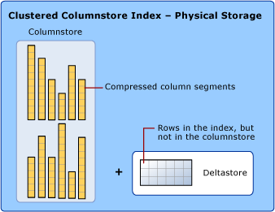
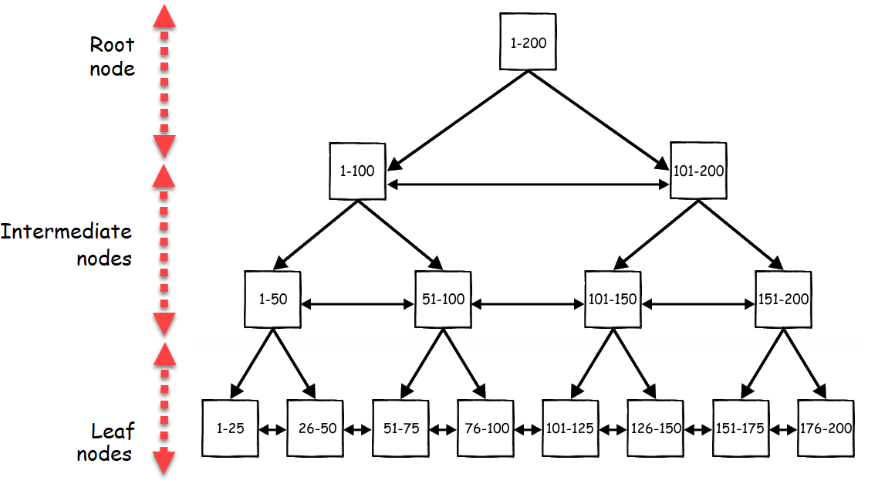

# Miscellaneous

## 01: Checking Existing Constraints on a Table using Data Dictionaries

- In SQL Server the `data dictionary` is a set of database tables used to store information about a database’s definition. One can use these data dictionaries to check the constraints on an already existing table and to change them(if possible).

- `USER_CONSTRAINTS` Data Dictionary

  - This data dictionary contains information about each constraint used in a database along with constraint specific information.

    ```
    DESC USER_CONSTRAINTS;
    ```

    - Result:
      ```
      Name              Null     Type
      ----------------- -------- ------------
      OWNER                      VARCHAR2(30)
      CONSTRAINT_NAME   NOT NULL VARCHAR2(30)
      CONSTRAINT_TYPE            VARCHAR2(1)
      TABLE_NAME        NOT NULL VARCHAR2(30)
      SEARCH_CONDITION           LONG
      R_OWNER                    VARCHAR2(30)
      R_CONSTRAINT_NAME          VARCHAR2(30)
      DELETE_RULE                VARCHAR2(9)
      STATUS                     VARCHAR2(8)
      DEFERRABLE                 VARCHAR2(14)
      DEFERRED                   VARCHAR2(9)
      VALIDATED                  VARCHAR2(13)
      GENERATED                  VARCHAR2(14)
      BAD                        VARCHAR2(3)
      RELY                       VARCHAR2(4)
      LAST_CHANGE                DATE
      INDEX_OWNER                VARCHAR2(30)
      INDEX_NAME                 VARCHAR2(30)
      INVALID                    VARCHAR2(7)
      VIEW_RELATED               VARCHAR2(14)
      ```

  - Constraint types are:

    C - Check constraint on a table  
    P - Primary key  
    U - Unique key  
    R - Referential integrity  
    V - With check option, on a view  
    O - With read only, on a view  
    H - Hash expression  
    F - Constraint that involves a REF column  
    S - Supplemental logging

  - Source table, `SDF`:

    | SUPPNO | SNAME   | STATUS | CITY |
    | ------ | ------- | ------ | ---- |
    | 21     | JONYY   | 25     | NY   |
    | 22     | MIKKY   | 11     | LA   |
    | 23     | JIM     | 29     | LV   |
    | 24     | BNFERYY | 47     | HW   |
    | 25     | TIM     | 41     | HS   |

  - Query for checking constraints on this table :

    ```sql
    SELECT CONSTRAINT_NAME, SEARCH_CONDITION AS CONSTRAINT_TYPE
    FROM USER_CONSTRAINTS
    WHERE TABLE_NAME='SDF';
    ```

  - Output:

    | CONSTRAINT_NAME | CONSTRAINT_TYPE |
    | --------------- | --------------- |
    | XYZ             | STATUS<50       |
    | Abc             | (NULL)          |

- `USER_CONS_COLUMNS` Data Dictionary

  - We can use this Data Dictionary to find the columns to which constraint has been applied.

  ```sql
  DESC USER_CONS_COLUMNS;
  ```

  ```
  Name            Null     Type
  --------------- -------- --------------
  OWNER           NOT NULL VARCHAR2(30)
  CONSTRAINT_NAME NOT NULL VARCHAR2(30)
  TABLE_NAME      NOT NULL VARCHAR2(30)
  COLUMN_NAME              VARCHAR2(4000)
  POSITION                 NUMBER
  ```

- Query to check the columns of SDF table with constraints:

  ```sql
  SELECT * FROM USER_CONS_COLUMNS WHERE TABLE_NAME='SDF';
  ```

  - Output:

    | OWNER  | CONSTRAINT_NAME | TABLE_NAME | COLUMN_NAME | POSITION |
    | ------ | --------------- | ---------- | ----------- | -------- |
    | SYSTEM | XYZ             | SDF        | STATUS      | (null)   |
    | SYSTEM | ABC             | SDF        | STATUS      | 1        |

- Using Cartesian Product to get Complete information on constraints:

  ```sql
  SELECT A.CONSTRAINT_NAME, A.CONSTRAINT_TYPE, B.COLUMN_NAME, B.TABLE_NAME
  FROM
  USER_CONSTRAINTS A,
  USER_CONS_COLUMNS B
  WHERE A.CONSTRAINT_NAME=B.CONSTRAINT_NAME
  AND A.TABLE_NAME='SDF';
  ```

  - Output:

    | CONSTRAINT_NAME | CONSTRAINT_TYPE | COLUMN_NAME | TABLE_NAME |
    | --------------- | --------------- | ----------- | ---------- |
    | XYZ             | C               | STATUS      | SDF        |
    | ABC             | P               | SUPPNO      | SDF        |

## 02: How To DISABLE a PRIMARY KEY in MS SQL Server

- You can disable a primary key using the `ALTER INDEX` statement in MS SQL Server.

- On the other hand, if you want to improve loading performance of a large table in a data warehouse, it is recommended to disable constraints such as `PRIMARY KEY`, `UNIQUE KEY` and `CHECK` and `INDEX`.

  - Keeping in mind that when you mark one of your table columns as the primary key, it creates a Clustered Index for the column you picked. If the Clustered Index is already created (before creating the primary key), then it creates a Non-Clustered Index. If the primary key is created with a Clustered Index and if you disable it, table will not be able to accessed because the main structure is disabled. However, if the primary key is created with a non-clustered index, you can disable it and still work with it.

- The syntax to disable a primary key using the `ALTER INDEX` statement in MS SQL Server is:

  ```sql
  ALTER INDEX constraint_name
  ON table_name
  DISABLE;
  ```

## 03: Object Naming Rules

- The rules for naming database objects (such as tables, columns, views, and database procedures) are as follows:
  - Names can contain only alphanumeric characters and must begin with an alphabetic character or an underscore (`_`). Database names must begin with an alphabetic character, and cannot begin with an underscore.
  - Names can contain (but cannot begin with) the following special characters: 0 through 9, #, @, and $. Names specified as delimited identifiers (in double quotes) can contain additional special characters.

## 04: DISTINCT Operator

- The `DISTINCT` operator treats `NULL` duplicate. It means that the two NULLs are the same. Therefore, if the `SELECT` statement returns NULLs, the `DISTINCT` returns only one `NULL`.

## 05: SQL AUTO INCREMENT Field

- `AUTO INCREMENT` Field
  Auto-increment allows a unique number to be generated automatically when a new record is inserted into a table.

  Often this is the primary key field that we would like to be created automatically every time a new record is inserted.

- Syntax for MySQL

  - The following SQL statement defines the "Personid" column to be an auto-increment primary key field in the "Persons" table:

  ```sql
  CREATE TABLE Persons (
      Personid int NOT NULL AUTO_INCREMENT,
      LastName varchar(255) NOT NULL,
      FirstName varchar(255),
      Age int,
      PRIMARY KEY (Personid)
  );
  ```

  - MySQL uses the `AUTO_INCREMENT` keyword to perform an auto-increment feature.

    - By default, the starting value for `AUTO_INCREMENT` is `1`, and it will increment by `1` for each new record.

    - To let the `AUTO_INCREMENT` sequence start with another value, use the following SQL statement:

      ```sql
      ALTER TABLE Persons AUTO_INCREMENT=100;
      ```

- Syntax for SQL Server

  - The following SQL statement defines the "Personid" column to be an auto-increment primary key field in the "Persons" table:

    ```sql
    CREATE TABLE Persons (
        Personid int IDENTITY(1,1) PRIMARY KEY,
        LastName varchar(255) NOT NULL,
        FirstName varchar(255),
        Age int
    );
    ```

  - The MS SQL Server uses the `IDENTITY` keyword to perform an auto-increment feature.

    - In the example above, the starting value for `IDENTITY` is `1`, and it will increment by `1` for each new record.

  - Tip: To specify that the "Personid" column should start at value `10` and increment by `5`, change it to `IDENTITY(10,5)`.

## 06: CREATE DOMAIN

- Used in : Postgre sql

  - `CREATE DOMAIN` creates a new domain. A domain is essentially a data type with optional constraints (restrictions on the allowed set of values). The user who defines a domain becomes its owner.

  - Domains are useful for abstracting common constraints on fields into a single location for maintenance. For example, several tables might contain email address columns, all requiring the same `CHECK` constraint to verify the address syntax. Define a domain rather than setting up each table’s constraint individually.

- Examples:

  ```sql
  CREATE DOMAIN CPI_DATA AS REAL CHECK
  (value >= 0 AND value <= 10);
  ```

  - Now `CPI_DATA` domain is created so, we can use this domain anywhere in any table of database as below :

    ```sql
    CREATE TABLE student(
      sid char(9) PRIMARY KEY,
      name varchar(30),
      cpi CPI_DATA
    );
    ```

  - Every time `cpi_data` will check the constraint, when you add data in student table.

    - Example 1 :

      ```sql
      Insert into student values (201501408,Raj,7.5);
      ```

      - This will not violate the property of cpi.

    - Example 2 :
      ```sql
      Insert into student values (201501188,Dhaval,12);
      ```
      - ERROR. This will violate the property of cpi.

## 07: What is collation sensitivity? Explain different types.

- `Collation sensitivity` is used to define the rules for sorting and comparing the strings of character data. The basic rule for sorting a character data are correct character sequence, Case-sensitivity, character width, and accent marks, etc.

- Different types of collation sensitivity :

  - `Case Sensitivity` : Case sensitivity defines every character with a unique value, as alphabet characters `A` and `a` are treated individually, as they have different ASCII values for a computer language

  - `Accent sensitivity` : Accent sensitivity is related that whether the accent is off or not, as `a` and `á` both should be treated differently

  - `Kana sensitivity` : Kana sensitivity defines the difference between two Japanese words: Hiragana and Katakana

  - `Width sensitivity` : It differentiates between a single-byte character (half- width) and representation of the double-byte character of the same character

## 08: MySQL Operator precedence

- Operator precedence specifies the order in which operators are evaluated when two or more operators with different precedence are adjacent in an expression.

  - For example, `1+2/3` gives the different result as compared to `(1+2)/3`. Just like all other programming languages C, C++, Java etc. MySQL also has a precedence rule.

- The following table describes operator precedence in MySQL, from highest to lowest. Operators which are in the same group have the equal precedence.

  - 1:
    - `INTERVAL`
      - Return the index of the argument that is less than the first argument
  - 2:
    - `BINARY COLLATE`
      - This is a type that stores binary byte strings
      - This clause override whatever the default collation is for comparison
  - 3:
    - `!`
      - Negate values
  - 4:
    - `–`
      - It change the sign of the operand
    - `~`
      - It inverts the bits of operand
  - 5:
    - `^`
      - Bitwise XOR
  - 6:

    - `*`
      - Multiplication operator
    - `/`
      - Division operator
    - `DIV`
      - Integer Division (discard the fractional part of division)
    - `%`, `MOD`
      - Modulo operator

  - 7:
    - `–`
      - Minus operator
    - `+`
      - Addition operator
  - 8:
    - `<<`
      - Shift a (BIGINT) number or binary string to left
    - `>>`
      - Shift a (BIGINT) number or binary string to right
  - 9:

    - `&`
      - Bitwise AND

  - 10:
    - `|`
      - Bitwise OR
  - 11:

    - `=`
      - Comparison operator
    - `<=>`
      - NULL-safe equal to operator
    - `>=`, `>`
      - Greater than/Greater than or equal to
    - `<=`, `<`
      - Less than/Less than or equal to
    - `<>`, `!=`
      - Not Equal to operator
    - `IS`
      - Test a value against a boolean value
    - `LIKE`
      - Pattern matching operator
    - `REGEXP`
      - Matches the string expression with the regular expression
    - `IN`
      - Check whether a value is present in list or not

  - 12:
    - `BETWEEN`
      - Check whether a value is within a range of values
    - `CASE WHEN THEN ELSE `
      - Case operator
  - 13:
    - `NOT`
      - Negates Value
  - 14:
    - `AND`, `&&`
      - Logical AND
  - 15:
    - `XOR`
      - Logical XOR
  - 16:
    - `OR`, `||`
      - Logical OR
    - `=`
      - Assign a value (as part of a SET statement/SET clause in an UPDATE statement)
    - :=
      - Assign a value

## 09: What is Database Normalization in SQL Server?

- According to Wikipedia...

  - “Database normalization is the process of restructuring a relational database in accordance with a series of so-called normal forms in order to reduce data redundancy and improve data integrity. It was first proposed by Edgar F. Codd as an integral part of his relational model.

  - Normalization entails organizing the columns (attributes) and tables (relations) of a database to ensure that their dependencies are properly enforced by database integrity constraints. It is accomplished by applying some formal rules either by a process of synthesis (creating a new database design) or decomposition (improving an existing database design).”

- Database normalization

  - Database Normalization is a process and it should be carried out for every database you design. The process of taking a database design, and apply a set of formal criteria and rules, is called `Normal Forms`.

  - The database normalization process is further categorized into the following types:

    - 1. First Normal Form (1 NF)
    - 2. Second Normal Form (2 NF)
    - 3. Third Normal Form (3 NF)
    - 4. Boyce Codd Normal Form or Fourth Normal Form ( BCNF or 4 NF)
    - 5. Fifth Normal Form (5 NF)
    - 6. Sixth Normal Form (6 NF)

  - One of the driving forces behind database normalization is to streamline data by reducing redundant data. Redundancy of data means there are multiple copies of the same information spread over multiple locations in the same database.

  - The drawbacks of data redundancy include:

    - 1. Data maintenance becomes tedious – data deletion and data updates become problematic

    - 2. It creates data inconsistencies

    - 3. Insert, Update and Delete anomalies become frequent. An update anomaly, for example, means that the versions of the same record, duplicated in different places in the database, will all need to be updated to keep the record consistent

    - 4. Redundant data inflates the size of a database and takes up an inordinate amount of space on disk

- Normal Forms

  - First Normal Form (1NF):

    - The first normal form requires that a table satisfies the following conditions:

      1. Rows are not ordered
      2. Columns are not ordered
      3. There is duplicated data
      4. Row-and-column intersections always have a unique value
      5. All columns are “regular” with no hidden values

    - In the following example, the first table clearly violates the 1 NF. It contains more than one value for the `Dept` column. So, what we might do then is go back to the original way and instead start adding new columns, so, `Dept1`, `Dept2`, and so on. This is what’s called a `repeating group`, and there should be no repeating groups. In order to bring this First Normal Form, split the table into the two tables. Let’s take the department data out of the table and put it in the dept table. This has the one-to-many relationship to the `employee` table.

    - Let’s take a look at the employee table:

      | EmpID | Employee | Age | Dept                   |
      | ----- | -------- | --- | ---------------------- |
      | 1001  | ABC      | 30  | Sales, Finance         |
      | 1002  | CDE      | 30  | Sales, Finance, DevOps |

    - Now, after normalization, the normalized tables `Dept` and `Employee` looks like below:

      | DeptID | DeptName |
      | ------ | -------- |
      | 1      | Sales    |
      | 2      | Finance  |
      | 3      | DevOps   |

      | EmpId | Employee | Age | DeptID |
      | ----- | -------- | --- | ------ |
      | 1001  | ABC      | 30  | 1      |
      | 1001  | AGC      | 30  | 2      |
      | 1002  | CDE      | 40  | 1      |
      | 1002  | CDE      | 40  | 2      |
      | 1002  | CDE      | 40  | 3      |

    - Second Normal Form and Third Normal Form are all about the relationship between the columns that are the keys and the other columns that aren’t the key columns.

  - Second Normal Form (2NF):

    - An entity is in a second normal form if all of its attributes depend on the whole primary key. So this means that the values in the different columns have a dependency on the other columns.
      1. The table must be already in `1 NF` and all non-key columns of the tables must depend on the `PRIMARY KEY`
      2. The partial dependencies are removed and placed in a separate table
    - Note: Second Normal Form (2 NF) is only ever a problem when we’re using a composite primary key. That is, a primary key made of two or more columns.

    - The following example, the relationship is established between the `Employee` and `Department` tables.

      | Name         | Date       | Title                      |
      | ------------ | ---------- | -------------------------- |
      | AWS_101      | 9/17/2018  | Amazon Web Services        |
      | Azure_101    | 9/18/2018  | SQL Azure Essentials       |
      | DynamoDB_102 | 9/20/2018  | DynamoDB Advanced Concepts |
      | SQL_101      | 11/26/2018 | T-SQL Essentials           |
      | SQL_102      | 11/26/2018 | SQL Server for DBA         |
      | AWS_101      | 11/26/2018 | Amazon Web Services        |

      - Composite Keys: `Name`, `Date`
      - The column `Title` is functionally dependent on `Name` column

    - In this example, the `Title` column is functionally dependent on `Name` and `Date` columns. These two keys form a composite key. In this case, it only depends on `Name` and partially dependent on the `Date` column. Let’s remove the course details and form a separate table. Now, the course details are based on the entire key. We are not going to use a composite key.

      | Name         | Date       |
      | ------------ | ---------- |
      | AWS_101      | 9/17/2018  |
      | Azure_101    | 9/18/2018  |
      | DynamoDB_102 | 9/20/2018  |
      | SQL_101      | 11/26/2018 |
      | SQL_102      | 11/26/2018 |
      | AWS_101      | 11/26/2018 |

      | CourseID     | Title                      |
      | ------------ | -------------------------- |
      | AWS_101      | Amazon Web Services        |
      | Azure_101    | SQL Azure Essentials       |
      | DynamoDB_102 | DynamoDB Advanced Concepts |
      | SQL_101      | T-SQL Essentials           |
      | SQL_102      | SQL Server for DBA         |
      | AWS_101      | Amazon Web Services        |

  - Third Normal Form (3NF):

    - The third normal form states that you should eliminate fields in a table that do not depend on the key.

      1. A Table is already in 2 NF
      2. Non-Primary key columns shouldn’t depend on the other non-Primary key columns
      3. There is no transitive functional dependency

    - Consider the following example, in the table `employee`; `empID` determines the `department ID` of an employee, `department ID` determines the `department name`. Therefore, the `department name` column indirectly dependent on the `empID` column. So, it satisfies the transitive dependency. So this cannot be in third normal form.

    | EmpId | Employee | CourseName   | Date       | Title                      | DeptName |
    | ----- | -------- | ------------ | ---------- | -------------------------- | -------- |
    | 1001  | ABC      | AWS_101      | 9/17/2018  | Amazon Web Services        | ManLog   |
    | 1001  | ABC      | Azure_101    | 9/18/2018  | SQL Azure Essential        | Finance  |
    | 1003  | EFG      | DynamoDB_102 | 9/20/2018  | DynamoDB Advanced Concepts | Research |
    | 1002  | CDE      | SQL_101      | 11/26/2018 | T-SQL Essentials           | ManLog   |
    | 1002  | CDE      | SQL_102      | 11/26/2018 | SQL Server for DBA         | ManLog   |
    | 1002  | CDE      | AWS_101      | 11/26/2018 | Amazon Web Services        | ManLog   |

    - Composite Keys: `CourseName`, `Date`
    - `Title` partially dependent to `CourseName`
    - `DeptName` functionally dependent to `EmpId`

  - In order to bring the table to `3 NF`, we split the `employee` table into two.

    | CourseID     | Title                      |
    | ------------ | -------------------------- |
    | AWS_101      | Amazon Web Services        |
    | Azure_101    | SQL Azure Essentials       |
    | DynamoDB_102 | DynamoDB Advanced Concepts |
    | SQL_101      | T-SQL Essentials           |
    | SQL_102      | SQL Server for DBA         |
    | AWS_101      | Amazon Web Services        |

    | EmpID | Employee |
    | ----- | -------- |
    | 1001  | ABC      |
    | 1002  | CDE      |
    | 1003  | EFG      |

    | DeptID | DeptName |
    | ------ | -------- |
    | 1      | ManLog   |
    | 2      | Finance  |
    | 3      | Research |

    =>

    | EmpId | CourseID     | Date       | DeptID |
    | ----- | ------------ | ---------- | ------ |
    | 1001  | AWS_101      | 9/17/2018  | 1      |
    | 1001  | Azure_101    | 9/18/2018  | 2      |
    | 1003  | DynamoDB_102 | 9/20/2018  | 3      |
    | 1002  | SQL_101      | 11/26/2018 | 1      |
    | 1002  | SQL_102      | 11/26/2018 | 1      |
    | 1002  | AWS_101      | 11/26/2018 | 1      |

  - Now, we can see the all non-key columns are fully functionally dependent on the Primary key.

- Denormalization

  - According to Wikipedia...

    - “Denormalization is a strategy used on a previously-normalized database to increase performance. In computing, denormalization is the process of trying to improve the read performance of a database, at the expense of losing some write performance, by adding redundant copies of data or by grouping data.[1][2] It is often motivated by performance or scalability in relational database software needing to carry out very large numbers of read operations. Denormalization should not be confused with Unnormalized form. Databases/tables must first be normalized to efficiently denormalize them.”

  - Database normalization is always a starting point for denormalization. Denormalization is a type of reverse engineering process that can apply to retrieve the data in the shortest time possible.

  - Let us consider an example; we’ve got an `Employee` table that in-house an `email` and a `phone number` columns. Well, what happens if we add another email address column, another phone number? We tend to break First Normal Form. It’s a repeating group. But in general, it is easy to have those columns created (`Email_1`, and `Email_2` column), or having (`home_phone` and `mobile_phone`) columns, rather than having everything into multiple tables and having to follow relationships. The entire process is referred to as a `denormalization`.

## 10: Denormalization in Databases

- Denormalization is a database optimization technique in which we add redundant data to one or more tables. This can help us avoid costly joins in a relational database. Note that denormalization does not mean ‘reversing normalization’ or ‘not to normalize’. It is an optimization technique that is applied after normalization.

- Basically, The process of taking a normalized schema and making it non-normalized is called denormalization, and designers use it to tune the performance of systems to support time-critical operations.

- In a traditional normalized database, we store data in separate logical tables and attempt to minimize redundant data. We may strive to have only one copy of each piece of data in a database.

- For example, in a normalized database, we might have a Courses table and a Teachers table. Each entry in Courses would store the teacherID for a Course but not the teacherName. When we need to retrieve a list of all Courses with the Teacher’s name, we would do a join between these two tables.

- In some ways, this is great; if a teacher changes his or her name, we only have to update the name in one place.
  - The drawback is that if tables are large, we may spend an unnecessarily long time doing joins on tables.
- Denormalization, then, strikes a different compromise. Under denormalization, we decide that we’re okay with some redundancy and some extra effort to update the database in order to get the efficiency advantages of fewer joins.

- Pros of Denormalization:

  1. Retrieving data is faster since we do fewer joins
  2. Queries to retrieve can be simpler(and therefore less likely to have bugs),
     since we need to look at fewer tables.

- Cons of Denormalization:

  1. Updates and inserts are more expensive.
  2. Denormalization can make update and insert code harder to write.
  3. Data may be inconsistent.
  4. Data redundancy necessitates more storage.

- In a system that demands scalability, like that of any major tech company, we almost always use elements of both normalized and denormalized databases.

## 11: Covered Query vs. Covering Index

- What's the difference between a covered query and a covering index?

  - Covered queries and covering indexes are different, yet closely related. A query is covered if all the columns it uses come from one or more indexes. These columns include the columns you want the query to return as well as columns in any JOIN, WHERE, HAVING, and ORDER BY clause. A covered query typically is considered advantageous because data access through indexes can be more efficient. However, the high-speed access that this kind of query facilitates can become costly when you update the table because you must maintain the indexes.

  - A covering index—which is used in covered queries—can provide some or all of the indexed columns that a covered query uses. If a covering index is also a composite index (i.e., it indexes more than one column in its base table or view), it might contain columns that aren't used in the covered query but are used instead in other queries that have overlapping columns.

## 12: When can a view be updated?

1. The view is defined based on one and only one table.

2. The view must include the `PRIMARY KEY` of the table based upon which the view has been created.

3. The view should not have any field made out of aggregate functions.

4. The view must not have any `DISTINCT` clause in its definition.

5. The view must not have any `GROUP BY` or `HAVING` clause in its definition.

6. The view must not have any `SUBQUERIES` in its definitions.

7. If the view you want to update is based upon another view, the later should be updatable.

8. Any of the selected output fields (of the view) must not use constants, strings or value expressions.

## 13: Creating and Optimizing Views in SQL Server

- Using Views to Update Data

  - A view can be used in a query that updates data, subject to a few restrictions. Bear in mind that a view is not a table and contains no data—the actual modification always takes place at the table level. Views cannot be used as a mechanism to override any constraints, rules, or referential integrity defined in the base tables.

- Restrictions on Updating Data Through Views

  - You can insert, update, and delete rows in a view, subject to the following limitations:

    - If the view contains joins between multiple tables, you can only insert and update one table in the view, and you can't delete rows.

    - You can't directly modify data in views based on union queries. You can't modify data in views that use `GROUP BY` or `DISTINCT` statements.

    - All columns being modified are subject to the same restrictions as if the statements were being executed directly against the base table.

    - Text and image columns can't be modified through views.

    - There is no checking of view criteria. For example, if the view selects all customers who live in Paris, and data is modified to either add or edit a row that does not have City = 'Paris', the data will be modified in the base table but not shown in the view, unless `WITH CHECK OPTION` is used when defining the view.

- Using `WITH CHECK OPTION`

  - The `WITH CHECK OPTION` clause forces all data-modification statements executed against the view to adhere to the criteria set within the `WHERE` clause of the `SELECT` statement defining the view. Rows cannot be modified in a way that causes them to vanish from the view. `Listing 9.12` creates a view showing customers from Paris using the `WITH CHECK OPTION` statement.

  - Listing 9.12 Creating a View Using WITH CHECK OPTION

    ```sql
    CREATE VIEW vwCustomersParis
    AS
      SELECT CompanyName, ContactName, Phone, City
      FROM Customers
      WHERE City = 'Paris'

    WITH CHECK OPTION
    ```

    - The following Transact-SQL statement attempting to update data by moving everyone from Paris to Lyons will fail because Lyons does not meet the criteria defined in the view. If you did not have WITH CHECK OPTION defined, the UPDATE statement would succeed, and a requery of the view would return no rows. Here's the statement:

      ```sql
      UPDATE vwCustomersParis
      SET City = 'Lyons'
      ```

- Updating Views with Joins

  - A view that contains a join will only be updateable on one side of the join, unless an `INSTEAD OF` trigger is created on the view. `INSTEAD OF` triggers are discussed in the next section. For example, the view shown in `Listing 9.13` is based on a join between the `Categories` and `Products` tables.

    - Listing 9.13 A View with a Join

      ```sql
      CREATE VIEW vwCategoriesProducts
      AS
        SELECT Categories.CategoryName,
        Products.ProductID, Products.ProductName
        FROM Products INNER JOIN
        Categories ON

        Products.CategoryID = Categories.CategoryID
      ```

      - The following `UPDATE` statement will work because it's only affecting the `Products` table's side of the join:

        ```sql
        UPDATE vwCategoriesProducts
          SET ProductName = 'Chay'
          WHERE ProductID = 1
        ```

      - This `UPDATE` statement will also work because only affects the `Categories` table's side of the join:

        ```sql
        UPDATE vwCategoriesProducts
          SET CategoryName = 'Drinks'
          WHERE ProductID = 1
        ```

      - However, the following `UPDATE` statement attempting to modify columns in both the `Products` and `Categories` tables won't work (you'll get the error "View or function 'vwCategoriesProducts' is not updateable because the FROM clause names multiple tables"):

        ```sql
        UPDATE vwCategoriesProducts
          SET ProductName = 'Chay', CategoryName = 'Drinks'
          WHERE ProductID = 1
        ```

- The Trouble with Updateable Views

  - In general, you'll want to make views that use joins read-only. Allowing updates in views with joins is likely to confuse users because it's not intuitive that they can't update different columns on the same row. After all, it looks like the same table to them.

  - If you want users to be able to use views to update data, base the view on a single table, or use a stored procedure to perform the update.

- Updating Data Using User-Defined Inline Functions

  - The rules for updating user-defined inline functions are the same as they are for views. Consider these three statements:

    ```sql
    SELECT * FROM dbo.fnProductSelectInline()
    WHERE ProductID = 1

    UPDATE dbo.fnProductSelectInline()
    SET UnitPrice = 20
    WHERE ProductID = 1

    SELECT * FROM dbo.fnProductSelectInline()
    WHERE ProductID = 1
    ```

    - The first statement selects the data from the `fnProductSelectInline()` function, the second statement updates it, and the third statement selects the new value. Here's the output for the two `SELECT` statements demonstrating that the function worked:

      ```
      ProductID   ProductName        UnitPrice
      ----------- ------------------ ---------------------
      1           Chai                19.0000

      ProductID   ProductName        UnitPrice
      ----------- ------------------ ---------------------
      1           Chai                20.0000
      ```

  - An inline function that has a parameter can also be used to update data, with the parameter limiting the scope of the update. Here is a function where a parameter is used to return a single row from the Products table:

    ```sql
    CREATE FUNCTION fnProductInlineParam
      (@ProductID int)
      RETURNS TABLE
    AS
      RETURN
      (SELECT ProductID, ProductName, UnitPrice
      FROM Products
      WHERE ProductID = @ProductID)
    ```

    - Call the function as follows to update the price of `ProductID` `5` to `29.95`:

      ```sql
      UPDATE dbo.fnProductInlineParam(5)
      SET UnitPrice = 29.95
      ```

      - Only the one product with the `ProductID` of `5` will have its price changed.

- Using `INSTEAD OF` Triggers to Update Non-Updateable Views

  - An `INSTEAD OF` trigger on a view allows you to get around many of the restrictions on updating views. For example, only one table in a view with multiple joined tables can be updated. An `INSTEAD OF` trigger can support inserts, updates, and deletes that reference data in more than one table. `INSTEAD OF` triggers also allow you to code more complex logic than is normally supported in views; and they let you work with time stamp data, computed columns, and identity columns.

  - The following view selects the `CompanyName` values in a `UNION` query between the `Customers` and `Suppliers` tables:

    ```sql
    CREATE VIEW vwUnionCustomerSupplier
    AS
      SELECT CompanyName, 'Customer' AS Type
      FROM Customers

      UNION ALL

      SELECT CompanyName, 'Supplier' AS Type
      FROM Suppliers
    ```

    - Normally a `UNION` query is not updateable. However, an `INSTEAD OF` trigger lets you update the tables involved because it can execute code instead of the default action (`UPDATE`). The trigger makes use of the inserted table, which contains the new value, to insert data into the appropriate table based on the `Type` value. It also makes use of the deleted table, which contains the old value, to find the correct record in the base table.

      ```sql
      CREATE TRIGGER trigUnion ON vwUnionCustomerSupplier
        INSTEAD OF UPDATE
      AS
      BEGIN
      SET NOCOUNT ON
        DECLARE @DelName nvarchar(50)

        IF (SELECT inserted.Type FROM inserted) Is Null
        RETURN

        SELECT @DelName = deleted.CompanyName FROM deleted

        IF (SELECT inserted.Type FROM inserted) = 'Company'
        UPDATE Customers
        SET CompanyName =
          (SELECT CompanyName
          FROM inserted)
          WHERE Customers.CompanyName =
          @DelName
        ELSE
        UPDATE Suppliers
        SET CompanyName =
          (SELECT CompanyName
          FROM inserted)
          WHERE Suppliers.CompanyName =
          @DelName
      END
      ```

    - This allows the following `UPDATE` statement to update the `Customers` table with a new company name:

      ```sql
      UPDATE vwUnionCustomerSupplier
      SET CompanyName = 'Around the Block'
      WHERE CompanyName = 'Around the Horn'
      ```

    - As you can see, `INSTEAD OF` triggers on views can make them very powerful indeed, allowing actions that would not normally be permitted. You could also use `INSTEAD OF` triggers to call stored procedures to perform the requested data modification.

## 14: MySQL Stored Procedure Parameters

- Introduction to MySQL stored procedure parameters

  - Often, stored procedures have parameters. The parameters make the stored procedure more useful and reusable. A parameter in a stored procedure has one of three modes: `IN`,`OUT`, or `INOUT`.

  - `IN` parameters

    - `IN` is the default mode. When you define an `IN` parameter in a stored procedure, the calling program has to pass an argument to the stored procedure.

    - In addition, the value of an `IN` parameter is protected. It means that even you change the value of the `IN` parameter inside the stored procedure, its original value is unchanged after the stored procedure ends. In other words, the stored procedure only works on the copy of the `IN` parameter.

  - `OUT` parameters
    The value of an `OUT` parameter can be changed inside the stored procedure and its new value is passed back to the calling program.

    Notice that the stored procedure cannot access the initial value of the `OUT` parameter when it starts.

  - `INOUT` parameters
    An `INOUT` parameter is a combination of `IN` and `OUT` parameters. It means that the calling program may pass the argument, and the stored procedure can modify the `INOUT` parameter, and pass the new value back to the calling program.

  - Defining a parameter

    - Here is the basic syntax of defining a parameter in stored procedures:

      ```
      [IN | OUT | INOUT] parameter_name datatype[(length)]
      ```

      - In this syntax,

        - First, specify the parameter mode, which can be `IN` , `OUT` or `INOUT` depending on the purpose of the parameter in the stored procedure.
        - Second, specify the name of the parameter. The parameter name must follow the naming rules of the column name in MySQL.
        - Third, specify the data type and maximum length of the parameter.

- MySQL stored procedure parameter examples

  - The `IN` parameter example

    ```sql
    DELIMITER //

    CREATE PROCEDURE GetOfficeByCountry(
      IN countryName VARCHAR(255)
    )
    BEGIN
      SELECT *
      FROM offices
      WHERE country = countryName;
    END //

    DELIMITER ;
    ```

    - In this example, the `countryName` is the `IN` parameter of the stored procedure.

    - Suppose that you want to find offices locating in the `USA`, you need to pass an argument (`USA`) to the stored procedure as shown in the following query:

      ```sql
      CALL GetOfficeByCountry('USA');
      ```

    - Because the `countryName` is the `IN` parameter, you must pass an argument. If you don’t do so, you’ll get an error:

      ```sql
      CALL GetOfficeByCountry();
      ```

      =>

      ```
      Error Code: 1318. Incorrect number of arguments for PROCEDURE classicmodels.GetOfficeByCountry; expected 1, got 0
      ```

  - The OUT parameter example

    - The following stored procedure returns the number of orders by order status.

      ```sql
      DELIMITER $$

      CREATE PROCEDURE GetOrderCountByStatus (
        IN  orderStatus VARCHAR(25),
        OUT total INT
      )
      BEGIN
        SELECT COUNT(orderNumber)
        INTO total
        FROM orders
        WHERE status = orderStatus;
      END$$

      DELIMITER ;
      ```

      - The stored procedure `GetOrderCountByStatus()` has two parameters:

        - The `orderStatus`: is the `IN` parameter specifies the status of orders to return.
        - The `total`: is the `OUT` parameter that stores the number of orders in a specific status.

    - To find the number of orders that already shipped, you call `GetOrderCountByStatus` and pass the order status as of `Shipped`, and also pass a session variable ( `@total` ) to receive the return value.

      ```sql
      CALL GetOrderCountByStatus('Shipped',@total);
      SELECT @total;
      ```

  - The INOUT parameter example

    ```sql
    DELIMITER $$

    CREATE PROCEDURE SetCounter(
      INOUT counter INT,
        IN inc INT
    )
    BEGIN
      SET counter = counter + inc;
    END$$

    DELIMITER ;
    ```

    - In this example, the stored procedure `SetCounter()` accepts one `INOUT` parameter ( `counter` ) and one `IN` parameter ( `inc` ). It increases the counter ( `counter` ) by the value of specified by the `inc` parameter.

    - These statements illustrate how to call the `SetSounter` stored procedure:

      ```sql
      SET @counter = 1;
      CALL SetCounter(@counter,1); -- 2
      CALL SetCounter(@counter,1); -- 3
      CALL SetCounter(@counter,5); -- 8
      SELECT @counter; -- 8
      ```

## 15: PostgreSQL Boolean Data Type with Practical Examples

- Introduction to the PostgreSQL Boolean type

  - PostgreSQL supports a single Boolean data type: `BOOLEAN` that can have three values: `true`, `false` and `NULL`.

  - PostgreSQL uses one byte for storing a boolean value in the database. The `BOOLEAN` can be abbreviated as `BOOL`.

  - In standard SQL, a Boolean value can be `TRUE`, `FALSE`, or `NULL`. However, PostgreSQL is quite flexible when dealing with `TRUE` and `FALSE` values.

    - The following table shows the valid literal values for `TRUE` and `FALSE` in PostgreSQL.

      | True   | False   |
      | ------ | ------- |
      | true   | false   |
      | ‘t’    | ‘f ‘    |
      | ‘true’ | ‘false’ |
      | ‘y’    | ‘n’     |
      | ‘yes’  | ‘no’    |
      | ‘1’    | ‘0’     |

      - Note that the leading or trailing whitespace does not matter and all the constant values except for `true` and `false` must be enclosed in single quotes.

- PostgreSQL Boolean examples

  - First, create a new table `stock_availability` to log which products are available.

    ```sql
    CREATE TABLE stock_availability (
      product_id INT PRIMARY KEY,
      available BOOLEAN NOT NULL
    );
    ```

  - Second, insert some sample data into the `stock_availability` table. We use various literal value for the boolean values.

    ```sql
    INSERT INTO stock_availability (product_id, available)
    VALUES
      (100, TRUE),
      (200, FALSE),
      (300, 't'),
      (400, '1'),
      (500, 'y'),
      (600, 'yes'),
      (700, 'no'),
      (800, '0');
    ```

  - Third, use the following statement to check for the availability of products:

    ```sql
    SELECT *
    FROM stock_availability
    WHERE available = 'yes';
    ```

    - Result:

      ```
       product_id | available
      ------------+-----------
              100 | t
              300 | t
              400 | t
              500 | t
              600 | t
      (5 rows)
      ```

  - You can imply the true value by using the Boolean column without any operator. For example, the following query returns all products that are available:

    ```sql
    SELECT *
    FROM stock_availability
    WHERE available;
    ```

  - Similarly, if you want to look for false values, you compare the value of the Boolean column against any valid Boolean constants.

    - The following query returns the products that are not available.

      ```sql
      SELECT *
      FROM stock_availability
      WHERE available = 'no';
      ```

      - Result:

        ```
         product_id | available
        ------------+-----------
                200 | f
                700 | f
                800 | f
        (3 rows)
        ```

    - Or you can use the `NOT` operator to check if values in the Boolean column are false like this:

      ```sql
      SELECT *
      FROM stock_availability
      WHERE NOT available;
      ```

- Set a default value of the Boolean column

  - To set a default value for an existing Boolean column, you use the `SET DEFAULT` clause in the `ALTER TABLE` statement.

    - For example, the following `ALTER TABLE` statement sets the default value for the `available` column in the `stock_availability` table:

      ```sql
      ALTER TABLE stock_availability
      ALTER COLUMN available
      SET DEFAULT FALSE;
      ```

      - If you insert a row without specifying the value for the available column, PostgreSQL uses `FALSE`:

        ```sql
        INSERT INTO stock_availability (product_id)
        VALUES (900);
        ```

        ```sql
        SELECT *
        FROM stock_availability
        WHERE product_id = 900;
        ```

        ```
         product_id | available
        ------------+-----------
                900 | f
        (1 row)
        ```

  - Likewise, if you want to set a default value for a Boolean column when you create a table, you use the `DEFAULT` constraint in the column definition as follows:

    ```sql
    CREATE TABLE boolean_demo(
      ...
      is_ok BOOL DEFAULT 't'
    );
    ```

## 16: Columnstore indexes

- Overview:

  - Columnstore indexes are the standard for storing and querying large data warehousing fact tables. This index uses column-based data storage and query processing to achieve gains up to 10 times the query performance in your data warehouse over traditional row-oriented storage. You can also achieve gains up to 10 times the data compression over the uncompressed data size.

- What is a columnstore index?

  - A `columnstore index` is a technology for storing, retrieving, and managing data by using a columnar data format, called a _columnstore_.

  - Key terms and concepts

    - Columnstore

      - A columnstore is data that's logically organized as a table with rows and columns, and physically stored in a column-wise data format.

    - Rowstore

      - A rowstore is data that's logically organized as a table with rows and columns, and physically stored in a row-wise data format. This format is the traditional way to store relational table data. In SQL Server, rowstore refers to a table where the underlying data storage format is a heap, a clustered index, or a memory-optimized table.

    - Rowgroup

      - A rowgroup is a group of rows that are compressed into columnstore format at the same time. A rowgroup usually contains the maximum number of rows per rowgroup, which is 1,048,576 rows.
      - For high performance and high compression rates, the columnstore index slices the table into rowgroups, and then compresses each rowgroup in a column-wise manner. The number of rows in the rowgroup must be large enough to improve compression rates, and small enough to benefit from in-memory operations.

    - Column segment

      - A column segment is a column of data from within the rowgroup.

        - Each rowgroup contains one column segment for every column in the table.
        - Each column segment is compressed together and stored on physical media.
        - There is metadata with each segment to allow for fast elimination of segments without reading them.

    - Clustered columnstore index

      - A clustered columnstore index is the physical storage for the entire table.
      - 
      - To reduce fragmentation of the column segments and improve performance, the columnstore index might store some data temporarily into a clustered index called a _deltastore_ and a B-tree list of IDs for deleted rows. The deltastore operations are handled behind the scenes. To return the correct query results, the clustered columnstore index combines query results from both the columnstore and the deltastore.

    - Delta rowgroup

      - A delta rowgroup is a clustered B-tree index that's used only with columnstore indexes. It improves columnstore compression and performance by storing rows until the number of rows reaches a threshold (1,048,576 rows) and are then moved into the columnstore.
      - When a delta rowgroup reaches the maximum number of rows, it transitions from an OPEN to CLOSED state. A background process named the tuple-mover checks for closed row groups. If the process finds a closed rowgroup, it compresses the delta rowgroup and stores it into the columnstore as a COMPRESSED rowgroup.
      - When a delta rowgroup has been compressed, the existing delta rowgroup transitions into TOMBSTONE state to be removed later by the tuple-mover when there is no reference to it.

    - Deltastore

      - A columnstore index can have more than one delta rowgroup. All of the delta rowgroups are collectively called the deltastore.

      - During a large bulk load, most of the rows go directly to the columnstore without passing through the deltastore. Some rows at the end of the bulk load might be too few in number to meet the minimum size of a rowgroup, which is 102,400 rows. As a result, the final rows go to the deltastore instead of the columnstore. For small bulk loads with less than 102,400 rows, all of the rows go directly to the deltastore.

    - Nonclustered columnstore index

      - A nonclustered columnstore index and a clustered columnstore index function the same. The difference is that a nonclustered index is a secondary index that's created on a rowstore table, but a clustered columnstore index is the primary storage for the entire table.
      - The nonclustered index contains a copy of part or all of the rows and columns in the underlying table. The index is defined as one or more columns of the table and has an optional condition that filters the rows.
      - A nonclustered columnstore index enables real-time operational analytics where the OLTP workload uses the underlying clustered index while analytics run concurrently on the columnstore index.

    - Batch mode execution
      - Batch mode execution is a query processing method that's used to process multiple rows together. Batch mode execution is closely integrated with, and optimized around, the columnstore storage format. Batch mode execution is sometimes known as _vector-based_ or _vectorized_ execution. Queries on columnstore indexes use batch mode execution, which improves query performance typically by two to four times.

- Why should I use a columnstore index?

  - A columnstore index can provide a very high level of data compression, typically by 10 times, to significantly reduce your data warehouse storage cost. For analytics, a columnstore index offers an order of magnitude better performance than a B-tree index. Columnstore indexes are the preferred data storage format for data warehousing and analytics workloads. Starting with SQL Server 2016 (13.x), you can use columnstore indexes for real-time analytics on your operational workload.

  - Reasons why columnstore indexes are so fast:

    - Columns store values from the same domain and commonly have similar values, which result in high compression rates. I/O bottlenecks in your system are minimized or eliminated, and memory footprint is reduced significantly.

    - High compression rates improve query performance by using a smaller in-memory footprint. In turn, query performance can improve because SQL Server can perform more query and data operations in memory.

    - Batch execution improves query performance, typically by two to four times, by processing multiple rows together.

    - Queries often select only a few columns from a table, which reduces total I/O from the physical media.

- When should I use a columnstore index?

  - Recommended use cases:

    - Use a clustered columnstore index to store fact tables and large dimension tables for data warehousing workloads. This method improves query performance and data compression by up to 10 times.

    - Use a nonclustered columnstore index to perform analysis in real time on an OLTP workload.

    - For more usage scenarios for columnstore indexes, see Choose the best columnstore index for your needs.

  - How do I choose between a rowstore index and a columnstore index?

    - Rowstore indexes perform best on queries that seek into the data, when searching for a particular value, or for queries on a small range of values. Use rowstore indexes with transactional workloads because they tend to require mostly table seeks instead of table scans.
    - Columnstore indexes give high performance gains for analytic queries that scan large amounts of data, especially on large tables. Use columnstore indexes on data warehousing and analytics workloads, especially on fact tables, because they tend to require full table scans rather than table seeks.
    - Beginning with SQL Server 2022 (16.x), ordered clustered columnstore indexes improve performance for queries based on ordered column predicates. Ordered columnstore indexes can improve row-group elimination, which can deliver performance improvements by skipping row groups altogether.

  - Can I combine rowstore and columnstore on the same table?
    - Yes. Beginning with SQL Server 2016 (13.x), you can create an updatable nonclustered columnstore index on a rowstore table. The columnstore index stores a copy of the selected columns, so you need extra space for this data, but the selected data is compressed on average 10 times. You can run analytics on the columnstore index and transactions on the rowstore index at the same time. The columnstore is updated when data changes in the rowstore table, so both indexes work against the same data.
    - Beginning with SQL Server 2016 (13.x), you can have one or more nonclustered rowstore indexes on a columnstore index and perform efficient table seeks on the underlying columnstore. Other options become available too. For example, you can enforce a primary key constraint by using a UNIQUE constraint on the rowstore table. Because a non-unique value fails to insert into the rowstore table, SQL Server can't insert the value into the columnstore.

## 17: SQL general functions | `NVL`, `NVL2`, `DECODE`, `COALESCE`, `NULLIF`, `LNNVL` and `NANVL`

- These functions work with any data type and pertain to the use of null values in the expression list. These are all `single row function` i.e. provide one result per row.

- `NVL(expr1, expr2)`

  - In SQL, `NVL()` converts a null value to an actual value. Data types that can be used are date, character and number. Data type must match with each other i.e. expr1 and expr2 must of same data type.

  - Syntax:

    ```
    NVL (expr1, expr2)
    ```

    - `expr1` is the source value or expression that may contain a null.
    - `expr2` is the target value for converting the null.

  - Example:

    ```sql
    SELECT  salary, NVL(commission_pct, 0),
      (salary*12) + (salary*12*NVL(commission_pct, 0))
        annual_salary FROM employees;
    ```

- `NVL2(expr1, expr2, expr3)`

  - The `NVL2` function examines the first expression. If the first expression is not null, then the `NVL2` function returns the second expression. If the first expression is null, then the third expression is returned i.e. If `expr1` is not null, `NVL2` returns `expr2`. If `expr1` is null, `NVL2` returns `expr3`. The argument `expr1` can have any data type.

  - Syntax:

    ```
    NVL2 (expr1, expr2, expr3)
    ```

    - `expr1` is the source value or expression that may contain null
    - `expr2` is the value returned if expr1 is not null
    - `expr3` is the value returned if expr1 is null

  - Example:

    ```sql
    SELECT last_name, salary, commission_pct,
      NVL2(commission_pct, ’SAL+COMM’, ’SAL’)
      income FROM employees;
    ```

- `DECODE()`

  - Facilitates conditional inquiries by doing the work of a `CASE` or `IF-THEN-ELSE` statement.
    The `DECODE` function decodes an expression in a way similar to the `IF-THEN-ELSE` logic used in various languages. The `DECODE` function decodes expression after comparing it to each search value. If the expression is the same as search, result is returned.
    If the default value is omitted, a null value is returned where a search value does not match any of the result values.

  - Syntax:

    ```
    DECODE(col|expression, search1, result1
      [, search2, result2,...,][, default])
    ```

  - Example:

    ```sql
    SELECT last_name, job_id, salary,
      DECODE(job_id, ’IT_PROG’, 1.10*salary,
        ’ST_CLERK’, 1.15*salary,
        ’SA_REP’, 1.20*salary,salary)
        REVISED_SALARY FROM employees;
    ```

- `COALESCE()`

  - The `COALESCE()` function examines the first expression, if the first expression is not null, it returns that expression; Otherwise, it does a `COALESCE` of the remaining expressions.
    The advantage of the `COALESCE()` function over the `NVL()` function is that the `COALESCE` function can take multiple alternate values. In simple words `COALESCE()` function returns the first non-null expression in the list.

  - Syntax:

    ```
    COALESCE (expr_1, expr_2, ... expr_n)
    ```

  - Example:

    ```sql
    SELECT last_name,
      COALESCE(commission_pct, salary, 10) comm
      FROM employees ORDER BY commission_pct;
    ```

- `NULLIF()`

  - The `NULLIF` function compares two expressions. If they are equal, the function returns null. If they are not equal, the function returns the first expression. You cannot specify the literal `NULL` for first expression.

  - Syntax:

    ```
    NULLIF (expr_1, expr_2)
    ```

  - Example:

    ```sql
    SELECT LENGTH(first_name) "expr1",
      LENGTH(last_name) "expr2",
      NULLIF(LENGTH(first_name),LENGTH(last_name))
        result FROM employees;
    ```

- `LNNVL()`

  - `LNNVL` evaluate a condition when one or both operands of the condition may be null. The function can be used only in the `WHERE` clause of a query. It takes as an argument a condition and returns `TRUE` if the condition is `FALSE` or `UNKNOWN` and `FALSE` if the condition is `TRUE`.

  - Syntax:

    ```
    LNNVL( condition(s) )
    ```

  - Examples:

        ```sql
        SELECT COUNT(*) FROM employees
          WHERE commission_pct < .2;
        ```

        - Now the above examples does not considered those employees who have no commission at all.
          To include them as well we use `LNNVL()`

          ```sql
          SELECT COUNT(*) FROM employees
            WHERE LNNVL(commission_pct >= .2);
          ```

- `NANVL()`

  - The `NANVL` function is useful only for floating-point numbers of type `BINARY_FLOAT` or `BINARY_DOUBLE`. It instructs the Database to return an alternative value `n2` if the input value `n1` is `NaN` (not a number). If `n1` is not `NaN`, then database returns `n1`. This function is useful for mapping `NaN` values to `NULL`.

  - Syntax:

    ```
    NANVL( n1 , n2 )
    ```

  - Consider the following table named `nanvl_demo`:

    ```
    BIN_FLOAT
    ---------
    5.056E+001
           Nan
    ```

  - Example:

    ```sql
    SELECT bin_float, NANVL(bin_float,0)
      FROM nanvl_demo;
    ```

    - Result:

      | BIN_FLOAT  | NANVL(BIN_FLOAT, 0) |
      | ---------- | ------------------- |
      | 5.056E+001 | 5.056E+001          |
      | Nan        | 0                   |

## 18: SQL Server performance tuning using Indexes

- Introduction

  - The proper index can drastically increase the performance of an application. However, there are tradeoffs to almost any feature, and indexes are no exception.

  - This article outlines several good rules and best practices to apply when creating and modifying indexes for your database.

- How It Works

  - The SQL Server engine uses an index, as a reader uses a book index. Without it, the reader needs to look at every page in a book to find a word.

  - Indexes are the method by which SQL Server sorts and organizes the rows in tables. It allows you to quickly narrow in on the rows to satisfy the query and avoid scanning every row in the table.

  - In database terms, a `table scan` (or just `scan`) happens when there is no index available to help a query. They have a terrific impact on performance on large tables, but sometimes are inevitable.

  - A table scan is not always a problem, but as a table grows to millions of rows and beyond, scans become slower and more costly.

  - Alternatively, a seek is an operation that uses an index to jump to desired the part of a table

  - B-tree index structure

    - The most common type of index structure in SQL Server is the B-Tree.

    - The sorted nature of the B-Tree lends itself well to range-based scanning and sequential access as well as equality-based access.

    - This hierarchical structure has the root node at the top and the leaf nodes at the bottom, as you can see below.
      - Figure 1 – B-tree data structure.
        - 
    - When a query is using an index, the query engine starts at the root node and go down through the intermediate nodes.

    - The query engine continues down through the index nodes until it reaches the leaf node.

    - It can contain a pointer to a row or the entire data, a clustered or nonclustered index.

- SQL Server Index types

  - here are two main index types offered by SQL Server: Clustered index and Nonclustered.

  - Clustered index

    - Every table, with almost no meaningful exception, should have a clustered index.

    - It is the method by which SQL Server sorts the actual data.

    - The clustered index essentially is the table. It contains all of the columns of the table rather than just a subset of columns.

    - Because the entire table is only stored on disk once and that single copy can only be sorted one way, there can be only one clustered index per table.

      - This means that queries that use the clustered index to perform their seek will be able to return any and every column they need as they are all stored on the index.

      - On the downside, any updates to the column(s) that make up the clustered index may cause the entire row to have to be moved to another place in the clustered index.

    - This behavior turns an update query into a DELETE followed by an INSERT, with an evident decrease in performance. On a table with many columns, that can be a very resource-intensive operation.

    - A clustered index can often be found on the primary key (or a foreign key) column because the values generally do not change once a record is inserted.

    - Creating a primary key constraint in SQL Server will automatically create a clustered index (if none exists) using the primary key column as the index key.

    - Sometimes it is better to use a unique nonclustered index on the primary key column, and place the clustered index on a column used by more queries.

  - Nonclustered Index

    - After making a selection for the clustered index, all other indexes need to be nonclustered indexes.

    - A nonclustered index has fewer columns than the clustered index. It contains only a subset of columns.

    - When a query uses it for a seek, it will quickly find the row(s) desired.

    - However, a key lookup may be necessary against the clustered index.

      - A key lookup occurs when SQL Server uses a nonclustered index to satisfy the query’s predicates, but it doesn’t contain all the information needed to cover it.

      - This may happen when the columns in your select list are not part of the index definition, or an additional predicate is not.

      - Key Lookups are tied to Nested Loops Joins, executing once for each row that needs to be retrieved. It can be painful, especially in instances of parameter sniffing.

- Taking Advantage of Indexes

  - One of the query optimizer jobs is to select the best index or indexes to perform the task.

  - The database engine can use indexes to boost performance in many different queries.

  - In the following sections, we will review the main types of queries that can benefit from an index.

  - Matching a `WHERE` clause

    - The most common use for an index is in finding a record or set of records matching a `WHERE` clause.

    - Queries can use an index to look for a specific value, as values inside of a range.
    - For example, the queries below:

      ```sql
      DELETE FROM PersonPhone WHERE BusinessEntityID = 15;

      UPDATE PersonPhone SET Discontinued = 1 WHERE BusinessEntityID > 35;

      SELECT * FROM PersonPhone WHERE BusinessEntityID BETWEEN 15 AND 35;
      ```

    - SQL statements like `DELETE`, `SELECT`, and `UPDATE` can all benefit from an index on a table.

  - Sorting Rows

    - We control the sorting of a dataset by specifying one or more fields in an `ORDER BY` clause.

      - When you send a query to SQL Server, with no index, the database will scan the `Products` table and sort the rows to process the query.

    - However, the index provides the database with a presorted list of values.

    - This way, it can simply scan the index from the first entry to the last entry and retrieve the rows in sorted order.

    - The index works equally for `ASC` or `DESC` (by merely scanning the index in reverse).

  - Grouping Records

    - We may use a `GROUP BY` clause to group records and aggregate values.

    - To process the query with this statement, SQL Server usually sorts the results on the columns included in the `GROUP BY`.

      - It means that Indexing a field used in a `GROUP BY` clause can often speed up a query.

  - Maintaining a Unique Column

    - There are several methods to create a unique index.

    - Marking a column as a primary key will automatically create a unique index on the column.

    - In fact, every column that requires unique values must have a unique index applied. It is the best tool for the database to use to enforce this rule.

    - Each time an application adds or modifies a row in the table, the database needs to search all existing records to ensure none of the values in the new data duplicate existing values.

    - Indexes, as we should know by now, will improve this search time.

- Building the Best Indexes

  - Now we understand enough why indexes are useful and where indexes are best applied.

  - Choosing the correct columns and types for an index is another important step.

  - Consider the following points when creating a useful index for your tables.

  - Short Keys

    - Be as narrow as possible. Try to limit the index to as few columns.

      - Having short index is beneficial for main reasons:

        1. The larger an index key is, the harder a database has to work to use the index. Larger index keys will cause the database to perform more disk reads, which limits throughput.

        2. Since index entries are often involved in comparisons, smaller entries are easier to compare. Choose a compact data type for an index column, based on the number of bytes required.

      - Avoid using character columns in an index, particularly primary key indexes. Integer columns will always have an advantage over character fields in the ability to boost the performance of a query.

  - High selective Keys

    - An index with a high percentage of unique values is called a selective index.

    - SQL Server will track statistics about each index, so they know how selective each index is.

    - That means the indexes with a small percentage of duplicated values are the most effective.

    - For example, think of a phone book for a town where 80% of the population has the last name of Trump. If we sorted in order of the last name, It would not be beneficial. You can only discount a small number of entries when you are looking for a Trump.

    - A useful index allows the SQL server to disregard many records as possible during a search.

  - Covering Queries with an Index

    - For your most crucial queries, you might consider creating a covering index to give the query the best performance possible.

    - We call covered queries because all of the columns requested in the output are contained in the index itself.

    - You can use a composite index to help match the search criteria of specific queries.

  - Composite indexes

    - A composite index is an index on two or more columns.

    - Both clustered and nonclustered indexes can be composite indexes.
    - Let’s take a look at the composite index below:

      ```sql
      CREATE UNIQUE CLUSTERED INDEX [PK_BusinessEntityID_PhoneNumber]
      ON [PersonPhone] (BusinessEntityID, PhoneNumber)
      ```

    - The order in which columns appear in a `CREATE INDEX` statement is significant. The primary sort order for this index is `BusinessEntityID`.

      - When the `BusinessEntityID` is the same for two or more records, the database will sort this subset of records on `PhoneNumber`.

      - The composite index on table `PersonPhone` is useful in the following two queries:

        ```sql
        SELECT *  FROM [PersonPhone] where [BusinessEntityID] = 10;

        SELECT * FROM [PersonPhone] where [BusinessEntityID] = 10 AND PhoneNumber = '330-555-2568';
        ```

        - Both have the same query plan result, as shown above.

      - However, the following query cannot take advantage of the index we created since `PhoneNumber` is the second part of the index key.

        ```sql
        SELECT * FROM [PersonPhone] where PhoneNumber = '330-555-2568'
        ```

        - In this case, as you can see below, there is a key lookup occurs when SQL Server to satisfy the query.
        - Such an index would probably be a composite index, which appears to go against our first guideline of keeping index entries as short as possible.

        - This is another tradeoff you can only evaluate with performance testing and monitoring.

- Index Drawbacks

  - Indexes can significantly improve queries performance in the SQL server, but they may hamper the performance too.

  - Data Modification

    - Any time a query modifies records in a table, the indexes on must change too, degrading the performance.

    - You probably shouldn’t have more than 5 indexes per table. However, achieving the right number of indexes will require testing and monitoring of your database.

    - A database with a massive number of transactions to modify data will need fewer indexes to allow for higher throughput.

    - In other hand, In decision support systems and data warehouses that are used heavily for reporting, they can afford more indexes to support the read-only queries.

  - Disk Space

    - The Clustered index in SQL Server does not require any additional disk space.

    - However, each nonclustered index requires additional disk space as it is stored separately from the table.

    - Usually, this is not a significant concern as disk space is generally cheap enough to trade for more performance. Mainly when a database serves a large number of users.

    - To see the space required for a table, you can use the stored procedure `sp_spaceused`, as the example below.

      ```sql
      EXEC sp_spaceused 'PersonPhone'
      ```

      - result:

        | name        | rows  | reserved | data   | index_size | unused |
        | ----------- | ----- | -------- | ------ | ---------- | ------ |
        | PersonPhone | 19972 | 2320KB   | 1184KB | 992KB      | 144KB  |

      - According to the above output, the table data uses 1184 KB, while the table indexes use 992 KB.

      - The ratio of index size to table size can vary, depending on the columns, data types, and the number of indexes on a table.

## 19: PL/SQL IF Statement

- The IF statement allows you to either execute or skip a sequence of statements, depending on a condition. The IF statement has the three forms:

  - `IF THEN`
  - `IF THEN ELSE`
  - `IF THEN ELSIF`

- PL/SQL IF THEN statement

  ```sql
  IF condition THEN
      statements;
  END IF;

  ```

  - The condition is a Boolean expression that always evaluates to `TRUE`, `FALSE`, or `NULL`.

  - If the condition evaluates to `TRUE`, the statements after the `THEN` execute. Otherwise, the IF statement does nothing.

  - Example:

    - In the following example, the statements between THEN and END IF execute because the sales revenue is greater than 100,000.

    ```sql
    DECLARE n_sales NUMBER := 2000000;
    BEGIN
      IF n_sales > 100000 THEN
          DBMS_OUTPUT.PUT_LINE( 'Sales revenue is greater than 100K ' );
      END IF;
    END;
    ```

  - Tip # 1: Avoid clumsy IF statement

    ```sql
    DECLARE
      b_profitable BOOLEAN;
      n_sales      NUMBER;
      n_costs      NUMBER;
    BEGIN
      b_profitable := false;
      IF n_sales > n_costs THEN
        b_profitable := true;
      END IF;
    END;

    ```

    - In this example, the `IF` statement determines whether the sales revenue is higher than the cost and updates the `b_profitable` variable accordingly.

    - This `IF` statement called a clumsy `IF` statement because you can assign the result of a Boolean expression directly to a Boolean variable as follows:

      ```
      b_profitable := n_sales > n_costs;

      ```

  - Tip #2: Avoid evaluating Boolean variables

    - A Boolean variable is always `TRUE`, `FALSE` or `NULL`. Therefore the following comparison is unnecessary:

      ```sql
      IF b_profitable = TRUE THEN
        DBMS_OUTPUT.PUT_LINE( 'This sales deal is profitable' );
      END IF;

      ```

    - Instead, use:

      ```sql
      IF b_profitable THEN
        DBMS_OUTPUT.PUT_LINE( 'This sales deal is profitable' );
      END IF;

      ```

- PL/SQL IF THEN ELSE statement

  - The IF THEN ELSE statement has the following structure:

    ```sql
    IF condition THEN
        statements;
    ELSE
        else_statements;
    END IF;

    ```

    - If the condition evaluates to `TRUE`, then the statements between `THEN` and `ELSE` execute. In case the condition evaluates to `FALSE` or `NULL`, the `else_statements` between `ELSE` and `END IF` executes.

  - Example:

    - The following example sets the sales commission to 10% if the sales revenue is greater than 200,000. Otherwise, the sales commission is set to 5%.

      ```sql
      DECLARE
        n_sales NUMBER := 300000;
        n_commission NUMBER( 10, 2 ) := 0;
      BEGIN
        IF n_sales > 200000 THEN
          n_commission := n_sales * 0.1;
        ELSE
          n_commission := n_sales * 0.05;
        END IF;
      END;

      ```

- PL/SQL IF THEN ELSIF statement

  - The following illustrates the structure of the `IF THEN ELSIF` statement:

    ```sql
    IF condition_1 THEN
      statements_1
    ELSIF condition_2 THEN
      statements_2
    [ ELSIF condition_3 THEN
        statements_3
    ]
    ...
    [ ELSE
        else_statements
    ]
    END IF;

    ```

    - In this structure, the condition between `IF` and `THEN`, which is the first condition, is always evaluated. Each other condition between `ELSEIF` and `THEN` is evaluated only if the preceding condition is `FALSE`. For example, the `condition_2` is evaluated only if the `condition_1` is `false`, the `condition_3` is evaluated only if the `condition_2` is `false`, and so on.

    - If a condition is `true`, other subsequent conditions are not evaluated. If no condition is `true`, the `else_statements` between the `ELSE` and `ENDIF` execute. In case you skip the the `ELSE` clause and no condition is `TRUE`, then the `IF THEN ELSIF` does nothing

  - Example:

    - The following example uses the `IF THEN ELSIF` statement to set the sales commission based on the sales revenue.

      ```sql
      DECLARE
        n_sales NUMBER := 300000;
        n_commission NUMBER( 10, 2 ) := 0;
      BEGIN
        IF n_sales > 200000 THEN
          n_commission := n_sales * 0.1;
        ELSIF n_sales <= 200000 AND n_sales > 100000 THEN
          n_commission := n_sales * 0.05;
        ELSIF n_sales <= 100000 AND n_sales > 50000 THEN
          n_commission := n_sales * 0.03;
        ELSE
          n_commission := n_sales * 0.02;
        END IF;
      END;

      ```

- Nested IF statement

  - You can nest an `IF` statement within another `IF` statement as shown below:

    ```sql
    IF condition_1 THEN
        IF condition_2 THEN
            nested_if_statements;
        END IF;
    ELSE
        else_statements;
    END IF;

    ```

  - However, if you have too many levels of nesting, the code will be hard to read and maintain, so you should avoid nesting the IF statements.

## 20: Hash collision

- In computer science, a `hash collision` or `hash clash` is when two pieces of data in a `hash table` share the same hash value. The hash value in this case is derived from a hash function which takes a data input and returns a fixed length of bits.

- Although hash algorithms have been created with the intent of being `collision resistant`, they can still sometimes map different data to the same hash (by virtue of the `pigeonhole principle`). Malicious users can take advantage of this to mimic, access, or alter data.

- Due to the possible negative applications of hash collisions in data management and computer security (in particular, cryptographic hash functions), collision avoidance has become an important topic in computer security.

## 21: MySQL Lateral Derived Tables

- A derived table cannot normally refer to (depend on) columns of preceding tables in the same FROM clause. As of MySQL 8.0.14, a derived table may be defined as a lateral derived table to specify that such references are permitted.

  - Nonlateral derived tables are specified using the syntax discussed in Section 13.2.15.8, “Derived Tables”.
  - The syntax for a lateral derived table is the same as for a nonlateral derived table except that the keyword `LATERAL` is specified before the derived table specification. The `LATERAL` keyword must precede each table to be used as a lateral derived table.

- Lateral derived tables are subject to these restrictions:

  - A lateral derived table can occur only in a `FROM` clause, either in a list of tables separated with commas or in a join specification (`JOIN`, `INNER JOIN`, `CROSS JOIN`, `LEFT [OUTER] JOIN`, or `RIGHT [OUTER] JOIN`).

  - If a lateral derived table is in the right operand of a join clause and contains a reference to the left operand, the join operation must be an `INNER JOIN`, `CROSS JOIN`, or `LEFT [OUTER] JOIN`.

    - If the table is in the left operand and contains a reference to the right operand, the join operation must be an `INNER JOIN`, `CROSS JOIN`, or `RIGHT [OUTER] JOIN.`

  - If a lateral derived table references an aggregate function, the function's aggregation query cannot be the one that owns the `FROM` clause in which the lateral derived table occurs.

  - In accordance with the SQL standard, MySQL always treats a join with a table function such as `JSON_TABLE()` as though `LATERAL` had been used. This is true regardless of MySQL release version, which is why it is possible to join against this function even in MySQL versions prior to 8.0.14. In MySQL 8.0.14 and later, the `LATERAL` keyword is implicit, and is not allowed before `JSON_TABLE()`. This is also according to the SQL standard.

- The following discussion shows how lateral derived tables make possible certain SQL operations that cannot be done with nonlateral derived tables or that require less-efficient workarounds.

- Suppose that we want to solve this problem: Given a table of people in a sales force (where each row describes a member of the sales force), and a table of all sales (where each row describes a sale: salesperson, customer, amount, date), determine the size and customer of the largest sale for each salesperson. This problem can be approached two ways.

- First approach to solving the problem: For each salesperson, calculate the maximum sale size, and also find the customer who provided this maximum. In MySQL, that can be done like this:

  ```sql
  SELECT
    salesperson.name,
    -- find maximum sale size for this salesperson
    (SELECT MAX(amount) AS amount
      FROM all_sales
      WHERE all_sales.salesperson_id = salesperson.id)
    AS amount,
    -- find customer for this maximum size
    (SELECT customer_name
      FROM all_sales
      WHERE all_sales.salesperson_id = salesperson.id
      AND all_sales.amount =
          -- find maximum size, again
          (SELECT MAX(amount) AS amount
            FROM all_sales
            WHERE all_sales.salesperson_id = salesperson.id))
    AS customer_name
  FROM
    salesperson;
  ```

  - That query is inefficient because it calculates the maximum size twice per salesperson (once in the first subquery and once in the second).

  - We can try to achieve an efficiency gain by calculating the maximum once per salesperson and “caching” it in a derived table, as shown by this modified query:

    ```sql
    SELECT
      salesperson.name,
      max_sale.amount,
      max_sale_customer.customer_name
    FROM
      salesperson,
      -- calculate maximum size, cache it in transient derived table max_sale
      (SELECT MAX(amount) AS amount
        FROM all_sales
        WHERE all_sales.salesperson_id = salesperson.id)
      AS max_sale,
      -- find customer, reusing cached maximum size
      (SELECT customer_name
        FROM all_sales
        WHERE all_sales.salesperson_id = salesperson.id
        AND all_sales.amount =
            -- the cached maximum size
            max_sale.amount)
      AS max_sale_customer;
    ```

  - However, the query is illegal in SQL-92 because derived tables cannot depend on other tables in the same FROM clause. Derived tables must be constant over the query's duration, not contain references to columns of other FROM clause tables. As written, the query produces this error:

    ```
    ERROR 1054 (42S22): Unknown column 'salesperson.id' in 'where clause'
    ```

  - In SQL:1999, the query becomes legal if the derived tables are preceded by the `LATERAL` keyword (which means “this derived table depends on previous tables on its left side”):

    ```sql
    SELECT
      salesperson.name,
      max_sale.amount,
      max_sale_customer.customer_name
    FROM
      salesperson,
      -- calculate maximum size, cache it in transient derived table max_sale
      LATERAL
      (SELECT MAX(amount) AS amount
        FROM all_sales
        WHERE all_sales.salesperson_id = salesperson.id)
      AS max_sale,
      -- find customer, reusing cached maximum size
      LATERAL
      (SELECT customer_name
        FROM all_sales
        WHERE all_sales.salesperson_id = salesperson.id
        AND all_sales.amount =
            -- the cached maximum size
            max_sale.amount)
      AS max_sale_customer;
    ```

  - A lateral derived table need not be constant and is brought up to date each time a new row from a preceding table on which it depends is processed by the top query.

- Second approach to solving the problem: A different solution could be used if a subquery in the `SELECT` list could return multiple columns:

  ```sql
  SELECT
    salesperson.name,
    -- find maximum size and customer at same time
    (SELECT amount, customer_name
      FROM all_sales
      WHERE all_sales.salesperson_id = salesperson.id
      ORDER BY amount DESC LIMIT 1)
  FROM
    salesperson;
  ```

  - That is efficient but illegal. It does not work because such subqueries can return only a single column:

    ```
    ERROR 1241 (21000): Operand should contain 1 column(s)
    ```

  - One attempt at rewriting the query is to select multiple columns from a derived table:

    ```sql
    SELECT
      salesperson.name,
      max_sale.amount,
      max_sale.customer_name
    FROM
      salesperson,
      -- find maximum size and customer at same time
      (SELECT amount, customer_name
        FROM all_sales
        WHERE all_sales.salesperson_id = salesperson.id
        ORDER BY amount DESC LIMIT 1)
      AS max_sale;
    ```

  - However, that also does not work. The derived table is dependent on the `salesperson` table and thus fails without LATERAL:

    ```
    ERROR 1054 (42S22): Unknown column 'salesperson.id' in 'where clause'
    ```

  - Adding the `LATERAL` keyword makes the query legal:

    ```sql
    SELECT
      salesperson.name,
      max_sale.amount,
      max_sale.customer_name
    FROM
      salesperson,
      -- find maximum size and customer at same time
      LATERAL
      (SELECT amount, customer_name
        FROM all_sales
        WHERE all_sales.salesperson_id = salesperson.id
        ORDER BY amount DESC LIMIT 1)
      AS max_sale;
    ```

- In short, `LATERAL` is the efficient solution to all drawbacks in the two approaches just discussed.

## 22: FLASHBACK TABLE

- Purpose

  - Use the `FLASHBACK TABLE` statement to restore an earlier state of a table in the event of human or application error. The time in the past to which the table can be flashed back is dependent on the amount of undo data in the system. Also, Oracle Database cannot restore a table to an earlier state across any DDL operations that change the structure of the table.

  - You cannot roll back a `FLASHBACK TABLE` statement. However, you can issue another `FLASHBACK TABLE` statement and specify a time just prior to the current time. Therefore, it is advisable to record the current SCN before issuing a `FLASHBACK TABLE` clause.

- Prerequisites

  - To flash back a table to an earlier SCN or timestamp, you must have either the `FLASHBACK` object privilege on the table or the `FLASHBACK ANY TABLE` system privilege. In addition, you must have the `READ` or `SELECT` object privilege on the table, and you must have the `INSERT`, `DELETE`, and `ALTER` object privileges on the table.

  - Row movement must be enabled for all tables in the Flashback list unless you are flashing back the table `TO BEFORE DROP`. That operation is called a `flashback drop` operation, and it uses dropped data in the recycle bin rather than undo data.

  - To flash back a table to a restore point, you must have the `SELECT ANY DICTIONARY` or `FLASHBACK ANY TABLE` system privilege or the `SELECT_CATALOG_ROLE` role.

  - To flash back a table to before a `DROP TABLE` operation, you need only the privileges necessary to drop the table.

- Semantics

  - During an Oracle Flashback Table operation, Oracle Database acquires exclusive DML locks on all the tables specified in the Flashback list. These locks prevent any operations on the tables while they are reverting to their earlier state.

  - The Flashback Table operation is executed in a single transaction, regardless of the number of tables specified in the Flashback list. Either all of the tables revert to the earlier state or none of them do. If the Flashback Table operation fails on any table, then the entire statement fails.

  - At the completion of the Flashback Table operation, the data in _table_ is consistent with _table_ at the earlier time. However, `FLASHBACK TABLE TO SCN` or `TIMESTAMP` does not preserve rowids, and `FLASHBACK TABLE TO BEFORE DROP` does not recover referential constraints.

- Oracle Database does not revert statistics associated with table to their earlier form. Indexes on table that exist currently are reverted and reflect the state of the table at the Flashback point. If the index exists now but did not yet exist at the Flashback point, then the database updates the index to reflect the state of the table at the Flashback point. However, indexes that were dropped during the interval between the Flashback point and the current time are not restored.

- Examples

  - Restoring a Table to an Earlier State: Examples

    - The examples below create a new table, `employees_test`, with row movement enabled, update values within the new table, and issue the `FLASHBACK TABLE` statement.

    - Create table `employees_test`, with row movement enabled, from table `employees` of the sample `hr` schema:

      ```sql
      CREATE TABLE employees_test
        AS SELECT * FROM employees;

      ```

    - As a benchmark, list those salaries less than 2500:

      ```sql
      SELECT salary
        FROM employees_test
        WHERE salary < 2500;

          SALARY
      ----------
            2400
            2200
            2100
            2400
            2200
      ```

    - Enable row movement for the table:

      ```sql
      ALTER TABLE employees_test
        ENABLE ROW MOVEMENT;

      ```

    - Issue a 10% salary increase to those employees earning less than 2500:

      ```sql
      UPDATE employees_test
        SET salary = salary * 1.1
        WHERE salary < 2500;

      5 rows updated.
      COMMIT;
      ```

    - As a second benchmark, list those salaries that remain less than 2500 following the 10% increase:

      ```sql
      SELECT salary
        FROM employees_test
        WHERE salary < 2500;

          SALARY
      ----------
            2420
            2310
            2420

      ```

    - Restore the table `employees_test` to its state prior to the current system time. The unrealistic duration of 1 minute is used so that you can test this series of examples quickly. Under normal circumstances a much greater interval would have elapsed.

      ```sql
      FLASHBACK TABLE employees_test
        TO TIMESTAMP (SYSTIMESTAMP - INTERVAL '1' minute);

      ```

    - List those salaries less than 2500. After the FLASHBACK TABLE statement issued above, this list should match the list in the first benchmark.

      ```sql
      SELECT salary
        FROM employees_test
        WHERE salary < 2500;

          SALARY
      ----------
            2400
            2200
            2100
            2400
            2200
      ```

  - Retrieving a Dropped Table: Example

    - If you accidentally drop the `pm.print_media` table and want to retrieve it, then issue the following statement:

      ```sql
      FLASHBACK TABLE print_media TO BEFORE DROP;
      ```

    - If another `print_media` table has been created in the `pm` schema, then use the `RENAME TO` clause to rename the retrieved table:

      ```sql
      FLASHBACK TABLE print_media TO BEFORE DROP RENAME TO print_media_old;
      ```

    - If you know that the employees table has been dropped multiple times, and you want to retrieve the oldest version, then query the `USER_RECYLEBIN` table to determine the system-generated name, and then use that name in the `FLASHBACK TABLE` statement. (System-generated names in your database will differ from those shown here.)

      ```sql
      SELECT object_name, droptime FROM user_recyclebin
        WHERE original_name = 'PRINT_MEDIA';

      OBJECT_NAME                    DROPTIME
      ------------------------------ -------------------
      RB$$45703$TABLE$0              2003-06-03:15:26:39
      RB$$45704$TABLE$0              2003-06-12:12:27:27
      RB$$45705$TABLE$0              2003-07-08:09:28:01
      ```
